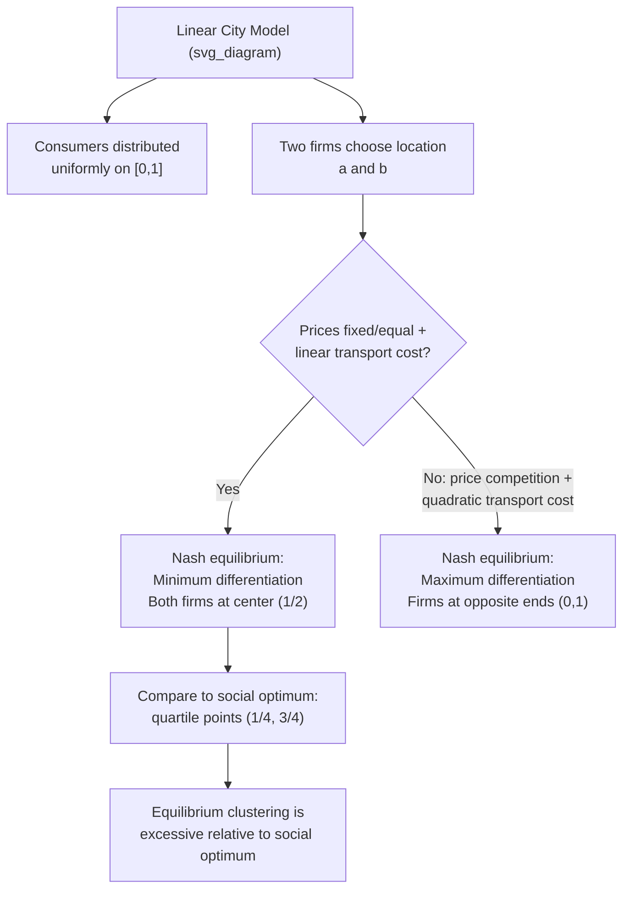

## Hotelling's Model of Spatial Competition

### Overview and Historical Context

Harold Hotelling introduced this model in his 1929 paper "Stability in Competition" (*Economic Journal*). Where Weber's model treated firm location as a single-firm cost-minimization problem in a fixed spatial environment, Hotelling reframed location as a **strategic game between competing firms**, in which each firm's optimal location depends on where its rival(s) are located. This was among the earliest formal treatments of spatial competition and remains foundational both to location theory and, more broadly, to industrial organization models of product differentiation.

### Model Setup: The Linear City

Hotelling's canonical formulation is often called the **"linear city" model**:

- Consumers are distributed uniformly along a line segment of fixed length (commonly normalized to the unit interval $[0,1]$), representing either literal geographic space or, in later reinterpretations, a "product characteristic space" (e.g., product sweetness, political ideology position)
- Two firms (or sellers) choose locations on this line, denoted $a$ and $b$
- Consumers incur a transportation (or "mismatch") cost proportional to the distance between their location and the firm they patronize
- Consumers purchase from whichever firm offers the lower **full price** — the posted price plus their individual transport cost to reach that firm
- In the baseline model, prices are often initially assumed fixed/equal (to isolate the pure location decision), though Hotelling's fuller model, and the modern literature building on it, allows firms to simultaneously choose both location and price

### The Median Voter / Principle of Minimum Differentiation

Hotelling's most famous and counterintuitive result is the **Principle of Minimum Differentiation**: under the baseline assumptions (uniform consumer distribution, fixed or symmetric prices, linear transport costs), the unique Nash equilibrium has **both firms locating at the exact center of the line** ($a = b = 1/2$), rather than spreading out to serve their local markets efficiently.

**Intuition**: consider a candidate equilibrium in which firm A is located to the left of firm B, both away from the center. Firm A, holding firm B's location fixed, can always increase its market share (capture more of the consumers between the two firms and even undercut into firm B's territory) by moving slightly to the right, toward the center — as long as it remains to the left of firm B, it retains all consumers to its left (who have nowhere closer to go) while gaining additional consumers from the middle region. This incentive to "leapfrog toward the center" persists until neither firm can profitably move again, which occurs only when both firms are co-located at the median point.

This result is often summarized by the observation, attributed to Hotelling's framework, that vendors selling similar products (his own example was ice cream carts on a beach) tend to cluster at the center of the market rather than disperse to minimize aggregate consumer travel distance — a result frequently invoked to explain the empirical tendency of similar retail stores, and even political candidates (in the "median voter" reinterpretation of the model), to converge toward the center of their respective "spaces" rather than differentiate.

$$a^* = b^* = \frac{1}{2}$$

### Social (Planner's) Optimum vs. Equilibrium

A key result of the model is that the equilibrium outcome (both firms at the center) is **not** socially efficient. A social planner minimizing the *sum of all consumers' transport costs* would instead locate the two firms at the **quartile points** of the line — i.e., at $1/4$ and $3/4$ — since this divides the line into two equal-sized market areas, each served by a firm located at that sub-area's own center, minimizing the total distance consumers must travel in aggregate.

$$a_{\text{social optimum}} = \frac{1}{4}, \quad b_{\text{social optimum}} = \frac{3}{4}$$

This divergence between the privately optimal (equilibrium) and socially optimal locations is a classic example of a location externality: firms competing for market share do not internalize the aggregate transport-cost burden imposed on consumers, generating excessive spatial concentration (insufficient differentiation) relative to the social optimum.

|  | Firm A location | Firm B location | Aggregate consumer transport cost |
| --- | --- | --- | --- |
| Nash equilibrium (competition) | 1/2 | 1/2 | Higher (excess clustering) |
| Social planner's optimum | 1/4 | 3/4 | Minimized |

### Diagram: Equilibrium vs. Social Optimum (svg_diagram)

<svg xmlns="http://www.w3.org/2000/svg" viewBox="0 0 700 320">
<text x="350" y="24" text-anchor="middle" font-size="16" font-weight="bold" fill="#222">Hotelling Linear City (svg_diagram)</text>

<text x="60" y="80" font-size="13" font-weight="bold" fill="#333">Nash Equilibrium</text>

<line x1="60" y1="110" x2="640" y2="110" stroke="#333" stroke-width="2" />

<circle cx="60" cy="110" r="4" fill="#333" />

<circle cx="640" cy="110" r="4" fill="#333" />

<circle cx="350" cy="110" r="9" fill="`#c0392b`" />

<circle cx="352" cy="110" r="9" fill="`#2980b9`" opacity="0.6" />

<text x="350" y="135" text-anchor="middle" font-size="11" fill="#333">Both firms at center (s=1/2)</text>

<text x="60" y="135" font-size="10" fill="#666">0</text>

<text x="630" y="135" font-size="10" fill="#666">1</text>

<text x="60" y="200" font-size="13" font-weight="bold" fill="#333">Social Optimum</text>

<line x1="60" y1="230" x2="640" y2="230" stroke="#333" stroke-width="2" />

<circle cx="60" cy="230" r="4" fill="#333" />

<circle cx="640" cy="230" r="4" fill="#333" />

<circle cx="205" cy="230" r="9" fill="`#c0392b`" />

<circle cx="495" cy="230" r="9" fill="`#2980b9`" />

<text x="205" y="255" text-anchor="middle" font-size="11" fill="#333">Firm A (s=1/4)</text>

<text x="495" y="255" text-anchor="middle" font-size="11" fill="#333">Firm B (s=3/4)</text>

<text x="60" y="255" font-size="10" fill="#666">0</text>

<text x="630" y="255" font-size="10" fill="#666">1</text>

<text x="350" y="295" text-anchor="middle" font-size="11" fill="#555">Equilibrium clustering is privately optimal but not socially efficient</text>

</svg>

### The Instability of Hotelling's Original Result: Price Competition

Later analysis (most notably by d'Aspremont, Gabszewicz, and Thisse, 1979) demonstrated that Hotelling's original minimum-differentiation result is **not robust** once firms are allowed to compete simultaneously on both location and price with quadratic (rather than linear) transport costs. Under quadratic transport costs, the equilibrium instead exhibits **maximum differentiation**: firms locate at the two opposite extremes of the line ($a=0$, $b=1$), because locating close to a rival intensifies price competition (Bertrand-style price undercutting) so severely that the resulting profit loss outweighs the demand-capturing benefit of being near the center — the opposite conclusion from Hotelling's original linear-transport-cost model.

This finding is an important qualification: it shows that the celebrated "Principle of Minimum Differentiation" is sensitive to specific functional-form assumptions (particularly the linear vs. quadratic transport cost specification) and to whether price is fixed or a strategic choice variable, rather than being a fully general property of spatial duopoly. [Inference: the precise equilibrium configuration in richer versions of the model (n firms, non-uniform consumer density, alternative transport-cost functions) depends sensitively on these modeling choices, and the literature has produced a range of results rather than a single universal prediction.]

### Extensions

**More than two firms / free entry**

With more than two firms and free entry, the equilibrium configuration becomes more complex, and the "circular city" variant (consumers distributed on a circle rather than a line, introduced by Salop, 1979) is commonly used to model monopolistic competition with product differentiation and free entry, generating a determinate number of equally-spaced firms in symmetric equilibrium.

**Reinterpretation as product characteristic space**

Hotelling's model is frequently reinterpreted with the "line" representing not physical geography but a one-dimensional product characteristic (e.g., sweetness of a cereal, political ideology on a left-right spectrum) rather than literal spatial distance — this is the basis of the **median voter theorem** in political economy (candidates converging toward the median voter's ideological position) and of horizontal product differentiation models in industrial organization.

**Application to retail and firm clustering**

The model is frequently invoked (with appropriate caveats about its price-competition instability) to explain observed real-world clustering of similar retailers (e.g., competing gas stations or fast-food outlets locating adjacent to one another) as consistent with the demand-capturing logic of the original minimum-differentiation intuition, though the price-competition extensions caution that this clustering logic is most applicable when price competition is muted (e.g., through price regulation, cost near-uniformity, or non-price competition emphasis).

### Relevance to Urban and Regional Economics

Hotelling's framework contributes to urban and regional economics primarily through:

- Introducing **strategic (game-theoretic) location reasoning**, complementing the earlier cost-minimization (Weber) and rent-maximization (von Thünen) approaches, both of which treat location choice as a single-agent optimization rather than a multi-agent strategic interaction
- Providing the theoretical basis for understanding retail agglomeration and competitive clustering within cities (e.g., automobile dealership rows, restaurant districts) as a potential equilibrium outcome of competitive location choice rather than solely a consequence of agglomeration economies in the Marshallian sense
- Establishing an early and influential example of the divergence between private (equilibrium) and social optimum in a spatial context, a theme that recurs throughout urban economics (e.g., in the divergence between equilibrium and optimal city size discussed in the agglomeration literature)

### Diagram: Model Logic Flow (svg_diagram)

### Key Points

- Hotelling's 1929 linear city model treats firm location as a strategic game between competitors, in contrast to the single-agent cost/rent optimization of Weber's and von Thünen's models.
- Under the baseline assumptions (uniform consumers, fixed/equal prices, linear transport costs), the unique Nash equilibrium is both firms locating at the center — the Principle of Minimum Differentiation.
- The equilibrium is socially inefficient: a planner minimizing aggregate transport costs would locate firms at the quartile points (1/4 and 3/4), not the center.
- D'Aspremont, Gabszewicz, and Thisse (1979) showed that allowing simultaneous price and location competition with quadratic transport costs reverses the result to maximum differentiation, showing the original result is sensitive to functional-form assumptions.
- The model underlies the median voter theorem in political economy and provides an early framework for understanding retail clustering and the private-social divergence in location choice.

### Related Topics

- Median voter theorem and its relationship to spatial competition
- Salop's circular city model and monopolistic competition with free entry
- D'Aspremont-Gabszewicz-Thisse quadratic transport cost model
- Weber's theory of industrial location (contrasted single-agent framework)
- Bertrand vs. Cournot competition in spatial contexts
- Retail agglomeration and clustering of competing firms
- Product differentiation models in industrial organization
- Private vs. social optimum divergence in spatial and urban economics