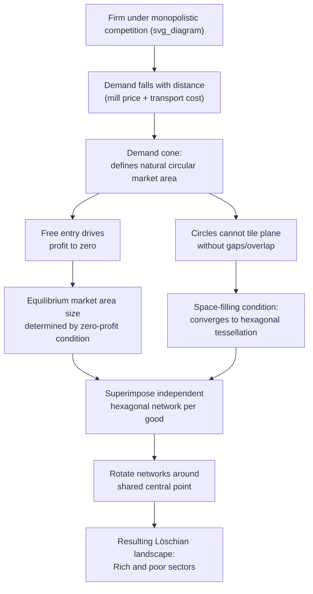

## Lösch's Economic Landscape Model

### Overview and Historical Context

August Lösch presented his model in *Die räumliche Ordnung der Wirtschaft* (1940; English translation *The Economics of Location*, 1954). Lösch's central contribution was to **derive** the hexagonal central-place hierarchy from explicit profit-maximizing firm behavior under monopolistic competition, rather than positing the hexagonal geometry more directly as Christaller had done. Where Christaller worked largely from settlement geography and empirical pattern description outward toward theory, Lösch worked from microeconomic equilibrium principles inward toward the spatial pattern — producing a more rigorously derived, but also more complex and less strictly hierarchical, predicted spatial structure.

### Deriving Market Areas from Firm Behavior

Lösch's starting point is a single firm operating under monopolistic competition (differentiated product, downward-sloping demand curve, free entry driving long-run profits to zero) situated on a uniform, isotropic plain. He derived the firm's market area using a **spatial demand cone**:

1. At the firm's own location, the price consumers pay equals the mill price (production cost plus normal profit)
2. As distance from the firm increases, transport costs are added to the price paid by consumers, so the effective delivered price rises with distance
3. Demand for the good falls as the effective price rises (standard downward-sloping demand), so quantity purchased per consumer declines with distance from the firm
4. At some maximum distance, the delivered price becomes so high that quantity demanded falls to zero — this defines the outer edge of the market area, analogous to Christaller's "range" concept but derived explicitly from an underlying demand curve rather than assumed

Rotating this demand relationship (price/quantity falling with distance) around the firm's location in all directions on the uniform plain generates a **cone-shaped demand surface**: highest at the firm's own location, sloping down to zero at the market area boundary. The **volume of this cone** represents the firm's total sales, and free entry drives this volume down (as competing firms enter and shrink each firm's market area) until it equals exactly the volume needed to generate zero economic profit — pinning down the equilibrium market area size, exactly analogous to zero-profit market-area determination in standard monopolistic competition models (e.g., Chamberlin), but made explicitly spatial.

### From Circular Market Areas to Hexagonal Tiling

As in Christaller's theory, Lösch showed that the demand cone's naturally circular market area cannot tile the plain without gaps or overlaps. Lösch derived that the equilibrium market area, once firms compete for space and eliminate gaps/overlaps through entry and boundary adjustment, converges to the same **hexagonal tiling** result as Christaller's theory — but Lösch reached this geometry as a *derived equilibrium outcome* of profit-maximizing entry rather than an assumed optimal shape.

### The Löschian Landscape: Relaxing Christaller's Rigid Hierarchy

Lösch's most distinctive departure from Christaller is his treatment of **multiple goods simultaneously**. Christaller assumed a single, strictly nested hierarchy in which every settlement of a given order offers an identical bundle of goods up to that order. Lösch relaxed this by allowing each good or industry to have its **own independently sized and independently rotated hexagonal network**, since different goods have different threshold populations, different ranges, and no requirement that their hexagonal networks be aligned or centered on the same set of settlements.

**Key consequence: sectors, not strict rings**

By superimposing many independently sized and rotated hexagonal networks (one per good/industry) on the same plain and rotating them around a shared central point, Lösch showed that the resulting composite landscape naturally produces **sectors** radiating from the largest central place — some sectors are "rich" (containing many overlapping hexagonal networks, hence many co-located industries and larger settlements) and some are "poor" (containing few overlapping networks, hence fewer co-located industries and smaller settlements) — rather than Christaller's simpler concentric-ring, strictly nested hierarchy.

This produces the **Löschian landscape**: a settlement pattern still built on the same underlying hexagonal market-area logic as Christaller, but exhibiting sectoral variation in settlement density and industrial composition around the central metropolis, rather than uniform concentric bands — a pattern argued to correspond more closely to observed real-world variation in the industrial composition of areas at similar distances from a major city (e.g., some corridors radiating from a metropolis are far more industrially developed than others at a similar distance, a pattern Christaller's strict concentric-ring model does not naturally generate).

### Comparison: Christaller vs. Lösch

| Dimension | Christaller (1933) | Lösch (1940) |
| --- | --- | --- |
| Starting point | Settlement geography, empirical pattern | Firm-level profit maximization, monopolistic competition |
| Derivation of hexagon | Posited as geometrically optimal shape | Derived as zero-profit equilibrium outcome |
| Hierarchy structure | Strict, single nested hierarchy (all goods aligned) | Multiple independent hexagonal networks per good, superimposed and rotated |
| Resulting spatial pattern | Concentric rings of settlement order | Sectoral variation ("rich" and "poor" sectors) around central metropolis |
| Underlying goal | Alternative k-value organizing principles (marketing, transport, administrative) | Single unifying microeconomic (monopolistic competition) derivation |

### Diagram: Superimposed Hexagonal Networks Producing Sectors (svg_diagram)

<svg xmlns="http://www.w3.org/2000/svg" viewBox="0 0 700 500">
<text x="350" y="24" text-anchor="middle" font-size="16" font-weight="bold" fill="#222">Löschian Landscape (svg_diagram)</text>
<g transform="translate(350,260)">
<polygon points="0,-160 138,-80 138,80 0,160 -138,80 -138,-80" fill="none" stroke="#c0392b" stroke-width="1.5" opacity="0.6" />
<polygon points="0,-140 121,-70 121,70 0,140 -121,70 -121,-70" fill="none" stroke="#2980b9" stroke-width="1.5" opacity="0.6" transform="rotate(20)" />
<polygon points="0,-110 95,-55 95,55 0,110 -95,55 -95,-55" fill="none" stroke="#27ae60" stroke-width="1.5" opacity="0.6" transform="rotate(-15)" />



```
<circle r="10" fill="#222" />

<path d="M 0 0 L 60 -150 A 160 160 0 0 1 90 -128 Z" fill="#f4d03f" opacity="0.35" />
<path d="M 0 0 L -60 150 A 160 160 0 0 1 -90 128 Z" fill="#f4d03f" opacity="0.35" />

<text x="70" y="-155" font-size="10" fill="#333">"Rich" sector</text>
<text x="-75" y="170" font-size="10" fill="#333">"Rich" sector</text>
<text x="-160" y="0" font-size="10" fill="#666">"Poor" sector</text>
<text x="140" y="0" font-size="10" fill="#666">"Poor" sector</text>
```

</g>

<text x="350" y="470" text-anchor="middle" font-size="11" fill="#555">Independently rotated hexagonal networks (one per industry) create sectoral variation</text>

</svg>

### The Löschian Equilibrium Conditions

Lösch's model can be summarized by three simultaneous equilibrium conditions that must hold for every good/industry in the landscape:

1. **Zero-profit condition**: the market area (demand cone) shrinks through entry until price equals average total cost, eliminating excess profit — the standard monopolistic-competition zero-profit condition applied spatially
2. **Space-filling condition**: market areas of the same order must tile the plain without gaps or overlaps, which — given the circular shape of the raw demand cone — converges to the hexagonal tessellation
3. **Consumer optimization**: each consumer patronizes the supplier offering the lowest delivered price (mill price plus transport cost), consistent with utility/cost minimization

Formally, for a representative firm, profit is:

$$\pi = \int_{\text{market area}} \left[ p(d) - c \right] q(p(d)) \, dA - F$$

where $p(d)$ is the delivered price at distance $d$ (mill price plus transport cost), $c$ is marginal production cost, $q(p(d))$ is the individual consumer's demand at that delivered price, $F$ is fixed cost, and the integral is taken over the firm's market area. Free entry drives $\pi \to 0$, which pins down the equilibrium market area size (and hence, given the space-filling condition, the equilibrium hexagon size) for that good.

### Significance and Legacy

Lösch's model is generally regarded as the more theoretically rigorous of the two central place frameworks, since it derives rather than assumes the hexagonal market structure from standard monopolistic competition principles, and its treatment of sectoral variation offers a richer, arguably more empirically plausible account of real-world variation in regional industrial composition than Christaller's strict nested hierarchy. However, Christaller's original framework remains more widely taught as an introductory device due to its greater simplicity and more direct connection to observable settlement-size hierarchies, with Lösch's landscape typically introduced as a formalizing extension.

Both frameworks, along with von Thünen's and Weber's models, were systematically integrated by Walter Isard into the founding synthesis of regional science in the 1950s, and both continue to inform modern treatments of urban systems, retail location, and the spatial structure of regional economies.

### Diagram: Derivation Logic (svg_diagram)



### Key Points

- Lösch's 1940 model derives the hexagonal central-place market area as an equilibrium outcome of profit-maximizing firms under monopolistic competition, rather than positing it as a geometrically optimal shape as Christaller did.
- The firm's market area is derived from a spatial "demand cone" — demand falling with distance due to rising delivered (transport-inclusive) price — with free entry driving the market area to the zero-profit size.
- Lösch relaxed Christaller's assumption of a single rigid nested hierarchy by allowing each good/industry its own independently sized, independently rotated hexagonal network.
- Superimposing these independent networks around a shared central point produces the Löschian landscape: sectoral variation in settlement density and industrial composition ("rich" and "poor" sectors), rather than Christaller's uniform concentric rings.
- Lösch's framework is regarded as more rigorously derived from microeconomic first principles, while Christaller's remains more widely taught as a simpler introductory device.

### Related Topics

- Christaller's central place theory (the framework Lösch formalized and extended)
- Monopolistic competition models (Chamberlin) and their spatial application
- Von Thünen's and Weber's location theory frameworks
- Isard's synthesis of location theory into regional science
- Zipf's Law and the rank-size distribution of city sizes
- Retail and industrial location applications of hexagonal market-area theory
- Sectoral variation in regional industrial composition: empirical evidence