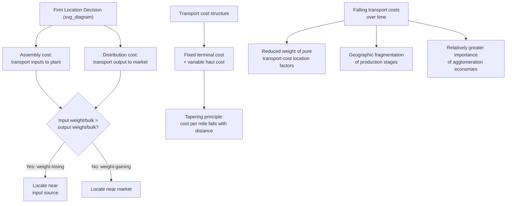

## Transport Costs and the Firm Location Decision

### Overview

Transport cost is the unifying variable across classical location theory: it is the mechanism that gives space economic significance in the first place, and every model covered earlier in this chapter — von Thünen's rent gradients, Weber's least-cost triangle, Hotelling's spatial competition, and Christaller/Lösch's central place hierarchy — is ultimately a different application of the same underlying idea, that moving goods, people, or information across distance is costly, and firms and households organize themselves in space to economize on that cost. This section synthesizes the general theory of how transport costs enter the firm's location decision and examines the properties of transport cost functions in more depth than the individual classical models addressed in isolation.

### The General Firm Location Problem

A firm choosing a location must weigh, at minimum:

- **Assembly costs**: the cost of transporting raw materials and intermediate inputs to the production site
- **Distribution costs**: the cost of transporting finished output to the market(s) where it will be sold
- **Production costs**: costs of labor, capital, and other inputs, which may vary by location
- **Agglomeration benefits/costs**: productivity gains or congestion costs associated with locating near other firms

$$

\pi(\text{location}) = R(\text{location}) - \left [C_{\text{production}} + C_{\text{assembly}} + C_{\text{distribution}} \right](%5Ctext%7Blocation%7D)

$$

The firm chooses the location that maximizes $\pi$. Transport costs enter through both the assembly and distribution terms, and the relative weight of each depends on the firm's specific input and output characteristics — precisely the logic formalized by Weber's material index.

### Properties of Transport Cost Functions

**Linearity vs. non-linearity in distance**

The simplest transport cost specification (used by von Thünen and Weber in their baseline models) is linear in distance: $TC = t \cdot d$, where $t$ is a constant per-unit-distance rate. Real-world transport costs, however, typically exhibit important **non-linearities**:

- **Terminal (fixed) costs**: loading, unloading, and handling costs that are incurred regardless of distance traveled, producing a transport cost function of the form $TC = F + t \cdot d$, where $F$ is a fixed terminal cost. This fixed component means that transport cost **per unit distance** falls as distance rises (since the fixed cost is spread over more distance), a phenomenon sometimes called the **tapering principle**.
- **Distance-decay in the marginal rate**: even the variable (distance-sensitive) portion of transport cost often rises less than proportionally with distance (concave in distance), reflecting economies of scale in long-haul transport relative to short-haul transport, particularly for rail and sea transport, which have high fixed terminal costs but low marginal haul costs, favoring long-distance movement once the terminal cost is incurred.

**Mode-specific cost structures**

Different transport modes exhibit different combinations of fixed (terminal) and variable (haul) costs:

| Mode | Terminal (fixed) cost | Per-mile haul cost | Best suited for |
| --- | --- | --- | --- |
| Road/truck | Low | Relatively high | Short-to-medium distance, flexible routing |
| Rail | Moderate-high | Low | Long-distance, bulky/heavy freight |
| Water (sea/river) | High | Very low | Very long-distance, bulky, low-value-per-weight freight |
| Air | Very high | High | Long-distance, low-weight, high-value, time-sensitive freight |

This mode-cost structure explains why firms shipping heavy, bulky, low-value goods over long distances favor rail or water transport (accepting the high terminal cost to access the very low marginal haul cost), while firms shipping light, high-value, time-sensitive goods favor air or road transport despite the higher marginal haul cost, since the terminal cost is a larger share of a smaller total shipment and speed/flexibility matter more than raw per-mile efficiency.

**Weight, bulk, and perishability**

Transport cost per unit of value depends critically on the physical characteristics of the good, independent of the transport mode chosen:

- **Weight/bulk relative to value** (value density): low-value, bulky/heavy goods (raw ore, agricultural bulk commodities, cement) incur high transport cost relative to their value, making location decisions highly sensitive to transport cost minimization (consistent with Weber's weight-losing, material-oriented industries)
- **Perishability**: perishable goods (fresh produce, dairy) effectively face a very high implicit transport cost at longer distances/durations, due to spoilage risk and the need for costly preservation (refrigeration), reinforcing the tendency (observed in von Thünen's model) for perishable-good production to locate near the market
- **Fragility and special handling requirements**: goods requiring careful handling incur higher effective transport costs through packaging, insurance, and slower/more careful shipping methods

### Transport Cost and the Weight-Losing/Weight-Gaining Distinction Revisited

Weber's material index concept (introduced earlier in this chapter) can be generalized beyond a strict weight-based measure to a broader **value-to-transport-cost ratio** framework: any characteristic of the production process that causes the weight, bulk, fragility, or perishability of inputs to differ substantially from that of the finished output will pull the firm's optimal location toward whichever endpoint (input source or market) has the higher effective transport cost per unit of value.

$$\text{Location pull toward inputs if: } \sum_i w_i^{\text{input}} t_i^{\text{input}} > w^{\text{output}} t^{\text{output}}$$

$$\text{Location pull toward market if: } \sum_i w_i^{\text{input}} t_i^{\text{input}} < w^{\text{output}} t^{\text{output}}$$

### The Effect of Falling Transport Costs Over Time

A major theme in the historical application of transport-cost-based location theory is the observed long-run decline in real transport costs (due to technological improvements: railroads, containerization in shipping, highway construction, air freight, and — for information rather than physical goods — telecommunications and the internet). This secular decline has several well-documented comparative-static implications:

- **Reduced sensitivity of firm location to pure transport-cost minimization**: as $t$ falls, the transport-cost component of total cost shrinks in importance relative to other location factors (labor cost, agglomeration economies, amenities, tax policy), making location decisions increasingly driven by these secondary factors rather than the primary transport-cost logic that dominated 19th- and early 20th-century location theory
- **Spatial dispersion of production stages**: falling transport costs enable the geographic fragmentation of production processes (separating different stages of a supply chain across different locations, including internationally) since the transport-cost penalty of separating stages that were once co-located for transport-cost reasons has fallen substantially — a key driver of modern global value chains
- **Suburbanization and urban decentralization**: as discussed in the earlier section on spatial equilibrium comparative statics, falling commuting costs (transport costs for people, rather than for firms' inputs/outputs) flatten the urban rent gradient and enable urban spatial expansion
- **Persistence of agglomeration despite falling transport costs**: paradoxically, even as transport costs for goods have fallen dramatically, agglomeration of high-skill, information-intensive activity has in some respects intensified (the "death of distance" thesis has been extensively debated), suggesting that once pure transport-cost considerations recede in importance, agglomeration economies (knowledge spillovers requiring face-to-face interaction, in particular) become relatively more dominant in determining location for certain sectors — a pattern central to modern discussions of "superstar cities" and the persistence (or intensification) of urban concentration in advanced, information-intensive economies. [Inference: the relative weight of transport-cost decline versus intensifying agglomeration forces in explaining contemporary spatial patterns remains an active area of debate and likely varies substantially by sector and skill level.]

### Diagram: Transport Cost Functions Compared (svg_diagram)

<svg xmlns="http://www.w3.org/2000/svg" viewBox="0 0 700 400">
<text x="350" y="24" text-anchor="middle" font-size="16" font-weight="bold" fill="#222">Transport Cost Functions (svg_diagram)</text>
<line x1="70" y1="340" x2="640" y2="340" stroke="#333" stroke-width="1.5" />
<line x1="70" y1="340" x2="70" y2="50" stroke="#333" stroke-width="1.5" />
<text x="355" y="370" text-anchor="middle" font-size="12" fill="#333">Distance</text>
<text x="30" y="200" text-anchor="middle" font-size="12" fill="#333" transform="rotate(-90,30,200)">Total Transport Cost</text>
<line x1="70" y1="340" x2="600" y2="70" stroke="#c0392b" stroke-width="2.5" />
<text x="480" y="130" font-size="11" fill="#c0392b">Linear (no fixed cost): TC = t·d</text>
<path d="M 70 300 L 130 250 Q 350 130 600 90" fill="none" stroke="#2980b9" stroke-width="2.5" />
<text x="380" y="180" font-size="11" fill="#2980b9">With fixed terminal cost + concave haul cost</text>
<line x1="70" y1="340" x2="70" y2="300" stroke="#2980b9" stroke-width="4" />
<text x="80" y="325" font-size="10" fill="#2980b9">Fixed terminal cost (F)</text>
</svg>

### Application: Location Decisions Along a Supply Chain

Modern firms with multi-stage production processes must solve the location problem separately (though not independently) for each stage, weighing the transport cost of moving intermediate goods between stages against the labor-cost, input-access, and agglomeration advantages available at each candidate location for that stage — an extension of Weber's original single-stage least-cost framework to a network of interconnected location decisions. This is the transport-cost-theoretic foundation underlying the modern analysis of **global value chains** and offshoring/reshoring decisions, where falling international transport and communication costs have historically been a key enabling factor for geographically fragmented, multi-country production networks, though this remains a topic more fully developed in international trade and economic geography literatures adjacent to core urban/regional economics.

### Diagram: Transport Cost Logic Summary (svg_diagram)

### Key Points

- Transport cost is the common underlying variable linking von Thünen's, Weber's, Hotelling's, and Christaller/Lösch's location models, and remains central to the general firm location problem of weighing assembly, distribution, and production costs.
- Real transport cost functions typically include a fixed terminal (loading/handling) cost plus a variable haul cost that is often concave in distance, producing the "tapering principle" (cost per unit distance falls as distance rises).
- Different transport modes (road, rail, water, air) exhibit distinct combinations of fixed and variable costs, explaining mode choice based on shipment weight, value density, distance, and time-sensitivity.
- The generalized weight-losing/weight-gaining logic (extending Weber's material index) determines whether a firm's optimal location is pulled toward input sources or toward the market, based on the relative transport-cost-per-value of inputs versus outputs.
- The long-run secular decline in transport costs has reduced the relative importance of pure transport-cost minimization in firm location decisions, enabling geographic fragmentation of supply chains, while agglomeration economies (particularly knowledge spillovers) have become relatively more important for certain sectors.

### Related Topics

- Weber's theory of industrial location and the material index
- Global value chains and the geography of production fragmentation
- Agglomeration economies and the "death of distance" debate
- Suburbanization and the effect of falling commuting costs
- Mode choice in freight transportation economics
- Von Thünen's model and perishability-driven land use
- "Superstar cities" and persistent urban concentration in the information economy