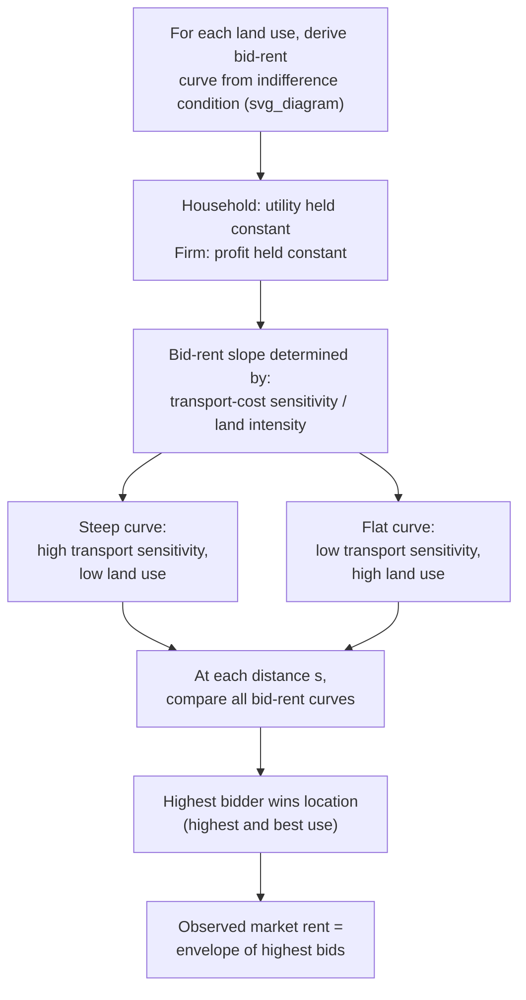

## Bid-Rent Theory and Land Rent Gradients

### Overview

Bid-rent theory generalizes von Thünen's agricultural rent-gradient logic into a unified framework applicable to any competing land use — agricultural, residential, commercial, or industrial. It provides the microeconomic foundation for how land is allocated across competing uses and users in equilibrium, and it is the essential building block for the monocentric city model of urban spatial structure covered later in this course. This section develops the general theory of bid-rent curves, their determinants, and the equilibrium land-use pattern they generate.

### The Bid-Rent Function Defined

The **bid-rent function** (or bid-rent curve) for a given land use or user represents the **maximum rent per unit of land that use/user is willing and able to pay at each location**, such that they are indifferent between locating there versus at any alternative location — i.e., they receive the same level of utility (for households) or profit (for firms) regardless of where they locate, once the location-specific rent is paid.

$$R(s) = \text{maximum rent per unit land at distance } s \text{ that leaves the bidder indifferent across locations}$$

This is precisely the same construct as von Thünen's location rent, generalized beyond agriculture: it is derived by asking, for each candidate location, "how much could this bidder afford to pay in rent, given the revenue/utility available there and the costs (production, transport, commuting) incurred there, while still achieving the same net outcome as at any other location?"

### General Derivation for a Household

For a household choosing residential location at distance $s$ from a central point (e.g., a central business district, CBD), the bid-rent function is derived from the requirement that utility be held constant across all candidate locations (the household's own indifference condition, distinct from — but closely related to — the market-wide spatial equilibrium condition covered in the methodology section of this course):

$$U(c, q) = \bar{u} \quad \text{s.t.} \quad y - t(s) = c + R(s) \cdot q$$

Solving this for $R(s)$ at the utility level $\bar{u}$ gives the household's bid-rent function:

$$R(s) = \frac{y - t(s) - c^*(s)}{q^*(s)}$$

where $c^*(s)$ and $q^*(s)$ are the utility-maximizing (or expenditure-minimizing) choices of composite consumption and housing/land at distance $s$, given the constraint. As $s$ increases, commuting cost $t(s)$ rises, leaving less income available for consumption and housing, which — to hold utility constant — requires rent $R(s)$ to fall, generating the household's negatively sloped bid-rent curve.

### General Derivation for a Firm

For a firm, the analogous bid-rent function is derived from the zero-profit (or constant-profit) condition:

$$\pi = pQ(s) - c(s)Q(s) - t_d(s) - R(s) \cdot A = \bar{\pi}$$

Solving for $R(s)$:

$$R(s) = \frac{pQ(s) - c(s)Q(s) - t_d(s) - \bar{\pi}}{A}$$

where $Q(s)$ is output (which may itself depend on location, e.g., through access to markets or agglomeration benefits), $c(s)$ is unit production cost at that location, $t_d(s)$ is total transport/distribution cost from that location, $A$ is land area used, and $\bar{\pi}$ is the profit level the firm requires to remain indifferent across locations (often zero, under free entry).

### The Slope of the Bid-Rent Curve

The single most important comparative property of a bid-rent curve is its **slope** — how steeply rent must fall with distance to maintain the bidder's indifference. The slope is determined by the bidder's **sensitivity to distance/transport cost relative to the bidder's land intensity**:

$$\frac{dR}{ds} = -\frac{1}{q} \cdot \frac{dt}{ds}$$

(derived by differentiating the household bid-rent equation with respect to $s$, holding utility constant, under standard regularity assumptions). This shows that the bid-rent slope is steeper (rent falls faster with distance) when:

- **Transport/commuting cost sensitivity is high** ($dt/ds$ large): bidders who incur high costs per unit of additional distance need a larger rent discount to compensate, generating a steep gradient
- **Land/space consumption per unit is low** ($q$ small): if a bidder uses only a small amount of land, a given dollar change in total transport cost translates into a large change in rent *per unit of land*, since that same land intensity divides the compensating rent adjustment over a small area — this produces a steep bid-rent curve even for moderate transport-cost sensitivity

Conversely, a **flat bid-rent curve** characterizes bidders who are relatively insensitive to distance (low transport-cost sensitivity) or who use land extensively (large $q$), since the same total transport-cost saving from moving closer to the center is spread thinly over a large area of land, requiring only a small compensating rent change per unit area.

### Land Allocation via Highest and Best Use

Exactly as in von Thünen's original agricultural model, the **equilibrium land use at any given location is determined by whichever competing use has the highest bid-rent at that specific distance** — the land is allocated, in effect, through implicit competitive bidding, with the highest bidder securing the location:

$$\text{Land use at } s = \arg\max_i R_i(s)$$

This principle, often called the **highest and best use** principle in applied real estate and urban economics, generates the observed pattern of concentric (or, in richer models, sectoral or polycentric) zones of differing land use as bid-rent curves of different steepness intersect at different distances from the center.

### Diagram: Competing Bid-Rent Curves and Land Use Zones (svg_diagram)

<svg xmlns="http://www.w3.org/2000/svg" viewBox="0 0 700 420">
<text x="350" y="24" text-anchor="middle" font-size="16" font-weight="bold" fill="#222">Bid-Rent Curves by Land Use (svg_diagram)</text>
<line x1="70" y1="360" x2="640" y2="360" stroke="#333" stroke-width="1.5" />
<line x1="70" y1="360" x2="70" y2="50" stroke="#333" stroke-width="1.5" />
<text x="355" y="390" text-anchor="middle" font-size="12" fill="#333">Distance from CBD (s)</text>
<text x="30" y="200" text-anchor="middle" font-size="12" fill="#333" transform="rotate(-90,30,200)">Rent R(s)</text>
<line x1="70" y1="70" x2="230" y2="360" stroke="#c0392b" stroke-width="2.5" />
<text x="90" y="90" font-size="11" fill="#c0392b">Commercial/Office (steepest)</text>
<line x1="70" y1="150" x2="420" y2="360" stroke="#e67e22" stroke-width="2.5" />
<text x="260" y="180" font-size="11" fill="#e67e22">Residential (medium)</text>
<line x1="70" y1="230" x2="600" y2="360" stroke="#27ae60" stroke-width="2.5" />
<text x="440" y="250" font-size="11" fill="#27ae60">Agricultural/Industrial (flattest)</text>
<line x1="150" y1="50" x2="150" y2="360" stroke="#999" stroke-width="1" stroke-dasharray="3,3" />
<line x1="330" y1="50" x2="330" y2="360" stroke="#999" stroke-width="1" stroke-dasharray="3,3" />

<text x="105" y="400" text-anchor="middle" font-size="10" fill="#555">Zone 1:</text>

<text x="105" y="412" text-anchor="middle" font-size="10" fill="#555">Commercial</text>

<text x="235" y="400" text-anchor="middle" font-size="10" fill="#555">Zone 2: Residential</text>

<text x="480" y="400" text-anchor="middle" font-size="10" fill="#555">Zone 3: Agricultural/Industrial</text>

</svg>

### Applications Across Land Use Types

**Commercial/office land use**

Typically exhibits the **steepest** bid-rent curve among urban land uses, since office and retail firms rely heavily on accessibility (to customers, to a shared labor pool, to each other for face-to-face business interaction) and consume land relatively intensively (multi-story buildings on small footprints), both factors favoring a steep gradient concentrated near the most accessible point (traditionally the CBD).

**Residential land use**

Exhibits an **intermediate** bid-rent slope, reflecting households' moderate sensitivity to commuting cost relative to firms, and their greater land/housing consumption relative to commercial users — the specific slope depends on household income, family structure, and the value households place on commuting time versus additional housing space (as discussed in the earlier comparative-statics treatment of income effects on the rent gradient).

**Agricultural or industrial land use** (in an urban-fringe context)

Exhibits the **flattest** bid-rent curve, since these uses are typically land-extensive (large land area per unit of output) and relatively insensitive to fine-grained accessibility differences, allowing them to persist at the urban fringe where commercial and residential bids have fallen below the agricultural/industrial bid.

### Convexity of the Bid-Rent Curve

Bid-rent curves are typically **convex** (falling at a decreasing rate) rather than linear, for two related reasons:

- **Substitution effects**: as rent falls with distance, land becomes relatively cheaper compared to other consumption goods, inducing bidders to substitute toward more land consumption at greater distances — this rising land consumption at greater distances means each additional unit of distance requires a smaller marginal rent adjustment to maintain compensating indifference (since the rent reduction is now spread over more land)
- **Declining marginal transport-cost sensitivity**: in some model specifications, marginal commuting/transport cost itself may not rise linearly with distance, further contributing to gradient curvature

This convexity property is empirically well-documented in observed urban land rent and density gradients (rent falling steeply near the center and more gradually toward the periphery) and is a standard feature retained in the Alonso-Muth-Mills monocentric city model developed later in this course.

### Distinguishing Bid-Rent from Observed Market Rent

An important conceptual distinction: the bid-rent function represents the *maximum* a given bidder *could* pay while remaining indifferent across locations — it is a demand-side, willingness-to-pay construct. The **observed equilibrium market rent** at any location equals the *highest* bid-rent among all competing potential users at that location (the winning bid), not the bid-rent of any single use type evaluated in isolation. This distinction is essential for correctly interpreting the "highest and best use" land allocation principle: at any given distance, only the use whose bid-rent curve is highest at that specific point will actually occupy the land, while other uses' bid-rent curves at that same point remain hypothetical (unrealized) willingness-to-pay levels.

### Diagram: Bid-Rent Determination Logic (svg_diagram)

### Key Points

- The bid-rent function represents the maximum rent per unit land a bidder (household or firm) would pay at each location while remaining indifferent (constant utility or profit) across all locations — a direct generalization of von Thünen's agricultural location rent.
- The bid-rent slope is determined by the ratio of transport-cost sensitivity to land intensity: steep curves characterize high-transport-sensitivity, land-extensive-averse bidders; flat curves characterize low-transport-sensitivity, land-extensive bidders.
- Equilibrium land use at any location is determined by whichever competing use has the highest bid-rent there (the "highest and best use" principle), with observed market rent equal to the envelope of the highest bid across all uses at each point.
- Commercial/office uses typically exhibit the steepest bid-rent curves, residential uses intermediate, and agricultural/industrial uses the flattest, generating the classic concentric pattern of urban land use.
- Bid-rent curves are typically convex due to substitution effects (increasing land consumption as rent falls with distance) and possible non-linearities in transport cost, a property retained in the monocentric city model.

### Related Topics

- Von Thünen's model of agricultural land use (the origin of the bid-rent concept)
- The Alonso-Muth-Mills monocentric city model
- Household spatial equilibrium and the residential location decision
- Income effects on the urban rent gradient (ambiguous comparative statics)
- Population density gradients and their empirical estimation
- Highest and best use principle in real estate economics
- Polycentric and sectoral extensions to the bid-rent framework