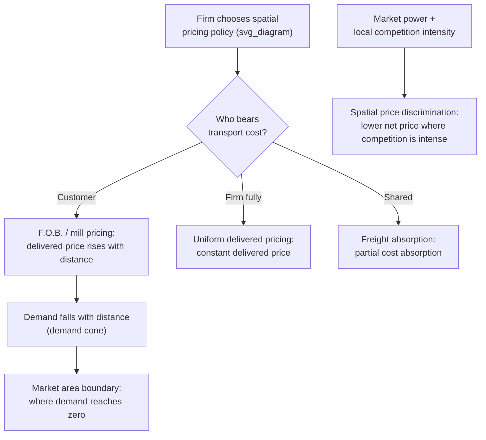

## Spatial Pricing and Regional Demand Theory

### Overview

Spatial pricing theory examines how firms set prices for goods that must be transported to geographically dispersed customers, and how those pricing decisions interact with — and are constrained by — the spatial distribution of demand. This body of theory sits at the intersection of location theory (covered earlier in this chapter) and industrial organization, and it directly determines the market-area boundaries that underlie both Weberian firm-location analysis and Lösch's demand-cone derivation of central place theory.

### The Basic Spatial Pricing Problem

A firm selling to spatially dispersed customers must decide how to allocate transport cost between itself and its customers. This decision is captured by the **spatial pricing policy** the firm adopts, of which several polar and intermediate cases are standard in the literature:

**F.O.B. pricing (mill pricing / "free on board")**

The firm charges a uniform **mill price** at the factory gate, and the customer bears the full transport cost from the mill to their own location. Under F.O.B. pricing, the **delivered price** rises linearly (or per whatever the transport cost function is) with distance from the firm:

$$p_d(s) = p_{\text{mill}} + t \cdot s$$

This is the pricing assumption implicit in Lösch's demand-cone derivation of market areas (covered earlier in this chapter): delivered price rises with distance, demand falls accordingly, and the market area boundary occurs where demand reaches zero.

**Uniform delivered pricing (postage-stamp pricing)**

The firm charges the **same delivered price to all customers regardless of distance**, absorbing all transport cost variation itself. This requires the firm to charge a price above its mill price plus average transport cost to nearby customers (in effect, cross-subsidizing distant customers using profit earned from nearby customers) — sometimes termed **phantom freight** when nearby customers pay for transport costs they do not actually generate.

**Freight absorption / discriminatory pricing**

An intermediate case in which the firm sets delivered price schedules that partially — but not fully — reflect transport cost differences across customers, often used strategically to remain price-competitive in distant markets where a rival is closer (absorbing part of the transport cost disadvantage) while charging closer customers a price above the minimum needed to cover their lower transport cost.

**Basing-point pricing**

A historically significant (and, in the U.S., eventually subject to antitrust scrutiny) system in which delivered price is calculated as if the good were shipped from a designated "basing point" location, regardless of where it was actually produced — allowing geographically dispersed producers to quote identical delivered prices to a given customer even when their actual production/shipping locations differ, a practice associated with reduced spatial price competition and historically prominent in industries such as steel (the "Pittsburgh Plus" system).

| Pricing policy | Who bears transport cost | Delivered price pattern |
| --- | --- | --- |
| F.O.B. (mill pricing) | Customer | Rises linearly with distance from mill |
| Uniform delivered | Firm (fully absorbed) | Constant regardless of distance |
| Freight absorption | Shared (firm absorbs part) | Rises with distance, but less steeply than actual cost |
| Basing-point | Varies; calculated from a reference point, not actual origin | Based on distance from designated basing point, not actual plant |

### Spatial Price Discrimination and Market Power

Firms with market power (rather than pure price-taking competitors) can use spatial pricing as a form of **third-degree price discrimination**, charging different net prices (after netting out transport cost) to customers in different locations based on the local intensity of competition and local demand elasticity:

- In locations where the firm faces intense competition from rival suppliers (e.g., near a rival's own plant), the firm may set a lower net price to retain market share
- In locations where the firm faces little competition (e.g., far from any rival, within its "natural" Weberian/Löschian market area), the firm can charge a higher net price, closer to the monopoly-optimal markup

This spatial price discrimination behavior is a natural extension of Hotelling-style spatial competition (covered earlier in this chapter): when firms compete on both location and price, the resulting equilibrium delivered-price schedule typically reflects the intensity of local competition at each point along the line or plane, not merely actual transport cost.

### Regional Demand Theory: Demand as a Function of Location

**Regional demand theory** examines how aggregate demand for a good varies across geographic regions or distance from a supply point, integrating standard microeconomic demand theory with the spatial pricing structure described above. Several key elements:

**The demand cone (Lösch's construction, generalized)**

As covered in the discussion of Lösch's economic landscape model, individual consumer demand for a good typically falls as delivered price rises (standard downward-sloping demand), and delivered price rises with distance under F.O.B. pricing — combining these two relationships produces a "cone" of declining demand intensity radiating outward from the supply point, whose volume represents total regional sales and whose base (where demand reaches zero) defines the market area boundary.

**Elasticity of demand with respect to distance**

A useful summary measure in regional demand analysis is the elasticity of quantity demanded with respect to distance (via the transport-cost-induced price increase):

$$\varepsilon_{Q,s} = \frac{dQ/Q}{ds/s} = \varepsilon_{Q,p} \cdot \frac{dp_d/ds \cdot s}{p_d}$$

where $\varepsilon_{Q,p}$ is the standard own-price elasticity of demand. Goods with highly elastic demand will see quantity demanded fall sharply even with modest transport-cost-induced price increases, producing a smaller effective market area (all else equal) than goods with inelastic demand, for which distance-induced price increases have only a modest dampening effect on quantity demanded.

**Aggregation across a regional population**

Regional total demand is the integral of individual consumer demand over the relevant geographic area, weighted by population density:

$$Q_{\text{region}} = \int_{\text{region}} q(p_d(s)) \cdot \rho(s) \, dA$$

where $\rho(s)$ is population (or purchasing power) density at location $s$. This formalization connects spatial pricing theory directly to the empirical estimation of regional market size and the delineation of trade areas used in applied retail and regional economic analysis.

### Diagram: Delivered Price Under Alternative Pricing Policies (svg_diagram)

<svg xmlns="http://www.w3.org/2000/svg" viewBox="0 0 700 380">
<text x="350" y="24" text-anchor="middle" font-size="16" font-weight="bold" fill="#222">Delivered Price by Pricing Policy (svg_diagram)</text>
<line x1="70" y1="320" x2="640" y2="320" stroke="#333" stroke-width="1.5" />
<line x1="70" y1="320" x2="70" y2="50" stroke="#333" stroke-width="1.5" />
<text x="355" y="350" text-anchor="middle" font-size="12" fill="#333">Distance from firm (s)</text>
<text x="30" y="185" text-anchor="middle" font-size="12" fill="#333" transform="rotate(-90,30,185)">Delivered Price</text>
<line x1="70" y1="270" x2="600" y2="90" stroke="#c0392b" stroke-width="2.5" />
<text x="420" y="130" font-size="11" fill="#c0392b">F.O.B. pricing (rises with distance)</text>
<line x1="70" y1="180" x2="600" y2="180" stroke="#2980b9" stroke-width="2.5" />
<text x="420" y="170" font-size="11" fill="#2980b9">Uniform delivered pricing</text>
<path d="M 70 250 Q 350 150 600 130" fill="none" stroke="#27ae60" stroke-width="2.5" stroke-dasharray="6,3" />
<text x="380" y="200" font-size="11" fill="#27ae60">Freight absorption (partial)</text>
</svg>

### Empirical and Applied Relevance

**Market area delineation in retail and regional analysis**

Spatial pricing and regional demand theory underlie applied trade-area analysis methods (e.g., the Reilly's Law / gravity-model approach to retail trade-area delineation, which treats the relative "pull" of competing retail centers as a function of their size and the distance to potential customers, formally analogous to the demand-cone logic developed here).

**Antitrust and regulatory relevance**

Basing-point pricing and other spatially discriminatory pricing systems have historically drawn antitrust scrutiny (e.g., the U.S. Federal Trade Commission's actions against the steel industry's "Pittsburgh Plus" system in the mid-20th century) on the grounds that they can facilitate tacit price coordination and dampen genuine spatial price competition, an application connecting spatial pricing theory directly to competition policy.

**Connection to central place theory and Weberian location theory**

Spatial pricing theory formalizes the price-and-demand mechanics that Lösch's landscape model and Christaller's range/threshold concepts assume more informally, and it provides the demand-side counterpart to Weber's supply-side (transport-cost minimization) location framework — together, these strands constitute the full classical toolkit connecting firm pricing, firm location, and the resulting spatial pattern of market areas covered throughout this chapter.

### Diagram: Spatial Pricing Decision Logic (svg_diagram)

### Key Points

- Spatial pricing policies (F.O.B./mill pricing, uniform delivered pricing, freight absorption, basing-point pricing) determine how transport cost is allocated between the firm and its geographically dispersed customers, directly shaping the delivered price schedule.
- Firms with market power can use spatial pricing as a form of third-degree price discrimination, charging lower net prices where local competition is intense and higher net prices in more captive market areas.
- Regional demand theory combines standard downward-sloping demand with distance-induced delivered-price increases to generate a "demand cone," whose volume represents regional sales and whose boundary defines the market area — the same construct underlying Lösch's derivation of central place market areas.
- Basing-point pricing systems have drawn historical antitrust scrutiny (e.g., the steel industry's "Pittsburgh Plus" system) for potentially facilitating reduced spatial price competition.
- Spatial pricing and regional demand theory provide the demand-side counterpart to Weber's supply-side transport-cost-minimization framework, jointly determining the resulting spatial pattern of market areas.

### Related Topics

- Lösch's economic landscape model and the demand cone
- Weber's theory of industrial location (supply-side counterpart)
- Hotelling's model of spatial competition and price discrimination
- Reilly's Law and gravity-model retail trade-area analysis
- Basing-point pricing and antitrust/competition policy
- Third-degree price discrimination in industrial organization
- Christaller's range and threshold concepts (demand-side foundations)