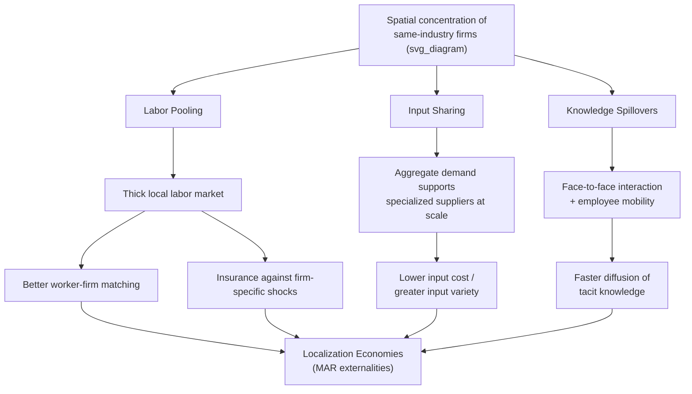

## Marshallian Externalities: Labor Pooling, Input Sharing, and Knowledge Spillovers

### Overview

Alfred Marshall, in *Principles of Economics* (1890), identified three specific mechanisms through which the spatial concentration of firms in the same industry raises their collective productivity — mechanisms that remain, more than a century later, the standard organizing framework for what modern urban economics calls **localization economies**, or Marshall-Arrow-Romer (MAR) externalities. This section develops each of the three mechanisms in depth, along with their formal representation, empirical identification challenges, and modern extensions.

### The General Structure of Marshallian Externalities

All three Marshallian mechanisms share a common formal structure: they are **external economies of scale** — the productivity of an individual firm depends not only on its own inputs, but on the aggregate scale of the *local industry* in which it operates:

$$y_i = A(N_{\text{industry}}) \cdot f(k_i, l_i)$$

where $y_i$ is output of firm $i$, $f(\cdot)$ is a standard constant-returns production function in the firm's own capital $k_i$ and labor $l_i$, and $A(N_{\text{industry}})$ is total factor productivity that rises with $N_{\text{industry}}$, the scale of the local industry (measured, e.g., by local industry employment or number of establishments). The crucial feature distinguishing this from ordinary internal economies of scale is that $A$ depends on aggregate local industry activity, not on the individual firm's own size — no single firm internalizes the productivity benefit it confers on its neighbors, making this a genuine (uncompensated) externality.

### Mechanism 1: Labor Market Pooling

**The core mechanism**

A geographic concentration of firms in the same industry supports a correspondingly large, specialized local labor market. This generates productivity benefits through improved **matching quality** between workers and firms: with many firms and many workers with industry-specific skills in the same location, both sides of the labor market can search more effectively for a well-suited match than they could in a location with only one or a few firms in that industry.

**The insurance/risk-sharing channel**

A distinct and independently important benefit of labor pooling is **risk-sharing against idiosyncratic (firm-specific) shocks**. If a single firm in an isolated location suffers a negative demand or productivity shock, its workers face unemployment with no local alternative employer in the same industry, and may need to migrate or retrain. In a labor-pooled cluster with many firms in the same industry, a worker displaced from one firm can be reabsorbed by another firm in the cluster experiencing a positive (or merely stable) shock, without needing to relocate. This insurance effect can make locating in the cluster attractive to workers even independent of any pure matching-quality improvement, and can lower the wage firms must pay to compensate workers for employment risk.

**Formal representation (search/matching framework)**

Labor pooling is often formalized using a search-and-matching framework in which the matching function exhibits increasing returns to the "thickness" of the local market:

$$M = m(V, U)$$

where $M$ is the number of successful matches, $V$ is the number of vacancies, and $U$ is the number of unemployed (or job-seeking) workers, both measured within the local labor market. If the matching function $m(\cdot)$ exhibits increasing returns to scale in $(V, U)$ jointly — a common finding in the empirical matching-function literature, sometimes termed "thick market externalities" — then a larger local labor market generates a higher match rate (and by extension, better-quality matches on average) than the same ratio of vacancies to job-seekers spread across several smaller, isolated labor markets.

**Empirical signature**

Evidence consistent with labor pooling includes lower unemployment duration in industries with greater local employment concentration, wage compression or reduced wage volatility for workers in thickly clustered industries (consistent with the insurance channel), and observed high rates of worker mobility between firms within the same local industry cluster (consistent with active, well-functioning matching).

### Mechanism 2: Input Sharing (Input-Output Linkages)

**The core mechanism**

Concentration of firms in the same industry (or in vertically related industries) permits local specialization in the supply of intermediate inputs, business services, and specialized equipment, because the aggregate local demand for these inputs is large enough to support efficient-scale specialized suppliers that would not be economically viable if demand were spread over a wider, more dispersed geographic area.

**Fixed-cost/scale logic**

This mechanism rests on ordinary internal economies of scale *at the level of the input supplier*: many specialized input and service providers (equipment repair, specialized consulting, component manufacturing, logistics services tailored to the industry) have significant fixed costs that require a minimum scale of demand to spread over, per unit of output. A geographically concentrated cluster of downstream firms can generate sufficient aggregate demand to support such specialized suppliers at efficient scale, and the resulting lower input prices (or wider input variety) benefit every downstream firm in the cluster — again, an externality, since no single downstream firm's own purchases are large enough to justify the supplier's fixed cost alone.

**Formal representation (variety/love-of-variety framework)**

Input sharing is frequently modeled using a Dixit-Stiglitz-style monopolistic competition framework in which downstream firm productivity depends on the **variety** of available specialized intermediate inputs:

$$y = \left( \sum_{j=1}^{n} x_j^{\rho} \right)^{1/\rho}, \quad 0 < \rho < 1$$

where $x_j$ is the quantity of intermediate input variety $j$ used, and $n$ is the number of available varieties. Under this constant-elasticity-of-substitution structure, output rises with the number of available varieties $n$ (holding total input expenditure fixed), so a larger local downstream industry — by supporting a larger number of viable specialized input varieties through greater aggregate demand — raises the productivity of every downstream firm using those inputs, formalizing the input-sharing mechanism within a standard monopolistic-competition framework closely related to the New Economic Geography models covered later in this course.

**Empirical signature**

Evidence consistent with input sharing includes a greater local variety of specialized suppliers and business services in regions with larger clusters of a given downstream industry, and lower input costs (or higher input quality/customization) for downstream firms located within versus outside such clusters.

### Mechanism 3: Knowledge Spillovers

**The core mechanism**

Marshall's own description — that in an industrial district, industry "secrets" are, in effect, "in the air" — captures the idea that spatial proximity facilitates the exchange of **tacit knowledge**: know-how, techniques, and ideas that are difficult to codify in documents, patents, or manuals and are instead transmitted through informal channels — face-to-face conversation, observation of competitors' and collaborators' practices, employee mobility between firms, and participation in shared local institutions (trade associations, informal social networks, industry events).

**Why proximity matters specifically for tacit knowledge**

Codified knowledge (patents, technical manuals, published research) can, in principle, be transmitted over arbitrary distance at relatively low cost, since it has been formalized into a transferable format. Tacit knowledge, by contrast, is knowledge that "resides" partly in the practices, routines, and unstated understanding of the people who possess it, and its transmission is argued to require an intensity and richness of interaction (frequent, informal, often unplanned face-to-face contact) that is difficult to replicate over distance, even with modern telecommunications — the empirical and theoretical basis for the continued importance of physical proximity for innovation-intensive activity even in an era of otherwise dramatically falling communication costs.

**Employee mobility as a transmission channel**

A well-documented specific channel for local knowledge spillovers is **labor mobility between firms in the same cluster**: when an employee moves from one firm to a nearby competitor or supplier, they carry accumulated tacit knowledge, contacts, and know-how with them, effectively diffusing that knowledge across the cluster in a way that would not occur (or would occur far more slowly) if the employee instead had to relocate to a geographically distant firm.

**Formal representation (knowledge production function)**

Knowledge spillovers are often formalized within an endogenous-growth-style knowledge production function in which the rate of local innovation or productivity growth depends on the local stock of accumulated knowledge/experience:

$$\dot{A} = \delta \cdot A^{\phi} \cdot L_A$$

where $\dot{A}$ is the growth rate of local productivity/knowledge, $L_A$ is labor engaged in knowledge-generating activity, and $\phi$ captures the degree to which existing local knowledge stock $A$ facilitates further knowledge creation — a formulation directly connecting Marshallian knowledge spillovers to Romer-style endogenous growth theory, applied at the local (rather than national) scale, and providing the theoretical basis for treating knowledge spillovers as primarily a **dynamic** (growth-rate) agglomeration economy, in contrast to the more **static** (level) productivity effects of labor pooling and input sharing.

**Empirical signature and identification challenges**

Knowledge spillovers are notoriously difficult to measure directly, since knowledge flows are, by definition, often invisible or informal. The empirical literature has used several indirect proxies and strategies: patent citation patterns (testing whether citations to a given patent are geographically localized near the citing inventor, relative to a comparable non-citing control), the geographic mobility patterns of inventors and highly skilled workers, and co-location patterns of R&D-intensive establishments. [Inference: patent-citation-based evidence of geographic knowledge-spillover localization is a well-established empirical finding in this literature, though the precise magnitude and the extent to which findings generalize across industries and time periods remains an area of ongoing empirical refinement.]

### Comparative Summary of the Three Mechanisms

| Mechanism | Core benefit | Primary channel | Static or dynamic |
| --- | --- | --- | --- |
| Labor pooling | Better matching; risk-sharing against shocks | Thick local labor market | Primarily static (level effect), with some dynamic (career/skill development) components |
| Input sharing | Access to specialized inputs/services at lower cost/greater variety | Local demand supports efficient-scale specialized suppliers | Primarily static (level effect) |
| Knowledge spillovers | Faster diffusion of tacit knowledge and innovation | Face-to-face interaction; employee mobility | Primarily dynamic (growth-rate effect) |

### Diagram: The Three Marshallian Mechanisms (svg_diagram)

<svg xmlns="http://www.w3.org/2000/svg" viewBox="0 0 700 450">
<text x="350" y="24" text-anchor="middle" font-size="16" font-weight="bold" fill="#222">Marshall's Three Externalities (svg_diagram)</text>
<circle cx="350" cy="230" r="55" fill="#f4d03f" stroke="#333" stroke-width="2" />
<text x="350" y="225" text-anchor="middle" font-size="11" font-weight="bold" fill="#333">Local Industry</text>
<text x="350" y="240" text-anchor="middle" font-size="11" font-weight="bold" fill="#333">Cluster</text>
<g>
<circle cx="150" cy="120" r="70" fill="#d9e8c4" stroke="#333" stroke-width="1.5" />
<text x="150" y="105" text-anchor="middle" font-size="11" font-weight="bold" fill="#333">Labor Pooling</text>
<text x="150" y="122" text-anchor="middle" font-size="9" fill="#333">Matching quality</text>
<text x="150" y="136" text-anchor="middle" font-size="9" fill="#333">Risk-sharing</text>
</g>
<g>
<circle cx="550" cy="120" r="70" fill="#a9c98f" stroke="#333" stroke-width="1.5" />
<text x="550" y="105" text-anchor="middle" font-size="11" font-weight="bold" fill="#333">Input Sharing</text>
<text x="550" y="122" text-anchor="middle" font-size="9" fill="#333">Specialized suppliers</text>
<text x="550" y="136" text-anchor="middle" font-size="9" fill="#333">Input variety</text>
</g>
<g>
<circle cx="350" cy="380" r="70" fill="#7fa860" stroke="#333" stroke-width="1.5" />
<text x="350" y="365" text-anchor="middle" font-size="11" font-weight="bold" fill="#fff">Knowledge Spillovers</text>
<text x="350" y="382" text-anchor="middle" font-size="9" fill="#fff">Tacit knowledge diffusion</text>
<text x="350" y="396" text-anchor="middle" font-size="9" fill="#fff">Employee mobility</text>
</g>
<line x1="200" y1="150" x2="310" y2="210" stroke="#333" stroke-width="1.5" />
<line x1="500" y1="150" x2="390" y2="210" stroke="#333" stroke-width="1.5" />
<line x1="350" y1="285" x2="350" y2="310" stroke="#333" stroke-width="1.5" />
</svg>

### Localization Economies vs. Urbanization Economies Revisited

All three Marshallian mechanisms are, by construction, **localization economies** — they depend specifically on the scale of the local *same-industry* cluster, in contrast to **urbanization economies** (Jacobs externalities), which depend on overall city size and industrial diversity rather than own-industry concentration. This is an important distinction for interpreting Marshallian externalities correctly: labor pooling, input sharing, and knowledge spillovers as Marshall described them operate most powerfully *within* a specialized industry cluster, whereas Jacobs' alternative mechanism (cross-industry idea recombination) requires a diverse, not specialized, local economy — the two frameworks are complementary rather than competing explanations, and most real cities plausibly exhibit some combination of both.

### Illustrative Example: Silicon Valley

Silicon Valley's technology cluster is commonly cited as exhibiting all three Marshallian mechanisms simultaneously: a deep, specialized local labor market of software engineers and hardware specialists (labor pooling, with well-documented high rates of job-hopping between firms); a dense ecosystem of specialized suppliers, venture capital firms, legal services, and component manufacturers supporting the technology sector specifically (input sharing); and well-documented informal information exchange, employee mobility between competing firms, and geographic clustering of patent citations within the region (knowledge spillovers). [Inference: while Silicon Valley is widely used as the canonical illustrative example of Marshallian agglomeration in both academic and popular treatments, isolating the precise causal contribution of each of the three mechanisms individually — versus historical path dependence, venture capital availability, university research spillovers from Stanford, and other regionally specific factors — remains genuinely difficult to disentangle empirically.]

### Diagram: Marshallian Mechanisms Summary Flow (svg_diagram)

### Key Points

- Marshall (1890) identified three sources of localization economies: labor market pooling, input sharing, and knowledge spillovers — mechanisms that remain the standard framework for understanding same-industry agglomeration benefits (MAR externalities).
- Labor pooling operates through improved worker-firm matching quality and insurance against idiosyncratic firm-specific shocks, formalizable via search-and-matching theory with increasing returns to local labor market thickness.
- Input sharing operates through the aggregate demand of a local cluster supporting specialized input and service suppliers at efficient scale, formalizable via a Dixit-Stiglitz love-of-variety framework.
- Knowledge spillovers operate through the diffusion of tacit (non-codifiable) knowledge, facilitated by face-to-face interaction and employee mobility between firms in the cluster; this mechanism is primarily dynamic (affecting the growth rate of productivity/innovation) rather than static.
- All three Marshallian mechanisms are localization economies (own-industry-dependent), distinct from and complementary to Jacobs-style urbanization economies (diversity-dependent).

### Related Topics

- Localization economies vs. urbanization economies (Jacobs externalities)
- Search-and-matching models of labor markets
- Dixit-Stiglitz monopolistic competition and the love-of-variety effect
- Patent citation analysis and empirical measurement of knowledge spillovers
- Endogenous growth theory (Romer) applied to local/regional knowledge accumulation
- Industrial districts and cluster case studies (Silicon Valley, Third Italy)
- Static vs. dynamic agglomeration economies