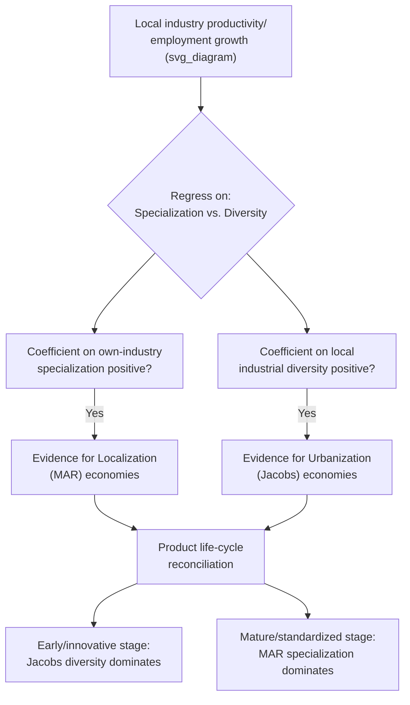

## Localization Economies versus Urbanization Economies

### Overview

Agglomeration economies are conventionally decomposed into two distinct types based on the *source* of the external productivity benefit: **localization economies**, which arise from the scale of a firm's own industry concentrated locally, and **urbanization economies**, which arise from the overall scale and diversity of the broader metropolitan economy, independent of industry. This distinction — often labeled the **MAR (Marshall-Arrow-Romer) versus Jacobs** debate — has organized much of the empirical agglomeration literature since the 1990s and carries distinct predictions for which cities and industries should exhibit the fastest productivity or employment growth.

### Localization Economies (MAR Externalities)

**Definition**

Localization economies are productivity gains that accrue to a firm from the scale of *its own industry* concentrated in the same local area, independent of the size or diversity of the broader city. A firm's productivity rises as the local employment (or number of establishments) in its specific industry rises, holding the size of other, unrelated industries in the same city fixed.

$$y_{i,r} = A(N_{s,r}) \cdot f(k_i, l_i)$$

where $y_{i,r}$ is output of firm $i$ in region $r$, and $A(N_{s,r})$ is productivity as a function of $N_{s,r}$, the local employment scale of the firm's own industry/sector $s$ in region $r$.

**Theoretical foundation: the Marshall-Arrow-Romer (MAR) label**

The "MAR" label attaches Marshall's original three mechanisms (labor pooling, input sharing, knowledge spillovers — covered in the preceding section of this chapter) to a specific theoretical claim, associated with Kenneth Arrow (1962) and Paul Romer (1986), about the nature of knowledge spillovers within an industry: that knowledge accumulated by one firm in an industry spills over primarily to *other firms in the same industry*, since firms in the same industry are best positioned to understand, absorb, and build on each other's innovations (they share technical vocabulary, production processes, and problem domains). This implies that **specialization**, not diversity, should drive the fastest rate of local innovation and productivity growth, since concentrating a single industry maximizes the density of same-industry knowledge exchange.

**MAR externalities and local monopoly power**

An additional, more specific theoretical claim sometimes associated with the MAR framework is that **local monopoly power in an industry facilitates innovation appropriation**: if a single firm (or a small number of firms) dominates a local industry, that firm can better capture the returns to its own innovations (facing less local imitation/competition) than in a setting with many competing local firms in the same industry — implying that local *concentration of market power* within the specialized industry, not merely geographic concentration of *employment*, may matter for the innovation-generating variant of localization economies. This is a distinct (and more specific) theoretical claim from the broader Marshallian mechanisms and is sometimes tested separately in the empirical literature.

### Urbanization Economies (Jacobs Externalities)

**Definition**

Urbanization economies are productivity gains that accrue to a firm from the overall scale and **industrial diversity** of the metropolitan area in which it is located, regardless of the size of its own specific industry locally. A firm's productivity rises with total city size and/or the diversity of industries present in the city, even if its own industry represents only a small share of local activity.

$$y_{i,r} = A(N_r, \text{Div}_r) \cdot f(k_i, l_i)$$

where $N_r$ is total employment (or population) in region $r$ and $\text{Div}_r$ is a measure of industrial diversity in region $r$ (e.g., an inverse Herfindahl index of industry employment shares, or an entropy-based diversity index).

**Theoretical foundation: Jane Jacobs' argument**

Jane Jacobs (1969, *The Economy of Cities*) argued, in direct contrast to the MAR/specialization view, that the most important source of urban innovation is the **cross-fertilization of ideas across different, unrelated industries** — new products and processes emerge disproportionately from the unexpected recombination of knowledge and techniques originally developed in unrelated fields, a process that requires a diverse local economy (many different industries co-located) rather than a specialized one. Jacobs' own illustrative examples emphasized how innovations often arose at the intersection of previously separate trades and skills present simultaneously within large, diverse cities.

**Related concept: unrelated variety vs. related variety**

A refinement within the urbanization-economies literature distinguishes **unrelated variety** (industries present in a city that share little technological or skill overlap, corresponding most closely to Jacobs' original cross-fertilization argument) from **related variety** (industries that are technologically or skill-related to each other, though not identical — e.g., different segments of an automotive supply chain), with some empirical work finding that "related variety" specifically, rather than diversity in the broadest unrelated sense, best predicts regional employment growth. [Inference: this related-variety refinement is a recognized extension within the broader urbanization-economies literature, though the relative empirical support for "unrelated" versus "related" variety as the more important growth driver varies across studies and contexts.]

### Direct Comparison

| Dimension | Localization Economies (MAR) | Urbanization Economies (Jacobs) |
| --- | --- | --- |
| Source of benefit | Own-industry scale, locally | Overall city size and industrial diversity |
| Theoretical origin | Marshall (1890); Arrow (1962); Romer (1986) | Jacobs (1969) |
| Mechanism | Labor pooling, input sharing, within-industry knowledge spillovers | Cross-industry idea recombination |
| Predicted driver of growth | Industry specialization | Industrial diversity |
| Associated market structure claim | Local monopoly may aid innovation appropriation | Local competition may aid innovation diffusion |
| Static or dynamic emphasis | Both (labor/input sharing static; knowledge spillovers dynamic) | Primarily dynamic (innovation/growth-rate effect) |

### Diagram: Two Sources of Agglomeration Benefit (svg_diagram)

<svg viewBox="0 0 700 400" xmlns="http://www.w3.org/2000/svg">
<text x="350" y="24" text-anchor="middle" font-size="16" font-weight="bold" fill="#222">Localization vs. Urbanization Economies (svg_diagram)</text>
<rect x="60" y="70" width="270" height="280" rx="10" fill="#dfeee0" stroke="#333" stroke-width="1.5"/>
<text x="195" y="100" text-anchor="middle" font-size="13" font-weight="bold" fill="#333">Localization (MAR)</text>
<circle cx="120" cy="150" r="18" fill="#27ae60"/>
<circle cx="160" cy="150" r="18" fill="#27ae60"/>
<circle cx="200" cy="150" r="18" fill="#27ae60"/>
<circle cx="240" cy="150" r="18" fill="#27ae60"/>
<text x="195" y="200" text-anchor="middle" font-size="10" fill="#333">Same industry,</text>
<text x="195" y="215" text-anchor="middle" font-size="10" fill="#333">many firms, concentrated</text>
<text x="195" y="260" text-anchor="middle" font-size="10" fill="#333">Benefit rises with</text>
<text x="195" y="275" text-anchor="middle" font-size="10" fill="#333">own-industry scale</text>
<text x="195" y="320" text-anchor="middle" font-size="10" font-style="italic" fill="#333">e.g. Finance in NYC</text>
<rect x="370" y="70" width="270" height="280" rx="10" fill="#f4e2b8" stroke="#333" stroke-width="1.5"/>
<text x="505" y="100" text-anchor="middle" font-size="13" font-weight="bold" fill="#333">Urbanization (Jacobs)</text>
<circle cx="450" cy="140" r="16" fill="#c0392b"/>
<rect x="490" cy="140" x="480" y="130" width="30" height="20" fill="#2980b9"/>
<polygon points="540,120 555,150 525,150" fill="#e67e22"/>
<circle cx="590" cy="140" r="16" fill="#8e44ad"/>
<text x="505" y="200" text-anchor="middle" font-size="10" fill="#333">Many different industries,</text>
<text x="505" y="215" text-anchor="middle" font-size="10" fill="#333">co-located and diverse</text>
<text x="505" y="260" text-anchor="middle" font-size="10" fill="#333">Benefit rises with</text>
<text x="505" y="275" text-anchor="middle" font-size="10" fill="#333">overall diversity</text>
<text x="505" y="320" text-anchor="middle" font-size="10" font-style="italic" fill="#333">e.g. Diverse metros</text>
</svg>

### Empirical Approaches to Distinguishing the Two

Testing MAR versus Jacobs externalities empirically typically involves regressing a measure of local industry productivity growth or employment growth on measures of both local own-industry specialization (e.g., a location quotient, or the log of local own-industry employment) and local industrial diversity (e.g., an inverse Herfindahl index across all local industries), while controlling for local competition intensity, city size, and other confounders:

$$\Delta \ln(y_{s,r}) = \beta_1 \ln(\text{Specialization}_{s,r}) + \beta_2 \ln(\text{Diversity}_r) + \beta_3 \ln(\text{Competition}_{s,r}) + \gamma X_{s,r} + \varepsilon_{s,r}$$

A finding of $\beta_1 > 0$ (with diversity controlled for) is interpreted as evidence for localization/MAR economies; a finding of $\beta_2 > 0$ (with specialization controlled for) is interpreted as evidence for urbanization/Jacobs economies. The seminal empirical papers in this literature (notably Glaeser, Kallal, Scheinkman, and Shleifer, 1992, using U.S. city-industry data) found evidence more supportive of urbanization/Jacobs-style diversity effects and *local competition* (rather than local specialization/monopoly) as predictors of employment growth, though subsequent work using different industries, time periods, countries, and outcome measures (productivity growth versus employment growth, in particular) has produced a genuinely mixed body of findings, and the debate has not been definitively resolved in favor of one mechanism over the other. [Inference: characterizing the overall balance of the empirical literature is inherently provisional, since findings appear sensitive to the specific outcome variable, industry sample, geographic unit, and time period used; a general takeaway across this literature is that both mechanisms likely operate, with their relative importance varying by context, industry maturity, and stage of the product/industry life cycle, rather than one mechanism being universally dominant.]

### The Product Life-Cycle Reconciliation

A commonly cited reconciliation of the mixed empirical evidence connects the two mechanisms to the **stage of an industry's product life cycle** (drawing on Vernon's product cycle theory, adapted to a regional context):

- **Early stage (innovation-intensive)**: new, still-evolving industries benefit most from urbanization/Jacobs-style diversity, since production processes are not yet standardized, and cross-fertilization from unrelated fields is more likely to generate the novel breakthroughs needed at this stage
- **Mature stage (standardized, routine production)**: once an industry's technology and processes have matured and become more standardized, localization/MAR-style specialization economies become more important, since firms benefit most from the efficiency gains of a large, specialized labor pool and supplier base rather than from cross-industry idea recombination

This reconciliation suggests both mechanisms can be simultaneously valid, operating at different points in an industry's development, rather than being mutually exclusive competing theories of urban productivity.

### Diagram: Empirical Testing Logic (svg_diagram)

### Key Points

- Localization economies (MAR externalities) arise from own-industry scale concentrated locally, grounded in Marshall's labor pooling, input sharing, and knowledge spillover mechanisms, with Arrow and Romer's variant emphasizing within-industry knowledge diffusion and, in some formulations, local monopoly power aiding innovation appropriation.
- Urbanization economies (Jacobs externalities) arise from overall city size and industrial diversity, grounded in Jane Jacobs' argument that cross-fertilization of ideas across unrelated industries drives urban innovation.
- The seminal Glaeser, Kallal, Scheinkman, and Shleifer (1992) study found evidence more supportive of diversity and local competition than specialization and monopoly, but subsequent empirical findings have been genuinely mixed across industries, time periods, and outcome measures.
- A commonly cited reconciliation links the two mechanisms to an industry's product life-cycle stage: Jacobs-style diversity benefits are more important for young, innovation-intensive industries, while MAR-style specialization benefits are more important for mature, standardized industries.
- The related variety vs. unrelated variety distinction refines the urbanization-economies concept, with some evidence favoring technologically related (but not identical) industry diversity as the stronger growth predictor.

### Related Topics

- Marshallian externalities: labor pooling, input sharing, and knowledge spillovers (in depth)
- Glaeser, Kallal, Scheinkman, and Shleifer (1992) and the empirical MAR-vs-Jacobs literature
- Related variety versus unrelated variety in regional economic diversity
- Vernon's product life-cycle theory applied to regional industry evolution
- Location quotients and measuring industry specialization
- Patent citation studies and empirical measurement of knowledge spillovers
- Static versus dynamic agglomeration economies
- Industrial districts and cluster case studies (Silicon Valley, Third Italy)