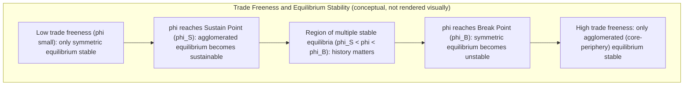

## Increasing Returns to Scale and Spatial Concentration

### Overview and Core Intuition

Increasing returns to scale (IRS) occur when output grows more than proportionally with inputs — doubling all inputs more than doubles output. In spatial economics, IRS is the foundational mechanism explaining why economic activity clusters in space rather than spreading evenly across a featureless plain. Under constant returns to scale (CRS) and perfect competition, the classical result (formalized by Starrett's spatial impossibility theorem) is that no trade or transport costs would be incurred in equilibrium — firms and households would disperse to minimize transport costs, and any concentrated pattern would not be an equilibrium. Cities, industrial districts, and regional clusters can only be sustained if there is some countervailing force that rewards concentration. IRS supplies that force.

### The Spatial Impossibility Theorem (Motivation)

**Key Points**

- Starrett (1978) showed that if (1) space is homogeneous, (2) transport is costly, (3) there is a finite number of agents, and (4) production is characterized by constant returns and perfect competition, then no competitive equilibrium with transport costs exists — equivalently, any equilibrium involves zero transportation.
- This implies that backyard capitalism (autarky at every point) is the only equilibrium under CRS with costly trade.
- To explain observed spatial concentration (cities, industrial belts), at least one of these assumptions must be relaxed. The dominant approach in urban and regional economics relaxes constant returns, introducing IRS at the firm or aggregate level.

### Types of Increasing Returns Relevant to Spatial Concentration

#### Internal (Firm-Level) Increasing Returns

Internal IRS arises from indivisibilities in a single firm's production function — for example, fixed costs of a factory, a marketing department, or R&D spread over larger output. This is the basis of the **Dixit-Stiglitz monopolistic competition** framework used in New Economic Geography (NEG).

$$C(q) = F + cq$$

where $F$ is the fixed cost and $c$ is the constant marginal cost. Average cost $AC = F/q + c$ declines with $q$, generating scale economies at the firm level. Firms therefore concentrate production in a single (or few) locations rather than replicating plants everywhere, because splitting production across many small plants forfeits the fixed-cost spreading advantage.

#### External (Agglomeration) Economies

External IRS arises when the productivity of an individual firm depends on the aggregate scale of activity around it, even though each firm individually may face constant or even decreasing returns internally. Marshall (1890) identified three classic sources, often called **MAR externalities**:

1. **Labor market pooling** — a thick local labor market with specialized skills reduces search and matching frictions for both firms and workers.
2. **Input-output linkages** — proximity to specialized suppliers and customers reduces transaction and transport costs, and supports a wider variety of intermediate inputs.
3. **Knowledge spillovers** — tacit knowledge diffuses more easily through face-to-face contact, informal exchange, and labor mobility within a cluster ("knowledge is in the air").

External economies are technically increasing returns *at the industry or city level* even when individual firms operate under CRS or near-CRS technology — this is why they can be reconciled with perfectly competitive firm behavior, unlike internal IRS, which requires imperfect competition (since a competitive firm facing IRS would want to expand without bound).

### Localization vs. Urbanization Economies

**Key Points**

- **Localization economies**: external economies specific to firms in the *same* industry clustering together (MAR-type). Benefits scale with own-industry employment in the location.
- **Urbanization economies**: external economies available to *all* firms regardless of industry, scaling with total city size or diversity (Jacobs-type, after Jane Jacobs, 1969). These emphasize cross-industry knowledge recombination and diversity as the source of innovation and growth.
- **Empirical distinction**: localization economies are typically tested via industry-specific employment density; urbanization economies via total city population, employment diversity indices (e.g., inverse Herfindahl of industry shares), or Jacobs diversity measures.

A production function capturing both might be written as:

$$A_i = A_0 \cdot L_i^{\alpha} \cdot U_i^{\beta}$$

where $A_i$ is total factor productivity at location $i$, $L_i$ is own-industry employment (localization), $U_i$ is total urban employment or diversity (urbanization), and $\alpha, \beta > 0$ capture the elasticity of productivity with respect to each.

### Formal Modeling Approaches

#### 1. Agglomeration as an Externality in the Production Function

The simplest reduced-form approach embeds city size or industry size directly as a productivity shifter:

$$Y_i = A(N_i) \cdot F(K_i, L_i), \quad A'(N_i) > 0$$

where $N_i$ is employment or population at location $i$, and $A(\cdot)$ is increasing, reflecting external IRS. Individual firms take $A(N_i)$ as given (external to their own decisions), preserving perfect competition at the firm level while generating aggregate IRS.

This nests naturally into urban wage/rent equilibrium models (see the chapter's treatment of Alonso-Muth-Mills and urban systems): higher $A(N_i)$ raises the marginal product of labor, which bids up wages, attracting workers, until the wage premium is offset by higher land rents and commuting costs — an equilibrium city size emerges from the balance between agglomeration benefits and congestion costs.

#### 2. Dixit-Stiglitz Monopolistic Competition (Core-Periphery / NEG)

The Krugman (1991) core-periphery model is the canonical microfounded treatment of IRS-driven concentration. Key ingredients:

- **CES preferences** over a continuum of differentiated varieties, generating "love of variety":

$$U = \left( \int_{0}^{n} c(\omega)^{\frac{\sigma-1}{\sigma}} d\omega \right)^{\frac{\sigma}{\sigma-1}}$$

where $\sigma > 1$ is the elasticity of substitution between varieties.

- **Increasing returns at the firm level** (fixed + marginal cost, as above), which combined with free entry and monopolistic competition (Dixit-Stiglitz, 1977) determines firm size and the number of varieties produced.
- **Iceberg transport costs**: shipping one unit requires producing $\tau > 1$ units, of which $\tau - 1$ "melts" in transit.
- **Two forces**:
  - **Centripetal (agglomerating) forces**: market access (demand linkages — firms want to locate near large markets, the "home market effect"), cost-of-living/price-index effects (more local varieties reduce the local price index), and forward/backward input-output linkages.
  - **Centrifugal (dispersing) forces**: immobile factors (e.g., agricultural land/labor), market crowding/competition effects, and congestion or land rent costs.

The model produces **multiple equilibria** and a **tomahawk (pitchfork with hysteresis) bifurcation diagram**: as trade costs fall below a critical threshold (the "break point"), the symmetric equilibrium becomes unstable and the economy catastrophically tips into a core-periphery outcome, with one region capturing manufacturing and the other left with only the immobile sector.

#### 3. Circular Causation and Cumulative Causation

Myrdal (1957) and Kaldor's earlier verbal theories anticipated the NEG mechanism: an initial advantage (natural or historical) attracts firms, which increases local demand and labor market thickness, which attracts more firms — a self-reinforcing ("virtuous circle") process. This is formalized in NEG via the **backward linkage** (firms locate where demand is large) and **forward linkage** (demand is large where many firms already locate, lowering the price index). The combination generates circular and cumulative causation.

### Diagram: Centripetal vs. Centrifugal Forces

<svg xmlns="http://www.w3.org/2000/svg" viewBox="0 0 720 420" font-family="Helvetica, Arial, sans-serif">
<text x="360" y="28" text-anchor="middle" font-size="18" font-weight="bold" fill="#1a1a1a">Forces Shaping Spatial Concentration (svg_diagram)</text>
<circle cx="360" cy="210" r="70" fill="#e8f0fe" stroke="#1a56db" stroke-width="2" />
<text x="360" y="205" text-anchor="middle" font-size="14" font-weight="bold" fill="#1a56db">Spatial</text>
<text x="360" y="222" text-anchor="middle" font-size="14" font-weight="bold" fill="#1a56db">Equilibrium</text>

<rect x="30" y="60" width="220" height="130" rx="8" fill="#eafaf1" stroke="#0d9c5c" stroke-width="2" />
<text x="140" y="82" text-anchor="middle" font-size="13" font-weight="bold" fill="#0d9c5c">Centripetal Forces</text>
<text x="45" y="104" font-size="11.5" fill="#1a1a1a">• Market access / demand linkages</text>
<text x="45" y="123" font-size="11.5" fill="#1a1a1a">• Thick labor markets (pooling)</text>
<text x="45" y="142" font-size="11.5" fill="#1a1a1a">• Input-output linkages</text>
<text x="45" y="161" font-size="11.5" fill="#1a1a1a">• Knowledge spillovers</text>
<text x="45" y="180" font-size="11.5" fill="#1a1a1a">• Lower local price index</text>

<rect x="470" y="60" width="220" height="130" rx="8" fill="#fdeaea" stroke="#c81e1e" stroke-width="2" />
<text x="580" y="82" text-anchor="middle" font-size="13" font-weight="bold" fill="#c81e1e">Centrifugal Forces</text>
<text x="485" y="104" font-size="11.5" fill="#1a1a1a">• Immobile factors (land, farmers)</text>
<text x="485" y="123" font-size="11.5" fill="#1a1a1a">• Market crowding / competition</text>
<text x="485" y="142" font-size="11.5" fill="#1a1a1a">• Land rent / congestion costs</text>
<text x="485" y="161" font-size="11.5" fill="#1a1a1a">• Commuting costs</text>
<text x="485" y="180" font-size="11.5" fill="#1a1a1a">• Pollution / negative externalities</text>
<line x1="250" y1="130" x2="292" y2="180" stroke="#0d9c5c" stroke-width="2.5" marker-end="url(#arrowGreen)" />
<line x1="470" y1="130" x2="428" y2="180" stroke="#c81e1e" stroke-width="2.5" marker-end="url(#arrowRed)" />
<text x="360" y="340" text-anchor="middle" font-size="12.5" fill="`#333333`">Concentration emerges when centripetal forces dominate;</text>

<text x="360" y="360" text-anchor="middle" font-size="12.5" fill="`#333333`">dispersion persists when centrifugal forces dominate.</text>

<text x="360" y="390" text-anchor="middle" font-size="11" fill="`#666666`" font-style="italic">Trade/transport cost is the key parameter shifting the balance (Krugman 1991)</text>

</svg>

### Break Point and Sustain Point

Two critical thresholds of trade freeness ($\phi$, inversely related to trade costs $\tau$) characterize the bifurcation:

- **Break point** ($\phi_B$): the trade-freeness level at which the symmetric (dispersed) equilibrium loses stability. Below this level of trade freeness (i.e., high trade costs), symmetry is stable; above it, symmetry breaks.
- **Sustain point** ($\phi_S$): the trade-freeness level at which a fully agglomerated core-periphery equilibrium first becomes sustainable (no incentive for a firm to relocate to the periphery).

Because $\phi_S < \phi_B$ typically holds under standard parameterizations, there is a range of trade freeness in which **both** the symmetric and the core-periphery equilibria are locally stable — producing path dependence and hysteresis: history (not just current fundamentals) determines which equilibrium prevails, and once agglomeration occurs, reducing trade costs further does not reverse it (a "lock-in" effect).

### Empirical Measurement of Agglomeration Economies

**Key Points**

- **Elasticity estimates**: a large empirical literature (Rosenthal & Strange, Combes et al., Melo, Graham, Ciccone & Hall) estimates the elasticity of productivity (or wages) with respect to density or employment scale. A frequently cited "rule of thumb" is that doubling city size raises productivity by roughly 2–8%, though estimates vary substantially by country, sector, and identification strategy.
- **Identification challenges**:
  - **Sorting/selection**: more productive firms and workers may self-select into large cities, biasing naive cross-sectional estimates upward (reverse causality between productivity and location).
  - **Endogeneity of density**: unobserved local productivity shocks can simultaneously raise density and output.
  - Common solutions include instrumental variables (e.g., historical population, geological/soil characteristics as instruments for density — Ciccone & Hall 1996), panel data with worker or firm fixed effects (Combes, Duranton, Gobillon), and natural experiments.
- **Distance decay**: Rosenthal and Strange (2003, 2008) find agglomeration effects attenuate sharply with distance — benefits are strongest within a few miles/kilometers and decline substantially beyond that, suggesting localized, face-to-face-dependent mechanisms (especially for knowledge spillovers) rather than purely regional effects.

**Example**

A standard empirical specification (Combes-style) regresses log wage or log TFP on log employment density, controlling for individual and firm characteristics:

$$\ln w_{it} = \beta_0 + \beta_1 \ln(\text{Density}_{c(i,t)}) + X_{it}'\gamma + \mu_i + \varepsilon_{it}$$

where $\mu_i$ is a worker fixed effect (to net out unobserved individual ability/sorting), and $\beta_1$ is interpreted as the agglomeration elasticity.

### Diseconomies of Concentration (Congestion Forces)

IRS does not imply unbounded concentration — increasing congestion costs eventually offset agglomeration benefits, yielding a finite equilibrium city size or firm cluster size. Congestion sources include:

- Rising land rents and housing costs (bid-rent competition, per the Alonso-Muth-Mills tradition).
- Commuting time and traffic congestion.
- Pollution and other negative environmental externalities.
- Crime and other social costs associated with density.

The equilibrium (and optimal) city size is typically characterized where the marginal agglomeration benefit equals the marginal congestion cost:

$$\frac{\partial A(N)}{\partial N} = \frac{\partial \text{Congestion Cost}(N)}{\partial N}$$

A well-known result (Henderson, 1974) is that the market equilibrium city size, absent developer coordination, tends to differ from the socially optimal size because individual agents do not internalize their marginal contribution to congestion or to agglomeration benefits for others — motivating city-size regulation, zoning, or the role of "large" landowners/developers who can internalize agglomeration and congestion externalities within a city (as modeled in Henderson-style systems of cities).

### Systems of Cities and Specialization

Because localization economies favor industry-specific clustering while congestion costs limit any single city's size, an economy-wide equilibrium typically features a **system of cities**, each specializing in different industries (Henderson's systems-of-cities model). Total welfare is maximized when the number and size distribution of cities balances industry-specific agglomeration economies against city-size congestion costs across the whole urban system. This helps explain both the existence of many mid-sized specialized cities and a few large diversified metropolises, consistent with **Zipf's Law** for city-size distributions (an empirical regularity in which city sizes approximately follow a power law, i.e., the population of the $n$-th largest city is approximately proportional to $1/n$ times the largest city's population).

### Related Empirical Regularities

- **Home Market Effect**: NEG predicts that larger markets host a more-than-proportionate share of increasing-returns industries and can become net exporters of those goods — a testable implication distinguishing NEG from Heckscher-Ohlin trade theory.
- **Wage-Density (Agglomeration) Gradient**: observed positive correlation between urban density/size and nominal wages, partially offset by higher cost of living (real wage gradients are typically flatter than nominal ones).
- **New Firm Formation and Nursery Cities**: dense urban areas often serve as incubators for new, small, and innovative firms, consistent with knowledge-spillover-driven IRS (Duranton & Puga's "nursery city" hypothesis).

### Distinguishing Localization, Urbanization, and Jacobs Externalities Empirically

| Externality Type | Key Driver | Typical Proxy | Associated Scholars |
| --- | --- | --- | --- |
| Localization (MAR) | Own-industry specialization | Own-industry employment share/density | Marshall, Arrow, Romer |
| Urbanization | Overall city scale | Total city population/employment | Various (Henderson) |
| Jacobs | Cross-industry diversity | Diversity index (inverse Herfindahl) | Jane Jacobs |

**[Inference]** The relative empirical importance of MAR versus Jacobs externalities remains contested; results are sensitive to industry classification granularity, geographic unit of analysis, and identification strategy, and no consensus ranking applies uniformly across all contexts.

### Policy Implications

- **Place-based policy**: if agglomeration economies are strong and localized, policies that subsidize firm relocation to lagging regions may reduce aggregate productivity (moving firms away from productive agglomerations), even if they achieve interregional equity goals — a classic efficiency-equity tradeoff in regional policy.
- **Infrastructure and market access**: reducing internal trade costs (via transport infrastructure) can trigger NEG-style bifurcations, potentially exacerbating regional inequality by accelerating core-periphery divergence rather than promoting convergence, depending on where the economy sits relative to the break and sustain points.
- **Urban growth boundaries and zoning**: because market equilibrium city sizes may deviate from socially optimal sizes (due to uninternalized congestion or agglomeration externalities), land-use regulation has a theoretical efficiency rationale, though empirical calibration of "optimal" density is difficult and context-dependent. **[Inference]** The direction and magnitude of any welfare gain from such regulation depends heavily on local elasticities of agglomeration and congestion, which vary by city and are not settled empirically in general.

### Related Topics

- Alonso-Muth-Mills monophonic urban land use model and the bid-rent framework
- Dixit-Stiglitz monopolistic competition and CES demand systems
- Krugman core-periphery model: full derivation and comparative statics
- Zipf's Law and the rank-size distribution of cities
- Henderson's systems-of-cities model and urban specialization
- Home Market Effect and its empirical tests
- Knowledge spillovers and patent citation studies (Jaffe, Trajtenberg, Henderson)
- Nursery cities and firm life-cycle location choices (Duranton & Puga)
- New Economic Geography (NEG) vs. New Urban Economics: methodological contrasts
- Congestion pricing and optimal city-size regulation
- Spatial equilibrium models and the Rosen-Roback framework
- Distance decay in agglomeration spillovers (Rosenthal & Strange)