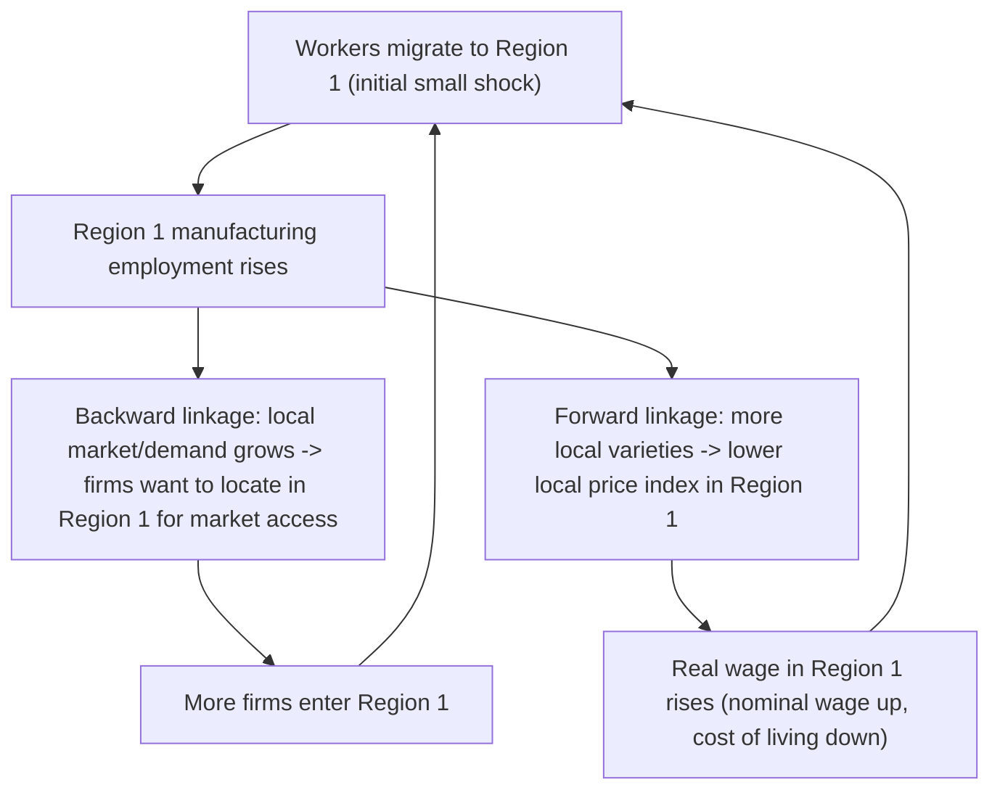
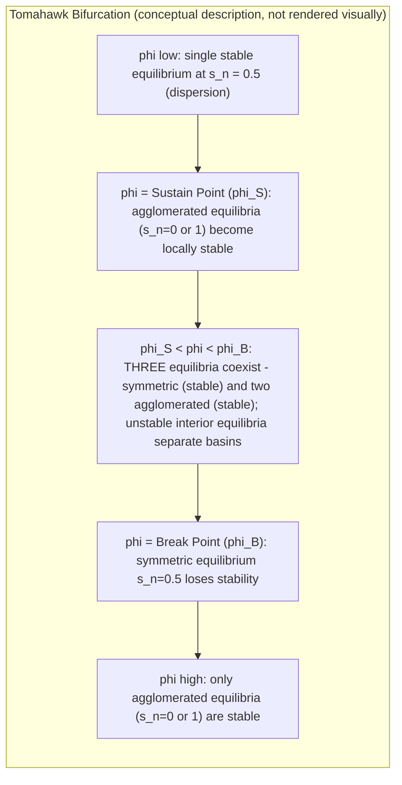

## New Economic Geography and the Core-Periphery Model

### Overview

New Economic Geography (NEG) is the body of theory, initiated by Paul Krugman's 1991 paper "Increasing Returns and Economic Geography," that formalizes spatial concentration using general-equilibrium microfoundations: Dixit-Stiglitz monopolistic competition, increasing returns to scale (IRS) at the firm level, and costly interregional trade. Its centerpiece is the **core-periphery (CP) model**, which shows how a symmetric two-region economy can endogenously and discontinuously split into an industrialized "core" and an agricultural "periphery" purely as a function of falling transport costs — with no exogenous regional advantage required. Krugman received the 2008 Nobel Memorial Prize in Economic Sciences in part for this contribution.

### Why NEG Was Needed: The Spatial Impossibility Problem

Under constant returns to scale and perfect competition, Starrett's spatial impossibility theorem implies that costly transport is inconsistent with competitive equilibrium — dispersion (autarky at every point) is the only outcome. To generate concentration, NEG abandons two neoclassical pillars simultaneously: constant returns (replaced by internal IRS at the firm level) and perfect competition (replaced by Dixit-Stiglitz monopolistic competition, which remains tractable despite each firm facing a downward-sloping demand curve).

### Core Assumptions of the Krugman (1991) Model

**Key Points**

- **Two regions** (Region 1 and Region 2), symmetric in fundamentals.
- **Two sectors**:
  - **Agriculture (A)**: constant returns to scale, perfectly competitive, produces a homogeneous good, costlessly traded, uses an immobile factor (farmers/land).
  - **Manufacturing (M)**: increasing returns to scale (fixed + marginal cost), monopolistically competitive, produces a continuum of differentiated varieties, traded subject to iceberg transport costs, uses a mobile factor (workers).
- **Two factors**: immobile agricultural labor/land (pins down the periphery) and mobile manufacturing labor (the mechanism of migration/agglomeration).
- **Iceberg transport costs**: to deliver one unit of a manufactured variety to the other region, $\tau > 1$ units must be shipped; the fraction $\tau - 1$ "melts" in transit. This avoids introducing a separate transport sector.
- **CES preferences** over manufacturing varieties combined with Cobb-Douglas preferences over the agriculture/manufacturing composite.

### Consumer Preferences

Utility is Cobb-Douglas over agricultural goods and a manufacturing composite index:

$$U = M^{\mu} A^{1-\mu}$$

where $\mu$ is the (constant) expenditure share on manufactures. The manufacturing composite is a CES (Dixit-Stiglitz) aggregator over the continuum of varieties $\omega \in [0, n]$:

$$M = \left( \int_0^n c(\omega)^{\frac{\sigma - 1}{\sigma}} \, d\omega \right)^{\frac{\sigma}{\sigma - 1}}$$

with $\sigma > 1$ the elasticity of substitution between varieties (equivalently, $1/(\sigma-1)$ indexes the "love of variety" — lower $\sigma$ means varieties are less substitutable and variety itself is more valued).

### Production and Firm Behavior

Each manufacturing variety is produced by a single firm under increasing returns:

$$l(x) = F + cx$$

where $l(x)$ is labor required to produce output $x$, $F$ is the fixed labor requirement, and $c$ is the marginal labor requirement. Firms are monopolistically competitive: each sets a profit-maximizing markup price, free entry drives profits to zero, and the equilibrium number of varieties/firms is pinned down by the zero-profit condition. Under CES demand, the profit-maximizing price is a constant markup over marginal cost:

$$p = \frac{\sigma}{\sigma - 1} \cdot w \cdot c$$

where $w$ is the local manufacturing wage. Zero profit combined with the markup pricing rule pins down each firm's equilibrium output and labor use, meaning **each region's number of varieties is proportional to its manufacturing employment** — a key link between factor mobility and variety supply.

### The Price Index and Real Wages

The CES price index for manufactures in region $i$, aggregating over local varieties (priced at $p$) and imported varieties (priced at $p\tau$ due to iceberg costs), is:

$$P_i = \left[ n_i p_i^{1-\sigma} + n_j (p_j \tau)^{1-\sigma} \right]^{\frac{1}{1-\sigma}}$$

A region with **more local varieties** has a **lower local price index** (consumers avoid paying the transport-cost markup on most of what they consume) — this is the mechanism behind the **forward linkage**: firms prefer to locate where many other firms already are, because that lowers the cost of living there for workers, which (via the real-wage-equalization migration condition) makes it more attractive to locate for workers.

### Real Wages and Market Access

The nominal wage that manufacturing firms in region $i$ can pay depends on demand from both regions (the "market access" effect), weighted by transport costs — this is the **backward linkage**: firms want to locate near large markets to save on transport costs, and markets are large where many workers (income) already are.

$$w_i = \left[ \sum_j Y_j \, p_i^{-\sigma} \tau_{ij}^{1-\sigma} P_j^{\sigma - 1} \right]^{1/\sigma}$$

(schematic form; exact expression depends on normalization). The **real wage** is $\omega_i = w_i / P_i^{\mu}$, and workers migrate toward the region offering the higher real wage.

### The Two Linkages and Circular Causation

This is **circular and cumulative causation**: a small initial migration shock is self-reinforcing rather than self-correcting, provided the centripetal forces (linkages) dominate the centrifugal force (competition effect — more firms in one place intensifies local competition and depresses local nominal wages, plus the immobile agricultural sector anchors some demand in the periphery).

### Centripetal vs. Centrifugal Forces (Summary)

| Force Type | Mechanism | Effect on Concentration |
| --- | --- | --- |
| Backward linkage (market access) | Firms locate near large demand | Centripetal |
| Forward linkage (price index/cost of living) | Workers prefer locations with many local varieties | Centripetal |
| Labor market thickness | Matching/agglomeration benefits | Centripetal |
| Market crowding | More firms locally intensifies price competition | Centrifugal |
| Immobile factor (agriculture) | Anchors some demand/production in periphery | Centrifugal |
| Land rent / congestion | Rising costs of concentrated activity | Centrifugal |

### Equilibrium, Bifurcation, and the Tomahawk Diagram

The model's central result is expressed as a bifurcation diagram plotting the share of manufacturing in Region 1 ($s_n$) against **trade freeness** $\phi \equiv \tau^{1-\sigma} \in (0,1)$ (higher $\phi$ means lower effective trade costs):

- **Low $\phi$ (high trade costs)**: only the symmetric equilibrium ($s_n = 0.5$) is stable — dispersion.
- **Intermediate $\phi$**: multiple stable equilibria coexist — both symmetric dispersion and full agglomeration ($s_n = 0$ or $s_n=1$) can be locally stable, depending on history/initial conditions.
- **High $\phi$ (low trade costs)**: the symmetric equilibrium becomes unstable; only the asymmetric core-periphery equilibria are stable.

### Break Point vs. Sustain Point Formally

- **Break point** $\phi_B$: found via local stability analysis of the symmetric equilibrium — the value of $\phi$ at which a small perturbation to $s_n = 0.5$ stops being self-correcting and starts being self-reinforcing.
- **Sustain point** $\phi_S$: found by checking whether, starting from full agglomeration ($s_n = 1$), a single firm has an incentive to deviate and move to the empty region (the "no-black-hole" condition must fail for periphery firms to be viable). It's the point where full agglomeration first becomes a *sustainable* equilibrium (no-deviation condition holds).

Because typically $\phi_S < \phi_B$, the intermediate range exhibits **hysteresis**: the economy's history (not just current parameters) determines which equilibrium is realized, and gradual reductions in trade costs can produce **catastrophic, discontinuous jumps** from dispersion to full agglomeration once $\phi_B$ is crossed, rather than smooth adjustment.

### Necessary Conditions for Agglomeration (No-Black-Hole Condition)

A theoretical curiosity of the base model: if $\sigma$ (elasticity of substitution) is too low relative to $\mu$ (expenditure share on manufactures), the model predicts agglomeration is unconditionally sustained for *any* trade cost — a "black hole" result considered empirically implausible (it would imply the entire world's manufacturing should concentrate in one city, absent all dispersion forces). The **no-black-hole condition** requires:

$$\mu < \frac{\sigma - 1}{\sigma}$$

This condition ensures the market-crowding (competition) centrifugal effect is strong enough, relative to the linkage effects, to admit an interior sustain point $\phi_S \in (0,1)$ rather than agglomeration being sustainable even under autarky.

### Extensions of the Baseline Model

**Key Points**

- **Footloose capital model** (Martin & Rogers, 1995): replaces migration of workers with mobile capital (while profits/income are repatriated to the immobile owner's home region), avoiding the need to model labor migration and simplifying welfare analysis; commonly used because it removes one channel of circular causation, making the model more tractable while preserving qualitative results.
- **Footloose entrepreneur model** (Forslid & Ottaviano): entrepreneurs (a mobile skilled factor) migrate together with their capital, blending features of the original and footloose-capital variants.
- **Vertical linkages / input-output model** (Venables, 1996; Krugman & Venables, 1995): introduces intermediate goods produced under IRS and used as inputs by other manufacturing firms, generating agglomeration forces even without labor mobility — relevant for explaining industrial clustering *within* a country where interregional labor mobility is limited.
- **Congestion/dispersion via immobile housing or local costs** (Helpman, 1998): replaces the immobile agricultural sector with housing, reversing some qualitative results — the forward linkage (price index effect) can become a dispersion force because increased demand in the growing region raises local *housing* costs faster than it lowers the traded-goods price index.
- **Multi-region and continuous-space extensions**: racetrack economies (Krugman, 1993) with many regions arranged on a circle, generating regularly spaced "spikes" of activity resembling actual urban systems and offering a bridge to central place theory.

### Empirical Assessment of NEG

**Key Points**

- **Home Market Effect (HME)**: the central testable prediction — regions with larger demand for an IRS good become net exporters of that good, and host a more-than-proportionate share of its production. Empirical support is mixed but present in several studies (e.g., Davis & Weinstein on OECD manufacturing; various EU regional studies), though the effect's magnitude and robustness vary by sector and identification strategy.
- **Wage equations and market potential**: studies (Hanson, 2005; Redding & Venables, 2004) estimate structural NEG "market potential" or "market access" terms and generally find a positive, statistically significant relationship between market access and wages, consistent with NEG's backward linkage.
- **Trade cost calibration**: empirical trade-cost estimates (from gravity models) are used to calibrate $\tau$ and assess whether observed regions are in the dispersion, multiple-equilibria, or agglomeration zone of the bifurcation diagram.
- **Critiques**:
  - The model's reliance on iceberg costs and the Dixit-Stiglitz functional form, while tractable, is a strong simplification that may not capture real transport/trade cost structures.
  - Structural estimation of full NEG models is econometrically demanding (nonlinear, multiple equilibria complicate identification).
  - Some argue NEG's predictions overlap substantially with older economic base and export base theories, and that distinguishing NEG mechanisms from simple factor-endowment or natural-advantage explanations empirically is difficult.
  - **[Inference]** The degree to which observed regional specialization patterns are driven by NEG-style cumulative causation versus first-nature geography (natural resources, coastal access) versus factor endowments remains actively debated and likely varies by context; no single decomposition is universally accepted.

### Welfare and Policy Implications

- **Efficiency vs. equity tradeoff**: agglomeration can be efficient in aggregate (higher average real income) even as it generates regional inequality — the core benefits at the periphery's relative expense, though not necessarily in absolute terms (the periphery can still gain from trade even while falling behind relatively).
- **Self-fulfilling regional policy**: because of multiple equilibria in the intermediate trade-cost range, temporary regional subsidies or infrastructure investments can permanently shift an economy from one equilibrium to another (there's a role for temporary "big push" policy), but the same multiplicity means policy timing and credibility matter enormously — a policy that is too small or poorly timed may have no lasting effect.
- **Infrastructure investment ambiguity**: reducing transport costs (e.g., building a highway between regions) is NOT unambiguously good for the lagging region — depending on where the economy sits relative to $\phi_B$, it can *accelerate* divergence (push the periphery region toward zero manufacturing share) rather than promote convergence. This is a widely cited caution for regional infrastructure policy.

### Relation to Other Frameworks in the Chapter

- NEG's aggregate/reduced-form cousin is the **agglomeration-externality production function approach** (productivity as an increasing function of city size/density), which is more empirically tractable but less microfounded regarding *why* the externality exists.
- NEG's urban-economics cousin is the **Alonso-Muth-Mills model**, which explains within-city spatial structure (land rent gradients) taking the existence of the city as given; NEG instead explains *why* cities/regions of unequal size exist in the first place.
- **Henderson's systems-of-cities model** complements NEG by explaining the number, size, and specialization pattern of cities in an urban hierarchy, incorporating congestion costs that NEG's base model omits.

### Related Topics

- Dixit-Stiglitz monopolistic competition: full derivation of demand, pricing, and zero-profit conditions
- Footloose capital and footloose entrepreneur model variants
- Racetrack economy and multi-region NEG extensions
- Home Market Effect: theory and empirical tests
- Gravity models of trade and calibration of iceberg transport costs
- Henderson's systems-of-cities and urban specialization
- Hysteresis and path dependence in regional economic outcomes
- Regional policy under multiple equilibria: timing and credibility of "big push" interventions
- Central place theory and its relationship to NEG's racetrack model
- Vertical linkages and intermediate-goods-based agglomeration (Krugman-Venables)