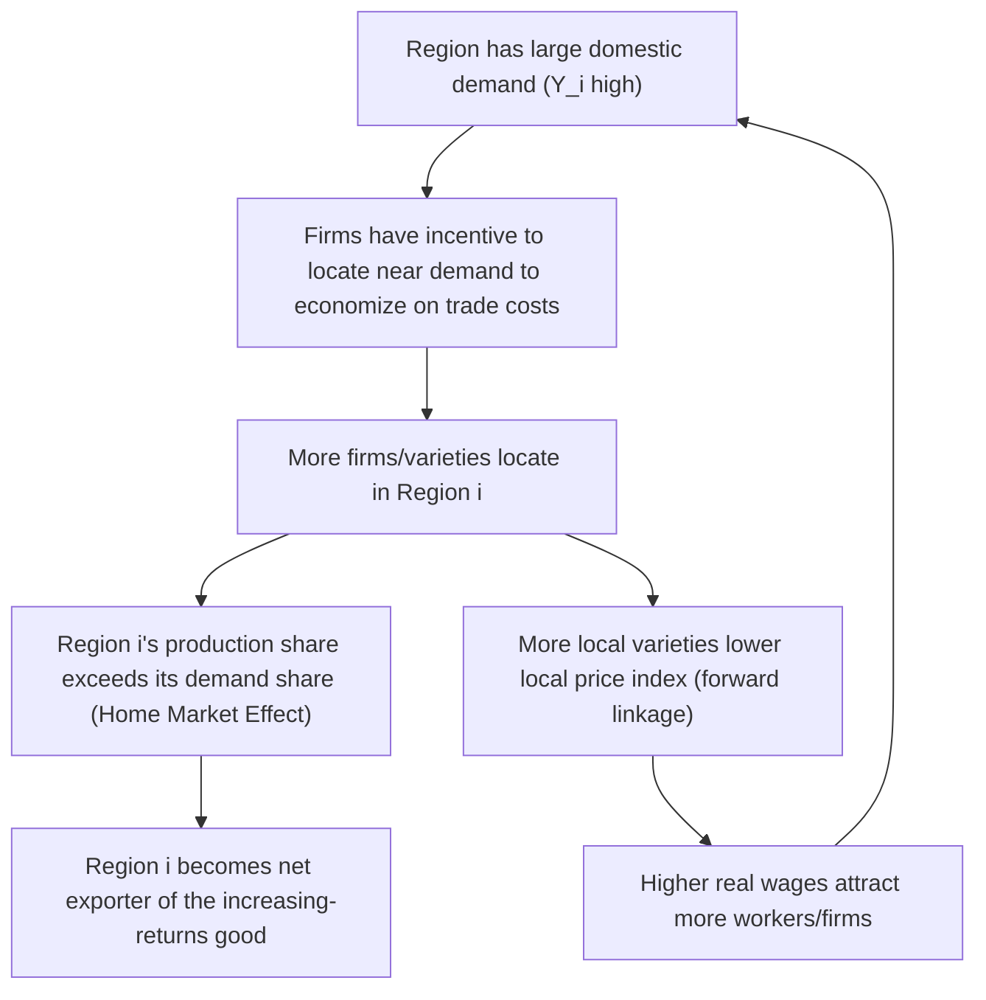

## Home Market Effects and Market Access

### Overview

The **home market effect (HME)** is one of the signature testable predictions of New Economic Geography (NEG) and monopolistic-competition trade theory: under increasing returns to scale (IRS) and costly trade, a region or country with a larger domestic demand for a differentiated good will host a **more-than-proportionate** share of that good's production, and will become a net exporter of it. **Market access (or market potential)** is the closely related concept measuring a location's proximity-weighted access to purchasing power across all destinations, and serves as the key explanatory variable linking geography to wages, firm location, and trade flows.

### Origins: Linder, Krugman, and the Underlying Intuition

The intuition predates formal NEG: Staffan Linder (1961) observed that countries tend to export goods for which they have a large domestic market, since firms first develop products to serve home demand and only later export. Krugman (1980) provided the first rigorous general-equilibrium formalization in a two-country, two-good Dixit-Stiglitz model, showing that the larger country becomes a net exporter of the increasing-returns good even absent any comparative advantage — the effect is generated purely by the interaction of scale economies, product differentiation, and trade costs.

### Formal Mechanism in the Dixit-Stiglitz/Iceberg Framework

Consider two regions with CES preferences over manufacturing varieties ($\sigma > 1$) and iceberg trade costs $\tau > 1$. Firms are monopolistically competitive with fixed cost $F$ and marginal cost $c$, pricing at a constant markup:

$$p = \frac{\sigma}{\sigma-1} wc$$

The **market access** (or market potential) of region $i$ aggregates demand from all destinations, discounted by trade costs:

$$MA_i = \sum_j \frac{Y_j}{P_j^{1-\sigma}} \tau_{ij}^{1-\sigma}$$

where $Y_j$ is expenditure in region $j$, $P_j$ is region $j$'s CES price index, and $\tau_{ij}$ is the iceberg trade cost between $i$ and $j$. Firms locating in regions with higher $MA_i$ can pay higher wages while remaining competitive, because they economize on trade costs for the larger share of demand located "at home."

**Key result**: when trade costs are positive but finite ($1 < \tau < \infty$), equilibrium **manufacturing employment share** in a region rises more than one-for-one with its share of world expenditure on manufactures. Formally, if region 1's share of combined demand is $s_E$, its equilibrium share of manufacturing firms/employment $s_n$ satisfies:

$$s_n > s_E \quad \text{whenever} \quad s_E > \frac{1}{2}$$

i.e., the larger market's share of production **exceeds** its share of demand — the defining signature of the home market effect. This is sometimes called the **"magnification effect"**: a demand advantage is magnified into an even larger production/export advantage.

### Why the Effect Arises: Two Complementary Explanations

**Key Points**

1. **Firm relocation incentive (NEG channel)**: because of the backward linkage, a firm's optimal location is where demand is largest, since it minimizes total trade costs paid on shipments to all destinations. With free entry, firms enter in the location offering the highest real return, and this concentrates disproportionately where markets are largest.
2. **Trade pattern channel (goods-based)**: even taking the number of firms/varieties in each location as roughly proportional to relative market size, the region with more varieties has a comparative cost advantage in the increasing-returns sector due to economies of scale not being replicated at small scale elsewhere — so it exports the differentiated good and imports the homogeneous, constant-returns good (in two-sector versions) or the increasing-returns good from a shrinking foreign variety set.

### Boundary Conditions: When HME Reverses or Disappears

**Key Points**

- **Zero trade costs** ($\tau \to 1$): location is irrelevant to delivered cost, so the HME vanishes — firms are indifferent to location and the production share need not exceed the demand share.
- **Prohibitive trade costs** ($\tau \to \infty$): each region must be self-sufficient (autarky), so production share equals demand share exactly (no magnification, since nothing is exported).
- **Intermediate trade costs**: this is the range in which the HME is strongest — moderate but non-trivial trade costs are necessary for firms' location decisions to matter for trade patterns.
- **Davis (1998) reversal result**: when a homogeneous, constant-returns good is also costly to trade (rather than costlessly traded, as in the baseline Krugman 1980 setup), the home market effect can be substantially weakened or even reversed. This showed the HME is not a robust, parameter-free prediction — it depends on specific assumptions about the outside sector's trade costs, and this critique shaped a large subsequent empirical and theoretical literature testing its robustness.

### Market Access, Wages, and the Wage Equation

NEG structural models (Redding & Venables, 2004; Hanson, 2005) derive a **wage equation** linking nominal wages to market access and "supplier access" (access to intermediate input suppliers):

$$w_i = \left( MA_i \right)^{1/\sigma} \times (\text{local cost/productivity terms})$$

Empirically, this is typically estimated as:

$$\ln w_i = \beta_1 \ln(MA_i) + \beta_2 \ln(SA_i) + X_i'\gamma + \varepsilon_i$$

where $SA_i$ is supplier access (proximity-weighted access to intermediate suppliers, symmetric to market access but on the input side). A robust empirical finding across many country and regional studies is a **positive and statistically significant coefficient** on market access, consistent with NEG's backward-linkage prediction, though the estimated elasticity varies considerably by study, region, and time period.

### Constructing an Empirical Market Access Measure

**Example**

A standard empirical market access index for region $i$ (Harris, 1954 market potential function, later adapted to NEG structural form) is:

$$MP_i = \sum_{j} \frac{Y_j}{d_{ij}^{\theta}}$$

where $Y_j$ is GDP or purchasing power of location $j$, $d_{ij}$ is distance (or estimated trade cost) between $i$ and $j$, and $\theta$ is a distance-decay parameter (often estimated via a gravity equation, typically in the range of 1 to 2 for interregional/international trade flows, though estimates are context-dependent). The **own-region term** ($j = i$) is typically included using an internal-distance proxy (e.g., a fraction of the region's radius) since a location has substantial "access to itself."

### Home Market Effect vs. Comparative Advantage: A Testable Distinction

| Dimension | Comparative Advantage (Heckscher-Ohlin) | Home Market Effect (NEG) |
| --- | --- | --- |
| Source of trade | Differences in factor endowments/technology across regions | Scale economies + demand size, even with identical endowments |
| Prediction for identical regions | No trade (or trade only if endowments differ) | Trade can occur even between ex-ante identical regions, driven by demand-size differences |
| Production share vs. demand share | Equal in the relevant good if endowments match demand shares | Production share **exceeds** demand share for the larger region |
| Empirical test | Factor-content-of-trade tests | Regression of production/export share on demand share, testing for slope $> 1$ |

### Empirical Evidence

**Key Points**

- **Davis & Weinstein (1996, 1999, 2003)**: influential empirical tests using OECD industry and regional (Japanese prefecture) data; found evidence consistent with HME for many manufacturing industries with strong scale economies and product differentiation, though results varied by sector and were sensitive to whether idiosyncratic demand or "home bias" effects were controlled for.
- **Feenstra, Markusen & Rose (2001)**: tested HME predictions using cross-country trade flow data, finding support particularly in differentiated-product (versus homogeneous-good) industries — consistent with the theoretical prediction that HME should be strongest where product differentiation and scale economies are most relevant.
- **Regional (sub-national) studies**: several EU and US regional studies find market access variables have significant explanatory power for regional wage and industry-location patterns, in line with the Redding-Venables wage-equation approach.
- **[Inference]** Because identifying HME requires distinguishing it from comparative-advantage-based trade and from simple gravity effects, and because idiosyncratic demand/home-bias confounds are difficult to fully control for, the overall body of evidence is generally read as "supportive but not universally robust," and estimated magnitudes vary substantially across studies, sectors, and time periods.

### Relationship to City and Regional Systems

Within a country, the HME logic helps explain why large metropolitan markets attract a disproportionate share of scale-economy industries (e.g., headquarters services, specialized manufacturing, media/publishing) relative to their population share, reinforcing the circular causation mechanisms discussed under the core-periphery model. Market access calculations are also used in applied urban/regional economics to construct **market potential surfaces** — maps of predicted economic advantage by location — which are used both as an explanatory variable in empirical wage/productivity regressions and as a policy tool for evaluating the likely spatial impact of transport infrastructure investments.

### Diagram: Market Access as a Function of Distance and Destination Size

<svg xmlns="http://www.w3.org/2000/svg" viewBox="0 0 700 380" font-family="Helvetica, Arial, sans-serif">
<text x="350" y="26" text-anchor="middle" font-size="17" font-weight="bold" fill="#1a1a1a">Market Access: Distance-Discounted Demand (svg_diagram)</text>
<circle cx="350" cy="200" r="26" fill="#1a56db" stroke="#0d2c66" stroke-width="2" />
<text x="350" y="205" text-anchor="middle" font-size="12" font-weight="bold" fill="#ffffff">Region i</text>
<circle cx="150" cy="120" r="34" fill="#0d9c5c" stroke="#075c33" stroke-width="2" />
<text x="150" y="125" text-anchor="middle" font-size="11" font-weight="bold" fill="#ffffff">Large Y_j</text>
<text x="150" y="163" text-anchor="middle" font-size="10" fill="#333333">(nearby)</text>
<circle cx="570" cy="120" r="22" fill="#f0a500" stroke="#8a6200" stroke-width="2" />
<text x="570" y="125" text-anchor="middle" font-size="10" font-weight="bold" fill="#ffffff">Small Y_k</text>
<text x="570" y="155" text-anchor="middle" font-size="10" fill="#333333">(nearby)</text>
<circle cx="200" cy="320" r="30" fill="#c81e1e" stroke="#6e0f0f" stroke-width="2" />
<text x="200" y="325" text-anchor="middle" font-size="10.5" font-weight="bold" fill="#ffffff">Large Y_m</text>
<text x="200" y="358" text-anchor="middle" font-size="10" fill="#333333">(far)</text>
<line x1="325" y1="180" x2="178" y2="140" stroke="#0d9c5c" stroke-width="3" />
<line x1="372" y1="180" x2="552" y2="135" stroke="#f0a500" stroke-width="1.5" stroke-dasharray="4,3" />
<line x1="335" y1="223" x2="222" y2="298" stroke="#c81e1e" stroke-width="1.5" stroke-dasharray="4,3" />

<text x="700" y="380" text-anchor="end" font-size="10.5" fill="`#666666`" font-style="italic">Line thickness ~ contribution to Region i's market access (Y_j / d_ij^theta)</text>

</svg>

### Related Topics

- Dixit-Stiglitz monopolistic competition and CES demand derivation
- Krugman (1991) core-periphery model: full bifurcation analysis
- Redding-Venables structural wage equations and market/supplier access estimation
- Gravity models of trade: theoretical foundations and estimation
- Davis (1998) HME reversal and the role of outside-sector trade costs
- Harris (1954) market potential function and its NEG-consistent generalizations
- New Trade Theory: Krugman (1980) monopolistic competition and intra-industry trade
- Transport infrastructure evaluation using market access/potential surfaces
- Comparative advantage vs. scale-economy-based trade: empirical decomposition methods
- Regional wage gradients and the role of market access in urban wage premiums