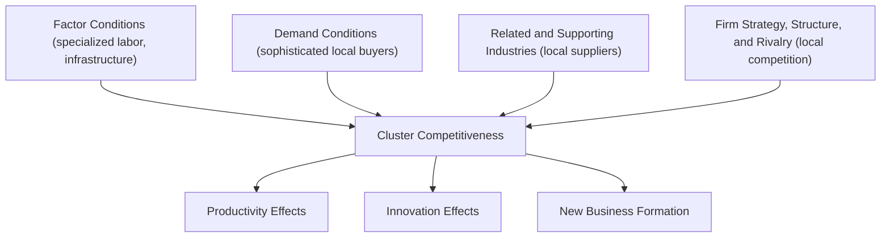
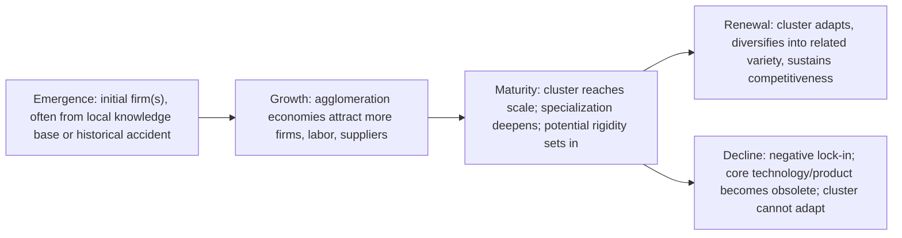

## Industry Clusters and Regional Specialization

### Overview

An industry cluster is a geographically concentrated group of interconnected firms, specialized suppliers, service providers, and associated institutions in a particular field, linked by commonalities and complementarities. Regional specialization refers to the broader pattern in which regions concentrate their economic activity in a narrower set of industries than the national average, driven by the agglomeration economies, comparative advantage, and increasing-returns mechanisms discussed elsewhere in this chapter. This item synthesizes the theory of *why* clusters form and persist, how they are measured, and what the empirical evidence says about their economic effects.

### Porter's Cluster Framework

Michael Porter (1990, 1998) popularized "cluster" as a strategic-management and regional-policy concept, arguing that clusters enhance competitiveness through three interrelated channels:

1. **Productivity effects**: access to specialized inputs, employees, and information; complementarities with other cluster firms; institutions that reduce transaction costs.
2. **Innovation effects**: proximity to sophisticated buyers and rivals accelerates the pace of innovation, and the pressure of co-located competitors (rather than isolation) drives upgrading.
3. **New business formation effects**: lower entry barriers for new firms and spinoffs, since input suppliers, skilled labor, and market knowledge are already locally available.

Porter's **Diamond Model** frames cluster competitiveness as the interaction of four determinants: factor conditions, demand conditions, related and supporting industries, and firm strategy/structure/rivalry — with clusters as the *geographic manifestation* of a well-functioning diamond.

### Theoretical Foundations: Why Clusters Form

**Key Points**

- **Marshallian externalities (localization economies)**: labor pooling, input-output linkages, and knowledge spillovers specific to an industry, as detailed under external increasing returns — the classical explanation for why same-industry firms co-locate (see "Increasing returns to scale and spatial concentration").
- **Transaction cost economics**: Williamson-style reasoning suggests that proximity reduces the costs of monitoring, negotiating, and enforcing contracts with suppliers and partners, particularly for complex, customized, or frequently adjusted transactions.
- **Knowledge spillover theory of entrepreneurship** (Audretsch & Feldman, 1996; Audretsch & Keilbach): clusters, especially in knowledge-intensive industries, form partly because tacit knowledge generated in incumbent firms or research institutions "spills over" and is commercialized locally by new entrants and spinoffs, since tacit knowledge travels poorly across distance.
- **Path dependence and historical accident**: many clusters trace their origin to a specific historical event, natural resource endowment, a founding entrepreneur, or a government decision (e.g., a military contract, a university's research focus) — after which self-reinforcing agglomeration dynamics (per NEG circular causation) lock in the location even after the original advantage becomes less relevant. Silicon Valley's origins in Stanford's early 20th-century engineering programs and defense contracting are frequently cited.
- **Related variety and regional branching**: newer evolutionary economic geography approaches (Frenken, Van Oort & Verburg, 2007; Boschma & Frenken) argue regions diversify into *technologically related* industries — a cluster is more likely to spawn new specializations that share underlying competencies (skills, technologies, knowledge base) than into unrelated fields, a process termed "regional branching."

### Localization vs. Urbanization Economies in Cluster Formation

As established under IRS and spatial concentration, clusters are conventionally understood to draw primarily on **localization (MAR) economies** — own-industry specific benefits — while diversified metropolitan regions draw more on **urbanization (Jacobs) economies**. This creates a recurring empirical and policy question: does regional economic strength come from *specialization* (deep clusters) or *diversity* (broad urban economies)? The empirical literature is genuinely mixed, with some studies finding stronger employment/productivity growth effects from diversity (Jacobs externalities) and others finding stronger effects from specialization (MAR externalities), with results sensitive to industry, region type, and time period. **[Inference]** No general consensus assigns unconditional primacy to either mechanism; the balance likely depends on an industry's stage of maturity (specialization may matter more for mature industries, diversity for emerging ones per Duranton & Puga's product life-cycle argument), though this remains an area of ongoing research rather than settled fact.

### Measuring Regional Specialization

#### Location Quotient (LQ)

The most widely used measure of regional industry concentration:

$$LQ_{i,r} = \frac{e_{i,r} / e_r}{e_{i,n} / e_n}$$

where $e_{i,r}$ is employment in industry $i$ in region $r$, $e_r$ is total employment in region $r$, and $e_{i,n}$, $e_n$ are the corresponding national figures. $LQ_{i,r} > 1$ indicates the region is more specialized in industry $i$ than the nation as a whole; $LQ_{i,r} = 1$ indicates the region's industry mix matches the national average.

**Example**: If manufacturing is 25% of employment in a region but only 10% of national employment, $LQ = 2.5$, indicating strong regional specialization suggestive of a manufacturing cluster (though LQ alone cannot confirm causal agglomeration mechanisms — it is descriptive).

#### Herfindahl-Hirschman Index (Regional Specialization Index)

Measures overall industrial concentration/diversity of a region's economy:

$$HHI_r = \sum_i \left(\frac{e_{i,r}}{e_r}\right)^2$$

Higher values indicate a more specialized (less diversified) regional economy; the inverse or complement is commonly used as a diversity index in urbanization-economies research.

#### Ellison-Glaeser Index

Ellison and Glaeser (1997) developed an index correcting a key weakness of simple concentration measures: raw geographic concentration can arise mechanically from a few large plants (a "dartboard" effect) rather than true localization economies. The EG index nets out the concentration expected from random plant location given the industry's establishment-size distribution:

$$\gamma_{EG} = \frac{\sum_r (s_r - x_r)^2 - (1 - \sum_r x_r^2)\bar{H}}{(1 - \sum_r x_r^2)(1 - \bar{H})}$$

where $s_r$ is region $r$'s share of industry employment, $x_r$ is region $r$'s share of overall (aggregate) employment, and $\bar{H}$ is a Herfindahl index of plant sizes in the industry. This has become close to a standard tool for empirically distinguishing genuine agglomeration-driven clustering from statistical artifacts of firm-size heterogeneity.

#### Other Diversity/Specialization Measures

- **Krugman Specialization Index**: sum of absolute differences between a region's industry employment shares and the national average, used to compare regional economic structures pairwise.
- **Shift-share analysis**: decomposes regional employment growth into a national growth component, an industry-mix component, and a regional-competitive (shift) component, helping isolate whether a region's growth stems from having the "right" industry mix or from genuine local competitiveness advantages.

### Regional Specialization Index (Shift-Share) — Worked Example

**Example**

Suppose a region's manufacturing employment grew 8% over a decade, while national manufacturing employment grew 3% and the region's overall employment grew 5%. Shift-share decomposes the region's manufacturing growth as:

$$\text{Regional growth} = \underbrace{3\%}_{\text{national share}} + \underbrace{(5\% - 3\%)}_{\text{proportional shift (industry mix)}} + \underbrace{(8\% - 5\%)}_{\text{differential shift (regional competitiveness)}}$$

A positive differential shift suggests the region has a genuine competitive/agglomeration advantage in manufacturing beyond what national trends or the region's general economic buoyancy would predict.

### Case Studies Commonly Cited in the Literature

**Key Points**

- **Silicon Valley (semiconductors/IT)**: frequently analyzed through the lens of knowledge spillovers, venture capital networks, non-compete enforceability differences (California's unusually weak non-compete enforcement is argued by some, e.g., Gilson 1999, to have facilitated labor mobility and knowledge diffusion relative to Route 128 in Massachusetts), and university-industry linkages (Stanford).
- **Third Italy (textiles, furniture, ceramics)**: emphasized in the industrial-district literature (Piore & Sabel, 1984; Becattini) as an example of small-firm, craft-based clusters relying on dense inter-firm trust networks and flexible specialization rather than large vertically integrated firms.
- **Detroit (automobiles, historical)**: illustrates both the productive power of localization economies during the industry's growth phase and the risk of "lock-in" or negative lock-in when a dominant cluster's core technology or firms decline (related to the "regional resilience" literature).
- **Hollywood (film/entertainment)**: a services-based cluster example emphasizing project-based labor markets, freelance specialization, and reputation/networking effects rather than manufacturing-style input-output linkages.
- **[Inference]** These case studies are illustrative rather than fully generalizable; the specific combination of mechanisms (spillovers, labor mobility rules, financial infrastructure, historical accident) that explains any one cluster's success is not necessarily replicable through policy in another location, a caution frequently raised in critiques of cluster-based industrial policy.

### Cluster Lifecycle and the Risk of Lock-In

Clusters are not permanent; several stylized lifecycle stages are commonly discussed:

**Negative lock-in** (Grabher, 1993, studying the Ruhr coal/steel region) occurs when the very networks and specialized assets that generated a cluster's early success become a liability — over-embedded relationships, narrow skill bases, and cognitive rigidity impede adaptation to technological or market shifts. This motivates the "related variety" literature's emphasis on regions maintaining some technological diversity as insurance against lock-in.

### Regional Specialization vs. Regional Diversification: Policy Tension

| Consideration | Favors Specialization (Clusters) | Favors Diversification |
| --- | --- | --- |
| Short-run productivity | Strong localization economies raise current productivity | Diversity provides cross-fertilization for innovation |
| Growth volatility | Higher exposure to industry-specific shocks (e.g., single-industry towns) | Lower volatility; industry-specific shocks are diversified away |
| Long-run adaptability | Risk of negative lock-in if core technology declines | Related variety enables branching into adjacent industries |
| Policy approach | Cluster-based industrial policy (targeted infrastructure, sector clusters) | Innovation ecosystem / general human capital investment |

### Empirical Evidence on Cluster Effects

**Key Points**

- **Productivity premiums**: numerous firm-level studies find wage and productivity premiums for firms located in strong same-industry clusters, though magnitudes vary widely by industry and country, and causal identification (distinguishing agglomeration effects from selection of more productive firms into clusters) remains a persistent empirical challenge, as discussed under agglomeration economies measurement.
- **Employment growth and cluster strength**: Delgado, Porter & Stern (2010, 2014) find, using US data, that industries located in stronger clusters (higher employment and specialization in complementary industries) exhibit higher rates of employment growth, patenting, and new business formation, though again subject to standard endogeneity caveats about reverse causality.
- **Spinoff dynamics**: Klepper's (2007, 2010) studies of the Detroit auto industry and Silicon Valley semiconductor firms document that many successful firms in a cluster are spinoffs of earlier successful firms in the same cluster, supporting an "organizational reproduction/heredity" theory of cluster growth as an alternative or complement to pure knowledge-spillover explanations.

### Cluster-Based Industrial Policy

**Key Points**

- Governments worldwide (US Economic Development Administration cluster initiatives, EU Regional Innovation Strategies, various national "cluster mapping" programs) have adopted cluster frameworks as an organizing principle for regional economic development policy, typically involving targeted infrastructure, coordinated business support services, and sometimes direct subsidies to anchor firms.
- **Critiques of cluster policy**:
  - Difficulty identifying "winning" clusters ex ante — successful clusters are more easily explained in retrospect than predicted in advance.
  - Risk of subsidizing agglomeration that would have occurred anyway (deadweight loss), or of picking losers if policymakers misjudge which industries have genuine local comparative/dynamic advantage.
  - Potential for cluster policy to exacerbate regional inequality by further concentrating activity in already-advantaged regions, echoing NEG's efficiency-equity tradeoff.
  - **[Inference]** Evidence on the net welfare effectiveness of explicit cluster-based industrial policy (relative to counterfactual general infrastructure or human-capital investment) is limited and mixed across the evaluation studies available, and conclusions are sensitive to the evaluation methodology and time horizon used, so no confident general verdict can be offered.

### Distinguishing Clusters from General Agglomeration

It is useful to distinguish the cluster concept (industry-specific, often emphasizing inter-firm relationships, supply chains, and institutional "thickness") from the broader concept of urban agglomeration (city size effects that benefit firms across industries). A cluster can exist within a diversified metropolitan area (e.g., a fintech cluster within a diversified global city) or can constitute the dominant economic activity of a smaller, specialized region (e.g., a single-industry resource town) — the theoretical mechanisms (MAR/localization vs. Jacobs/urbanization) map onto this distinction directly.

### Related Topics

- Marshallian externalities and localization vs. urbanization economies (see "Increasing returns to scale and spatial concentration")
- New Economic Geography and the core-periphery model: circular causation applied to clusters
- Evolutionary economic geography: related variety and regional branching
- Ellison-Glaeser index: methodology and applications
- Shift-share analysis for regional economic diagnostics
- Knowledge spillovers and patent citation studies (Jaffe, Trajtenberg, Henderson)
- Regional resilience and adaptation to structural economic shocks
- Cluster-based industrial policy: comparative evaluation across countries
- Industrial districts and flexible specialization (Piore & Sabel; Third Italy)
- Entrepreneurial spinoffs and firm heredity in cluster growth (Klepper)