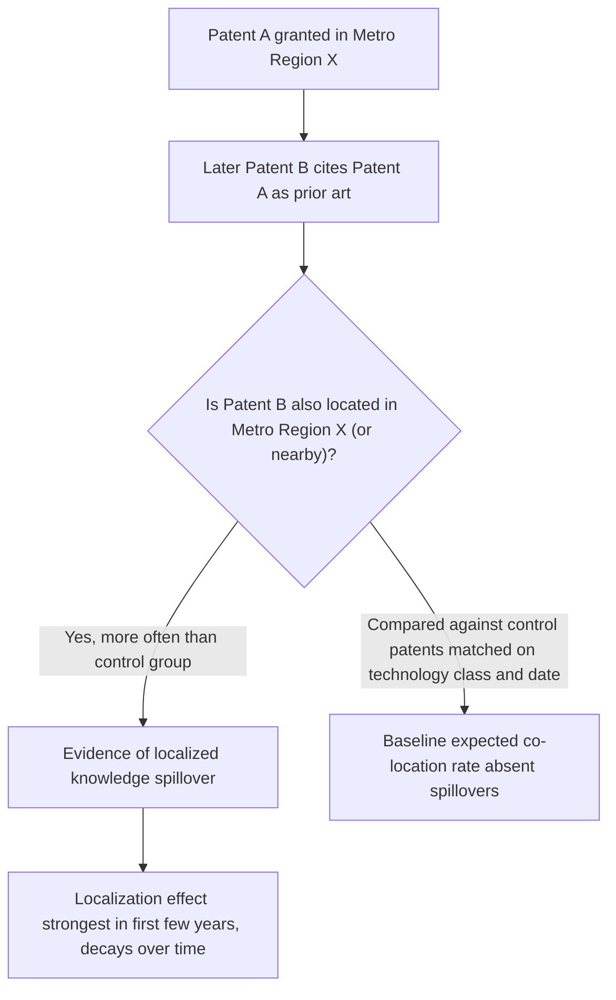

## Knowledge Spillovers and the Geography of Innovation

### Overview

Knowledge spillovers occur when the knowledge generated by one economic agent (a firm, researcher, or worker) benefits others without full compensation flowing back to the originator, and geography matters because much of this knowledge — especially tacit, uncodified knowledge — diffuses more easily over short distances than long ones. The **geography of innovation** studies why innovative activity (patenting, R&D, new-product development) is even more spatially concentrated than production or employment generally, and how proximity shapes the rate and direction of knowledge diffusion. This is one of the central mechanisms behind Marshallian localization economies and underlies much of the theoretical apparatus in New Economic Geography and cluster theory covered elsewhere in this chapter.

### Codified vs. Tacit Knowledge

**Key Points**

- **Codified knowledge**: knowledge that can be written down, formalized, and transmitted at low cost over any distance (patents, manuals, published research, blueprints). Because transmission costs are low regardless of location, codified knowledge diffusion is not strongly geographically bounded.
- **Tacit knowledge**: knowledge embedded in practice, experience, and social context — "know-how" that is difficult to articulate or transfer without face-to-face interaction, observation, and trust (Polanyi, 1966). Tacit knowledge transmission benefits strongly from physical proximity, repeated interaction, and shared professional/social networks.
- The geography-of-innovation literature's central claim is that the tacit component of knowledge — not the codified component — is what makes innovation spatially "sticky," giving rise to Alfred Marshall's famous phrase that in an industrial district, "the mysteries of the trade become no mystery, but are as it were in the air."

### Theoretical Channels of Knowledge Spillovers

1. **Labor mobility**: workers moving between firms (including via job-to-job transitions, not just formal knowledge transfer agreements) carry tacit knowledge, routines, and networks with them. Regions with high labor churn among related firms facilitate faster knowledge diffusion.
2. **Informal information exchange**: unplanned interactions — conferences, trade association meetings, professional networks, even casual conversation among engineers who happen to live in the same neighborhood or patronize the same establishments — transmit knowledge that would not travel through formal channels.
3. **Spinoffs and entrepreneurship**: employees leave incumbent firms to found new ventures, embodying and commercializing knowledge developed at the parent firm (the "knowledge spillover theory of entrepreneurship," Audretsch & Feldman 1996; Audretsch, Keilbach & Lehmann 2006).
4. **University-industry linkages**: proximity to research universities facilitates knowledge transfer via faculty consulting, student placement, licensing of university patents, and co-location of spinoff firms (Jaffe, 1989; Anselin, Varga & Acs, 1997).
5. **Buyer-supplier interaction**: repeated, close interaction with sophisticated local customers or suppliers accelerates product and process innovation (related to Porter's demand-conditions channel).

### Empirical Strategy: Patent Citations as a Knowledge Trace

**Key Points**

- The most influential empirical approach traces knowledge flows using **patent citations**: when patent B cites patent A as prior art, this is interpreted as evidence that knowledge embodied in A influenced the invention in B.
- **Jaffe, Trajtenberg & Henderson (1993)** — the foundational study — compared the geographic location of citing patents to a matched control sample of patents with similar technology and application-date characteristics but that did *not* cite the original patent. They found citing patents were significantly more likely to originate from the same metropolitan area (and even the same state/country) as the cited patent, providing direct evidence that knowledge spillovers are geographically localized.
- **Key finding**: the localization effect was strongest in the years immediately following the cited patent and decayed over time, consistent with knowledge eventually diffusing more broadly (becoming "codified" or absorbed into the general knowledge base) even as it starts out geographically concentrated.
- **Methodological critique (Thompson & Fox-Kean, 2005)**: using more precise technology-class-matched control groups reduced (but did not eliminate) the estimated localization effect, highlighting that some of the original localization result may partly reflect the tendency of related technologies/industries to co-locate for other reasons (a version of the general challenge of separating true spillovers from co-location due to common local factors).

### The Distance Decay of Knowledge Spillovers

Rosenthal and Strange (2003, 2008) provide some of the most cited estimates of how sharply agglomeration and spillover benefits decline with distance, generally finding that the effects are strongest within roughly the first mile or few miles/kilometers and attenuate substantially — though not necessarily to zero — thereafter. This "distance decay" pattern is broadly consistent with an economic geography in which knowledge spillovers depend on face-to-face contact and are therefore most powerful at very short (often intra-neighborhood or intra-building) distances, though the exact decay rate is sensitive to industry, data resolution, and methodology used, and some studies find spillovers extending to broader metropolitan or even regional scales for certain types of knowledge or industries.

<svg xmlns="http://www.w3.org/2000/svg" viewBox="0 0 700 360" font-family="Helvetica, Arial, sans-serif">
<text x="350" y="26" text-anchor="middle" font-size="17" font-weight="bold" fill="#1a1a1a">Stylized Distance Decay of Knowledge Spillovers (svg_diagram)</text>
<line x1="70" y1="300" x2="650" y2="300" stroke="#333333" stroke-width="1.5" />
<line x1="70" y1="300" x2="70" y2="60" stroke="#333333" stroke-width="1.5" />
<text x="360" y="335" text-anchor="middle" font-size="12" fill="#333333">Distance from knowledge source</text>
<text x="35" y="180" text-anchor="middle" font-size="12" fill="#333333" transform="rotate(-90 35 180)">Spillover intensity</text>
<path d="M 70 80 C 150 90, 200 160, 280 230 C 350 270, 450 288, 650 296" fill="none" stroke="#1a56db" stroke-width="3" />

<text x="130" y="70" font-size="11" fill="`#1a56db`" font-weight="bold">Tacit knowledge</text>

<text x="130" y="86" font-size="11" fill="`#1a56db`" font-weight="bold">(sharp decay)</text>

<path d="M 70 220 C 200 222, 400 226, 650 232" fill="none" stroke="#c81e1e" stroke-width="3" stroke-dasharray="6,4" />
<text x="470" y="215" font-size="11" fill="#c81e1e" font-weight="bold">Codified knowledge</text>
<text x="470" y="231" font-size="11" fill="#c81e1e" font-weight="bold">(gradual/flat decay)</text>
</svg>

### Jacobs Externalities and Innovation

Jane Jacobs (1969) argued that **diversity** — the co-location of firms from *different but related* industries — is a more important source of innovation than same-industry specialization, because innovation often arises from the recombination of ideas across fields. This is distinct from the Marshallian/localization view (MAR externalities) that emphasizes same-industry proximity. The empirical literature testing "MAR vs. Jacobs" for innovation specifically (as distinct from general productivity, covered in the clusters item) has produced mixed results:

- **Glaeser, Kallal, Scheinkman & Shleifer (1992)** — using US city-industry employment growth data, found evidence favoring Jacobs-style diversity and local competition over MAR-style specialization and monopoly as drivers of growth.
- **Henderson, Kuncoro & Turner (1995)** — using more disaggregated data distinguishing mature vs. new industries, found MAR (localization) externalities dominant for growth in mature industries but found some support for Jacobs externalities in newer, high-tech industries — suggesting the MAR-vs-Jacobs question may be industry-lifecycle-dependent rather than universally resolved in either direction.
- **[Inference]** Given the mixed and methodology-sensitive findings across this literature, no single verdict ("innovation is driven by specialization" or "innovation is driven by diversity") can be treated as settled; the balance plausibly depends on industry maturity, technological regime, and the specific innovation outcome measured (patenting vs. new-product introduction vs. productivity growth).

### Related Variety: A Middle Ground

The "related variety" concept (Frenken, Van Oort & Verburg, 2007) attempts to reconcile the MAR/Jacobs debate by arguing that innovation benefits most from diversity *among technologically or cognitively related* industries — too little relatedness (pure specialization) limits recombination opportunities, while too much unrelated diversity limits the ability of firms to absorb and apply spillovers from unrelated fields (absorptive capacity constraints, per Cohen & Levinthal, 1990). This has become an influential framework in evolutionary economic geography for explaining regional diversification patterns and predicting which new industries a region is likely to successfully develop.

### Universities, Anchor Institutions, and Innovation Geography

**Key Points**

- **Jaffe (1989)**: found that state-level R&D expenditure by universities has a measurable positive effect on corporate patenting activity in the same state, particularly in drugs, medical technology, electronics, and optics — early quantitative evidence for localized university spillovers.
- **Research parks and science parks**: many regions have developed formal university-adjacent research/science parks (e.g., Research Triangle Park in North Carolina) explicitly to capture geographic knowledge spillovers by co-locating firms near university research capacity; evidence on their causal effectiveness (versus simply attracting firms that would have located nearby regardless) is mixed and methodologically contested.
- **Anchor tenant theory**: the presence of a single, sufficiently large innovative firm or institution can catalyze cluster formation by generating spinoffs, training a specialized workforce, and attracting complementary suppliers — a mechanism related to but distinct from pure spillover theory, emphasizing organizational reproduction (see Klepper's spinoff studies referenced in industry-cluster theory).

### Measuring the Geography of Innovation

| Measure | What It Captures | Common Data Source |
| --- | --- | --- |
| Patent counts by region | Raw innovative output intensity | USPTO, EPO, national patent offices |
| Patent citation geography | Localization of knowledge flows | Patent citation databases (matched to inventor/assignee location) |
| R&D expenditure intensity | Innovation input intensity by region | Firm/establishment R&D surveys |
| Co-inventor network geography | Social/collaboration structure of inventive teams | Patent inventor address data, network analysis |
| University patent licensing/spinoffs | University-industry knowledge transfer | University technology transfer office records |

### Innovation Agglomeration and Firm Location Decisions

Firms in R&D-intensive industries face a location tradeoff directly informed by this literature: locating in a dense innovation cluster (e.g., a biotech hub) provides access to spillovers, specialized talent, and venture capital networks, but also intensifies competition for the same scarce specialized labor and can raise costs (real estate, wages) — a version of the general agglomeration-versus-congestion tradeoff formalized in the core-periphery and city-size literature. Firms in mature, less R&D-intensive stages of the product lifecycle are more likely to disperse to lower-cost locations, consistent with the **product life-cycle theory of location** (Vernon, 1966; extended spatially by Duranton & Puga's "nursery cities" hypothesis, in which large diverse cities incubate new products/processes before they mature and relocate to more specialized, lower-cost production locations).

### Policy Implications

- **Innovation-district and cluster policy**: many regional innovation policies explicitly aim to increase local knowledge-spillover intensity by co-locating universities, startups, and established firms (e.g., "innovation district" initiatives in various cities), predicated on the geography-of-innovation evidence that proximity matters for tacit knowledge transfer.
- **Immigration and high-skilled labor mobility policy**: because labor mobility is a key spillover channel, policies affecting the ease of skilled-worker mobility (including international immigration of scientists/engineers) have implications for the geographic concentration of innovation, a connection increasingly studied in the "brain circulation" and skilled-migration literatures.
- **Remote work and digital communication**: the rise of remote/hybrid work has renewed academic and policy debate over whether digital communication tools are reducing the importance of physical proximity for knowledge spillovers, or whether tacit-knowledge transfer channels remain fundamentally proximity-dependent even as routine codified communication has become distance-independent. **[Speculation]** The long-run effect of increased remote work on the geographic concentration of innovation is not yet well established empirically, given the relatively short post-pandemic time series available, and existing studies offer preliminary and sometimes conflicting evidence on this question.

### Related Topics

- Marshallian externalities and localization vs. urbanization economies
- Industry clusters and regional specialization (MAR vs. Jacobs empirical debate)
- Evolutionary economic geography and related variety
- Nursery cities and the product life-cycle theory of firm location (Duranton & Puga)
- Patent citation analysis methodology and geographic matching techniques
- University-industry technology transfer and research park evaluation
- Labor mobility, non-compete enforcement, and regional innovation ecosystems
- Absorptive capacity and firm-level knowledge assimilation (Cohen & Levinthal)
- Remote work and the future geography of innovation
- Skilled migration and "brain circulation" in innovation clusters