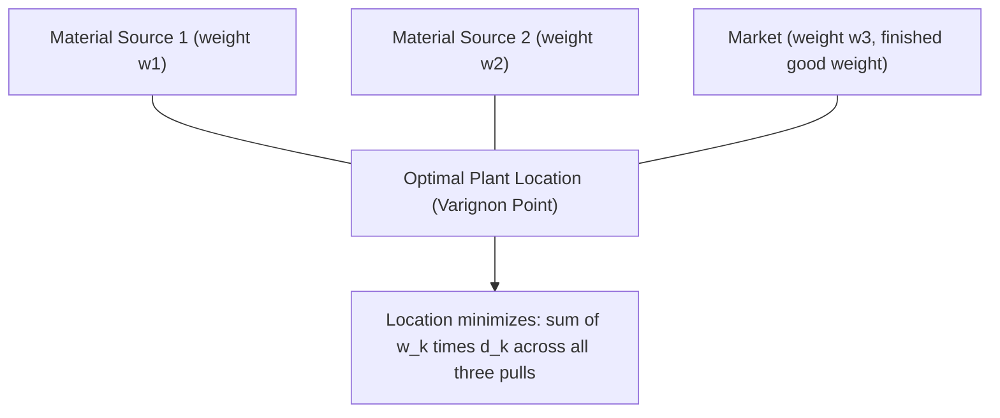
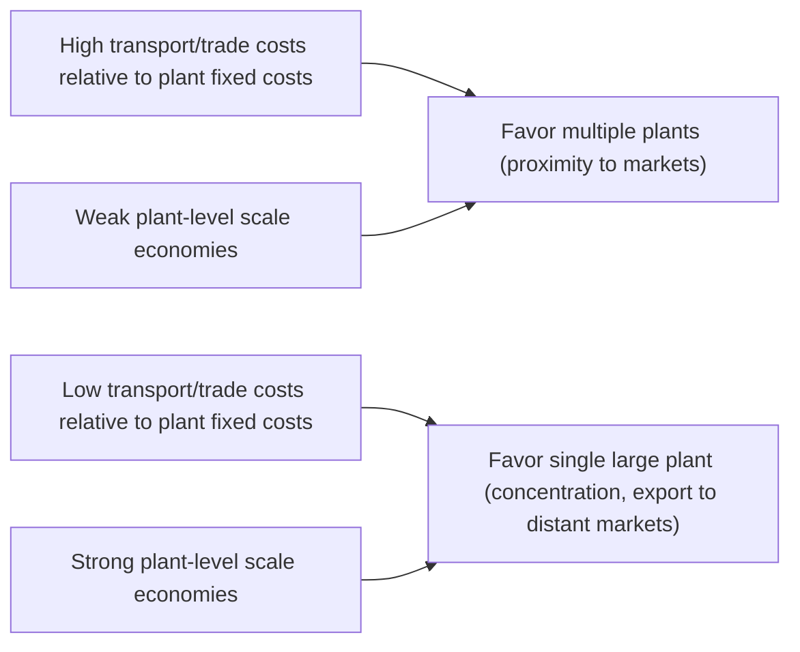

## Firm Location and Plant-Size Decisions


### Overview

Firm location theory addresses how a firm chooses where to site its production facilities, offices, or establishments, and plant-size theory addresses how much capacity to build at each chosen location — including whether to operate a single large plant or multiple smaller plants across locations. These decisions are jointly determined: agglomeration economies, transport costs, factor prices, and scale economies interact to shape both the number of plants a firm operates and where each is placed. This item synthesizes classical location theory (Weber, Hotelling), the modern multi-plant/multinational firm literature, and their connections to the agglomeration mechanisms covered elsewhere in this chapter.

### Classical Location Theory: Weber's Least-Cost Location Model

Alfred Weber (1909) provided the foundational framework for single-plant location choice, modeling a firm minimizing total transport cost between input sources and the final market, given fixed locations for raw material sources and the market.

#### The Weber Triangle

For a simple case with one market and two material sources, the optimal plant location minimizes the weighted sum of transport costs:

$$TC = \sum_{k} w_k \cdot d_k$$

where $w_k$ is the weight (tonnage) of input or output $k$ that must be transported, and $d_k$ is the distance from the plant to source/market $k$. The solution is the **Varignon point** (a mechanical analogy: if weights proportional to $w_k$ hang from strings over pulleys at each vertex of the triangle formed by the two material sources and the market, and the strings are joined and released, the knot settles at the cost-minimizing location).



#### Material Index and Locational Orientation

Weber classified industries by their **material index (MI)**:

$$MI = \frac{\text{weight of localized inputs}}{\text{weight of finished product}}$$

- **$MI > 1$ (weight-losing production)**: inputs lose substantial weight/bulk in processing (e.g., ore smelting, sugar refining, sawmilling). These industries tend toward **material orientation** — locating near input sources to avoid shipping the discarded weight.
- **$MI < 1$ (weight-gaining production)**: the finished product is heavier or bulkier than the assembled inputs (e.g., bottling, some assembly operations using ubiquitous inputs like water). These industries tend toward **market orientation**.
- **$MI \approx 1$**: footloose industries with weak locational pull from either material sources or markets, more responsive to labor costs, agglomeration economies, or other locational amenities.

#### Agglomeration Factors in Weber's Extended Model

Weber also incorporated **agglomeration factors** (cost reductions from co-locating with other firms) and **labor cost differentials** as forces that could pull the optimal location away from the pure transport-cost-minimizing point identified by the material triangle — an early, informal precursor to the modern formal treatment of increasing returns and spatial concentration covered elsewhere in this chapter.

### Hotelling's Model of Spatial Competition

Harold Hotelling (1929) analyzed firm location under strategic interaction rather than pure cost minimization: two firms selling a homogeneous good to consumers uniformly distributed along a line choose locations to maximize market share, given that consumers patronize the nearer firm (plus price effects). The classic result is that both firms locate at the **center** of the market (minimal differentiation / "Hotelling's Law"), a counterintuitive outcome relative to the socially optimal dispersed locations that would minimize aggregate consumer transport costs — illustrating a fundamental tension between private location incentives and social efficiency. Extensions incorporating price competition (d'Aspremont, Gabszewicz & Thisse, 1979) show the minimal-differentiation result is sensitive to modeling assumptions (particularly quadratic vs. linear transport costs), with price competition sometimes pushing firms toward maximal rather than minimal differentiation.

### The Modern Multi-Plant Firm Problem

Contemporary location theory, especially in the multinational and multi-regional firm literature, treats location and plant-size decisions jointly: a firm decides not just *where* to locate but *how many plants* to build and how to allocate production capacity among them, trading off:

- **Plant-level scale economies**: fixed costs favor concentrating production in fewer, larger plants (see the Dixit-Stiglitz fixed-cost framework from the core-periphery model item).
- **Proximity-concentration tradeoff**: shipping goods from a single distant plant to reach multiple markets incurs transport/trade costs; building multiple plants closer to each market saves transport costs but sacrifices plant-level scale economies and duplicates fixed costs.

#### The Proximity-Concentration Tradeoff Formally

A firm choosing between **exporting** from a single plant versus **horizontal FDI/multi-plant production** (building a plant in each market) compares:

$$\text{Concentrate (export)}: \quad \pi_E = R(p+\tau) - F$$


$$\text{Disperse (multi-plant)}: \quad \pi_D = R_1(p) + R_2(p) - 2F$$

where $R(\cdot)$ is revenue as a function of delivered price, $\tau$ represents per-unit transport/trade costs, and $F$ is the plant-level fixed cost. Multi-plant production becomes preferred when transport costs $\tau$ are high relative to the *extra* fixed cost of building a second plant — this is the standard "proximity-concentration tradeoff" from the multinational enterprise literature (Brainard, 1997; Markusen, 2002), directly paralleling the NEG tradeoff between trade costs and scale economies but applied at the individual-firm (rather than industry-equilibrium) level.



### Vertical vs. Horizontal Firm Fragmentation

**Key Points**

- **Horizontal multi-plant firms**: replicate similar production in multiple locations, each plant serving its local/regional market — driven primarily by the proximity-concentration tradeoff above (market-access motive).
- **Vertical multi-plant firms**: fragment the production process across locations, with each plant performing a different stage, exploiting factor-price or input-availability differences across locations (e.g., labor-intensive assembly stages located where labor is cheap, capital/skill-intensive stages located elsewhere) — driven by factor-cost-minimization motives, closely related to comparative-advantage-based trade theory and to global value chain / offshoring literatures.
- Empirically, many multinational firms exhibit a mix of both motives, and disentangling horizontal from vertical FDI motives is a substantial branch of the empirical trade and FDI literature (Markusen & Maskus's "knowledge-capital model" attempts to nest both motives in a unified framework).

### Firm Location and Agglomeration Economies: The Individual Firm's Perspective

From the perspective of a single firm making a location decision (as distinct from the industry-equilibrium NEG models), the location choice problem can be represented as maximizing expected profit across candidate sites:

$$\text{Location}^* = \arg\max_{r} \left[ R_r(A_r, MA_r) - C_r(w_r, \text{rent}_r, \tau_r) \right]$```

where $A_r$ is the agglomeration-driven productivity shifter at location $r$ (as in the reduced-form agglomeration production function), $MA_r$ is market access, $w_r$ is the local wage, $\text{rent}_r$ is local land/commercial rent, and $\tau_r$ captures transport costs to input/output markets from location $r$. This integrates the classical Weberian transport-cost framework with the modern agglomeration-economics and NEG market-access concepts into a single applied location-choice model, which is the standard approach in empirical site-selection and regional economic-development research.

### Empirical Firm Location Choice Models

**Key Points**

- Applied studies of firm (especially plant or FDI) location choice commonly use **discrete choice models** (conditional logit, nested logit, or Poisson pseudo-maximum-likelihood variants) where the firm selects among a finite set of candidate regions, with location-specific covariates including market access, agglomeration/own-industry employment density, labor costs, tax rates, infrastructure quality, and existing cluster presence.
- A robust empirical finding across many such studies is that existing own-industry employment density (a proxy for localization economies) and market access are both positive and statistically significant predictors of new plant location choice, consistent with the theoretical mechanisms discussed throughout this chapter — though the relative magnitude of agglomeration versus factor-cost or tax-incentive effects varies substantially by study, industry, and country context.
- **Site-selection consulting practice** (a more applied, less formally modeled body of work) generally incorporates similar factors — labor availability and cost, transportation/logistics access, tax incentives, utility costs, and proximity to suppliers/customers/talent pools — echoing the theoretical drivers formalized in the academic literature, though typically without formal econometric estimation.

### Plant Size and the Minimum Efficient Scale

**Key Points**

- **Minimum efficient scale (MES)**: the smallest plant output level at which long-run average cost is minimized (i.e., where scale economies are exhausted). Industries with high MES relative to market size tend toward fewer, larger, more geographically concentrated plants; industries with low MES relative to market size support many smaller, more dispersed plants.
- The relationship between MES and spatial concentration links directly back to the core mechanism of increasing returns to scale discussed under agglomeration economies: high-MES industries (e.g., steel, semiconductors, automobile assembly) are the ones for which the fixed-cost-spreading logic most strongly favors concentrated production, all else equal, whereas low-MES, low-fixed-cost industries (e.g., many personal services) naturally disperse to follow population/demand.
- Transport-cost reductions over time (containerization, air freight, digital communication) have generally raised the effective MES that can be served from a single location, a commonly cited (though not universally quantified) contributor to increased manufacturing concentration in some industries over the twentieth century, alongside offsetting increases in product variety/customization that favor smaller, more flexible, and more dispersed production in other industries.

### Location and Plant-Size Decisions Under Uncertainty

**Key Points**

- **Real options framework**: firms often value the flexibility to expand, contract, or relocate capacity in response to demand or cost shocks; agglomerated locations may offer valuable "option value" through access to flexible local labor markets and specialized supplier networks that ease adjustment, a consideration less prominent in the static classical models above but increasingly incorporated into applied corporate location strategy research.
- **Agglomeration shadow / crowding-out**: a firm considering entry into an already-dense cluster faces a tradeoff between spillover/pooling benefits and more intense local competition for the same specialized labor and suppliers (the market-crowding centrifugal force from NEG applied at the individual-firm level) — this tradeoff is sometimes cited as an explanation for why not all firms in an industry co-locate even when average cluster benefits appear positive; heterogeneous firms will sort such that only those firms for which agglomeration benefits most outweigh crowding costs locate in the densest clusters.

### Summary Table: Classical vs. Modern Location Frameworks

| Framework | Core Driver | Best Suited For |
| --- | --- | --- |
| Weber (1909) | Transport-cost minimization between fixed input/market points | Single-plant, resource/transport-oriented industries |
| Hotelling (1929) | Strategic interaction among competing firms | Spatial competition, retail/service location |
| Proximity-concentration (Brainard, Markusen) | Tradeoff between plant scale economies and trade costs | Multinational/multi-plant firm decisions |
| NEG/agglomeration-augmented location choice | Market access + agglomeration externalities + factor costs | Modern applied site-selection and empirical location-choice models |

### Related Topics

- Weber's least-cost location theory and material index classification
- Hotelling's spatial competition model and minimal/maximal differentiation extensions
- Proximity-concentration tradeoff and horizontal vs. vertical FDI motives
- Increasing returns to scale and spatial concentration (fixed-cost and Dixit-Stiglitz foundations)
- Home market effects and market access (linked to location-choice covariates)
- Discrete choice models (conditional logit) for empirical firm location analysis
- Minimum efficient scale and industry concentration patterns
- Global value chains and vertical fragmentation of production
- Real options theory applied to corporate facility location and expansion