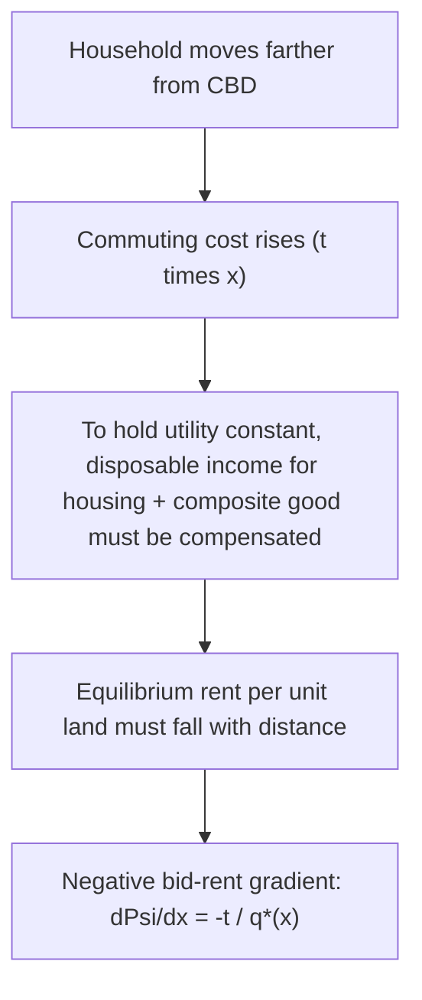

## Alonso-Muth-Mills Monocentric City Model

### Overview

The Alonso-Muth-Mills (AMM) model is the foundational framework of urban spatial economics, explaining the internal structure of a city — land use patterns, population density, and rent gradients — as the outcome of a competitive land market in which households and firms trade off commuting costs against land/housing costs. Developed independently by William Alonso (1964), Richard Muth (1969), and Edwin Mills (1967), the model assumes a **monocentric city**: all employment is concentrated at a single central business district (CBD), and households commute radially inward to work while choosing residential location to balance housing consumption against commuting cost. It remains the workhorse model for understanding urban land rent gradients, population density gradients, and city size, and serves as the launching point for nearly all subsequent urban spatial-structure theory.

### Core Assumptions

**Key Points**

- **Monocentricity**: all jobs are located at a single point, the CBD, at the city center. This is a strong simplification (modern polycentric cities are addressed by extensions covered elsewhere), but it isolates the pure commuting-cost/land-rent tradeoff mechanism.
- **Featureless plain**: land is homogeneous in a geometric sense (no natural features, equal fertility/buildability everywhere) except for distance to the CBD; the city is typically modeled as a circle (or a line, in simplified 1-D versions) with radial symmetry.
- **Open city vs. closed city**: two standard closure assumptions.
  - **Open city**: households are perfectly mobile across cities, so utility is fixed at some exogenous reservation level $\bar{u}$ (determined by conditions elsewhere in the national economy); population size is endogenous.
  - **Closed city**: population is fixed, and utility is endogenously determined to clear the land market for that population.
- **Absentee landlords**: land rent is competitively bid away and collected by landlords who do not consume in the city, so rental income does not feed back into local demand (a simplifying assumption that avoids circularity, though it means the model does not capture some feedback effects of local rent redistribution).
- **Single transport mode with constant or distance-increasing commuting cost**: commuting cost per unit distance is either constant ($t$, the linear case) or increases with distance from the CBD.
- **Competitive land market**: land is allocated to the highest bidder among households (and, in richer versions, competing land uses such as agriculture) at every distance from the CBD.

### The Household's Problem

Each household chooses residential distance from the CBD $x$, lot size (housing consumption) $q$, and a composite consumption good $z$, to maximize utility subject to a budget constraint that includes commuting cost as a function of distance:

$$\max_{x, q, z} \; U(z, q) \quad \text{s.t.} \quad y = z + R(x) q + t x$$

where $y$ is household income, $R(x)$ is the land rent per unit of land at distance $x$, and $t$ is the (constant, in the simplest version) commuting cost per unit distance. The price of the composite good $z$ is normalized to 1.

### The Bid-Rent Function

The central analytical device of the AMM model is the **bid-rent function**: the maximum rent per unit of land a household is willing to pay at each distance $x$ while achieving a fixed reference utility level $\bar{u}$. It is derived by solving the household's optimization problem for the rent that exactly exhausts the budget at each distance, holding utility fixed:

$$\Psi(x, \bar{u}) = \max_{q,z} \left\{ \frac{y - tx - z}{q} \; : \; U(z,q) = \bar{u} \right\}$$

**Key property (Envelope/Muth condition)**: the slope of the bid-rent function with respect to distance equals the negative of the marginal commuting cost divided by the household's optimal lot size:

$$\frac{\partial \Psi}{\partial x} = -\frac{t}{q^*(x)}$$

Since $t > 0$ and $q^* > 0$, the bid-rent function is **strictly downward-sloping in distance** — households must be compensated for greater commuting distance/cost through lower land rent, holding utility constant. This is the mechanism generating the classic negative rent gradient.

### Equilibrium Rent Gradient and Land Use

In competitive equilibrium, the observed **market rent gradient** $R(x)$ is the **upper envelope** of all households' bid-rent curves — at each distance, the household (or land use) with the highest bid-rent wins that location. For a single household type, equilibrium requires $R(x) = \Psi(x, \bar{u})$ for all $x$ within the city, where $\bar{u}$ is determined by the city's population/boundary conditions.

### Diagram: The Bid-Rent Curve and Equilibrium City Boundary

<svg xmlns="http://www.w3.org/2000/svg" viewBox="0 0 700 400" font-family="Helvetica, Arial, sans-serif">
<text x="350" y="26" text-anchor="middle" font-size="17" font-weight="bold" fill="#1a1a1a">Bid-Rent Gradient and City Edge (svg_diagram)</text>
<line x1="80" y1="320" x2="650" y2="320" stroke="#333333" stroke-width="1.5" />
<line x1="80" y1="320" x2="80" y2="60" stroke="#333333" stroke-width="1.5" />
<text x="365" y="355" text-anchor="middle" font-size="12" fill="#333333">Distance from CBD (x)</text>
<text x="45" y="190" text-anchor="middle" font-size="12" fill="#333333" transform="rotate(-90 45 190)">Land Rent R(x)</text>
<path d="M 90 90 C 200 130, 320 220, 430 290" fill="none" stroke="#1a56db" stroke-width="3" />
<text x="150" y="90" font-size="12" fill="#1a56db" font-weight="bold">Urban Bid-Rent, Psi(x, u-bar)</text>
<line x1="80" y1="270" x2="650" y2="270" stroke="#0d9c5c" stroke-width="2" stroke-dasharray="6,3" />
<text x="480" y="263" font-size="12" fill="#0d9c5c" font-weight="bold">Agricultural Rent, R_A</text>
<line x1="430" y1="60" x2="430" y2="320" stroke="#c81e1e" stroke-width="1.5" stroke-dasharray="3,3" />
<text x="430" y="52" text-anchor="middle" font-size="12" fill="#c81e1e" font-weight="bold">City Edge, x-bar</text>
<circle cx="90" cy="90" r="4" fill="#1a56db" />
<circle cx="430" cy="270" r="4" fill="#c81e1e" />
<text x="90" y="105" font-size="10" fill="#333333">CBD boundary</text>
</svg>

### The City Edge (Boundary) Condition

The city's outer boundary $\bar{x}$ is where the urban bid-rent curve intersects the **agricultural (or reservation) rent** $R_A$ — beyond this point, land is more valuably used for agriculture or remains undeveloped than converted to urban use:

$$\Psi(\bar{x}, \bar{u}) = R_A$$

In the open-city case, this equation, combined with the population/land-absorption condition, jointly determines the city's spatial extent $\bar{x}$ and its total population.

### Population Density Gradient

Because households facing higher land rent near the CBD substitute away from land consumption (consume smaller lots) to economize on the more expensive input, lot size $q^*(x)$ typically increases with distance from the CBD (holding preferences and income fixed), which implies **population density declines with distance from the CBD**. Under commonly used functional-form assumptions (e.g., Cobb-Douglas or CES utility with constant expenditure shares), this frequently yields the empirically well-documented **negative exponential density gradient** (Clark, 1951, an empirical regularity that predates but is rationalized by the AMM model):

$$D(x) = D_0 e^{-\gamma x}$$

where $D_0$ is central density and $\gamma > 0$ is the density gradient parameter. **[Inference]** The negative exponential form is not a universal theoretical necessity of the AMM model — it emerges under specific functional-form and parameter assumptions — but it has substantial empirical support as a good approximation for many (though not all) historical and cross-sectional city density patterns, particularly in the pre-automobile and early-automobile era; more recent data show significant flattening and departures from strict negative-exponential patterns in many cities, consistent with polycentric development and rising incomes/automobile ownership discussed in model extensions.

### Comparative Statics: Effects of Key Parameters

**Key Points**

- **Rise in income ($y$)**: theoretically ambiguous in the general model — higher income raises demand for both housing (land) and commuting-cost-saving proximity, so the net effect on the rent gradient's steepness and city shape depends on the relative income elasticities of housing demand and the value of commuting time. Empirically, in many contexts higher-income households have historically located farther from the CBD (flatter gradient, larger lot sizes at the periphery), consistent with a housing-demand income elasticity exceeding the commuting-cost income elasticity, though this pattern is not universal and has shown some reversal in cities experiencing "back to the city" gentrification dynamics in recent decades.
- **Rise in commuting cost per unit distance ($t$)**: steepens the bid-rent gradient (from the envelope condition, $\partial \Psi/\partial x = -t/q^*$), raising central rents relative to peripheral rents, and — for a fixed population — tends to shrink the city's spatial extent (a smaller $\bar{x}$) since a steeper bid-rent curve reaches the agricultural rent floor sooner.
- **Fall in commuting cost (e.g., due to transportation improvements — highways, transit)**: flattens the rent gradient, tends to expand the city's spatial extent (urban sprawl), and reduces central density relative to peripheral density — this is one of the model's most widely cited applied predictions, linking transportation infrastructure investment directly to suburbanization patterns observed across many metropolitan areas in the twentieth century.
- **Population growth (closed city) or reservation utility change (open city)**: population growth (closed city) pushes the city boundary outward and raises rents throughout, holding other parameters fixed; in the open-city case, a rise in the national reservation utility level $\bar{u}$ (representing improved outside options) reduces the city's population as some households are drawn away to alternative locations.
- **Agricultural rent floor ($R_A$)**: a higher opportunity cost of land (e.g., high-value agricultural land, environmental amenity value, urban growth boundary regulation effectively raising the shadow price of peripheral land) shrinks the city's edge inward and raises rents throughout.

### Open City vs. Closed City: Key Distinction in Predictions

| Feature | Open City | Closed City |
| --- | --- | --- |
| What is fixed | Household utility $\bar{u}$ (set by national/regional outside options) | Total population $N$ |
| What is endogenous | Population, city size | Utility level, city size |
| Effect of transport improvement | Population increases (city becomes relatively more attractive, drawing in migrants) at fixed utility | Utility increases at fixed population (existing residents better off) |
| Typical use case | Small city within a national urban system with free migration | City where migration is limited or being studied as containing a fixed cohort |

### Land Use Zoning: Residential vs. Agricultural vs. Other Uses

The competitive bid-rent framework extends naturally to a multi-use model where different land uses (residential, agricultural, potentially commercial/industrial) each have their own bid-rent function, and the equilibrium land-use pattern is determined by which use has the highest bid-rent at each distance — this generalizes the basic AMM household-vs-agriculture boundary condition into a fuller theory of urban land-use zoning driven purely by market forces rather than by regulation (though it also provides the baseline against which the welfare effects of zoning regulation are typically evaluated).

### The Mills-Muth Model: Production Side and Housing Supply

While Alonso's original formulation emphasized the household's lot-size choice directly, Muth (1969) and Mills (1967) developed complementary formulations emphasizing the **housing production** side: housing is produced using land and capital (structures) via a production function, and developers substitute capital for land (building taller, denser structures) more intensively where land is expensive (i.e., near the CBD). This generates a capital-land ratio that declines with distance from the CBD, providing a supply-side microfoundation for the density gradient that complements the pure consumption-substitution mechanism in Alonso's original household-side model. The **housing production function** approach is:

$$H = F(K, L)$$

where $H$ is housing services, $K$ is capital (structure intensity), and $L$ is land input; profit-maximizing developers choose $K/L$ to minimize the cost of producing a unit of housing given the local land rent, implying higher capital-land ratios (taller buildings) where $R(x)$ is high (near the CBD).

### Empirical Tests and Applications

**Key Points**

- The negative rent and density gradients predicted by AMM are broadly confirmed across a very large number of empirical studies of historical and cross-sectional city data (McMillen and others provide extensive surveys), though the *steepness* of gradients has generally flattened over time in most developed-country cities, consistent with declining relative commuting costs (automobiles, highway construction) as predicted by the model's comparative statics.
- **Monocentricity as an empirical simplification**: modern metropolitan areas are typically polycentric (multiple employment subcenters), and the strict single-CBD assumption is understood as a stylized starting point rather than a literal description of contemporary urban form — polycentric extensions (e.g., models incorporating multiple employment centers, following work by McMillen, Anas, and others) relax this assumption while retaining the bid-rent/commuting-cost tradeoff logic.
- **Land-use regulation testing**: the AMM framework provides the standard counterfactual ("what would the market outcome be absent regulation") against which the welfare and price effects of zoning, urban growth boundaries, and height restrictions are typically evaluated in applied urban economics.

### Limitations and Standard Extensions

**Key Points**

- **Monocentricity assumption**: relaxed in polycentric city models (see related topics) to accommodate the observed dispersal of employment to suburban subcenters.
- **Homogeneous households**: extended to multiple household income/type groups, generating income-sorting patterns across the city (who lives where) as an additional prediction beyond the aggregate rent/density gradient.
- **Fixed transport mode/cost**: extended to incorporate multiple transport modes, congestion (endogenous, traffic-dependent commuting cost), and mode choice.
- **Static, single-period model**: extended in the urban dynamics literature to incorporate durable housing capital, filtering, and neighborhood change over time, since the basic AMM model is fundamentally a static, single-cross-section equilibrium framework and does not by itself explain the dynamics of urban growth, decline, or housing-stock adjustment lags.
- **[Inference]** Because the basic model abstracts from amenities, crime, school quality, and other neighborhood-specific factors beyond pure commuting cost, its predictive power for fine-grained intra-urban rent variation is limited relative to hedonic models that incorporate such amenities directly; the AMM model is best understood as isolating and explaining the pure commuting-cost/density mechanism rather than as a complete explanation of all observed intra-urban price variation.

### Related Topics

- Bid-rent theory and the derivation of the Muth condition
- Population density gradients and the negative exponential model (Clark's Law)
- Open city vs. closed city equilibrium and comparative statics
- Housing production functions and capital-land substitution (Muth-Mills supply side)
- Polycentric city models and employment subcenters
- Urban sprawl and the effect of transportation cost changes on city form
- Zoning, land-use regulation, and urban growth boundaries: welfare analysis using the AMM baseline
- Income sorting and residential location choice across household types
- Hedonic price models and neighborhood amenities beyond commuting cost
- Housing filtering and dynamic extensions of the static monocentric model