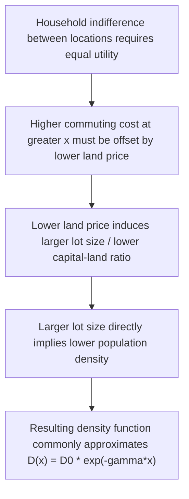

## Land Rent and Population Density Gradients

### Overview

Land rent and population density gradients describe how the price of urban land and the intensity of residential/economic use of that land vary systematically with distance from the city center. Both gradients decline with distance in the classical monocentric framework, and both are directly derived from the same underlying mechanism — the tradeoff between commuting cost and land consumption established in the Alonso-Muth-Mills model. This item develops the mathematical structure of the two gradients in greater depth, their empirical measurement, and their joint determination through the housing market.

### The Land Rent Gradient: Formal Derivation

Starting from the household's bid-rent function derived under the AMM framework, $\Psi(x, \bar{u})$, the equilibrium land rent gradient $R(x)$ in a single-household-type city equals the bid-rent function evaluated at the market-clearing utility level:

$$R(x) = \Psi(x, \bar{u}^*)$$

Differentiating the household's constrained optimization yields the **Muth-Alonso envelope condition**:

$$\frac{dR}{dx} = -\frac{t}{q(x)}$$

where $t$ is the marginal commuting cost and $q(x)$ is equilibrium lot size at distance $x$. This is a first-order differential equation in $R(x)$; given a boundary condition (the city-edge rent equals agricultural rent $R_A$ at $x = \bar{x}$), it can in principle be solved for the full rent function once the underlying utility function pins down $q(x)$ as a function of $R(x)$ and $x$.

### Closed-Form Solution Under Cobb-Douglas Preferences

**Example**

Assume Cobb-Douglas utility $U(z,q) = z^{1-\alpha} q^{\alpha}$, with $\alpha \in (0,1)$ the expenditure share on housing/land. Utility maximization subject to $y - tx = z + Rq$ yields:

$$q^*(x) = \frac{\alpha (y - tx)}{R(x)}$$

Substituting into the envelope condition and solving the resulting differential equation gives a rent gradient of the form:

$$R(x) = R_A \left( \frac{y - tx}{y - t\bar{x}} \right)^{1/\alpha}$$

This closed-form expression shows explicitly that: (1) rent declines with $x$ (since $y - tx$ falls as $x$ rises), (2) the rate of decline is governed by both the commuting cost $t$ and the housing expenditure share $\alpha$, and (3) rent reaches the agricultural floor $R_A$ exactly at the city edge $\bar{x}$, consistent with the boundary condition. A smaller $\alpha$ (housing is a smaller expenditure share, i.e., demand is relatively more inelastic in the exponent sense) produces a steeper percentage rent gradient for a given commuting cost.

### The Population Density Gradient

Population density $D(x)$ is the inverse of lot size (in a pure land-consumption model with no structure/capital substitution):

$$D(x) = \frac{1}{q^*(x)}$$

Since $q^*(x)$ generally rises with distance (households substitute toward more land as its price falls), $D(x)$ falls with distance — declining density mirrors declining rent, driven by the same underlying mechanism.

### The Negative Exponential Density Function (Clark's Law)

Colin Clark (1951) documented empirically, across dozens of cities and decades before the AMM model provided a theoretical rationale, that urban population density closely follows a negative exponential function of distance from the center:

$$D(x) = D_0 \, e^{-\gamma x}$$

where $D_0$ is the (extrapolated) central density and $\gamma > 0$ is the **density gradient parameter**, interpretable as the percentage rate of density decline per unit distance. Mills (1970) and Muth (1969) later showed this functional form emerges naturally from the monocentric model under specific but empirically reasonable functional-form assumptions (e.g., certain CES/Cobb-Douglas preference and housing-production-function specifications combined with a linear commuting cost function).

### Diagram: Rent and Density Gradients Side by Side

<svg xmlns="http://www.w3.org/2000/svg" viewBox="0 0 720 380" font-family="Helvetica, Arial, sans-serif">
<text x="360" y="26" text-anchor="middle" font-size="17" font-weight="bold" fill="#1a1a1a">Rent Gradient vs. Density Gradient (svg_diagram)</text>

<line x1="60" y1="330" x2="330" y2="330" stroke="#333333" stroke-width="1.5" />
<line x1="60" y1="330" x2="60" y2="70" stroke="#333333" stroke-width="1.5" />
<text x="195" y="358" text-anchor="middle" font-size="11.5" fill="#333333">Distance x</text>
<text x="30" y="200" text-anchor="middle" font-size="11.5" fill="#333333" transform="rotate(-90 30 200)">Rent R(x)</text>
<path d="M 65 90 C 130 120, 220 220, 320 310" fill="none" stroke="#1a56db" stroke-width="3" />
<text x="195" y="70" text-anchor="middle" font-size="12" fill="#1a56db" font-weight="bold">R(x) declines convexly</text>

<line x1="400" y1="330" x2="670" y2="330" stroke="#333333" stroke-width="1.5" />
<line x1="400" y1="330" x2="400" y2="70" stroke="#333333" stroke-width="1.5" />
<text x="535" y="358" text-anchor="middle" font-size="11.5" fill="#333333">Distance x</text>
<text x="370" y="200" text-anchor="middle" font-size="11.5" fill="#333333" transform="rotate(-90 370 200)">Density D(x)</text>
<path d="M 405 95 C 470 130, 560 240, 660 315" fill="none" stroke="#0d9c5c" stroke-width="3" />
<text x="535" y="70" text-anchor="middle" font-size="12" fill="#0d9c5c" font-weight="bold">D(x) = D0 e^(-gamma x)</text>
</svg>

### Estimating the Density Gradient Empirically

**Key Points**

- The negative exponential model is typically estimated by taking logs: $\ln D(x) = \ln D_0 - \gamma x$, which is linear in $x$ and can be estimated by OLS regression of log density on distance using census tract or grid-cell data.
- $\gamma$ is directly interpretable: a $\gamma$ of, say, 0.10 implies density falls by approximately 10% per additional kilometer (or mile, depending on units) from the center.
- **Historical pattern**: numerous studies (Mills, 1972; Muth, 1969; subsequent replications across many countries and time periods) document that $\gamma$ has generally **declined over time** in most developed-country cities across the twentieth century — i.e., density gradients have flattened, consistent with falling commuting costs (automobiles, highway construction) as predicted by AMM comparative statics.
- **Cross-country variation**: gradients tend to be steeper in cities with less-developed transportation infrastructure, higher poverty (where automobile ownership is lower and commuting cost sensitivity to distance is higher), and older urban cores built before automobile-oriented development; flatter gradients are typical of newer, more auto-oriented, and generally wealthier metropolitan areas — though these patterns admit exceptions and are sensitive to the specific measurement period and boundary definitions used.
- **[Inference]** Because the negative exponential form is a reduced-form empirical regularity rather than a theoretically necessary outcome, its fit varies across cities, and increasingly poor fit has been documented for polycentric metropolitan areas where density exhibits local peaks around suburban employment subcenters rather than smooth monotonic decline — motivating polycentric extensions of the basic gradient model.

### Rent-Density Relationship Through the Housing Production Function

In the Muth-Mills supply-side extension, land rent and density are linked not just through household lot-size substitution but through developers' capital-land substitution in housing production. Profit-maximizing developers facing production function $H = F(K,L)$ choose the capital-land ratio $K/L$ to minimize the cost of producing housing services, given local land rent $R(x)$:

$$\frac{K}{L} = g(R(x))$$

with $g' > 0$ — higher land rent (near the CBD) induces a higher capital-land ratio (taller buildings, more capital-intensive construction), which independently raises population/housing-unit density near the center, **reinforcing** the pure consumption-substitution channel from the household side. This dual mechanism (household lot-size substitution + developer capital-land substitution) is why the AMM/Mills-Muth density gradient prediction is considered fairly robust across different modeling emphases.

### Distinguishing Land Rent Gradients from House Price Gradients

**Key Points**

- **Land rent** ($R(x)$) is the price per unit of *raw land*; it is not directly observed in most housing market data, since developed property combines land and structure value.
- **House price or housing rent gradients** (the empirically observed variable in most hedonic studies) reflect the *combined* value of land and structure, and are typically **flatter** than the underlying land rent gradient because structures (capital) are more mobile/substitutable across locations than land itself — the capital-land substitution mechanism above partially offsets the steepness of the pure land-rent gradient when measured through total property value.
- Empirical land rent extraction (distinguishing land value from structure value in observed property prices) is a nontrivial econometric exercise, commonly addressed via hedonic decomposition, vacant land sales comparables, or residual/depreciated-cost methods; land share of total property value is generally found to be highest near the CBD and to fall (in relative terms) toward the urban periphery, consistent with the theoretical framework.

### City Size and the Gradients

The land rent and density gradients jointly determine (and are determined by) the city's total population and spatial extent, through the population-absorption identity:

$$N = \int_0^{\bar{x}} D(x) \cdot 2\pi x \, dx$$

(for a circular city), where $N$ is total population. This integral condition, combined with the city-edge boundary condition $R(\bar{x}) = R_A$, closes the model: given a population (closed city) or reservation utility (open city), the equilibrium gradients and city radius are jointly determined.

### Comparative Statics on the Gradients

| Parameter Change | Effect on Rent Gradient | Effect on Density Gradient |
| --- | --- | --- |
| Higher commuting cost $t$ | Steeper (rents rise faster near CBD) | Steeper ($\gamma$ rises; density more concentrated) |
| Lower commuting cost $t$ | Flatter | Flatter ($\gamma$ falls; density more dispersed) |
| Higher income $y$ (housing-demand-dominant case) | Generally flatter (peripheral rents rise relatively more) | Flatter (larger lots throughout, especially periphery) |
| Higher agricultural rent floor $R_A$ | Shifts gradient up, shrinks city radius | Higher density throughout (smaller city absorbs same or growing population in less land) |
| Population growth (closed city) | Entire gradient shifts up, city radius expands | Density rises at every distance, gradient may steepen near center |

### Applications: Using Gradients to Diagnose Urban Change

**Key Points**

- **Transportation investment evaluation**: predicted flattening of both gradients following a major transit or highway investment is a standard testable implication used in ex-post evaluation studies of transportation infrastructure projects.
- **Urban growth boundary and zoning analysis**: policies that artificially raise the effective boundary rent (e.g., growth boundaries that make peripheral land unavailable, effectively raising the shadow $R_A$) are predicted to compress the city, raise gradients, and increase overall rent levels — this prediction is used as a baseline in empirical studies evaluating the price effects of growth-management regulation.
- **Comparing gradients across cities or time**: the estimated $\gamma$ parameter provides a simple, comparable summary statistic of a city's degree of spatial concentration, widely used in cross-city and historical urban form comparisons (e.g., comparing US Sunbelt cities, generally flatter/more auto-oriented, against older Northeastern/European cities, generally steeper/more transit-oriented).

### Related Topics

- Alonso-Muth-Mills monocentric city model: full household and equilibrium derivation
- Housing production functions and capital-land substitution (Muth-Mills supply side)
- Open city vs. closed city equilibrium and the population-absorption condition
- Hedonic price models and land value vs. structure value decomposition
- Polycentric city models and multi-peaked density patterns
- Urban sprawl and the effect of transportation cost changes on city form
- Urban growth boundaries and zoning: price and gradient effects
- Historical and cross-country comparisons of density gradient parameters
- Housing filtering, depreciation, and dynamic extensions of the static gradient model