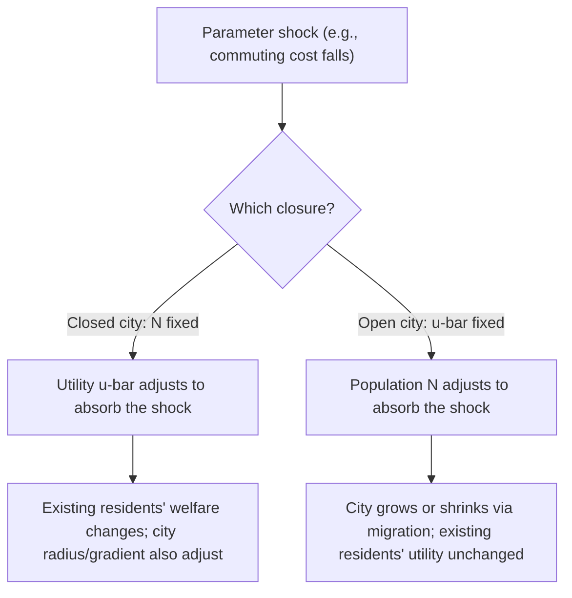
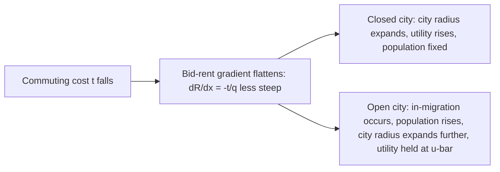

## Comparative Statics of the Monocentric Model

### Overview

Comparative statics in the Alonso-Muth-Mills (AMM) framework examines how a city's equilibrium rent gradient, density gradient, population, and spatial extent respond to changes in underlying parameters — income, commuting cost, agricultural rent, and population. This exercise is the primary vehicle through which the monocentric model generates its most widely cited applied predictions (suburbanization, sprawl, the effect of transit investment), and it requires carefully distinguishing between the **open-city** and **closed-city** closure assumptions, since the same parameter change can produce different — sometimes opposite — predictions depending on which closure is used.

### The Two Closure Regimes: A Recap

**Key Points**

- **Closed city**: population $N$ is fixed exogenously; utility $\bar{u}$ adjusts endogenously to clear the land market for that population. Appropriate for studying how a *given* population is affected by a parameter change (e.g., "how does this cohort's welfare change").
- **Open city**: utility $\bar{u}$ is fixed at an exogenous national/regional reservation level (determined by outside options); population $N$ adjusts endogenously via migration. Appropriate for studying long-run outcomes when households are freely mobile across cities.
- The choice of closure is not a minor technicality — it fundamentally changes which variable "absorbs" a shock (utility vs. population), and comparative statics results should always be read with the closure assumption explicit.

### Effect of a Decrease in Commuting Cost ($t \downarrow$)

This is the single most frequently analyzed comparative-static exercise, used to explain historical suburbanization following transportation improvements (streetcars, automobiles, highways).

**Mechanism**: From the envelope/Muth condition $dR/dx = -t/q(x)$, a lower $t$ flattens the bid-rent gradient directly (the slope becomes less negative at every $x$ and every lot size).

- **Closed city (fixed $N$)**:
  - The rent gradient flattens.
  - Central rents fall (since the same total population must now be accommodated with a flatter gradient, and the city edge condition $R(\bar{x})=R_A$ combined with population absorption implies the city expands spatially).
  - City radius $\bar{x}$ increases (urban sprawl).
  - Density gradient flattens; central density falls, peripheral density rises.
  - Household utility $\bar{u}$ **rises** — all existing residents are unambiguously better off, since lower commuting costs represent a pure efficiency gain distributed through the land market via lower effective housing-plus-commuting costs at every location.
- **Open city (fixed $\bar{u}$)**:
  - Because utility must remain at the fixed reservation level, the flatter, more attractive gradient draws in migrants.
  - Population $N$ **increases**.
  - The city radius increases both due to the flatter gradient and the larger population that must be accommodated — a compounding effect (larger than the closed-city radius increase for the same $\Delta t$).
  - Rents rise from in-migration pressure, partially offsetting the initial flattening effect, until utility is restored to $\bar{u}$ at the new (larger) population level.

### Effect of an Increase in Income ($y \uparrow$)

Income effects are theoretically **ambiguous** in the general model because rising income affects both the demand for housing/land (positive income elasticity of housing demand, typically assumed) and the value of time spent commuting (if commuting disutility or opportunity cost of time rises with income, e.g., $t$ effectively scales with wage).

**Key Points**

- If the **income elasticity of housing demand exceeds the income elasticity of the (time) cost of commuting**, higher income leads households to prefer larger lots and accept longer commutes — this flattens the rent and density gradients and tends to expand the city (more suburban-oriented outcome). This has historically been the empirically dominant pattern in many contexts (e.g., "as America got richer, it moved to the suburbs").
- If commuting cost's income elasticity is **higher** (e.g., if higher-income households' time is sufficiently more valuable that the effective cost of distance rises faster than their demand for land), the opposite (more central, denser high-income living) can result — a pattern more consistent with some contemporary "back to the city" gentrification dynamics in certain metropolitan areas.
- **[Inference]** Because the net effect depends on the relative magnitudes of these two elasticities, which vary across time periods, cities, and household types, no universal sign can be assigned to the income effect on urban form; both suburban-flight and gentrification-consistent patterns are theoretically nested within the same general AMM comparative-statics framework depending on parameter values, and the empirically dominant pattern has itself shifted across historical eras in many developed-country cities.

### Effect of an Increase in Agricultural (Boundary) Rent ($R_A \uparrow$)

**Key Points**

- A higher opportunity cost of peripheral land (whether from genuine agricultural productivity, environmental amenity value, or regulatory constraints like urban growth boundaries that effectively raise the shadow price of converting land to urban use) shifts the city-edge condition $\Psi(\bar{x}, \bar{u}) = R_A$ inward.
- **Closed city**: the city radius shrinks; because the same fixed population $N$ must now fit into less land, density rises at every distance, and the entire rent gradient shifts upward; household utility falls (the city has become more constrained/expensive for a given population).
- **Open city**: at fixed utility, the smaller, more constrained city cannot support as large a population at the reservation utility level, so population falls (out-migration) until utility is restored to $\bar{u}$ given the smaller available land area.
- This comparative static is the standard theoretical basis for predicting that **urban growth boundaries and greenbelt policies raise city-wide rents/house prices and increase density**, a prediction widely tested in the empirical land-use regulation literature.

### Effect of Population Growth ($N \uparrow$, Closed City) or Reservation Utility Change (Open City)

**Key Points**

- **Closed city, $N$ rises exogenously** (e.g., due to immigration, natural increase, or annexation): the city must absorb more residents; the rent gradient shifts upward at every distance, the city radius expands (more land is bid into urban use up to a new, farther boundary where $R = R_A$), and equilibrium utility $\bar{u}$ **falls** (existing residents are worse off due to more intense competition for centrally located land, even as newcomers who move from outside the city may be better off relative to their prior location).
- **Open city, reservation utility $\bar{u}$ rises** (e.g., because outside options elsewhere improve): the city, now relatively less attractive, loses population as households migrate to alternative locations offering the higher utility level; the rent gradient falls, and the city radius shrinks.

### Summary Table of Comparative Statics

| Parameter Change | Closure | Rent Gradient | City Radius | Density Gradient | Utility | Population |
| --- | --- | --- | --- | --- | --- | --- |
| $t \downarrow$ (transport improves) | Closed | Flattens | Expands | Flattens | Rises | Fixed |
| $t \downarrow$ | Open | Flattens | Expands (more) | Flattens | Fixed | Rises |
| $y \uparrow$, housing-dominant | Closed | Flattens | Expands | Flattens | Rises | Fixed |
| $y \uparrow$, commuting-cost-dominant | Closed | Steepens | Shrinks or ambiguous | Steepens | Ambiguous | Fixed |
| $R_A \uparrow$ (growth boundary) | Closed | Shifts up | Shrinks | Densifies | Falls | Fixed |
| $R_A \uparrow$ | Open | Shifts up | Shrinks | Densifies | Fixed | Falls |
| $N \uparrow$ | Closed | Shifts up | Expands | Densifies near center | Falls | Fixed by assumption |
| $\bar{u} \uparrow$ (better outside options) | Open | Shifts down | Shrinks | Flattens | Fixed by assumption | Falls |

### Elasticity-Based Formalization

For functional forms with closed-form solutions (e.g., the Cobb-Douglas case derived under "Land rent and population density gradients"), comparative statics can be expressed as explicit elasticities. For example, differentiating the Cobb-Douglas rent gradient

$$R(x) = R_A \left( \frac{y - tx}{y - t\bar{x}} \right)^{1/\alpha}$$

with respect to $t$ at fixed $x$ and $\bar{x}$ shows the direct channel through which commuting cost changes propagate to rents at every location, and combined with the city-edge condition and population-absorption identity yields the full system that must be solved (often numerically for realistic functional forms) for the closed-city or open-city equilibrium response.

### Diagram: Before-and-After Rent Gradient Shift from Falling Commuting Cost

<svg xmlns="http://www.w3.org/2000/svg" viewBox="0 0 700 380" font-family="Helvetica, Arial, sans-serif">
<text x="350" y="26" text-anchor="middle" font-size="17" font-weight="bold" fill="#1a1a1a">Commuting Cost Decline: Rent Gradient Response (svg_diagram)</text>
<line x1="70" y1="330" x2="650" y2="330" stroke="#333333" stroke-width="1.5" />
<line x1="70" y1="330" x2="70" y2="60" stroke="#333333" stroke-width="1.5" />
<text x="360" y="358" text-anchor="middle" font-size="12" fill="#333333">Distance from CBD (x)</text>
<text x="35" y="195" text-anchor="middle" font-size="12" fill="#333333" transform="rotate(-90 35 195)">Rent R(x)</text>
<path d="M 85 80 C 180 110, 280 190, 380 300" fill="none" stroke="#c81e1e" stroke-width="3" />
<text x="130" y="72" font-size="12" fill="#c81e1e" font-weight="bold">Before (high t): steep, short radius</text>
<path d="M 85 105 C 250 140, 450 220, 600 300" fill="none" stroke="#1a56db" stroke-width="3" />
<text x="420" y="215" font-size="12" fill="#1a56db" font-weight="bold">After (low t): flatter, longer radius</text>
<line x1="70" y1="270" x2="650" y2="270" stroke="#0d9c5c" stroke-width="1.5" stroke-dasharray="5,3" />
<text x="600" y="263" font-size="11" fill="#0d9c5c" font-weight="bold">R_A</text>
<line x1="380" y1="60" x2="380" y2="330" stroke="#c81e1e" stroke-width="1" stroke-dasharray="2,3" />
<line x1="600" y1="60" x2="600" y2="330" stroke="#1a56db" stroke-width="1" stroke-dasharray="2,3" />
</svg>

### Empirical Testing of Comparative Statics Predictions

**Key Points**

- **Transportation infrastructure studies**: numerous quasi-experimental studies (using highway openings, new transit lines, or historical streetcar expansions as shocks) find patterns broadly consistent with the falling-$t$ comparative static: flattening density gradients, expanding urban footprints, and population/employment decentralization following transport cost reductions.
- **Urban growth boundary studies**: empirical evaluations of growth boundaries (e.g., Portland, Oregon's urban growth boundary; UK green belts) generally find house price and rent increases consistent with the $R_A \uparrow$ comparative static, though magnitudes and the relative contribution of growth-boundary effects versus other confounding local factors vary across studies.
- **Income and sorting studies**: the historical US pattern of income rising alongside suburbanization is broadly consistent with a housing-demand-dominant income effect for much of the twentieth century, while more recent gentrification research in some large metropolitan areas documents reversals in specific neighborhoods, consistent with the model's inherent theoretical ambiguity on this parameter.
- **[Inference]** As with most reduced-form empirical tests of a stylized theoretical model, these studies generally treat the AMM comparative statics as qualitatively suggestive rather than quantitatively precise, since real cities depart from monocentricity, feature heterogeneous households and housing stock durability/adjustment lags, and are subject to many confounding local factors not present in the idealized model.

### Related Topics

- Alonso-Muth-Mills monocentric city model: full derivation of the household problem and equilibrium
- Land rent and population density gradients: closed-form solutions and estimation
- Open city vs. closed city equilibrium concepts
- Urban growth boundaries and land-use regulation: welfare and price effects
- Suburbanization and the historical role of transportation cost declines
- Income sorting and residential location choice across household types
- Housing filtering and dynamic adjustment following comparative-static shocks
- Polycentric extensions and their implications for comparative statics predictions