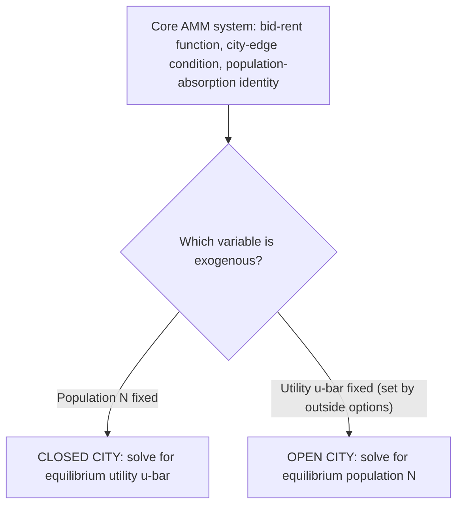
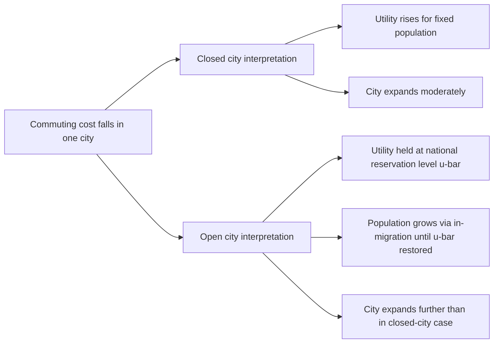

## Open City Versus Closed City Equilibrium

### Overview

The open-city and closed-city distinction is a modeling choice in the Alonso-Muth-Mills (AMM) framework governing which variable is held exogenously fixed and which is allowed to adjust endogenously to close the model. It is not a description of two different types of cities in the real world so much as two different **counterfactual experiments** — two different sets of assumptions about the degree of household mobility across cities — that a researcher chooses depending on the question being asked. Because the two closures generate materially different, sometimes opposite, comparative-statics predictions (as detailed under "Comparative statics of the monocentric model"), understanding this distinction precisely is essential to correctly interpreting and applying monocentric city model results.

### The Formal Difference

In both closures, the equilibrium of a monocentric city requires solving the same core system: a bid-rent function $\Psi(x,\bar u)$ derived from household optimization, a city-edge boundary condition $\Psi(\bar x, \bar u) = R_A$, and a population-absorption identity $N = \int_0^{\bar x} D(x) \, dA$. The system has two unknowns beyond the rent/density functions themselves — utility $\bar u$ and population $N$ — and exactly one additional equation is needed to close it. The two closures supply that missing equation differently:

$$\text{Closed city:} \quad N = \bar{N} \text{ (exogenous)} \;\; \Rightarrow \;\; \bar{u} \text{ solved endogenously}$$

$$\text{Open city:} \quad \bar{u} = \bar{U} \text{ (exogenous)} \;\; \Rightarrow \;\; N \text{ solved endogenously}$$

### Closed City: Definition and Interpretation

**Key Points**

- **Assumption**: the city's population is fixed at $\bar{N}$, either because migration is costly/restricted, because the analysis concerns a specific existing cohort of residents, or because the researcher wants to isolate the welfare consequences of a shock for a *given* population rather than allow population to adjust.
- **Endogenous variable**: equilibrium utility $\bar{u}^*$ adjusts so that the fixed population exactly fills the city up to the point where bid-rent equals agricultural rent.
- **Interpretation of comparative statics**: because utility is the "adjustment valve," comparative statics in the closed city directly show how a *given* population's **welfare** changes in response to a parameter shock — this makes the closed-city closure the natural choice for welfare analysis of a fixed population (e.g., "how does an existing city's residents' well-being change if a highway is built").
- **Typical applications**: short-run analysis where migration frictions are significant; welfare evaluation of local policy changes on incumbent residents; theoretical clarity when population changes are not the object of study.

### Open City: Definition and Interpretation

**Key Points**

- **Assumption**: households are perfectly mobile across a system of cities (or across the city and some outside region), so no city can sustain a utility level below what is available elsewhere — in equilibrium, utility in every city (or every open city in a system) must equal a common reservation level $\bar{U}$, determined by conditions in the broader economy (the "outside option").
- **Endogenous variable**: population $N^*$ adjusts (via migration in or out) until the city's utility, given its fixed population size at that point, exactly equals $\bar{U}$.
- **Interpretation of comparative statics**: because population is the "adjustment valve," comparative statics in the open city show how a shock affects the city's **size** (growth or decline via migration) rather than the welfare of a fixed population — existing (and new) residents' utility does not change, by construction, since it remains pinned at $\bar U$.
- **Typical applications**: long-run analysis of city growth in a national urban system with free migration; explaining why some cities grow and others shrink in response to local shocks (amenity changes, productivity shocks, transportation improvements) without those shocks translating into lasting local welfare differences.

### Why the Distinction Matters: A Side-by-Side Example

**Example**

Consider a transportation improvement that reduces commuting cost $t$ in a single city within a larger national system.

- **Closed-city prediction**: population is fixed, so the improvement makes existing residents strictly better off — utility $\bar{u}$ rises, the rent gradient flattens, and the city expands spatially to accommodate the same population more comfortably (larger lots at every income level).
- **Open-city prediction**: because utility cannot rise above the national reservation level $\bar{U}$ (any local utility gain is arbitraged away by in-migration), the improvement instead manifests as **population growth** — the city becomes larger, its footprint expands even further than in the closed-city case, but the additional in-migrants bid rents back up until utility returns to exactly $\bar U$. Existing residents' welfare, in this framework, does **not** improve in the long run; the benefit of the transportation improvement is capitalized into local population growth and higher rents rather than sustained utility gains.

This example illustrates a general and important point: whether a local amenity or infrastructure improvement is expected to raise local welfare or instead attract migrants until welfare returns to the national baseline is entirely a function of the assumed degree of interregional mobility, and picking the "wrong" closure for the empirical context being studied can produce materially misleading predictions.

### Diagram: Capitalization vs. Population Absorption

<svg xmlns="http://www.w3.org/2000/svg" viewBox="0 0 700 340" font-family="Helvetica, Arial, sans-serif">
<text x="350" y="26" text-anchor="middle" font-size="17" font-weight="bold" fill="#1a1a1a">Where the Benefit of a Local Improvement Goes (svg_diagram)</text>
<rect x="40" y="70" width="280" height="220" rx="8" fill="#e8f0fe" stroke="#1a56db" stroke-width="2" />
<text x="180" y="98" text-anchor="middle" font-size="14" font-weight="bold" fill="#1a56db">Closed City</text>
<text x="60" y="130" font-size="12" fill="#1a1a1a">Population N: fixed</text>
<text x="60" y="155" font-size="12" fill="#1a1a1a">Adjustment valve: utility u-bar</text>
<text x="60" y="190" font-size="12.5" fill="#0d9c5c" font-weight="bold">Benefit shows up as:</text>
<text x="60" y="212" font-size="12" fill="#1a1a1a">Higher welfare for</text>
<text x="60" y="230" font-size="12" fill="#1a1a1a">existing residents</text>
<rect x="380" y="70" width="280" height="220" rx="8" fill="#eafaf1" stroke="#0d9c5c" stroke-width="2" />
<text x="520" y="98" text-anchor="middle" font-size="14" font-weight="bold" fill="#0d9c5c">Open City</text>
<text x="400" y="130" font-size="12" fill="#1a1a1a">Utility u-bar: fixed (national)</text>
<text x="400" y="155" font-size="12" fill="#1a1a1a">Adjustment valve: population N</text>
<text x="400" y="190" font-size="12.5" fill="#c81e1e" font-weight="bold">Benefit shows up as:</text>
<text x="400" y="212" font-size="12" fill="#1a1a1a">City growth (in-migration),</text>
<text x="400" y="230" font-size="12" fill="#1a1a1a">not sustained local welfare gain</text>
</svg>

### Systems of Cities: The Open-City Closure in a Multi-City Context

**Key Points**

- The open-city assumption is most naturally embedded in a **system of cities** framework (related to Henderson's systems-of-cities model discussed under agglomeration economies), where many cities coexist and households freely choose among them.
- In such a system, the common reservation utility $\bar{U}$ is not arbitrary but is itself determined in general equilibrium by the characteristics of all cities in the system — a city with a persistent productivity or amenity advantage will, in the long run, be larger (not have permanently higher utility) precisely because population absorbs the advantage until utility is equalized across all cities that households are willing to consider.
- This generates one of urban economics' more subtle and often counterintuitive implications: **in a long-run open-city equilibrium with free mobility, observed cross-city utility levels should be roughly equalized**, while cross-city **population and rent** differences reflect underlying productivity, amenity, or cost differences — a pattern that motivates the **Rosen-Roback spatial equilibrium framework**, which formalizes this logic explicitly using wages and rents as the two prices that jointly compensate for or capitalize local (dis)amenities.

### Rosen-Roback Connection

The open-city AMM logic is the urban land-use-specific analogue of the broader **Rosen-Roback model** (Rosen, 1979; Roback, 1982), which treats wages and land rents as the two equilibrating prices in a system of open cities/regions, such that in equilibrium:

$$\bar{U} = U(w_r, R_r, \text{Amenities}_r) \quad \text{equalized across all locations } r$$

Under Rosen-Roback, a location with a desirable amenity (e.g., good climate) will exhibit **either** higher rents, **or** lower wages, **or** some combination, sufficient to exactly offset the amenity value and restore equal utility across locations — high nominal wages or low rents alone do not indicate that a location is a "better place to live" in this framework, since in full open-city equilibrium such differences should be exactly offset by unobserved (or observed) amenity/disamenity differences.

### Empirical Identification: Which Closure Fits Reality?

**Key Points**

- Neither closure is a literal description of any real city; both are polar simplifications of a continuum of intermediate mobility.
- **Short-run empirical work** (studying immediate effects of a local shock within a year or two) often implicitly aligns more closely with closed-city assumptions, since migration takes time and housing/labor markets adjust with lags.
- **Long-run empirical work** (studying effects over a decade or more, in contexts with well-developed internal migration systems, such as the modern United States) often aligns more closely with open-city assumptions, and much of the modern spatial equilibrium literature (following Rosen-Roback and its descendants, e.g., Diamond 2016, Moretti 2011) explicitly adopts an open-city-style framework with imperfect but substantial labor mobility.
- **[Inference]** Most researchers regard the true empirical setting as intermediate between the two polar cases — migration responds to shocks with a lag and is imperfect (due to moving costs, family ties, housing lock-in, and heterogeneous preferences for location), so a "partially open" or dynamic adjustment framework is often more empirically realistic than either pure closure, though the two polar cases remain the standard reference points for exposition and for bounding likely outcomes.

### Summary Comparison Table

| Feature | Closed City | Open City |
| --- | --- | --- |
| Exogenous variable | Population $N$ | Utility $\bar{u}$ (reservation level) |
| Endogenous variable | Utility $\bar{u}^*$ | Population $N^*$ |
| Best suited for | Fixed-cohort welfare analysis; short-run/low-mobility settings | Long-run city growth analysis; high-mobility settings; systems of cities |
| Local shock benefit shows up as | Utility gain for existing residents | Population growth (in-migration), utility unchanged |
| Related framework | — | Rosen-Roback spatial equilibrium; Henderson systems of cities |
| Real-world approximation | Migration-restricted, short time horizons | Well-integrated national urban system, long time horizons |

### Related Topics

- Alonso-Muth-Mills monocentric city model: full equilibrium derivation
- Comparative statics of the monocentric model under each closure
- Rosen-Roback spatial equilibrium and the wage-rent compensation framework
- Henderson's systems-of-cities model and endogenous city-size determination
- Local labor demand shocks and regional adjustment (Moretti, Diamond)
- Migration costs, housing lock-in, and deviations from perfect open-city mobility
- Amenity valuation using spatial equilibrium (hedonic wage/rent decomposition)
- Urban growth boundaries and land-use regulation under each closure assumption