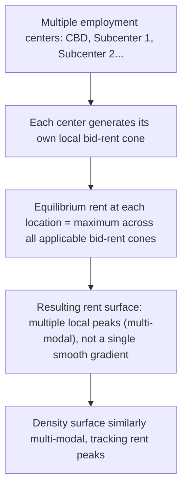

## Polycentric City Models

### Overview

Polycentric city models relax the single most restrictive assumption of the Alonso-Muth-Mills (AMM) framework — that all employment is concentrated at one central business district (CBD) — to account for the empirical reality that most contemporary metropolitan areas have multiple employment centers (a traditional downtown plus suburban office parks, edge cities, and mixed-use nodes). These models retain the core AMM logic of bid-rent competition and commuting-cost tradeoffs but extend it to a setting with multiple, often endogenously formed, employment subcenters, producing richer and empirically more accurate predictions about land rent, density, and commuting patterns.

### Motivation: Why Move Beyond Monocentricity

**Key Points**

- **Empirical mismatch**: numerous studies (McDonald & McMillen; Giuliano & Small's identification of over 30 employment subcenters in Los Angeles) document that modern metropolitan employment is not concentrated at a single point but distributed across multiple nodes, with the traditional CBD often retaining only a minority share of metropolitan employment.
- **Density gradient anomalies**: pure monocentric density gradients predict smooth, monotonic decline from the center; actual density surfaces in most large metros show secondary peaks or "bumps" at suburban employment centers, which the basic AMM negative exponential form cannot capture.
- **Reverse and cross-commuting**: monocentric models predict commuting flows entirely inward toward the CBD; polycentric metros exhibit substantial reverse commuting (from center to suburb), cross-suburban commuting, and complex multi-directional flow patterns inconsistent with pure monocentricity.
- **Edge cities and suburban employment growth**: Garreau (1991) documented the rise of "edge cities" — large suburban nodes of office, retail, and employment activity that in some metros rival or exceed the traditional downtown in size — as a defining feature of late-twentieth-century American urban form.

### Formal Extension: Multiple Employment Centers

The polycentric extension modifies the household's commuting cost term to reflect the minimum-cost commute to the *nearest* (or utility-maximizing) of several employment centers, rather than a fixed single CBD:

$$\max_{x, q, z} U(z,q) \quad \text{s.t.} \quad y = z + R(x)q + \min_k \left[ t \cdot d(x, k) \right]$$

where $d(x,k)$ is the distance from residential location $x$ to employment center $k$, and the minimization is over all available employment centers $k = 1, \ldots, K$. In more general versions, households may also have heterogeneous employment probabilities across centers (workers are not perfectly mobile between job locations), requiring the model to incorporate a labor-market matching or commuting-flow structure rather than assuming costless choice of employer location.

### The Resulting Rent and Density Surface

Because each employment center generates its own local bid-rent "peak," the equilibrium rent surface in a polycentric model becomes the **upper envelope of multiple overlapping bid-rent cones**, one centered on each employment node, rather than a single smooth gradient from one center.

### Diagram: Monocentric vs. Polycentric Rent Surface

<svg xmlns="http://www.w3.org/2000/svg" viewBox="0 0 720 380" font-family="Helvetica, Arial, sans-serif">
<text x="360" y="26" text-anchor="middle" font-size="17" font-weight="bold" fill="#1a1a1a">Monocentric vs. Polycentric Rent Surface (svg_diagram)</text>
<line x1="60" y1="330" x2="330" y2="330" stroke="#333333" stroke-width="1.5" />
<line x1="60" y1="330" x2="60" y2="70" stroke="#333333" stroke-width="1.5" />
<text x="195" y="358" text-anchor="middle" font-size="11.5" fill="#333333">Distance</text>
<path d="M 65 90 C 140 130, 230 240, 320 310" fill="none" stroke="#1a56db" stroke-width="3" />
<text x="195" y="70" text-anchor="middle" font-size="12" fill="#1a56db" font-weight="bold">Monocentric: single peak</text>
<line x1="400" y1="330" x2="670" y2="330" stroke="#333333" stroke-width="1.5" />
<line x1="400" y1="330" x2="400" y2="70" stroke="#333333" stroke-width="1.5" />
<text x="535" y="358" text-anchor="middle" font-size="11.5" fill="#333333">Distance</text>
<path d="M 405 100 C 440 150, 470 260, 500 290 C 530 260, 560 150, 590 100 C 610 150, 630 260, 660 300" fill="none" stroke="#0d9c5c" stroke-width="3" />
<text x="535" y="70" text-anchor="middle" font-size="12" fill="#0d9c5c" font-weight="bold">Polycentric: multiple peaks</text>
</svg>

### How Subcenters Form: Theoretical Explanations

**Key Points**

- **Firm decentralization from a saturated CBD**: as the CBD grows and central rents/congestion rise beyond a threshold, some firms find it profitable to relocate to secondary sites offering lower rent, especially firms with weaker agglomeration-benefit dependence on the specific CBD location (a version of the general agglomeration-versus-congestion tradeoff from the increasing-returns literature).
- **Self-reinforcing agglomeration at a secondary site**: once a small number of firms locate at a suburban site (often due to a specific triggering factor — a highway interchange, an existing institution, or a large anchor employer), NEG-style circular causation (own linkages, labor pooling, market access to a growing suburban population) can generate a self-sustaining subcenter, following the same cumulative-causation logic as the core-periphery model, but applied at the intra-metropolitan rather than inter-regional scale.
- **Transportation network structure**: subcenters frequently emerge at highway interchanges or transit nodes, where the transportation network itself creates a local advantage in market/labor access, echoing the classical Weberian transport-orientation logic.
- **Fu and Levinson's NEDUM-style / theoretical models**: formal models (e.g., Fujita & Ogawa, 1982; Lucas & Rossi-Hansberg, 2002) derive polycentric structure as an **endogenous equilibrium outcome** of the interaction between agglomeration economies (which favor concentration) and commuting/congestion costs (which favor dispersion) — rather than simply assuming multiple centers exogenously, these models show conditions under which a monocentric equilibrium becomes unstable and multiple centers emerge spontaneously, directly paralleling the bifurcation logic of the Krugman core-periphery model but at the intra-urban spatial scale.

### The Fujita-Ogawa and Lucas-Rossi-Hansberg Endogenous Polycentricity Models

**Key Points**

- **Fujita & Ogawa (1982)**: modeled a linear city with firms and workers choosing locations, where production externalities (positive spillovers between nearby firms) compete against commuting costs. They showed that depending on parameter values (especially the strength of agglomeration externalities relative to commuting costs), equilibria could be monocentric, polycentric with evenly spaced centers, or fully dispersed — an early formal demonstration that polycentric structure can be a pure equilibrium outcome of the same fundamental forces (IRS vs. transport costs) that generate concentration at the interregional scale.
- **Lucas & Rossi-Hansberg (2002)**: provided a more general continuous-space equilibrium model incorporating both production and residential externalities, solving for equilibrium spatial patterns of employment and residential density simultaneously, and demonstrating that realistic parameter combinations generate polycentric outcomes resembling observed metropolitan structure — a widely cited modern theoretical benchmark for endogenous urban spatial structure.
- These models directly connect the intra-city polycentricity literature to the interregional NEG/agglomeration-economics material covered elsewhere in this course: the same fundamental tension between scale/agglomeration economies and distance-related costs operates at multiple spatial scales, from within-city subcenter formation to inter-regional core-periphery patterns.

### Identifying Employment Subcenters Empirically

**Key Points**

- **Density-based (McDonald, 1987; McMillen, 2001)**: subcenters are identified as locations where employment density significantly exceeds what a smooth monocentric density function (fit to the rest of the data) would predict — typically implemented via a locally weighted regression (LWR) of employment density on distance from the main CBD, with subcenters defined as areas where actual density exceeds the smoothed prediction by a statistically significant margin.
- **Threshold-based approaches**: simpler methods define subcenters as any contiguous set of zones exceeding an absolute employment density threshold and a minimum total employment size, though results are sensitive to the chosen threshold values.
- **Commuting-flow-based approaches**: identify subcenters based on where large numbers of workers converge for employment (rather than pure density), which can better capture functional employment centers that may not have extremely high density but still draw substantial commuting flows.
- Giuliano & Small's (1991) study of Los Angeles is among the most influential empirical applications, identifying dozens of distinct employment subcenters and demonstrating that Los Angeles — often characterized informally as the quintessential "sprawling, centerless" city — in fact has clearly identifiable polycentric structure once formal subcenter-identification methods are applied.

### Consequences of Polycentricity for Commuting Patterns

**Key Points**

- **Excess/wasteful commuting**: polycentric structure, combined with imperfect job-housing matching (workers do not necessarily live near their nearest job of the appropriate type), generates a persistent empirical finding of "excess commuting" — actual average commute distances/times substantially exceed the theoretical minimum that would occur if workers optimally sorted to minimize aggregate commuting given the observed job and housing location patterns (Hamilton, 1982, and a large subsequent literature).
- **Job-housing balance**: policy discussions of polycentric metros frequently emphasize "job-housing balance" — the degree to which local employment and local housing supply are matched within subareas — as a lever for reducing aggregate commuting, congestion, and associated externalities, though empirical evidence on the effectiveness of job-housing balance policies in actually reducing commute times is mixed, since households and firms sort on many dimensions beyond simple proximity.
- **Rise of reverse and cross-commuting**: as subcenters grow, the classic monocentric prediction of unidirectional inward commuting breaks down, complicating simple transportation infrastructure planning that assumes primarily center-oriented flows.

### Polycentricity and the Land Rent/Density Gradient Literature

Empirical density-gradient estimation (as discussed under "Land rent and population density gradients") is directly complicated by polycentricity: fitting a single negative exponential function to a polycentric metro's density data typically yields a poor fit and a downward-biased estimate of the gradient parameter $\gamma$ unless subcenters are explicitly accounted for (e.g., via multi-center gradient models that allow density to depend on distance to the *nearest* relevant center, or via the McMillen semi-parametric approach that flexibly estimates the density surface without imposing a single-center functional form).

### Policy Relevance

**Key Points**

- **Transportation planning**: polycentric structure requires transportation infrastructure planning (transit route design in particular) to account for multi-directional and cross-suburban travel demand, rather than the radial hub-and-spoke design that is optimal under pure monocentricity.
- **Zoning and mixed-use development**: some urban planning approaches explicitly encourage polycentric development (satellite town planning, "urban village" concepts) as a strategy to reduce aggregate commuting distances by bringing jobs closer to a larger share of residents, drawing (sometimes loosely) on the theoretical logic of endogenous subcenter formation models.
- **Regional economic development**: understanding whether a metro area's growth is likely to reinforce its existing CBD or spawn new subcenters has direct implications for infrastructure investment prioritization and land-use planning at the metropolitan scale.

### Summary Comparison: Monocentric vs. Polycentric Models

| Feature | Monocentric (AMM) | Polycentric |
| --- | --- | --- |
| Employment structure | Single CBD | Multiple employment centers/subcenters |
| Rent/density surface | Single smooth peak, monotonic decline | Multiple local peaks, non-monotonic |
| Commuting pattern | Unidirectional inward | Multi-directional, includes reverse/cross-commuting |
| Subcenter formation | Not modeled (assumed away) | Endogenous outcome of agglomeration vs. commuting-cost tradeoff (Fujita-Ogawa, Lucas-Rossi-Hansberg) |
| Empirical fit to modern metros | Often poor, especially for large/mature metros | Generally better, though more complex to estimate |
| Analytical tractability | High (closed-form solutions common) | Lower (often requires numerical/computational solution methods) |

### Related Topics

- Alonso-Muth-Mills monocentric city model: the baseline being relaxed
- Fujita-Ogawa and Lucas-Rossi-Hansberg endogenous polycentricity models
- Land rent and population density gradients: multi-center estimation methods
- Excess/wasteful commuting and job-housing balance
- Edge cities and suburban employment growth (Garreau)
- Increasing returns to scale and spatial concentration: the intra-urban analogue
- New Economic Geography and the core-periphery model: parallel bifurcation logic at the metropolitan scale
- Transit-oriented development and transportation planning for polycentric metros
- Semi-parametric density gradient estimation (McMillen)