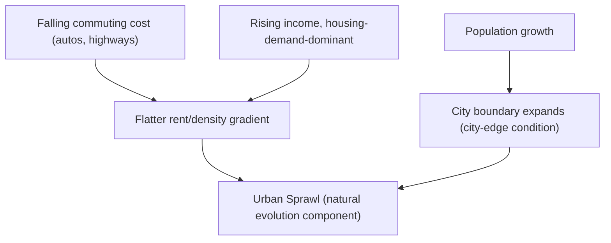
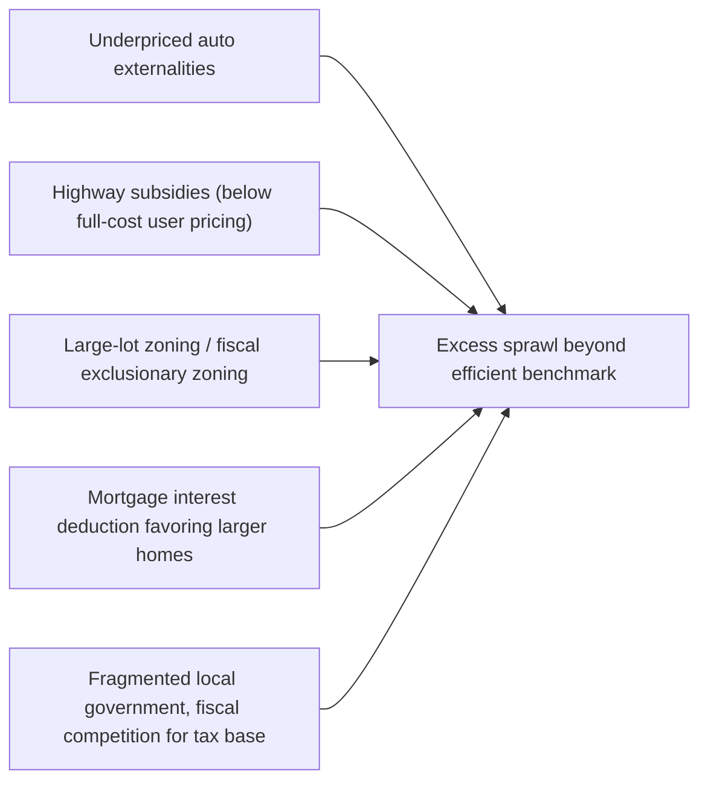

## Urban Sprawl: Causes and Consequences

### Overview

Urban sprawl refers to the outward, low-density expansion of metropolitan areas — characterized by declining central density, rising land consumption per capita, longer commutes, and often fragmented or leapfrog development patterns at the urban fringe. Within urban and regional economics, sprawl is best understood not as an unambiguous pathology but as the predictable equilibrium outcome of the Alonso-Muth-Mills (AMM) model's comparative statics under falling commuting costs and rising incomes, combined with a set of additional causes — infrastructure subsidies, zoning, and fiscal fragmentation — that may push land consumption beyond what an efficient market outcome would produce. This item synthesizes the causes (both efficient market-driven and distortion-driven), consequences, and measurement of sprawl.

### Defining and Measuring Sprawl

**Key Points**

- **No single agreed definition**: sprawl is measured via multiple, sometimes only loosely correlated indicators — low gross population density, low density gradient steepness (flat $\gamma$, see "Land rent and population density gradients"), leapfrog/discontinuous development patterns, low land-use mixing (segregated single-use zoning), and poor street connectivity.
- **Common composite indices**: the Smart Growth America/Ewing-Hamidi sprawl index and similar constructs combine density, land-use mix, centeredness (degree of polycentric concentration), and street accessibility into a single metropolitan-level sprawl score, enabling cross-metro comparisons.
- **Density gradient approach**: a flatter and/or lower-central-density negative exponential gradient (lower $D_0$, lower $\gamma$) is among the most theoretically grounded quantitative sprawl measures, since it connects directly to the AMM comparative statics framework.

### Causes of Sprawl: The "Natural Evolution" View

**Key Points**

- **Falling commuting costs**: as established under AMM comparative statics, declining transportation costs (streetcars historically, then mass automobile ownership, then highway construction) directly and mechanically flatten the equilibrium rent and density gradient and expand the city's spatial extent — this is the single most emphasized driver in the classical urban-economics literature (Mieszkowski & Mills, 1993, explicitly frame this as the primary "natural evolution" cause).
- **Rising incomes**: where the income elasticity of housing/land demand exceeds the income elasticity of commuting cost (see comparative statics discussion), rising real incomes over the twentieth century pushed households toward larger lots and longer commutes, contributing independently to gradient flattening.
- **Population growth**: absorbing a growing population within a fixed-technology transportation/land system mechanically requires outward expansion at the margin (the city-edge boundary condition), even absent any change in per-capita land consumption.
- Under this view, at least part of observed sprawl is simply the efficient market response to genuine underlying cost and preference changes, not evidence of market failure per se.

### Causes of Sprawl: The "Market Distortion" View

**Key Points**

- **Underpriced automobile externalities**: automobile use generates congestion, pollution, and (to some degree) infrastructure costs not fully borne by the driver; if the private cost of commuting by car understates its true social cost, households systematically over-consume distance/land relative to the social optimum, producing excess sprawl beyond the efficient AMM benchmark.
- **Highway and infrastructure subsidies**: federal, state, and local funding of highway construction (particularly the US Interstate Highway System from the 1950s onward) that is not fully paid for through user fees (gas taxes, tolls) proportional to use, effectively subsidizes the direct cost component $t$ in the household's commuting decision, artificially flattening the gradient beyond what full-cost-pricing would produce.
- **Property tax and local public finance distortions**: property taxes that do not reflect the marginal cost of extending infrastructure and services to new development can subsidize fringe development at the expense of existing built-up areas, particularly where new development's infrastructure costs are cross-subsidized by the broader tax base rather than charged via impact fees reflecting true marginal cost.
- **Large-lot zoning and minimum lot-size requirements**: suburban and exurban jurisdictions frequently impose zoning that mandates larger minimum lot sizes than the market would otherwise produce, partly to exclude lower-income residents (fiscal zoning) — this directly inflates land consumption per household beyond the AMM-predicted competitive outcome.
- **Mortgage interest deduction and other homeownership subsidies**: by lowering the effective cost of owner-occupied (typically larger, single-family, more peripherally located) housing relative to rental (typically denser, more centrally located) housing, tax policy can tilt household location and housing-type choices toward more land-intensive, peripheral outcomes.
- **Fragmented local government and fiscal competition**: in metropolitan areas with many independent municipalities, competition for tax base (particularly for commercial/retail development and higher-income residents) can incentivize each jurisdiction to encourage low-density, high-property-tax-revenue development at its own fringe, a pattern examined extensively in the local public finance and Tiebout-sorting literature.

### Distinguishing Efficient from Excess Sprawl

**Key Points**

- The central analytical challenge in the sprawl literature is separating the portion of observed low-density expansion attributable to genuine, welfare-improving cost and preference changes (efficient market outcome, consistent with the AMM comparative statics) from the portion attributable to distortions that cause land consumption to exceed the social optimum.
- **Brueckner (2000, 2001)** provides an influential formal framework identifying (at least) three specific market failures that generate excess (inefficient) sprawl relative to the competitive AMM benchmark: (1) failure to price open-space/agricultural land's amenity value into the private conversion decision, (2) failure to charge new development the full marginal cost of infrastructure provision, and (3) failure to price commuting-related traffic congestion externalities.
- **[Inference]** Quantifying what share of observed historical sprawl reflects efficient adjustment versus these specific distortions is empirically difficult, since it requires estimating counterfactual land consumption absent the distortions; existing studies provide suggestive evidence that distortions matter but do not converge on a single, precise decomposition, and estimates likely vary by metropolitan area and time period.

### Consequences of Sprawl: Economic and Fiscal

**Key Points**

- **Infrastructure cost**: low-density development generally requires more linear feet of roads, pipes, and wires per housing unit or resident than compact development, raising per-capita infrastructure provision and maintenance costs — a widely cited (though methodologically contested regarding magnitude) finding across cost-of-sprawl studies.
- **Public service delivery cost**: dispersed development can raise the per-capita cost of service delivery for functions with distance-sensitive costs (e.g., emergency response times, school busing, solid waste collection).
- **Vehicle miles traveled (VMT) and commuting cost**: sprawl is robustly associated with longer average commute distances and higher aggregate VMT, with attendant fuel consumption, time cost, and (per the market-distortion view) uninternalized congestion and pollution externalities.
- **Land conversion and open space loss**: sprawl directly converts agricultural and natural land to urban use, generating environmental costs (habitat loss, reduced carbon sequestration, stormwater management challenges) that are the focus of much of the environmental economics literature on land-use change.

### Consequences of Sprawl: Social and Equity

**Key Points**

- **Spatial mismatch**: sprawling low-density suburban employment growth, combined with persistent residential segregation and limited transit access, has been argued (Kain's original 1968 "spatial mismatch hypothesis" and a large subsequent literature) to disadvantage lower-income and minority urban-core residents who face longer, more costly commutes to suburban job growth, potentially contributing to urban unemployment disparities — though the magnitude and even the direction of causality in this relationship remains debated in the empirical literature, with some studies finding modest or context-dependent effects.
- **Public health**: an active empirical literature associates sprawling, auto-dependent built environments with lower rates of walking/physical activity and higher obesity prevalence, though as with much observational built-environment research, definitively separating causal built-environment effects from residential self-selection (health-conscious people choosing walkable neighborhoods) remains a persistent identification challenge.
- **Social capital and community**: some sociological and urban-planning literature (notably Putnam's broader work on social capital, though not sprawl-specific) has linked sprawling, low-density, automobile-dependent development to reduced casual social interaction and civic engagement, though this line of argument is less rigorously quantified in the economics literature specifically and should be treated as a more speculative/contested consequence relative to the infrastructure-cost and commuting findings above.

### Consequences of Sprawl: Potential Benefits

**Key Points**

- **Larger, more affordable housing**: sprawl provides larger lot sizes and (often) lower per-square-foot housing costs at the urban fringe, consistent with genuine household preferences for space, particularly for families, and consistent with the AMM prediction that housing-demand-dominant income effects produce larger suburban/exurban consumption.
- **Reduced central-city congestion and land-price pressure**: outward expansion, by absorbing population growth at the margin, can relieve some of the central-city land-price and congestion pressure that would otherwise result from accommodating the same population entirely within a fixed, denser footprint.
- **[Inference]** Whether the net welfare effect of a given increment of sprawl is positive or negative depends critically on whether it reflects efficient preference/cost-driven expansion or distortion-driven excess expansion, per the Brueckner framework — a blanket characterization of all sprawl as welfare-reducing is not supported by the theoretical framework, even though a meaningful share of observed sprawl is plausibly attributable to the specific distortions identified above.

### Policy Responses

**Key Points**

- **Urban growth boundaries (UGBs)**: directly restrict the conversion of peripheral land to urban use (raising the effective $R_A$ in the AMM framework), predicted (per the comparative statics discussed under that item) to raise city-wide rents/house prices and increase density, with empirical evidence (e.g., Portland, Oregon) generally consistent with this prediction, though the net welfare effect depends on whether the boundary is correcting for a genuine open-space externality or simply imposing an additional distortion.
- **Congestion pricing and full-cost road pricing**: directly addresses the underpriced-externality cause of excess sprawl by charging drivers closer to the marginal social cost of road use, theoretically the most targeted (Pigouvian) remedy for the specific distortion it addresses.
- **Impact fees and infrastructure cost internalization**: charging new peripheral development fees reflecting the true marginal cost of extending infrastructure directly addresses the infrastructure-subsidy cause of excess sprawl.
- **Zoning reform (upzoning, elimination of exclusionary minimum lot sizes)**: addresses the zoning-driven distortion by allowing denser development where market demand would otherwise support it, an approach increasingly emphasized in the contemporary "missing middle housing" and zoning-reform policy literature.
- **Transit-oriented development and infill incentives**: policies that subsidize or streamline denser, centrally located development aim to offset (rather than directly correct) some of the distortions favoring peripheral development, though this "second-best" approach (subsidizing the alternative rather than correcting the underlying distortion) can itself introduce new inefficiencies if not carefully designed.

### Summary: Sprawl Causes Mapped to Policy Remedies

| Cause | Type | Standard Policy Remedy |
| --- | --- | --- |
| Falling commuting cost, rising income | Efficient market response | Generally no correction warranted (unless externalities present) |
| Underpriced congestion/pollution externalities | Market distortion | Congestion pricing, carbon/fuel taxes |
| Infrastructure cost not charged to new development | Market distortion | Impact fees, full-cost infrastructure pricing |
| Exclusionary/large-lot zoning | Regulatory distortion | Zoning reform, upzoning |
| Mortgage interest deduction and homeownership subsidies | Fiscal/tax distortion | Tax policy reform (politically difficult) |
| Fiscal fragmentation and competition for tax base | Local public finance distortion | Regional tax-base sharing, metropolitan governance reform |

### Related Topics

- Alonso-Muth-Mills monocentric city model and comparative statics under falling commuting cost
- Land rent and population density gradients: measuring sprawl via gradient flattening
- Urban growth boundaries and land-use regulation: welfare and price effects
- Tiebout sorting and fiscal fragmentation across suburban jurisdictions
- Spatial mismatch hypothesis and labor market access for urban-core residents
- Congestion pricing and Pigouvian correction of transportation externalities
- Polycentric city models: suburban employment growth and edge cities
- Exclusionary zoning and housing affordability
- Cost-of-sprawl studies and infrastructure/public-service cost estimation