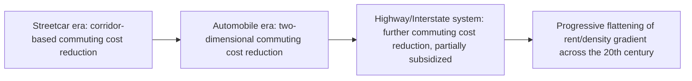

## Drivers of Suburbanization

### Overview

Suburbanization is the historical process by which population and, subsequently, employment relocated from central cities to surrounding lower-density suburban areas, transforming metropolitan spatial structure over the twentieth century in most developed economies (with the United States representing an especially pronounced case). While closely related to and partially overlapping with the urban sprawl and employment decentralization items in this chapter, this item focuses specifically on identifying and organizing the distinct causal drivers of the population-suburbanization process — transportation technology, income growth, housing preferences, racial and fiscal dynamics, and public policy — synthesizing both the "natural evolution" economic drivers and the more contested social/institutional drivers documented in the interdisciplinary suburbanization literature.

### Transportation Technology as the Primary Economic Driver

**Key Points**

- **Streetcar suburbs (late 19th–early 20th century)**: the first wave of suburbanization followed the introduction of horse-drawn and then electric streetcar lines, which reduced commuting cost/time along fixed radial corridors and allowed the first significant outward residential expansion beyond walking distance of the urban core — producing the characteristic star-shaped, corridor-following pattern of pre-automobile suburbs.
- **Mass automobile adoption (1920s onward, accelerating after WWII)**: the single most emphasized driver in the classical urban-economics literature (Mieszkowski & Mills, 1993). Unlike fixed-route streetcars, automobiles allowed commuting along any road, not just fixed corridors, converting the suburban expansion pattern from linear/radial to genuinely two-dimensional and dramatically lowering the effective commuting-cost parameter $t$ in the AMM framework.
- **Highway construction, especially the Interstate Highway System (US, beginning 1956)**: large-scale public investment in limited-access highways further reduced commuting costs and, because financing was substantially subsidized rather than fully user-fee-financed, arguably reduced the *private* cost of commuting below its full social cost — connecting this driver to the "market distortion" causes of excess sprawl discussed under that item.
- Formally, each of these transportation innovations operates through the same channel identified in the AMM comparative statics: a fall in $t$ flattens the bid-rent gradient, expands the equilibrium city radius, and (in an open-city setting) draws in additional population at each location's now-more-favorable rent-commuting combination.

### Income Growth and Housing Demand

**Key Points**

- Rising real household incomes across the twentieth century increased demand for housing space (larger lots, single-family detached homes) — where the income elasticity of housing/land demand exceeds the income elasticity of commuting cost (the housing-demand-dominant case from the AMM comparative statics), this directly favors suburban, larger-lot living over denser central-city alternatives.
- **Preference for single-family detached housing**: survey and revealed-preference evidence across much of the twentieth century in the US context generally documented a strong preference for single-family detached homes with private yards over multi-family/attached alternatives, a preference more easily satisfied at lower land cost in suburban locations than in expensive central cores.
- **Rise of consumer durables complementary to suburban living**: household adoption of automobiles, and later home appliances that reduced the value of proximity to central-city services and amenities, are commonly cited as complementary drivers reinforcing the shift toward more land-intensive, lower-density suburban household production.

### Fiscal and Tax Policy Drivers

**Key Points**

- **Mortgage interest deduction and federal homeownership subsidies**: US federal tax policy (and analogous policies in other countries) that favors owner-occupied housing — typically more prevalent and more land-intensive in suburban locations — over rental housing (more common and denser in central cities) tilts the relative after-tax cost of suburban versus central-city living in favor of suburbanization.
- **Federal Housing Administration (FHA) and Veterans Administration (VA) loan programs**: mid-twentieth-century US federal mortgage insurance and guarantee programs substantially reduced the cost of homeownership, disproportionately for new suburban construction (given underwriting standards and appraisal practices of the era that often favored new suburban development over existing, older central-city housing stock) — widely cited in the urban economic history literature as a significant institutional driver of postwar US suburbanization.
- **Local property tax and service-cost dynamics (Tiebout sorting)**: fragmented suburban municipal governance allows households to sort into jurisdictions matching their preferred local tax-service bundle (Tiebout, 1956), and this sorting mechanism itself can be a suburbanization driver where suburban jurisdictions offer more attractive tax-service combinations (e.g., lower taxes, dedicated school funding) than central-city governments facing different fiscal constraints and service demands.
- **Central-city fiscal stress feedback loops**: as population and tax base suburbanized, many central cities faced rising per-capita service costs (concentrated poverty, aging infrastructure) funded by a shrinking tax base, potentially triggering a self-reinforcing cycle in which rising central-city tax rates or declining service quality further incentivized out-migration — a pattern examined in the local public finance and urban fiscal distress literature.

### Racial Dynamics and Housing Discrimination

**Key Points**

- **Racial preferences and "white flight"**: a substantial body of urban history and urban economics literature documents that, particularly in the mid-twentieth-century United States, white household suburbanization was accelerated by racial preferences and discriminatory practices, including resistance to residential integration following the Great Migration and subsequent civil rights-era desegregation efforts — commonly termed "white flight" in this literature (Boustan, 2010, provides an influential quantitative treatment estimating the magnitude of this channel).
- **Redlining and discriminatory lending**: federal and private lending practices during the mid-twentieth century (including the historical practice of "redlining" by federal agencies and private lenders, denying or limiting mortgage credit in racially and ethnically mixed or minority urban neighborhoods) constrained investment in central-city housing stock while channeling mortgage credit disproportionately toward new suburban, often racially exclusive, developments — a well-documented institutional driver with long-lasting effects on the racial composition of central cities versus suburbs, and on intergenerational wealth accumulation disparities given housing's role as a primary wealth-building asset.
- **Restrictive covenants and exclusionary zoning**: private racially restrictive covenants (widely used before being ruled unenforceable by the US Supreme Court in *Shelley v. Kraemer*, 1948) and subsequent exclusionary zoning practices (minimum lot sizes, prohibition of multi-family housing) served related functions in shaping the racial and economic composition of suburban versus central-city populations.
- **[Inference]** Quantifying the precise relative contribution of racial dynamics versus the transportation-cost and income-driven "natural evolution" channels to aggregate twentieth-century US suburbanization is a genuinely contested empirical question across the urban history and urban economics literatures; most researchers in this area regard both channels as materially important, with their relative weight varying substantially by metropolitan area, time period, and the specific outcome being explained (e.g., aggregate suburbanization rates versus the specific racial composition of central cities versus suburbs).

### School Quality and Local Public Goods

**Key Points**

- **School quality sorting**: households with school-age children frequently cite local school quality as a primary driver of suburban relocation decisions, and this is supported by hedonic house-price studies finding substantial capitalization of school quality differences into local housing prices (Black, 1999, and a large subsequent literature) — consistent with a Tiebout-style sorting mechanism in which household mobility across jurisdictions is partly driven by matching to preferred local public-good (especially education) provision.
- **Central-city versus suburban public school funding disparities**: in fiscal systems where school funding depends substantially on local property tax base (again, most pronounced in the historical US context), central-city districts facing lower per-capita property wealth and higher concentrations of costly-to-educate student populations can face persistent school-quality disadvantages relative to wealthier suburban districts, reinforcing suburbanization incentives for households prioritizing education.

### Crime, Public Safety, and Central-City Disamenities

**Key Points**

- Rising central-city crime rates during specific historical periods (notably the US urban crime increase from the 1960s through the early 1990s) are commonly cited as an additional suburbanization driver, operating through the Rosen-Roback-style logic that crime functions as a local disamenity that households are willing to pay (via commuting cost and reduced access to central-city amenities) to avoid.
- **Fiscal-crime feedback**: to the extent that central-city fiscal stress (from tax-base erosion due to prior suburbanization) contributed to reduced public safety spending or effectiveness, this channel can interact with and reinforce the fiscal drivers discussed above, producing a potentially self-reinforcing cycle rather than fully independent causal channels.

### Diagram: Overview of Suburbanization Drivers

<svg xmlns="http://www.w3.org/2000/svg" viewBox="0 0 720 420" font-family="Helvetica, Arial, sans-serif">
<text x="360" y="26" text-anchor="middle" font-size="17" font-weight="bold" fill="#1a1a1a">Drivers of Suburbanization: A Taxonomy (svg_diagram)</text>
<rect x="30" y="60" width="200" height="150" rx="8" fill="#e8f0fe" stroke="#1a56db" stroke-width="2" />
<text x="130" y="84" text-anchor="middle" font-size="13" font-weight="bold" fill="#1a56db">Transport &amp; Cost</text>
<text x="45" y="108" font-size="11" fill="#1a1a1a">Streetcars, automobiles,</text>
<text x="45" y="124" font-size="11" fill="#1a1a1a">highways lowering</text>
<text x="45" y="140" font-size="11" fill="#1a1a1a">commuting cost t</text>
<text x="45" y="168" font-size="11" fill="#1a1a1a">Rising income raising</text>
<text x="45" y="184" font-size="11" fill="#1a1a1a">housing/land demand</text>
<rect x="260" y="60" width="200" height="150" rx="8" fill="#eafaf1" stroke="#0d9c5c" stroke-width="2" />
<text x="360" y="84" text-anchor="middle" font-size="13" font-weight="bold" fill="#0d9c5c">Fiscal &amp; Policy</text>
<text x="275" y="108" font-size="11" fill="#1a1a1a">Mortgage interest deduction</text>
<text x="275" y="124" font-size="11" fill="#1a1a1a">FHA/VA loan programs</text>
<text x="275" y="140" font-size="11" fill="#1a1a1a">Highway subsidies</text>
<text x="275" y="168" font-size="11" fill="#1a1a1a">Tiebout local tax-service</text>
<text x="275" y="184" font-size="11" fill="#1a1a1a">sorting across jurisdictions</text>
<rect x="490" y="60" width="200" height="150" rx="8" fill="#fdeaea" stroke="#c81e1e" stroke-width="2" />
<text x="590" y="84" text-anchor="middle" font-size="13" font-weight="bold" fill="#c81e1e">Social &amp; Institutional</text>
<text x="505" y="108" font-size="11" fill="#1a1a1a">Racial preferences,</text>
<text x="505" y="124" font-size="11" fill="#1a1a1a">redlining, restrictive covenants</text>
<text x="505" y="152" font-size="11" fill="#1a1a1a">School quality sorting</text>
<text x="505" y="180" font-size="11" fill="#1a1a1a">Crime/public safety disamenities</text>
<line x1="130" y1="210" x2="300" y2="270" stroke="#666666" stroke-width="1.5" />
<line x1="360" y1="210" x2="330" y2="270" stroke="#666666" stroke-width="1.5" />
<line x1="590" y1="210" x2="380" y2="270" stroke="#666666" stroke-width="1.5" />
<rect x="230" y="270" width="260" height="80" rx="8" fill="#fff3cd" stroke="#a8790d" stroke-width="2" />
<text x="360" y="300" text-anchor="middle" font-size="13" font-weight="bold" fill="#a8790d">Observed 20th-Century</text>
<text x="360" y="320" text-anchor="middle" font-size="13" font-weight="bold" fill="#a8790d">Suburbanization Pattern</text>
<text x="360" y="340" text-anchor="middle" font-size="10.5" fill="#555555">(interacting, reinforcing channels)</text>
</svg>

### Suburbanization in International Comparative Context

**Key Points**

- The magnitude and specific institutional drivers of suburbanization vary considerably across countries: the United States is frequently cited as an especially pronounced case, plausibly reflecting the combination of relatively early and extensive automobile adoption, distinctive federal housing finance institutions (FHA/VA), and racially specific historical dynamics not present in the same form elsewhere.
- Many European and East Asian cities exhibit comparatively less pronounced suburbanization and retain steeper density gradients, plausibly reflecting differences in transportation infrastructure investment patterns (greater relative investment in rail/transit versus highways), land-use regulation traditions (generally more restrictive growth-boundary-style policies), and different housing finance and tax-policy structures.
- **[Inference]** Cross-country comparative work in this area generally attributes observed differences to some combination of these institutional and policy factors rather than to a single dominant cause, but precise decomposition of relative contributions across countries remains an active area of research rather than a settled consensus.

### Related Topics

- Alonso-Muth-Mills monocentric city model and comparative statics under falling commuting cost
- Urban sprawl: causes and consequences (closely related, partially overlapping driver set)
- Edge cities and employment decentralization
- Tiebout sorting and local public finance across fragmented suburban jurisdictions
- Racial segregation, redlining, and housing wealth disparities in urban economic history
- School quality capitalization into housing prices (hedonic estimation)
- Spatial mismatch hypothesis and central-city labor market access
- Urban fiscal distress and central-city tax-base erosion