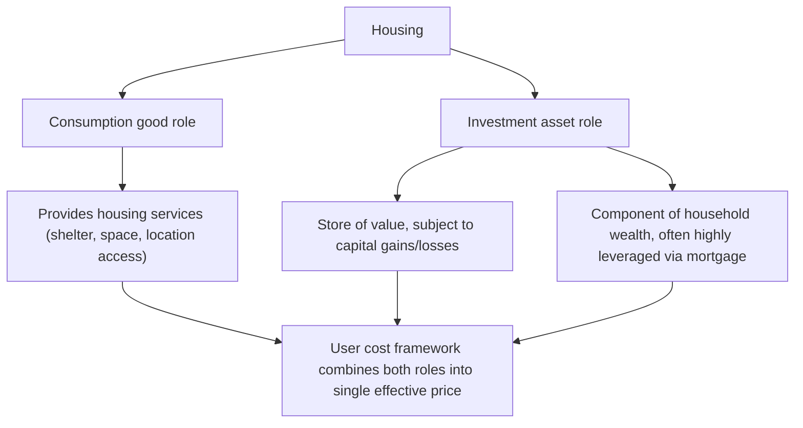

## Characteristics of Housing as an Economic Good

### Overview

Housing possesses a distinctive combination of economic properties that distinguish it from most other goods studied in introductory microeconomics, and these properties jointly explain why housing markets require specialized analytical tools (hedonic pricing, search models, dynamic filtering models) rather than the simple supply-and-demand apparatus adequate for many other markets. Understanding these characteristics is foundational to the housing economics material in this chapter, including hedonic pricing, housing supply elasticity, and filtering models covered elsewhere.

### Durability

**Key Points**

- Housing is an exceptionally long-lived capital good: residential structures commonly remain in use for 50 to 100+ years, far exceeding the useful life of most consumer goods and even most other capital goods.
- **Consequence for supply dynamics**: because housing depreciates slowly, the existing housing stock at any point in time vastly exceeds new construction in any given period (new construction is typically only 1–2% of the existing stock annually in mature markets), meaning **the housing stock adjusts slowly** to demand shocks — a large positive demand shock is initially absorbed almost entirely through price increases rather than quantity increases, since new supply takes years to materialize and even then adds only marginally to the total stock.
- **Consequence for market dynamics**: durability means housing markets exhibit strong path dependence — today's stock reflects decades of past construction decisions made under different demand, technology, and regulatory conditions, and this stock cannot be quickly reconfigured, a key driver of the **filtering** process (discussed under related topics) whereby housing units transition between quality/income tiers over their lifecycle rather than being demolished and rebuilt each period.
- **Depreciation and maintenance choice**: because housing is durable but not permanent, owners face an ongoing maintenance/reinvestment decision, and the rate of physical depreciation is partly endogenous (a function of maintenance investment) rather than a fixed physical parameter, complicating simple capital-stock modeling of the housing sector.

### Spatial Fixity (Immobility)

**Key Points**

- Unlike most goods, a housing unit cannot be relocated; its value is inseparably tied to its specific location, embedding it within the urban land-use framework (bid-rent, accessibility, neighborhood amenities) covered throughout this chapter's monocentric- and polycentric-city material.
- **Consequence**: housing markets are inherently **local** rather than national or global — a housing shortage in one metropolitan area cannot be relieved by "importing" housing units from another region the way a shortage of a portable manufactured good could be relieved by shipping, meaning housing markets in different cities can exhibit very different price dynamics even within the same national economy.
- **Consequence for land rent capitalization**: because location cannot be separated from the physical structure, housing prices capitalize not just the value of the structure itself but the value of its location — access to employment (per the AMM bid-rent framework), local public goods (school quality, safety), and neighborhood amenities — making housing price decomposition (land vs. structure vs. location-specific amenity value) a central and technically challenging task in applied housing economics, typically addressed via hedonic pricing methods.

### Heterogeneity

**Key Points**

- No two housing units are perfectly identical — even nominally similar units differ in exact location, orientation, condition, specific finishes, view, and myriad other attributes, making housing a fundamentally **heterogeneous, multi-attribute good** rather than a homogeneous commodity.
- **Consequence for pricing**: because housing units are not interchangeable, there is no single "the price of housing" in the way there is a single price for a homogeneous commodity like wheat or crude oil at a given time and place; instead, housing markets are best understood as markets for **bundles of characteristics**, formalized in Rosen's (1974) hedonic pricing framework, in which the observed price of a housing unit is decomposed as an implicit sum of the market-clearing prices of its constituent attributes (square footage, bedrooms, location, school quality, and so on).
- **Consequence for market analysis**: heterogeneity necessitates the construction of housing **price indices** (repeat-sales indices like Case-Shiller, or hedonic indices) that attempt to track price changes for a constant-quality unit over time, since raw average or median transaction prices can shift simply due to compositional changes in what types of units are selling in a given period, independent of any change in the price of any specific unit.

### High Transaction Costs

**Key Points**

- Buying or selling housing involves substantial transaction costs relative to the good's value: real estate broker commissions (historically often 5–6% of sale price in the US, though under increasing competitive and regulatory pressure in recent years), title search and insurance, legal fees, mortgage origination costs, and transfer taxes collectively can amount to a significant fraction of a property's value.
- **Consequence for market liquidity**: high transaction costs discourage frequent trading, meaning housing markets exhibit far lower turnover rates than markets for financial assets or most consumer goods, and households often remain in a given unit longer than their preferences alone would dictate simply to avoid re-incurring transaction costs — a phenomenon connected to "housing lock-in" effects on labor mobility discussed in the open-city/closed-city and regional-adjustment literature.
- **Consequence for price adjustment**: high transaction costs, combined with the search frictions discussed below, contribute to housing markets exhibiting well-documented **price stickiness**, particularly downward stickiness (sellers are often reluctant to accept below-expectation offers, generating extended time-on-market rather than immediate price adjustment when demand falls), a pattern extensively documented in the search-theoretic housing literature (Genesove & Mayer, 2001, on loss aversion and seller behavior).

### Search Frictions and Imperfect Information

**Key Points**

- Because housing units are heterogeneous and spatially fixed, and because each unit is typically offered by a single seller (rather than trading in a centralized, liquid market with many identical units and continuous price discovery), buyers and sellers face substantial **search costs** in finding a suitable match — this motivates the application of search-and-matching theory (originally developed for labor markets) to housing markets.
- **Consequence**: housing markets clear through a search process involving time-on-market, rather than instantaneous price-based market clearing, and this generates predictable empirical patterns — e.g., markets with more sellers relative to buyers ("buyer's markets") are characterized by both lower prices *and* longer time-on-market, rather than prices alone adjusting to clear the market instantaneously as in a frictionless Walrasian auction model.
- **Information asymmetry**: sellers typically possess private information about a property's condition and quality that buyers cannot fully observe prior to purchase, motivating institutions such as home inspections, seller disclosure requirements, and, more broadly, contributing to adverse-selection-type dynamics in some segments of the housing market (analogous to Akerlof's "market for lemons" framework, though the housing-specific literature on this is less extensively developed than in other applied information-economics contexts).

### Dual Nature: Consumption Good and Investment Asset

**Key Points**

- Housing is unusual in serving simultaneously as a **consumption good** (providing shelter and housing services directly consumed by the occupant) and, for owner-occupiers, as an **investment asset** (a store of value and a component of household wealth subject to capital gains or losses).
- **Consequence for demand modeling**: this dual role means housing demand cannot be fully modeled using pure consumption-good demand theory alone — households' housing decisions are also influenced by expectations of future price appreciation, mortgage financing terms and leverage, and portfolio-diversification considerations (housing is typically a large, undiversified, geographically concentrated component of household wealth for owner-occupiers), introducing asset-pricing and behavioral-finance considerations into what might otherwise be treated as a straightforward consumption decision.
- **Owner-occupied vs. rental tenure choice**: because of this dual nature, households face an explicit tenure choice (own versus rent) that itself has been extensively studied — the user-cost-of-capital framework (Poterba, 1984) formalizes owner-occupied housing's "imputed rent" as the relevant consumption-good price, while separately incorporating the investment-return and tax-treatment dimensions of ownership, allowing a rent-versus-own cost comparison that accounts for both roles simultaneously.

$$\text{User Cost} = P_H \left[ (1-\tau_y) i + \tau_p - \pi^e + \delta \right]$$

where $P_H$ is house price, $i$ is the mortgage interest rate, $\tau_y$ is the marginal income tax rate (relevant if mortgage interest is tax-deductible), $\tau_p$ is the property tax rate, $\pi^e$ is expected house price appreciation, and $\delta$ is the depreciation/maintenance rate — this expression makes explicit how tax policy, financing costs, and expected capital gains jointly determine the effective "price" of owner-occupied housing consumption.

### High Value Relative to Income (Indivisibility and Leverage)

**Key Points**

- Housing is typically the single largest purchase most households ever make, with a price often several multiples of annual household income — this **indivisibility** (housing cannot easily be purchased in small increments matching current income/savings) necessitates the extensive use of debt financing (mortgages) that is far less central to the purchase of most other consumer goods.
- **Consequence**: housing markets are tightly linked to credit market conditions — mortgage interest rates, lending standards, and down-payment requirements directly affect effective housing demand, making housing markets unusually sensitive to monetary policy and financial-sector regulation relative to most other goods markets, and creating a direct channel through which credit-market disruptions (as in the 2007–2009 financial crisis) can transmit into housing-market and broader macroeconomic instability.
- **Leverage amplification**: because housing purchases are typically highly leveraged (a large loan-to-value ratio is standard), percentage changes in house prices translate into much larger percentage changes in homeowner equity, amplifying both wealth gains during price appreciation and financial distress (negative equity) during price declines — a mechanism central to understanding housing's disproportionate role in macroeconomic and financial-stability analysis relative to its share of aggregate consumption.

### Summary Table: Housing's Distinguishing Characteristics and Their Analytical Consequences

| Characteristic | Key Implication | Related Analytical Tool |
| --- | --- | --- |
| Durability | Slow stock adjustment; long-run price-quantity dynamics dominated by existing stock | Stock-flow housing supply models; filtering models |
| Spatial fixity | Local (not national) markets; location value capitalized into price | Bid-rent/AMM framework; hedonic location premiums |
| Heterogeneity | No single "price of housing"; bundle-of-characteristics pricing | Hedonic pricing (Rosen 1974); repeat-sales indices |
| High transaction costs | Low turnover; price stickiness, especially downward | Search-and-matching models; loss-aversion studies |
| Search frictions | Time-on-market as an equilibrating margin, not just price | Search-theoretic housing models |
| Dual consumption/investment role | Demand depends on expected appreciation and financing terms, not just current consumption value | User-cost-of-capital framework (Poterba) |
| High value relative to income | Heavy reliance on debt financing; leverage amplification | Mortgage/credit market linkages; financial-stability analysis |

### Implications for Housing Market Policy Analysis

**Key Points**

- Because housing combines durability, spatial fixity, and slow supply adjustment, short-run demand shocks (e.g., a local economic boom, an interest-rate change) are predicted to show up disproportionately as **price** changes in the short run and only gradually as **quantity** (new construction) changes over the medium-to-long run — an important consideration in interpreting housing-market data and in designing policy responses (e.g., zoning reform aimed at improving long-run supply elasticity, discussed further under housing supply elasticity topics in this chapter).
- The dual consumption/investment nature of housing means that policies affecting expected future price appreciation (including housing-market regulation, tax policy, or even public statements about market conditions) can have demand-side effects that a pure consumption-good framework would not predict, complicating the policy-analysis toolkit relative to markets for goods without this dual role.
- **[Inference]** The relative empirical importance of each of these characteristics in explaining specific housing-market phenomena (e.g., how much of observed price volatility reflects durability/supply-inelasticity versus the investment-asset/expectations channel) remains an active area of empirical housing-economics and macro-finance research, and the answer likely varies across markets and time periods rather than admitting a single general answer.

### Related Topics

- Hedonic pricing models and the decomposition of housing's bundle-of-characteristics value
- Housing supply elasticity and the stock-flow adjustment process
- Filtering models and the dynamics of the existing housing stock over time
- User cost of capital and the rent-versus-own tenure choice
- Search-and-matching theory applied to housing markets
- Housing finance, mortgage markets, and the credit channel of housing demand
- Loss aversion and price stickiness in residential real estate (Genesove & Mayer)
- Housing wealth effects and household balance-sheet leverage