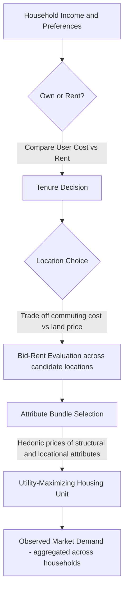

## Housing Demand and Household Choice

### Overview

Housing demand and household choice theory examines how households allocate income between housing and other goods, how they select among housing units differentiated by location, structure, and neighborhood attributes, and how these decisions aggregate into observed market demand. The topic sits at the intersection of consumer theory, spatial economics, and hedonic price theory, since housing is simultaneously a consumption good, an investment asset, and a spatially fixed bundle of attributes.

### The Housing Good as a Bundle of Attributes

**Key Points**

- Housing is not a homogeneous good; each unit represents a bundle of structural characteristics (square footage, bedrooms, age, quality), locational characteristics (accessibility, neighborhood amenities), and public-good characteristics (school quality, local tax rates, crime levels)
- Because housing is fixed in location, consuming housing simultaneously means consuming the surrounding bundle of locational and public attributes — this is the foundation of hedonic and Tiebout-style models
- Households cannot purchase attributes separately; they must purchase a whole unit, which creates lumpiness and indivisibility in housing choice not present in typical consumer goods

A hedonic representation treats the price of a housing unit as a function of its attribute vector:

$$P_h = P(S_1, S_2, \ldots, S_n, L_1, L_2, \ldots, L_m)$$

where $S_i$ are structural attributes and $L_j$ are locational/neighborhood attributes. The implicit (marginal) price of attribute $k$ is:

$$p_k = \frac{\partial P_h}{\partial S_k}$$

This marginal implicit price is the basis of hedonic price regressions used to estimate household willingness to pay for individual attributes such as an additional bedroom or proximity to a park.

### Standard Utility-Maximization Framework

**Key Points**

- The household is modeled as maximizing utility over housing services $h$ and a composite good $x$ (all other consumption), subject to a budget constraint
- Housing services $h$ is often treated as a continuous flow of "housing services" rather than the discrete physical unit, allowing standard consumer theory tools to apply
- The price of a unit of housing services is $p_h$ (rental price per unit of housing service), and the price of the composite good is normalized to 1

The household's problem:

$$\max_{h, x} \; U(h, x) \quad \text{subject to} \quad p_h h + x = Y$$

where $Y$ is household income. The first-order condition yields the familiar tangency:

$$\frac{U_h}{U_x} = p_h$$

Solving yields Marshallian demand functions:

$$h^* = h(p_h, Y) \qquad x^* = x(p_h, Y)$$

**Example**

If $U(h, x) = h^{\alpha} x^{1-\alpha}$ (Cobb-Douglas), demand for housing services is:

$$h^* = \frac{\alpha Y}{p_h}$$

This implies a constant budget share $\alpha$ spent on housing regardless of income or price — a simplification widely used in urban models (e.g., Alonso-Muth-Mills) despite being empirically imperfect, since housing budget shares tend to fall somewhat as income rises (see Income Elasticity below).

### Income and Price Elasticities of Housing Demand

**Key Points**

- Income elasticity of housing demand is empirically estimated to be positive but with mixed evidence on whether housing is a luxury good (elasticity > 1) or a necessity (elasticity < 1)
- Permanent income elasticity estimates in the literature typically range from about 0.5 to 0.9, generally below 1, suggesting housing behaves more like a necessity when measured against long-run income [Unverified — estimates vary substantially by country, dataset, and whether owner-occupied or rental housing is examined]
- Current (transitory) income elasticity tends to be measured lower than permanent income elasticity because housing consumption adjusts slowly and is based on expected long-run income (permanent income hypothesis applied to housing)
- Price elasticity of housing demand is typically estimated to be negative and inelastic, commonly cited in the range of -0.3 to -0.7 [Unverified — highly sensitive to model specification, geography, and time period]

Formally, income elasticity of demand:

$$\varepsilon_{h,Y} = \frac{\partial h}{\partial Y} \cdot \frac{Y}{h}$$

Own-price elasticity:

$$\varepsilon_{h,p_h} = \frac{\partial h}{\partial p_h} \cdot \frac{p_h}{h}$$

**Example**

If a household's income rises 10% and housing consumption (measured in value or square footage) rises 6%, the estimated income elasticity is 0.6 — consistent with housing being a necessity in the standard sense, even though housing is often colloquially described as a status/luxury good in wealthy household budgets.

### User Cost of Housing (Owner-Occupied Case)

**Key Points**

- For owner-occupiers, the relevant "price" is not the purchase price but the annualized user cost of capital — the implicit rental-equivalent cost of owning
- The user cost framework (Poterba, 1984) converts the asset price of housing into a flow price comparable to rent, enabling the same utility-maximization framework to apply to owners and renters alike

The user cost of housing capital is:

$$UC = P_H \left[ (1-\tau)(i + \tau_p) + m - \pi^e \right]$$

Where:

- $P_H$ = house price
- $i$ = mortgage interest rate
- $\tau$ = marginal income tax rate (relevant where mortgage interest is deductible)
- $\tau_p$ = property tax rate
- $m$ = maintenance/depreciation rate
- $\pi^e$ = expected house price appreciation

**Key Points**

- A rise in expected appreciation $\pi^e$ lowers user cost, increasing quantity of housing demanded — this is the mechanism by which speculative price expectations amplify housing cycles
- Mortgage interest deductibility (where applicable) lowers user cost for higher-tax-bracket households, a channel studied extensively in tax-incidence literature on homeownership subsidies
- [Inference] Because user cost embeds expected appreciation, periods of rapidly rising expected prices can generate self-reinforcing demand increases — a mechanism frequently invoked to explain housing bubbles, though the magnitude of this effect is debated empirically

### Tenure Choice: Own vs. Rent

**Key Points**

- Tenure choice models typically frame the own-vs-rent decision as a comparison of user cost of owning against the market rental rate, combined with household-specific factors: expected length of stay, income volatility, credit access, and preferences for control/customization
- Longer expected tenure favors ownership because transaction costs (closing costs, realtor fees, moving costs) are amortized over more years
- Credit-constrained households may be rationed out of ownership even when it is utility-maximizing, due to down-payment and underwriting requirements — a key friction studied in housing finance literature

A simplified reduced-form ownership decision compares:

$$\text{Own if: } UC_{own} \times (1 - \text{amenity/control premium}) < p_h^{rent}$$

**Example**

A household with high job mobility (expects to relocate in 2 years) faces high effective per-year transaction costs of ownership, making renting the rational choice even if annual user cost of owning is nominally lower than rent — illustrating why tenure choice cannot be reduced to comparing annual costs alone.

### Location Choice and the Bid-Rent Framework

**Key Points**

- Household housing choice is jointly a locational choice: households trade off housing costs, commuting costs, and access to amenities/employment
- The bid-rent function describes the maximum rent a household is willing to pay for land/housing at distance $u$ from the employment center (CBD), given a fixed utility level
- In the monocentric city model (Alonso-Muth-Mills), equilibrium bid-rent falls with distance from the CBD as households substitute cheaper land for higher commuting costs while holding utility constant

The bid-rent function is derived from:

$$U(x, h, u) = \bar{U} \quad \text{subject to} \quad Y - t(u) = p_h(u) h + x$$

where $t(u)$ is commuting cost as a function of distance $u$. Differentiating the equilibrium condition yields the bid-rent gradient:

$$\frac{d p_h(u)}{du} = -\frac{t'(u)}{h(u)}$$

**Key Points**

- Steeper bid-rent gradients occur when commuting costs are high relative to housing consumption, or when households have low elasticity of substitution between housing and the composite good
- Higher-income households in the standard monocentric model may locate farther from the CBD if their income elasticity of housing demand exceeds their marginal cost of commuting time (this underlies the classic explanation for suburbanization of higher-income households in the mid-20th century US context) [Inference — this prediction depends on assumptions about the relative income elasticity of commuting cost/value of time versus housing demand, and does not hold universally across cities or eras]

### Diagram: Bid-Rent Gradients by Income Group (svg_diagram)

<ns0:svg xmlns:ns0="[http://www.w3.org/2000/svg" viewBox="0 0 640 400">](http://www.w3.org/2000/svg%22%3E)

<ns0:text x="320" y="24" text-anchor="middle" font-size="16" font-weight="bold">Bid-Rent Gradients by Income Group (svg_diagram)</ns0:text>

<ns0:line x1="60" y1="350" x2="600" y2="350" stroke="black" stroke-width="2" />

<ns0:line x1="60" y1="350" x2="60" y2="50" stroke="black" stroke-width="2" />

<ns0:text x="330" y="380" text-anchor="middle" font-size="13">Distance from CBD (u)</ns0:text>

<ns0:text x="25" y="200" text-anchor="middle" font-size="13" transform="rotate(-90 25 200)">Bid Rent (p_h)</ns0:text>

<ns0:path d="M 80 70 Q 200 120 560 330" stroke="#1f77b4" stroke-width="3" fill="none" />

<ns0:text x="90" y="65" font-size="12" fill="#1f77b4">Low-income household (steep gradient)</ns0:text>

<ns0:path d="M 80 150 Q 250 200 560 310" stroke="#d62728" stroke-width="3" fill="none" />

<ns0:text x="90" y="145" font-size="12" fill="#d62728">High-income household (flatter gradient)</ns0:text>

<ns0:line x1="60" y1="60" x2="60" y2="350" stroke="#888" stroke-dasharray="4" />

<ns0:text x="45" y="365" font-size="11">CBD</ns0:text>

</ns0:svg>

### Household Heterogeneity and Sorting

**Key Points**

- The Tiebout (1956) model extends household choice to the sorting of heterogeneous households across jurisdictions based on preferences for local public goods and tax rates, assuming mobility and many jurisdictions ("voting with feet")
- Empirical housing choice models often incorporate discrete choice frameworks (e.g., multinomial or nested logit) since households choose among a finite set of differentiated neighborhoods/units rather than continuous quantities
- Sorting models predict capitalization of local public goods (school quality, low crime, tax rates) into housing prices — a testable and widely confirmed empirical implication used in hedonic valuation of public goods

A discrete-choice random utility model of neighborhood/unit choice:

$$U_{ij} = V(S_j, L_j, p_j; Y_i, Z_i) + \epsilon_{ij}$$

where household $i$ chooses unit/neighborhood $j$ maximizing $U_{ij}$, $Z_i$ are household characteristics, and $\epsilon_{ij}$ is an idiosyncratic preference shock (commonly assumed i.i.d. Type I extreme value in logit specifications).

### Household Choice Decision Flow (Mermaid)

### Market-Level Aggregation and Filtering

**Key Points**

- Aggregate housing demand at a given price/location is the sum (or integral) of individual household demands, weighted by the population distribution of income, preferences, and household size
- The filtering model of housing markets posits that as units age and depreciate, they filter down to lower-income households, meaning household choice is partly a function of the existing quality-differentiated housing stock rather than new construction alone
- Short-run housing supply is highly inelastic (due to construction lags, land-use regulation, and fixed stock), so short-run demand shifts are absorbed primarily through price changes rather than quantity changes, while long-run adjustment occurs through new construction and filtering

### Empirical Estimation Approaches

**Key Points**

- Hedonic regression: regresses observed housing prices/rents on attribute vectors to recover implicit prices; subject to omitted variable bias if unobserved attributes (e.g., unmeasured neighborhood quality) are correlated with included regressors
- Discrete choice/random utility models: used when housing units are treated as differentiated discrete alternatives rather than continuous quantities; allows estimation of willingness-to-pay for neighborhood and structural attributes
- Repeat-sales models: control for time-invariant unobserved unit quality by tracking price changes for the same unit sold multiple times, widely used in house price index construction (e.g., Case-Shiller methodology)
- Instrumental variable strategies are commonly used to address endogeneity between housing price and quantity demanded, since both are jointly determined in equilibrium

**Example**

A hedonic regression of the form:

$$\ln(P_h) = \beta_0 + \beta_1 \text{SqFt} + \beta_2 \text{Bedrooms} + \beta_3 \text{SchoolRating} + \beta_4 \text{DistanceToCBD} + \epsilon$$

yields $\beta_3$ as the semi-elasticity of price with respect to school rating, interpretable as household willingness to pay for school quality, holding other attributes constant — a standard technique in local public finance and education economics research.

### Common Extensions and Critiques

**Key Points**

- Life-cycle models incorporate housing as a durable asset held over a household's lifetime, integrating tenure choice with saving, borrowing constraints, and bequest motives
- Search and matching frictions (unlike the frictionless Walrasian assumption in basic models) explain observed vacancy rates, time-on-market, and price dispersion for seemingly similar units
- Behavioral extensions incorporate loss aversion (reluctance to sell at a nominal loss, the "disposition effect" in housing) and reference-dependent preferences, which standard neoclassical models do not predict [Unverified — magnitude and universality of behavioral effects vary across studies and markets]
- Housing demand models increasingly incorporate climate risk (flood, wildfire) as a negative locational attribute affecting willingness to pay, an active and evolving area of hedonic research [Unverified — this is a rapidly developing empirical literature and estimates of capitalization rates vary by region and by the salience of recent disaster events]

### Conclusion

Housing demand and household choice theory extends standard consumer theory to account for housing's unique properties: spatial fixity, attribute bundling, tenure duality, and durability as both consumption good and asset. The Alonso-Muth-Mills monocentric framework, hedonic price theory, user cost models, and discrete choice/sorting models together form the core toolkit for understanding how households select housing quantity, tenure, and location, and how these individual decisions aggregate into observable market prices and spatial patterns.

**Related Topics**

- Alonso-Muth-Mills monocentric city model and urban spatial structure
- Hedonic price theory and implicit market valuation
- Housing supply elasticity and land-use regulation
- Filtering models and housing quality dynamics
- Tiebout sorting and local public finance
- Mortgage finance, credit constraints, and homeownership rates
- House price indices (repeat-sales, hedonic, and median-price methods)
- Housing market search and matching frictions
- Capitalization of local amenities and disamenities (schools, crime, environmental risk)