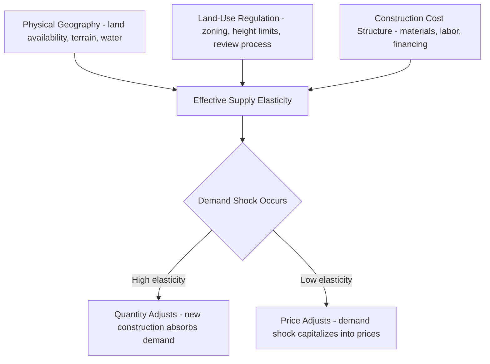

## Housing Supply, Construction Costs, and Elasticity

### Overview

Housing supply theory examines how the stock of housing units responds to price signals, encompassing new construction decisions, redevelopment/filtering of the existing stock, and the regulatory and physical constraints that determine how elastically supply responds to demand shocks. Unlike most goods, housing supply operates on two distinct margins — the flow of new construction and the much larger, slowly depreciating existing stock — and is subject to land-use regulation that varies dramatically across jurisdictions, making elasticity a central empirical and policy variable in urban economics.

### The Developer's Production Problem

**Key Points**

- Housing is produced by combining land and non-land capital (structure) according to a production function; developers choose the capital-to-land ratio to minimize cost for a given amount of "housing service" output
- The central insight of the monocentric/production-based supply model (Muth, 1969) is that developers substitute capital for land as land becomes more expensive — building taller/denser structures on expensive land near the CBD and building lower-density structures on cheap peripheral land
- This capital-land substitution is what generates the density gradient observed in cities: building height and floor-area ratio fall with distance from the center

The developer's production function for housing services $H$:

$$H = F(K, L)$$

where $K$ is non-land capital (structure) and $L$ is land. Cost minimization subject to a target output level yields the standard tangency condition:

$$\frac{MP_K}{MP_L} = \frac{r}{p_L}$$

where $r$ is the cost of capital and $p_L$ is the price of land. As $p_L$ rises (e.g., closer to the CBD), the optimal $K/L$ ratio rises — more capital-intensive (taller) construction.

**Example**

A developer builds a 40-story tower on a small downtown parcel where land costs $500 per square foot, but builds a single-story strip retail center on a suburban parcel where land costs $20 per square foot — both decisions reflect the same cost-minimizing capital-land substitution logic, just at different points on the land-price gradient.

### Construction Cost Structure

**Key Points**

- Construction costs are typically decomposed into hard costs (materials, labor, site work) and soft costs (permitting, architecture/engineering fees, financing costs, developer profit margin, impact fees)
- Hard costs generally rise less than proportionally with density up to a point, then rise sharply due to structural requirements (elevators, steel/concrete frame vs. wood frame, fire code compliance) — this creates a convex cost function in height/density beyond certain thresholds
- Construction cost inflation (materials, skilled labor availability) directly shifts the marginal cost curve for new supply and is a key real-world driver of observed housing starts volatility, separate from land-use regulation

A simplified marginal cost function for housing supply:

$$MC(q) = c_0 + c_1 q + c_2 q^2 \quad \text{(convex beyond structural thresholds)}$$

where $q$ represents density (e.g., floor-area ratio or units per acre). The convexity reflects step-changes in construction technology required at different height thresholds (e.g., wood-frame limits, high-rise concrete/steel requirements).

### Long-Run vs. Short-Run Supply

**Key Points**

- Short-run housing supply is highly inelastic because the existing stock is fixed and new construction takes time (permitting, financing, building lag typically spanning one to several years depending on project type and jurisdiction)
- Long-run supply is more elastic because developers can respond to sustained price increases with new construction, though the degree of long-run elasticity varies enormously across cities depending on land availability and regulatory constraints
- The distinction between short-run and long-run elasticity is central to understanding why demand shocks (e.g., a local income or population shock) translate largely into price increases in the short run but into some combination of price and quantity adjustment in the long run

**Example**

A metro area experiencing a sudden tech-sector employment boom sees rents rise sharply in year one (supply essentially fixed), while over the following 5-10 years new multifamily construction responds if land-use rules permit it — but in a highly regulated market (e.g., coastal California-type constraints), the long-run supply response remains muted and price increases persist rather than being competed away by new construction. [Inference — the magnitude and timing of this response is jurisdiction-specific and varies with local permitting regimes]

### The Housing Supply Elasticity Concept

**Key Points**

- Price elasticity of housing supply is defined as the percentage change in quantity of housing supplied for a 1% change in price
- Elasticity estimates vary enormously by metro area — often cited examples contrast highly elastic "sand states"/Sun Belt metros with abundant developable land and permissive zoning against highly inelastic coastal/supply-constrained metros [Unverified — precise numerical elasticity estimates vary substantially by study, methodology (Saiz-style geographic approach vs. regulatory-index approach), and time period; cite specific figures only from primary literature rather than as fixed constants]
- Saiz (2010) is a widely cited methodology decomposing supply elasticity into a geographic component (land unavailable due to slope/water) and a regulatory component (measured through survey-based land-use regulation indices such as the Wharton Residential Land Use Regulatory Index)

The elasticity of supply:

$$\varepsilon_S = \frac{\partial Q_S}{\partial P} \cdot \frac{P}{Q_S}$$

**Key Points**

- A near-vertical (inelastic) long-run supply curve implies demand shocks are capitalized almost entirely into land/house prices rather than quantity
- A near-horizontal (elastic) long-run supply curve implies demand shocks are absorbed mostly through quantity (new construction) with limited price appreciation
- Supply elasticity is not solely a physical/geographic property — it is heavily endogenous to local political economy and land-use institutions, which is why it is treated as a policy-relevant variable rather than purely a technological parameter

### Diagram: Elastic vs. Inelastic Supply Response to Demand Shock (svg_diagram)

<svg xmlns="http://www.w3.org/2000/svg" viewBox="0 0 680 420">
<text x="340" y="24" text-anchor="middle" font-size="16" font-weight="bold">Elastic vs. Inelastic Supply Response (svg_diagram)</text>
<line x1="80" y1="370" x2="320" y2="30" stroke="#2ca02c" stroke-width="3" />
<text x="90" y="45" font-size="12" fill="#2ca02c">Elastic Supply (S_elastic)</text>
<line x1="180" y1="370" x2="210" y2="30" stroke="#d62728" stroke-width="3" />
<text x="215" y="45" font-size="12" fill="#d62728">Inelastic Supply (S_inelastic)</text>
<line x1="320" y1="330" x2="80" y2="80" stroke="#1f77b4" stroke-width="2" />
<text x="90" y="330" font-size="12" fill="#1f77b4">D0</text>
<line x1="420" y1="330" x2="180" y2="80" stroke="#1f77b4" stroke-width="2" stroke-dasharray="5" />
<text x="420" y="330" font-size="12" fill="#1f77b4">D1 (shifted)</text>
<line x1="60" y1="370" x2="640" y2="370" stroke="black" stroke-width="2" />
<line x1="60" y1="370" x2="60" y2="20" stroke="black" stroke-width="2" />
<text x="340" y="400" text-anchor="middle" font-size="13">Quantity of Housing</text>
<text x="25" y="200" text-anchor="middle" font-size="13" transform="rotate(-90 25 200)">Price</text>
</svg>

### Land-Use Regulation as a Supply Constraint

**Key Points**

- Zoning restrictions (minimum lot sizes, height limits, floor-area ratio caps, parking minimums, use restrictions) directly shift the effective marginal cost curve upward or cap maximum feasible density, independent of physical construction costs
- The "regulatory tax" concept measures the gap between a housing unit's market price and its physical replacement/construction cost — a large gap is interpreted as evidence that regulatory scarcity, not construction cost, is driving price levels (Glaeser and Gyourko methodology)
- Discretionary approval processes (environmental review, public hearings, appeals) add both direct costs and, more significantly, time delay and uncertainty, which raises the effective cost of capital for developers and discourages supply response even where zoning nominally allows development [Unverified — the quantitative magnitude of delay-cost effects is an active area of empirical research and varies by jurisdiction]

The regulatory tax/rent decomposition:

$$P_h = MC_{construction} + P_{land} + R_{regulatory}$$

where $R_{regulatory}$ captures the price premium attributable to supply restriction beyond physical/replacement cost — theoretically the portion of price that would be competed away absent binding regulatory constraints.

### Housing Supply Curve Determinants Flow (Mermaid)

### Filtering and the Existing Stock Margin

**Key Points**

- Because new construction is a small flow relative to the total existing housing stock in most mature metro areas, aggregate supply elasticity is influenced not just by new construction but by conversion, subdivision, redevelopment/teardown, and filtering of existing units
- Filtering theory holds that as units age and lose relative quality, they depreciate in price and filter down to serve lower-income households, effectively expanding the "supply" available to lower-income demand even without new construction
- Redevelopment (teardown-and-rebuild) responds to the same price signals as new construction but is subject to additional frictions: demolition costs, existing tenant displacement/relocation requirements in some jurisdictions, and preservation ordinances

### Supply-Side Policy Instruments and Their Elasticity Effects

**Key Points**

- Upzoning (increasing allowable density/height) shifts the maximum feasible supply curve outward and is the standard textbook policy lever for increasing long-run elasticity, though realized effects depend on whether construction costs and market rents make development pro forma-feasible at the new density
- Impact fees and inclusionary zoning mandates raise the marginal cost of new construction, theoretically reducing quantity supplied at any given price, though empirical pass-through and magnitude effects are contested and study-dependent [Unverified — the literature shows a range of findings depending on fee structure, market conditions, and whether fees are offset by density bonuses]
- Streamlining permitting/entitlement processes (reducing discretionary review, "by-right" approval) primarily affects supply elasticity through the time-cost/uncertainty channel rather than direct construction cost
- Property tax structure (e.g., land value taxation vs. improvement taxation) affects the incentive to develop land intensively, since taxing land value alone (leaving improvements untaxed) does not penalize capital investment in structures, a point emphasized in the Georgist land-value-tax literature as theoretically supply-neutral or supply-positive relative to conventional property taxes

### Empirical Measurement Approaches

**Key Points**

- Saiz (2010) geographic approach: uses satellite/terrain data to measure the share of land within a fixed radius unavailable for development due to slope or water, combined with regulatory indices, to estimate metro-level elasticity
- Glaeser-Gyourko "zoning tax" approach: compares market prices to estimated physical construction/replacement costs; a large positive gap signals binding regulatory constraint
- Permit-elasticity regressions: regress housing permits/starts on lagged price changes, controlling for construction cost indices and interest rates, to estimate reduced-form supply response
- Wharton Residential Land Use Regulatory Index (WRLURI): survey-based composite index of local land-use regulation stringency, widely used as a regulatory-constraint proxy in cross-metro supply studies

### Common Critiques and Extensions

**Key Points**

- Pure geographic-constraint measures (Saiz-style) may understate elasticity variation attributable to endogenous political/regulatory choices, since physically unconstrained metros can still impose severe regulatory limits (and vice versa)
- Construction cost indices used in "replacement cost" comparisons can themselves embed labor market tightness and material tariff/supply-chain effects, complicating the interpretation of regulatory-tax estimates during periods of construction cost volatility
- Recent literature increasingly models supply elasticity as spatially heterogeneous within a single metro area (elastic on the urban fringe, inelastic in already-built-out core neighborhoods), rather than treating a metro as having a single elasticity parameter [Unverified — this is an evolving strand of the literature and specific within-metro elasticity estimates are highly context-dependent]

### Conclusion

Housing supply elasticity is jointly determined by physical geography, construction technology and cost structure, and — critically — land-use regulation and permitting institutions. Because supply responds slowly relative to demand and is constrained by a large, slowly depreciating existing stock, short-run housing markets clear primarily through price while long-run outcomes depend heavily on the elasticity of the supply curve, which varies enormously across metro areas due mainly to regulatory rather than purely physical constraints. This makes supply elasticity a central determinant of housing affordability outcomes and a primary lever in housing policy debates.

**Related Topics**

- Alonso-Muth-Mills monocentric city model and the capital-land substitution margin
- Zoning, land-use regulation, and the "regulatory tax" literature (Glaeser-Gyourko)
- Saiz (2010) geographic elasticity methodology and the Wharton Regulatory Index
- Filtering models and housing stock depreciation
- Land value taxation and its effect on development intensity
- Housing affordability and the price-to-construction-cost gap
- Upzoning, by-right development, and permitting reform
- Construction cost indices and materials/labor market dynamics