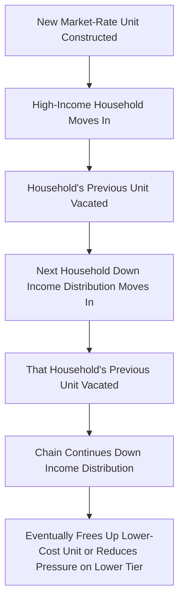

## Filtering Models of the Housing Stock

### Overview

Filtering theory describes how individual housing units move through a quality/price hierarchy over time, typically depreciating in relative quality and "filtering down" to serve successively lower-income occupants as they age, absent offsetting reinvestment. Filtering provides a dynamic, stock-based complement to static housing demand and supply models, explaining how the existing housing stock — not just new construction — supplies housing to different income segments over time, and is central to debates over whether new market-rate construction improves affordability for lower-income households.

### Core Theoretical Mechanism

**Key Points**

- Filtering models treat a housing unit as a bundle of "housing services" that declines over time due to physical depreciation, functional obsolescence, and neighborhood change, unless offset by maintenance and reinvestment expenditure
- As a unit's service flow declines relative to newer competing stock, its equilibrium price/rent falls, allowing it to be consumed by households with progressively lower income or willingness to pay — this downward price-quality movement over time is the filtering process
- Filtering is fundamentally a dynamic equilibrium concept: it links the age-price/quality gradient of the housing stock to the intertemporal allocation of housing consumption across income groups

A simplified representation of a unit's service flow over time:

$$H(t) = H_0 \cdot e^{-\delta t} + \sum_{s=0}^{t} I(s)$$

where $H_0$ is initial housing service quality, $\delta$ is the depreciation rate, and $I(s)$ represents reinvestment/renovation expenditure at time $s$ that can offset or reverse depreciation.

**Key Points**

- The equilibrium price of the unit at any time follows from the hedonic relationship between service flow and price: $P(t) = p \cdot H(t)$, where $p$ is the market-clearing price per unit of housing service
- Whether a unit filters down (depreciates faster than reinvestment offsets) or is maintained/upgraded (filters up or stays constant) is an endogenous owner decision based on comparing the marginal cost of maintenance against the marginal value of preserved housing service flow

### The Owner's Maintenance/Reinvestment Decision

**Key Points**

- Filtering models (originating with Sweeney, 1974, and extended by Rothenberg et al. and others) treat maintenance as an endogenous choice: owners invest in upkeep up to the point where marginal maintenance cost equals the marginal increase in asset value/rental income it generates
- Higher land value locations create incentive to maintain or even upgrade structures (since the land component supports continued high rents), while low land value locations create weaker incentive to maintain, accelerating filtering down and, in extreme cases, leading to abandonment
- This generates a testable prediction: filtering rates (depreciation net of reinvestment) should vary systematically with underlying land value, not just structure age — high land-value neighborhoods see renovation/redevelopment, while low land-value neighborhoods see disinvestment

The owner's maintenance decision can be represented as choosing $I(t)$ to maximize the present value of the asset:

$$\max_{I(t)} \int_0^{\infty} e^{-rt} \left[ p(t) H(t) - c(I(t)) \right] dt$$

subject to the depreciation/investment dynamics of $H(t)$, where $c(I)$ is the cost function for maintenance investment and $r$ is the discount rate.

**Example**

A prewar rowhouse in a neighborhood with rising land values gets substantially renovated (kitchen/bath upgrades, structural work) because the underlying land value justifies the reinvestment — the unit filters "up" or holds its quality tier despite structural age. An identical-vintage rowhouse in a neighborhood with stagnant or declining land value receives only minimal deferred maintenance, and filters down toward lower-income occupancy as its relative housing-service quality declines.

### Filtering and New Construction: The Supply Chain Argument

**Key Points**

- The "filtering supply chain" or "moving chains" argument holds that new market-rate construction — even luxury or high-income-targeted units — expands housing supply at the top of the quality distribution, which indirectly benefits lower-income households as departing occupants vacate their previous units, which are then filled by the next household down the income distribution, and so on down the chain
- This chain reasoning underlies the economic case that supply expansion at any price point can loosen the market broadly, since each vacancy created by a new unit potentially triggers a sequence of vacancies down the quality ladder
- Empirical "moving chain" studies (e.g., using administrative move-in/move-out data) attempt to trace how many vacancies are generated per new unit built and at what income level those vacancies ultimately occur [Unverified — the length and income distribution of moving chains varies substantially by study, metro area, and time period; cite specific chain-length estimates only from primary sources]

### Filtering Chain Mechanism Flow (Mermaid)

### Countervailing Forces: Filtering Up and Gentrification

**Key Points**

- Filtering is not unidirectional; units and neighborhoods can also "filter up" through renovation, redevelopment, or neighborhood-level demand shifts that raise land values enough to justify reinvestment even in previously depreciated structures
- Neighborhood-level filtering-up (often associated with gentrification) can reduce the supply of low-cost units available to lower-income households even without any single unit being physically altered, simply through repricing driven by rising land value expectations
- The tension between unit-level filtering-down (the classical mechanism generating affordable supply) and neighborhood-level filtering-up (which can eliminate it) is a central empirical and policy question in urban housing economics, since both processes can occur simultaneously in different parts of the same metro area

### Filtering Rate Estimation and Empirical Evidence

**Key Points**

- Empirical filtering studies typically estimate the rate at which real (quality-adjusted) rents or prices decline with housing age, controlling for structure characteristics and location, often using repeat-observations or hedonic panel methods
- Historical US studies have found measurable filtering-down of older housing stock into lower rent tiers over time, though the pace and magnitude vary by market tightness, regulatory environment, and regional housing demand growth [Unverified — cite specific filtering rate percentages only from named primary studies, as figures vary considerably across the literature]
- In supply-constrained, high-demand metro areas, filtering-down can slow or reverse (net filtering-up) because scarcity value dominates depreciation, meaning older units retain or gain relative value rather than depreciating toward lower-income accessibility — this is frequently cited as a reason filtering-based affordability arguments are weaker in severely supply-constrained coastal markets
- In slower-growth or declining-demand metro areas, filtering-down can proceed rapidly and even culminate in abandonment when structure value falls to zero or below (maintenance cost exceeds achievable rent), a phenomenon studied extensively in the urban decline/shrinking cities literature

### Filtering and Housing Policy Implications

**Key Points**

- The filtering mechanism underlies the "build more housing at any income level helps affordability" argument frequently made in supply-side housing policy discussions, since even high-end construction can indirectly expand the supply available to lower-income households through the moving-chain effect
- Critics of relying solely on market-rate filtering point to the slow speed of filtering chains, the risk that filtering-up/gentrification offsets filtering-down in high-demand submarkets, and the political/timing mismatch between long filtering horizons and urgent affordability needs — this motivates direct affordable housing production and preservation policies as complements to market-rate construction
- Filtering theory also informs preservation policy: publicly or nonprofit-owned "naturally occurring affordable housing" (NOAH) represents units that have already filtered down but are at risk of being filtered back up through renovation/repositioning if sold to market-rate investors, motivating acquisition/preservation strategies targeting these units specifically

### Diagram: Unit Value Trajectory Under Filtering-Down vs. Filtering-Up (svg_diagram)

<svg xmlns="http://www.w3.org/2000/svg" viewBox="0 0 680 400">
<text x="340" y="24" text-anchor="middle" font-size="16" font-weight="bold">Unit Value Trajectory: Filtering Down vs. Up (svg_diagram)</text>
<line x1="70" y1="350" x2="620" y2="350" stroke="black" stroke-width="2" />
<line x1="70" y1="350" x2="70" y2="30" stroke="black" stroke-width="2" />
<text x="345" y="380" text-anchor="middle" font-size="13">Structure Age (years)</text>
<text x="30" y="190" text-anchor="middle" font-size="13" transform="rotate(-90 30 190)">Real Value / Quality</text>
<path d="M 90 80 Q 250 150 300 260 Q 400 320 600 340" stroke="#d62728" stroke-width="3" fill="none" />
<text x="400" y="300" font-size="12" fill="#d62728">Filtering Down (low land value, deferred maintenance)</text>
<path d="M 90 80 Q 200 100 260 140 L 260 140 Q 320 90 400 70 Q 500 60 600 55" stroke="#2ca02c" stroke-width="3" fill="none" />
<text x="410" y="45" font-size="12" fill="#2ca02c">Filtering Up / Reinvestment (rising land value)</text>
<line x1="260" y1="140" x2="260" y2="350" stroke="#888" stroke-dasharray="4" />
<text x="230" y="365" font-size="11">Reinvestment decision point</text>
</svg>

### Formal Extensions: Filtering in General Equilibrium

**Key Points**

- Dynamic general equilibrium extensions of filtering models (e.g., overlapping-generations style housing stock models) endogenize both new construction and filtering simultaneously, determining the steady-state distribution of housing quality across the income distribution
- These models can produce testable comparative statics: e.g., how construction cost increases, income growth, or population growth shift the steady-state share of the housing stock available at each quality/price tier
- Vacancy chain models formalize the moving-chain argument mathematically, modeling the housing market as a Markov process in which each vacancy triggers a probabilistic sequence of subsequent moves and vacancies across the quality distribution [Inference — this formalization captures the qualitative logic of filtering chains, but calibrating such models to real markets requires strong assumptions about move probabilities across quality tiers, which limits precision of specific numerical predictions]

### Conclusion

Filtering models explain how the existing housing stock, not solely new construction, dynamically reallocates housing consumption across income groups over time through depreciation, reinvestment decisions, and vacancy chains triggered by new construction. The theory provides the economic foundation for the argument that expanding supply at any price point can loosen affordability broadly, while also highlighting the countervailing risk of neighborhood-level filtering-up (gentrification) that can offset or reverse the affordability gains filtering is theorized to generate — making the empirical pace and direction of filtering a central, market-specific question rather than a universal constant.

**Related Topics**

- Housing supply elasticity and construction cost dynamics
- Vacancy chain models and moving-chain empirical methodology
- Neighborhood change, gentrification, and land value capitalization
- Naturally Occurring Affordable Housing (NOAH) preservation policy
- Housing abandonment and shrinking-city dynamics
- Hedonic price models and age-price depreciation gradients
- Land value taxation and reinvestment incentives
- Supply-side vs. demand-side affordable housing policy debates