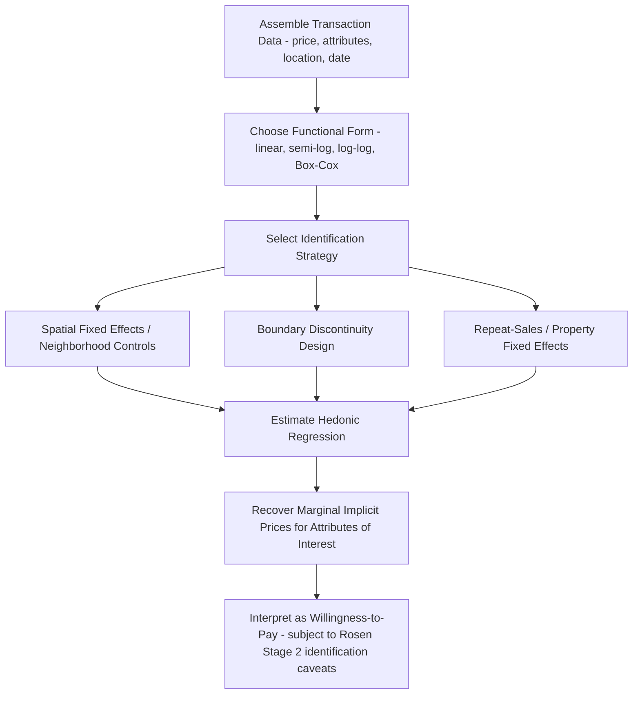

## Hedonic Pricing and Housing Valuation

### Overview

Hedonic pricing theory models the price of a differentiated good — housing being the canonical application — as a function of its constituent attributes, allowing researchers to recover the implicit (shadow) market price of individual characteristics that are never traded separately. Developed formally by Rosen (1974) building on earlier work by Court (1939) and Griliches (1961), the hedonic framework underlies house price index construction, willingness-to-pay estimation for local amenities and disamenities, and much of applied urban and environmental economics.

### Theoretical Foundations: The Rosen Model

**Key Points**

- The hedonic price function $P(z)$ maps a vector of attributes $z = (z_1, z_2, \ldots, z_n)$ to observed market price, and is an equilibrium outcome emerging from the interaction of heterogeneous buyers and sellers, not a technological or accounting relationship
- The hedonic price function is generally nonlinear even when individual bid and offer functions are simple, because it is the envelope of many households' bid functions tangent to many suppliers' offer functions across the attribute space
- Rosen's two-stage estimation framework: Stage 1 estimates the hedonic price function and its implicit marginal prices; Stage 2 attempts to recover the underlying structural demand (and supply) functions for each attribute using the first-stage marginal prices as an argument — Stage 2 is subject to well-known identification problems (Bartik, 1987; Epple, 1987) because marginal price and quantity are simultaneously determined in market equilibrium

The marginal implicit price of attribute $z_k$ is the partial derivative of the hedonic price function:

$$p_k(z) = \frac{\partial P(z)}{\partial z_k}$$

In equilibrium, a utility-maximizing household chooses attribute levels such that its marginal willingness to pay for attribute $k$ equals this implicit price:

$$\frac{\partial U/\partial z_k}{\partial U/\partial x} = \frac{\partial P(z)}{\partial z_k}$$

where $x$ is the numeraire composite good.

### The Household Bid Function and Firm Offer Function

**Key Points**

- Each household has a bid function $\theta(z; u, y)$ representing the maximum price it would pay for a unit with attribute bundle $z$ while holding utility $u$ and income $y$ constant — steeper bid functions for households with higher marginal valuation of an attribute
- Each supplier/builder has an offer function representing the minimum price at which they are willing to supply attribute bundle $z$ given their cost structure and desired profit
- Market equilibrium occurs where bid and offer functions are tangent; the locus of these tangency points across all households and firms traces out the observed hedonic price function — households with the steepest marginal valuation for an attribute sort into units with the highest levels of that attribute (this is the basis of hedonic sorting/matching predictions)

**Example**

Households with young children have steeper bid functions for school quality than childless households. In equilibrium, they sort into higher-school-quality neighborhoods, bidding up prices there, while the hedonic price function's marginal price on school quality reflects the tangency of these steeper bid curves with supplier offer curves in that segment of the housing stock.

### Empirical Specification: Functional Form Choices

**Key Points**

- The most common empirical hedonic specification is semi-log (dependent variable in logs, attributes in levels), because it produces coefficients interpretable as approximate percentage price effects and tends to fit skewed housing price distributions better than a fully linear form
- Alternative forms include linear, log-log (double-log, giving constant elasticities), and Box-Cox transformations that let the data determine the appropriate functional form rather than imposing it a priori
- Functional form choice matters substantially for estimated marginal implicit prices, especially when extrapolating outside the observed data range, since different functional forms imply different curvature in the price-attribute relationship

A standard semi-log hedonic specification:

$$\ln(P_i) = \beta_0 + \sum_{k=1}^{n} \beta_k z_{ik} + \sum_{j} \gamma_j D_{ij} + \epsilon_i$$

where $z_{ik}$ are continuous structural/locational attributes for unit $i$, $D_{ij}$ are categorical/dummy variables (e.g., neighborhood fixed effects, time-of-sale dummies), and $\epsilon_i$ is the error term.

**Example**

A coefficient $\beta_k = 0.05$ on an additional bedroom in a semi-log specification is interpreted (via the standard approximation) as roughly a 5% increase in price per additional bedroom, holding other attributes constant — though for larger coefficient magnitudes the exact percentage effect is $(e^{\beta_k} - 1) \times 100\%$ rather than $\beta_k \times 100\%$.

### Omitted Variable Bias and Identification Challenges

**Key Points**

- The central empirical threat to hedonic estimation is omitted variable bias: unobserved attributes correlated with both price and the attribute of interest bias the estimated implicit price — the canonical example is unobserved neighborhood quality correlated with an included variable like school test scores
- Spatial fixed effects (neighborhood, census tract, or even block-group dummies) are commonly used to absorb time-invariant unobserved locational quality, narrowing identification to within-neighborhood variation in the attribute of interest
- Boundary discontinuity designs exploit sharp administrative boundaries (e.g., school attendance zone boundaries, jurisdiction lines) where physically adjacent properties differ discretely in a policy-relevant attribute but are otherwise similar in unobserved neighborhood quality — widely used to more credibly isolate willingness-to-pay for school quality, tax rates, or other jurisdiction-level attributes
- Repeat-sales and property fixed-effects approaches control for all time-invariant unit-specific unobserved quality by using within-property price changes over time, at the cost of restricting the sample to properties that transact multiple times (a potentially non-random subsample)

### Diagram: Hedonic Equilibrium as Tangency of Bid and Offer Functions (svg_diagram)

<svg xmlns="http://www.w3.org/2000/svg" viewBox="0 0 680 420">
<text x="340" y="24" text-anchor="middle" font-size="16" font-weight="bold">Hedonic Equilibrium: Bid-Offer Tangency (svg_diagram)</text>
<line x1="70" y1="370" x2="620" y2="370" stroke="black" stroke-width="2" />
<line x1="70" y1="370" x2="70" y2="30" stroke="black" stroke-width="2" />
<text x="345" y="400" text-anchor="middle" font-size="13">Attribute Level (z)</text>
<text x="30" y="200" text-anchor="middle" font-size="13" transform="rotate(-90 30 200)">Price (P)</text>
<path d="M 100 340 Q 250 200 400 80" stroke="#1f77b4" stroke-width="2.5" fill="none" />
<text x="410" y="80" font-size="11" fill="#1f77b4">Household A Bid (steep valuation)</text>
<path d="M 100 340 Q 300 260 500 150" stroke="#9467bd" stroke-width="2.5" fill="none" />
<text x="505" y="150" font-size="11" fill="#9467bd">Household B Bid (shallow valuation)</text>
<path d="M 100 120 Q 250 220 400 340" stroke="#2ca02c" stroke-width="2.5" fill="none" />
<text x="200" y="120" font-size="11" fill="#2ca02c">Supplier Offer Curve</text>
<circle cx="270" cy="190" r="5" fill="black" />
<text x="280" y="185" font-size="11" font-weight="bold">Tangency Point (equilibrium price)</text>
<path d="M 90 340 Q 300 240 560 100" stroke="#d62728" stroke-width="3" stroke-dasharray="6,3" fill="none" />
<text x="480" y="100" font-size="11" fill="#d62728" font-weight="bold">Observed Hedonic Price Function P(z)</text>
</svg>

### Applications: Environmental and Amenity Valuation

**Key Points**

- Hedonic methods are the standard revealed-preference tool for valuing non-market environmental amenities and disamenities (air quality, noise, proximity to hazardous sites, flood risk, open space, water quality), since households implicitly pay for these through housing prices even though the amenities themselves are not directly traded
- Difference-in-differences hedonic designs are frequently used to value discrete environmental events or policy changes (e.g., a Superfund site cleanup, a new park opening, a change in flood zone designation), comparing price changes for affected properties against unaffected control properties before and after the event
- Climate risk hedonic studies (flood, wildfire, sea-level rise exposure) have become a growing application area, testing whether and how quickly such risks are capitalized into prices as information and salience change [Unverified — this is an active and rapidly evolving empirical literature; specific capitalization-rate estimates vary by hazard type, region, and study period]

### Applications: House Price Indices

**Key Points**

- Hedonic price indices construct a quality-adjusted price index by holding the attribute bundle constant over time (via the estimated hedonic coefficients), distinguishing pure price appreciation from price changes driven by shifts in the composition of transacted units (e.g., more large houses selling in one period than another)
- This differs from repeat-sales indices (e.g., Case-Shiller methodology), which control for unit quality by tracking the same properties over multiple sales rather than estimating a cross-sectional attribute-price relationship — hedonic indices can use all transactions (including one-time sales) while repeat-sales indices are restricted to properties selling more than once
- Hybrid approaches combining hedonic and repeat-sales elements are also used in official statistical agency price index construction to balance sample size against quality-control robustness

### Common Attribute Categories in Housing Hedonics

**Key Points**

- Structural attributes: square footage, lot size, number of bedrooms/bathrooms, age, construction quality/materials, garage/parking
- Locational/accessibility attributes: distance to CBD or employment centers, transit access, walkability
- Neighborhood/public-good attributes: school quality (test scores, ratings), crime rates, local tax rates, racial/socioeconomic composition (historically included in some studies, raising well-documented ethical and methodological concerns about reinforcing discriminatory valuation patterns)
- Environmental attributes: air quality, noise (e.g., airport/highway proximity), proximity to open space/water, flood/wildfire risk exposure
- Temporal controls: time-of-sale fixed effects to control for aggregate market price movements separate from attribute-specific effects

### Practical Estimation Workflow (Mermaid)

### Limitations and Methodological Critiques

**Key Points**

- Marginal implicit prices recovered from Stage 1 hedonic regressions represent local, market-specific valuations and should not be extrapolated to attribute levels far outside the observed data range, since the hedonic price function's curvature is only locally identified by observed transactions
- Rosen's Stage 2 (recovering full structural demand functions for attributes) faces a fundamental identification problem when using data from a single market, since all households in that market face the same hedonic price schedule, offering no independent price variation to trace out a demand curve — this typically requires either multiple market data or strong functional form/instrumental assumptions
- Hedonic estimates reflect the preferences of the marginal buyer in a given market and time period, and should not be interpreted as universal or time-invariant valuations, since amenity valuations shift with income growth, changing preferences, and market conditions
- Spatial autocorrelation (nearby properties having correlated unobserved characteristics and correlated error terms) can bias standard errors if not addressed through spatial econometric techniques (e.g., spatial lag or spatial error models, clustering by geography)

### Conclusion

Hedonic pricing theory provides the foundational framework for decomposing housing prices into the implicit values of constituent structural, locational, and environmental attributes, resting on the equilibrium tangency of heterogeneous household bid functions and supplier offer functions. While Stage 1 estimation of marginal implicit prices is widely and credibly implemented using modern identification strategies (fixed effects, boundary discontinuities, repeat-sales), recovering full structural demand functions (Stage 2) remains econometrically challenging, and careful attention to omitted variable bias, functional form, and spatial dependence is essential for credible hedonic housing valuation research.

**Related Topics**

- Rosen (1974) two-stage hedonic model and Bartik/Epple identification critiques
- House price index methodology: hedonic vs. repeat-sales (Case-Shiller) approaches
- Environmental valuation and capitalization of amenities/disamenities
- Boundary discontinuity designs in applied microeconomics
- School quality capitalization and Tiebout sorting
- Spatial econometrics and spatial autocorrelation corrections
- Climate risk capitalization in housing markets
- Housing demand and household choice (attribute bundle selection)