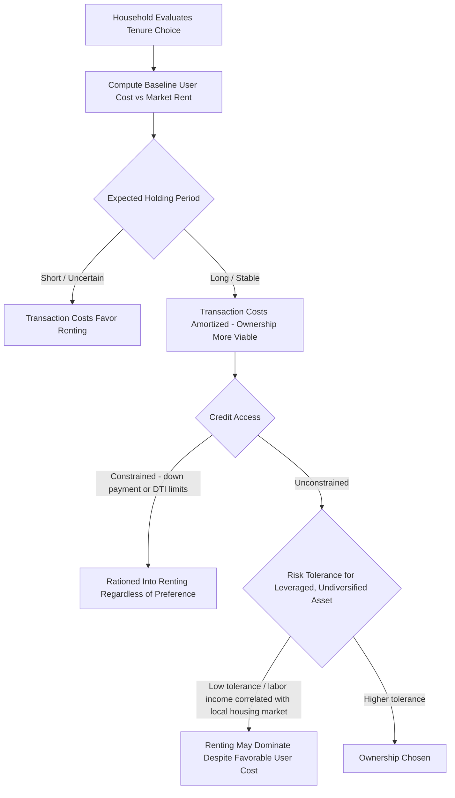

## Homeownership Versus Renting Decisions

### Overview

The homeownership-versus-renting decision is a household-level tenure choice problem that combines consumption, investment, and financing considerations under uncertainty. Unlike the simplified tenure comparisons embedded in basic housing demand models, a full treatment integrates user cost theory, portfolio/asset-allocation considerations, credit market frictions, mobility risk, and tax policy, since owning a home is simultaneously a housing consumption decision and a large, leveraged, undiversified investment position.

### The Baseline User Cost Comparison

**Key Points**

- The standard starting point for tenure comparison is to compare the annualized user cost of owning against the market rent for an equivalent unit; the household is predicted to own if user cost is lower and rent if market rent is lower, holding preferences constant
- User cost of owning converts the house price (a stock/asset value) into an annual flow cost comparable to rent, incorporating financing cost, taxes, depreciation, and expected appreciation
- This baseline comparison is necessary but not sufficient for actual tenure choice, since it ignores transaction costs, risk, liquidity, credit access, and non-pecuniary factors that materially affect the decision in practice

The user cost of homeownership (Poterba, 1984 framework):

$$UC = P_H \left[ (1-\tau)(i + \tau_p) + m - \pi^e \right]$$

Where $P_H$ is house price, $i$ is mortgage rate, $\tau$ is marginal tax rate (relevant where mortgage interest/property tax is deductible), $\tau_p$ is property tax rate, $m$ is maintenance/depreciation rate, and $\pi^e$ is expected house price appreciation.

**Example**

A household considers a $400,000 home with a 6% mortgage rate, 1.2% property tax rate, 1.5% maintenance rate, and 3% expected appreciation, with no tax deductibility benefit assumed. Annual user cost is approximately:

$$UC = 400{,}000 \times [(0.06 + 0.012) + 0.015 - 0.03] = 400{,}000 \times 0.057 = \$22{,}800/\text{year}$$

This is compared against the annual market rent for an equivalent unit to form the baseline own-vs-rent signal, before layering in transaction costs and risk considerations.

### The Price-to-Rent Ratio as a Summary Metric

**Key Points**

- The price-to-rent ratio ($P_H / R_{annual}$) is a widely used reduced-form heuristic that compresses the user cost comparison into a single number, with higher ratios signaling that owning is relatively more expensive compared to renting at prevailing prices
- The equilibrium price-to-rent ratio is theoretically the inverse of the user cost rate (from the asset-pricing identity $P_H = R / UC\_rate$), meaning it moves inversely with interest rates, expected appreciation, and tax benefits, and is not a fixed "fair value" constant across time or markets
- Elevated price-to-rent ratios are commonly cited in the literature as one indicator (among several) associated with housing market overvaluation risk, though the ratio alone cannot distinguish rational repricing (e.g., due to falling long-run interest rates) from speculative mispricing [Unverified — interpretation of any specific price-to-rent threshold as "overvalued" is model-dependent and contested in the empirical literature]

### Transaction Costs and the Breakeven Holding Period

**Key Points**

- Ownership involves substantial one-time transaction costs on both entry (closing costs, inspection, loan origination fees) and exit (realtor commissions, closing costs), commonly totaling a meaningful percentage of home value on each side — these costs must be amortized over the expected holding period to be compared fairly against renting
- The breakeven holding period is the minimum length of ownership required for the annualized benefit of a lower user cost (relative to rent) to offset the amortized transaction costs; below this horizon, renting is typically the lower-cost option even if annual user cost nominally favors owning
- Renting avoids most of these transaction costs (aside from security deposits and possible broker fees in some markets), making renting the more capital-efficient choice for households with short or uncertain expected tenure at a location

**Example**

If round-trip transaction costs total roughly 10% of home value, and the annual user-cost advantage of owning over renting is 2% of home value per year, the household needs to remain roughly 5 years to amortize the transaction cost through the annual savings — a household expecting to relocate for a job within 2-3 years would rationally rent even though the pure annual user-cost comparison favors owning. [Inference — this is an illustrative breakeven calculation; actual breakeven periods depend on the specific cost and rate assumptions in each case, and household-specific online calculators typically formalize this with additional parameters]

### Homeownership as a Leveraged, Undiversified Asset Position

**Key Points**

- Because home purchases are typically financed with a mortgage covering a large share of value (commonly 80% loan-to-value or higher for many buyers), homeownership represents a highly leveraged position in a single, geographically concentrated asset — equity returns are amplified relative to the underlying house price return
- This leverage cuts both ways: it amplifies gains during price appreciation but also amplifies losses (and can produce negative equity) during price declines, a dynamic prominently observed during the 2007-2009 US housing downturn
- Housing wealth is also highly undiversified relative to standard portfolio theory prescriptions, since a homeowner's largest asset is typically correlated with their local labor market (home value and job prospects often move together with local economic conditions), compounding rather than hedging income risk — a point emphasized in housing finance and household portfolio choice literature

Simple leveraged-return illustration: if a home is purchased with a 20% down payment and the house price appreciates 5%, the return on equity (ignoring costs) is approximately:

$$r_{equity} \approx \frac{\Delta P_H}{\text{Down Payment}} = \frac{0.05 \times P_H}{0.20 \times P_H} = 25\%$$

demonstrating the leverage amplification mechanism (and equally, a 5% price decline produces an equivalent-magnitude equity loss).

### Credit Constraints and Down Payment Frictions

**Key Points**

- Down payment requirements and underwriting standards (debt-to-income limits, credit score thresholds) can ration otherwise-utility-maximizing households out of ownership, a friction extensively studied in housing finance literature as a barrier to homeownership access, particularly for lower-income and first-time buyer households
- Government-sponsored and policy interventions (mortgage insurance programs, first-time buyer assistance, government-sponsored enterprise loan guarantees in the US context) are designed specifically to relax these credit constraints, with effects studied for their impact on homeownership rates and, separately, on house price levels
- Precautionary savings and liquidity considerations also factor into the decision: committing substantial wealth to an illiquid down payment reduces a household's buffer against income shocks, a consideration formalized in life-cycle models of housing and savings behavior

### Tenure Choice Decision Framework (Mermaid)

### Non-Pecuniary and Behavioral Factors

**Key Points**

- Ownership provides non-pecuniary benefits not captured in pure cost comparisons: control over the property (renovation, customization), housing stability/security against landlord-initiated non-renewal, and in some contexts social/status value attached to homeownership
- Renting provides flexibility value (lower cost of relocating for job opportunities, family reasons, or lifestyle changes) and eliminates maintenance responsibility and market risk exposure, both valuable to households with uncertain future circumstances
- Behavioral factors documented in the literature include loss aversion around housing (reluctance to sell at a nominal loss, sometimes called the disposition effect applied to housing) and possible overweighting of the "forced savings" aspect of mortgage amortization relative to what a fully rational lifecycle saver would choose [Unverified — the size and prevalence of these behavioral effects vary across studies and populations]

### Tax Policy Effects on Tenure Choice

**Key Points**

- In jurisdictions where mortgage interest and/or property taxes are deductible against income tax, the after-tax user cost of owning is reduced, with the benefit scaling with the household's marginal tax rate — meaning the tax subsidy to ownership is regressive in the sense that higher-bracket households capture larger per-dollar benefits, a well-documented critique in public finance literature on housing tax policy
- Imputed rent (the implicit rental income homeowners "pay themselves" by living in their own asset) is generally untaxed in most tax systems, which itself constitutes an implicit subsidy to ownership relative to renting, since landlords' actual rental income is typically taxable
- Capital gains treatment on primary residence sales (often preferential relative to other asset classes, e.g., exclusions up to a threshold in the US context) further affects the relative after-tax return to owning versus renting-and-investing the equivalent capital in a diversified portfolio [Unverified — specific capital gains treatment provisions are jurisdiction-specific and subject to legislative change; verify against current tax code for any applied analysis]

### The "Rent and Invest the Difference" Alternative Framework

**Key Points**

- A rigorous tenure comparison should account for the opportunity cost of the down payment and the ownership-renting cash flow difference: a renting household can in principle invest the capital that would otherwise be tied up in a down payment plus the ongoing cash-flow difference between renting and owning costs in an alternative diversified portfolio
- Under this framework, ownership is favorable not simply when user cost is below rent, but when the risk-adjusted return on housing equity (net of costs) exceeds the risk-adjusted return achievable by renting and investing the equivalent capital elsewhere
- This framework highlights that the own-vs-rent decision is formally a portfolio allocation problem, not merely a consumption cost comparison — the correct comparison nets out the financial asset return households forgo by holding housing equity instead of a diversified portfolio

### Empirical Patterns and Life-Cycle Considerations

**Key Points**

- Homeownership rates typically rise with age and household formation stage (marriage, children) in cross-sectional data, consistent with life-cycle models where housing tenure interacts with income stability, expected mobility, and the value of stability for raising a family [Unverified — while this pattern is broadly documented, specific homeownership rate figures by age cohort vary by country and time period and should be sourced from current primary statistical sources]
- Housing tenure choice models increasingly incorporate labor income risk correlated with local house prices (e.g., a construction worker's income and local house prices both falling together in a regional downturn), which can make ownership riskier than a simple financial asset-return comparison would suggest
- Households facing high income volatility or uncertain career trajectories are theoretically predicted to have relatively higher optimal renting propensity, given the illiquidity and leverage risk embedded in ownership, all else equal

### Conclusion

The homeownership-versus-renting decision extends beyond a simple annual user-cost-versus-rent comparison to incorporate transaction costs and expected holding period, leverage and portfolio diversification considerations, credit market access, tax policy effects, and non-pecuniary preferences for stability versus flexibility. A rigorous economic treatment frames tenure choice as a joint consumption-and-portfolio-allocation problem under uncertainty, in which the financially optimal choice depends heavily on household-specific factors — expected mobility, income volatility, credit access, and risk tolerance — rather than a single universally applicable ownership-versus-renting threshold.

**Related Topics**

- User cost of capital and the Poterba (1984) framework
- Price-to-rent ratios and housing market valuation indicators
- Mortgage finance, credit constraints, and down payment barriers
- Housing wealth, leverage, and household portfolio choice theory
- Tax policy and the mortgage interest deduction incidence literature
- Life-cycle models of housing consumption and saving
- Negative equity and housing market downturns
- Housing demand and household choice (baseline consumption framework)