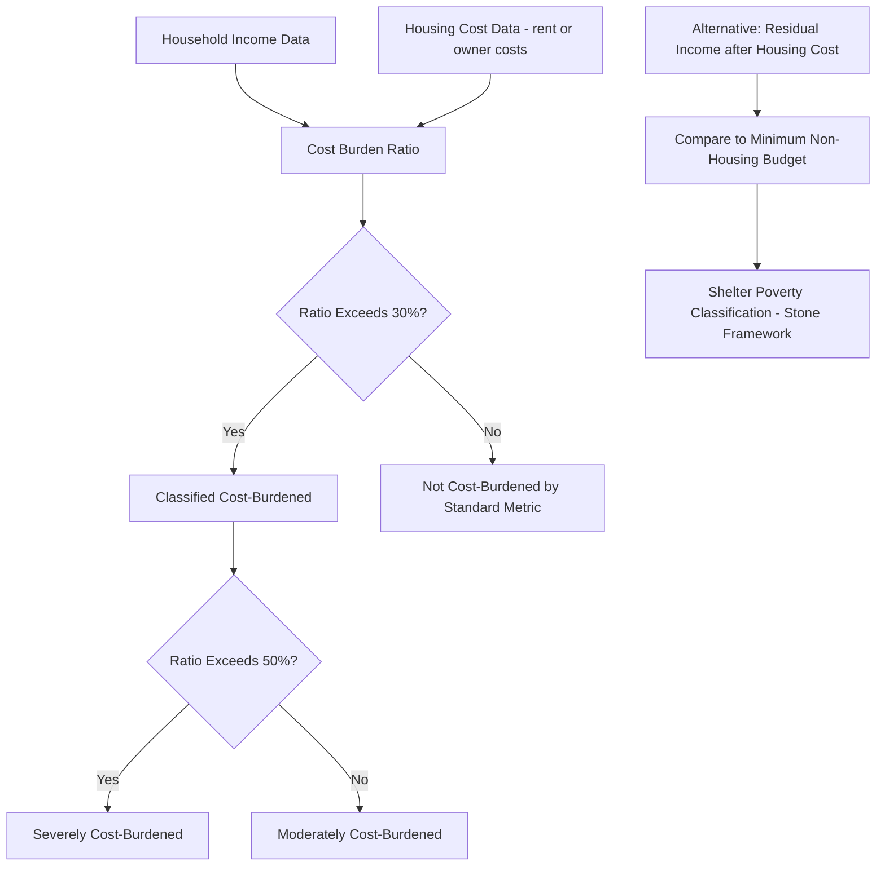

## Housing Affordability and Cost Burden

### Overview

Housing affordability and cost burden analysis examines the relationship between household housing expenditure and income, providing both a measurement framework for identifying households facing financial strain from housing costs and a diagnostic lens for understanding the demand-supply imbalances that drive affordability outcomes at the market level. Affordability sits at the intersection of positive economics (measuring and explaining cost burden patterns) and normative policy analysis (defining acceptable burden thresholds and designing interventions).

### Standard Measurement: The Cost-Burden Ratio

**Key Points**

- The most widely used affordability metric is the housing cost-to-income ratio, most commonly the 30% threshold: a household spending more than 30% of gross income on housing costs (rent or owner costs including mortgage, taxes, insurance) is classified as "cost-burdened," and above 50% as "severely cost-burdened" — this convention originates from US housing policy history (traceable to federal housing assistance program standards) and is widely used internationally as a comparative benchmark
- The 30% threshold is a normative/administrative convention rather than a value derived from utility-maximization theory; it does not adjust for household size, non-housing cost-of-living variation, or the fact that optimal housing expenditure shares vary systematically with income (recall that housing budget shares tend to fall as income rises per standard demand elasticity estimates below unity)
- Because the ratio uses gross income in the denominator, it can misclassify affordability burden for both very low-income households (for whom even below-30% spending may leave insufficient residual income for other necessities) and high-income households (for whom above-30% spending may reflect a discretionary consumption choice rather than financial strain) [Unverified — the precise degree of over/under-classification is empirically debated and depends on the income distribution and cost-of-living context being studied]

The basic cost-burden ratio:

$$CB_i = \frac{\text{Housing Costs}_i}{\text{Gross Income}_i}$$

Classification: $CB_i > 0.30$ = cost-burdened; $CB_i > 0.50$ = severely cost-burdened.

### Alternative and Refined Affordability Measures

**Key Points**

- The residual income approach (sometimes called the "shelter poverty" framework, associated with Michael Stone) instead asks whether a household has sufficient income remaining after housing costs to meet a minimum non-housing budget standard, addressing the critique that a flat percentage threshold ignores household size and absolute income level
- The Housing + Transportation (H+T) affordability index incorporates transportation costs alongside housing costs, recognizing that housing choices trade off against commuting costs (directly reflecting the bid-rent logic in location-choice theory) — a household in a cheaper but car-dependent location may face higher total cost burden than a nominal housing-cost-only comparison suggests
- Affordability gap measures compute the dollar difference between what a target household group can afford at the 30% standard and the actual cost of housing meeting minimum adequacy standards in a given market, used to estimate the scale of unmet affordable housing need at a market or regional level

The residual income approach compares:

$$Y_i - H_i \gtrless NHB_i$$

where $Y_i$ is household income, $H_i$ is housing cost, and $NHB_i$ is a minimum non-housing budget standard (food, transportation, healthcare, etc.) — the household is considered shelter-poor if residual income falls below $NHB_i$.

### Affordability as a Function of Income Distribution and Price Distribution

**Key Points**

- Aggregate affordability outcomes in a market are jointly determined by the income distribution of households and the price/rent distribution of available units; a mismatch between these distributions (e.g., median household income growing slower than median housing costs) produces rising cost-burden rates even without any single household's circumstances worsening in isolation
- This framing connects directly to housing supply elasticity: in supply-constrained markets, demand growth (population, income) translates disproportionately into price growth rather than quantity growth, widening the gap between the price distribution and the income distribution and raising cost-burden rates
- Filtering theory is directly relevant here: if filtering-down of the existing stock proceeds slower than growth in lower-income household formation, the effective supply of "naturally affordable" units fails to keep pace with need even if aggregate housing stock is nominally sufficient

### Diagram: Divergence of Income and Housing Cost Growth (svg_diagram)

<svg xmlns="http://www.w3.org/2000/svg" viewBox="0 0 680 400">
<text x="340" y="24" text-anchor="middle" font-size="16" font-weight="bold">Income vs. Housing Cost Growth Divergence (svg_diagram)</text>
<line x1="70" y1="350" x2="620" y2="350" stroke="black" stroke-width="2" />
<line x1="70" y1="350" x2="70" y2="30" stroke="black" stroke-width="2" />
<text x="345" y="380" text-anchor="middle" font-size="13">Time</text>
<text x="30" y="190" text-anchor="middle" font-size="13" transform="rotate(-90 30 190)">Index (base year = 100)</text>
<path d="M 90 320 L 600 250" stroke="#1f77b4" stroke-width="3" fill="none" />
<text x="450" y="240" font-size="12" fill="#1f77b4">Median Household Income</text>
<path d="M 90 320 L 600 80" stroke="#d62728" stroke-width="3" fill="none" />
<text x="450" y="75" font-size="12" fill="#d62728">Median Housing Cost</text>
<line x1="600" y1="80" x2="600" y2="250" stroke="#888" stroke-dasharray="4" />
<text x="605" y="165" font-size="11">Widening Cost-Burden Gap</text>
</svg>

### Determinants of Cost Burden: Supply-Side Channel

**Key Points**

- Housing supply elasticity (see Housing Supply, Construction Costs, and Elasticity) is a primary structural determinant of long-run affordability trends: metro areas with inelastic supply (due to geographic or regulatory constraints) exhibit persistently higher price growth relative to income growth compared to elastic-supply metros facing similar demand growth
- Land-use regulation stringency is empirically associated with both higher price levels and higher cost-burden rates in the literature, operating through the regulatory-tax/scarcity-rent mechanism discussed in hedonic and supply-elasticity analysis [Unverified — magnitude of this association varies across studies and specific regulatory-index methodologies; cite specific coefficient estimates only from primary sources]
- Construction cost inflation (materials, skilled labor, financing costs) independently raises the cost floor for new supply, compressing the feasible price range at which new construction can profitably occur, particularly affecting the supply of lower-cost new units

### Determinants of Cost Burden: Demand-Side Channel

**Key Points**

- Income growth that lags housing cost growth mechanically raises cost-burden ratios even absent any supply-side deterioration; wage stagnation for lower-income households relative to overall housing cost growth has been documented as a contributing factor in numerous market-specific studies [Unverified — the relative contribution of income stagnation versus supply constraints to affordability trends varies by study and is an actively debated empirical question]
- Population and employment growth (in-migration to high-opportunity metro areas) increases housing demand, and where supply does not respond elastically, this demand growth channels into price increases that widen cost-burden gaps for existing lower-income residents
- Low interest rate environments can increase house price levels (through the user cost channel, lowering the discount applied to future housing services) even without proportional income growth, affecting ownership affordability distinctly from rental affordability, since renters are not directly exposed to mortgage rate changes in the same way

### Distributional and Demographic Patterns

**Key Points**

- Cost burden is not evenly distributed across the income distribution: lower-income households are mechanically more likely to exceed any fixed percentage-of-income threshold because housing has a large fixed/minimum-adequate-unit cost component that consumes a larger income share at lower income levels — this is a direct empirical implication of income elasticity of housing demand being positive but less than one
- Renters as a group generally exhibit higher cost-burden rates than owners in most studied markets, partly because owners with fixed-rate mortgages experience housing cost stability over time (nominal payment does not rise with market rents) while renters are exposed to ongoing market rent adjustment, and partly due to differences in the income distributions of renter versus owner populations
- Housing cost burden interacts with other demographic factors (household composition, disability status, elderly fixed-income households) in ways that housing policy targeting (e.g., income-based rental assistance) is specifically designed to address, since a flat threshold does not account for these compounding vulnerability factors

### Affordability Metric Construction Flow (Mermaid)

### Policy Response Frameworks

**Key Points**

- Supply-side interventions (upzoning, permitting reform, reduced construction cost barriers) target affordability by increasing long-run supply elasticity, theoretically compressing the price distribution relative to a constrained-supply counterfactual — the primary policy lever implied by the supply-elasticity/filtering-chain literature
- Demand-side/subsidy interventions (housing choice vouchers, rental assistance, down payment assistance) directly reduce the effective cost burden faced by targeted households without necessarily changing the underlying market price level, and can in some circumstances bid up prices in supply-constrained markets if not paired with supply-side measures [Unverified — the degree of price pass-through/capitalization of housing subsidies into market rents is an actively studied and context-dependent empirical question]
- Production-based programs (public housing, income-restricted affordable housing mandates, low-income housing tax credit-style programs in the US context) directly add income-restricted units to the stock, addressing affordability at specific income tiers but at a per-unit public cost that differs from broader market-rate supply expansion
- Preservation-focused policy (protecting naturally occurring affordable housing, rent stabilization/control) aims to slow the loss of existing lower-cost units to filtering-up/redevelopment, though rent control's effects on the broader supply and quality of the rental stock are a long-standing and contested area of empirical housing economics research [Unverified — this remains one of the most debated topics in applied housing economics; effects vary significantly by control design, exemptions, and market context, and any specific empirical claim should reference dated primary literature]

### Measurement Caveats and Critiques

**Key Points**

- Point-in-time cost-burden statistics can conflate transitory burden (e.g., a household temporarily between jobs) with chronic structural burden, motivating panel/longitudinal approaches that track burden persistence over time rather than relying solely on cross-sectional snapshots
- Self-reported or survey-based income and housing cost data used in many affordability statistics are subject to measurement error and non-response bias, particularly for informal income sources or in-kind housing arrangements
- International and cross-jurisdictional affordability comparisons using a uniform 30% threshold can be misleading given differing baseline cost-of-living structures, tax systems, and the scope of what counts as "housing cost" (e.g., whether utilities, insurance, or homeowner association fees are included) across data sources

### Conclusion

Housing affordability and cost burden analysis translates the theoretical demand and supply mechanisms of housing markets into applied measures of household financial strain, most commonly through the 30%-of-income cost-burden convention, though richer frameworks (residual income, housing-plus-transportation indices, affordability gap analysis) address known limitations of the flat-threshold approach. Structural cost-burden trends are jointly driven by supply elasticity, construction costs, and land-use regulation on the supply side, and income growth, population growth, and interest rate environments on the demand side, with policy responses spanning supply-side, demand-side subsidy, production-based, and preservation-oriented interventions, each carrying distinct tradeoffs documented in the applied housing policy literature.

**Related Topics**

- Housing cost-burden thresholds and the Stone shelter-poverty framework
- Housing supply elasticity and land-use regulation effects on affordability
- Filtering models and the supply of naturally affordable housing
- Rent control and rent stabilization policy debates
- Housing choice vouchers and demand-side subsidy incidence
- Housing + Transportation affordability indices
- Income elasticity of housing demand
- Low-income housing tax credit and production-based affordable housing programs