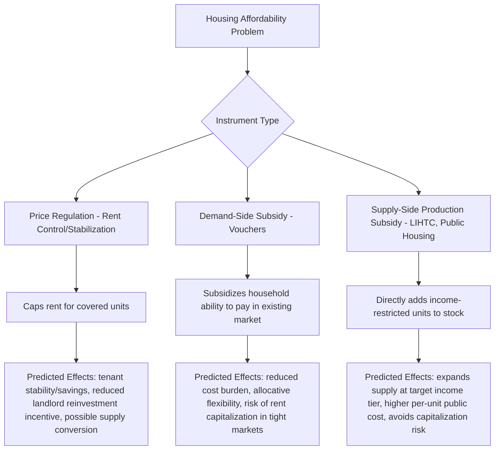

## Housing Policy: Rent Control, Subsidies, and Vouchers

### Overview

Housing policy instruments intervene in housing markets through price regulation (rent control/stabilization), direct income transfers tied to housing consumption (vouchers), or production/ownership subsidies (tax credits, public housing, down payment assistance). Each instrument operates through a distinct economic mechanism with different implications for market prices, housing quality, supply response, and target-household welfare, and each has generated a substantial and often contested empirical literature evaluating its effects relative to stated policy goals.

### Rent Control: Mechanism and Theoretical Predictions

**Key Points**

- First-generation ("hard") rent control caps nominal rents at or near a fixed level with little or no allowance for adjustment, historically associated with post-WWII-era price controls in several countries; standard price-ceiling analysis predicts this creates persistent excess demand (shortage), since the controlled price sits below the market-clearing rent
- Second-generation rent stabilization (the more common contemporary form) typically allows rent increases up to inflation or a capped annual percentage, often with vacancy decontrol or partial decontrol provisions (rent may reset to market rate upon tenant turnover) and exemptions for new construction — this creates weaker and more localized distortions than hard rent control but retains the core wedge between controlled and market rent for covered units
- Standard price-ceiling theory predicts a binding rent ceiling produces: (a) a shortage of rental units at the controlled price, (b) reduced landlord incentive to maintain or reinvest in the property (since the marginal return on maintenance investment is capped by the controlled rent), and (c) potential conversion of units out of the rental stock (condo conversion, owner move-in, or removal from the market) where legally permitted

A simplified price-ceiling representation of the rental market:

$$Q_D(P_{ceiling}) > Q_S(P_{ceiling}) \quad \text{when} \quad P_{ceiling} < P^*$$

where $P^*$ is the market-clearing rent — the excess demand $Q_D - Q_S$ represents the shortage, which in practice is allocated through non-price mechanisms (queuing, waiting lists, informal side payments, or tenant selection criteria).

### Diagram: Rent Control as a Binding Price Ceiling (svg_diagram)

<svg xmlns="http://www.w3.org/2000/svg" viewBox="0 0 680 420">
<text x="340" y="24" text-anchor="middle" font-size="16" font-weight="bold">Rent Control as a Binding Price Ceiling (svg_diagram)</text>
<line x1="70" y1="370" x2="620" y2="370" stroke="black" stroke-width="2" />
<line x1="70" y1="370" x2="70" y2="30" stroke="black" stroke-width="2" />
<text x="345" y="400" text-anchor="middle" font-size="13">Quantity of Rental Units</text>
<text x="30" y="200" text-anchor="middle" font-size="13" transform="rotate(-90 30 200)">Rent</text>
<line x1="100" y1="340" x2="560" y2="60" stroke="#2ca02c" stroke-width="3" />
<text x="565" y="60" font-size="12" fill="#2ca02c">Supply</text>
<line x1="100" y1="60" x2="560" y2="340" stroke="#1f77b4" stroke-width="3" />
<text x="565" y="340" font-size="12" fill="#1f77b4">Demand</text>
<line x1="70" y1="230" x2="620" y2="230" stroke="#d62728" stroke-width="2.5" stroke-dasharray="6,3" />
<text x="450" y="220" font-size="12" fill="#d62728">Rent Ceiling (P_ceiling)</text>
<line x1="250" y1="230" x2="250" y2="370" stroke="#888" stroke-dasharray="3" />
<line x1="450" y1="230" x2="450" y2="370" stroke="#888" stroke-dasharray="3" />
<text x="300" y="390" font-size="11" fill="#d62728">Shortage (Qd - Qs)</text>
<text x="240" y="385" font-size="10">Qs</text>
<text x="440" y="385" font-size="10">Qd</text>
</svg>

### Empirical Evidence on Rent Control

**Key Points**

- Empirical studies of rent control effects generally examine three margins: effects on covered tenants' rents and stability, effects on the quantity/quality of the rental stock (including conversion and reinvestment responses), and spillover effects on the uncontrolled segment of the market
- A widely cited study using San Francisco data (Diamond, McQuade, and Qian, 2019) found rent control provided significant benefits (rent savings, increased likelihood of staying in place) to covered tenants, while also finding landlords responded by reducing the rental housing supply through conversion to owner-occupied or other uses, and that the resulting reduced rental supply contributed to city-wide rent increases in the uncontrolled segment of the market [Unverified — cite exact magnitude figures only from the primary study; results are specific to the studied context and design of that particular rent control policy]
- The broader empirical literature shows a range of findings depending on the specific design of rent control (hard vs. soft, vacancy decontrol provisions, exemptions for new construction), the local supply elasticity context, and the time horizon studied, and there is no single universally agreed-upon magnitude of net welfare effect across all rent control implementations [Unverified — given the genuinely contested and design-dependent nature of this literature, any specific numerical claim in applied work should be sourced to a named, dated study rather than treated as a general constant]
- New-construction exemptions (common in many jurisdictions' rent stabilization designs) are intended to preserve the incentive for new supply, since covering new construction under rent control would directly reduce the expected return to development and could reduce long-run supply elasticity

### Rent Control Policy Design Variants

**Key Points**

- Vacancy decontrol/recontrol: rent resets to market rate when a unit turns over to a new tenant, which preserves some supply-side flexibility relative to hard control but can create incentive problems (e.g., landlord incentive to encourage tenant turnover, or tenant reluctance to move, generating "lock-in" effects that reduce housing market mobility and labor market matching efficiency)
- Just-cause eviction protections are frequently paired with rent stabilization to prevent landlords from circumventing rent limits through eviction-and-relighting at market rate, and are a distinct policy lever from the rent cap itself, addressing tenant security independent of the price mechanism
- Rent control is one instrument in a broader category of price/tenancy regulation that also includes rent increase notice requirements, security deposit limits, and habitability standards — these interact with but are conceptually distinct from the core rent-level control mechanism

### Housing Choice Vouchers: Mechanism

**Key Points**

- Housing vouchers (in the US context, the Housing Choice Voucher/Section 8 program) subsidize rent for eligible low-income households by paying the difference between a defined "payment standard" (often based on a percentage of local Fair Market Rent) and a household contribution set at a fixed percentage of the household's adjusted income (commonly around 30%), with the household selecting a unit in the private rental market rather than being assigned to a specific development
- Because vouchers are portable and demand-side (subsidizing the household rather than a specific building), they are generally predicted in standard economic theory to be more allocatively efficient than unit-based/production subsidies, since households can select housing matching their preferences across the existing metro-wide stock rather than being constrained to specific subsidized developments
- Voucher take-up and utilization can be constrained by landlord willingness to accept vouchers (source-of-income discrimination, where legally unprohibited), unit availability at the payment standard in tight rental markets, and administrative burden in the application/inspection process — these frictions are studied extensively as barriers reducing the theoretical efficiency advantage of demand-side subsidies in practice

The household's voucher-subsidized rent payment:

$$\text{Household Payment} = \max(0.30 \times \text{Adjusted Income}, \text{Minimum Rent})$$

$$\text{Subsidy} = \text{Payment Standard} - \text{Household Payment}$$

with the household typically responsible for any amount by which chosen-unit rent exceeds the payment standard, up to program-specific limits.

### Empirical Evidence on Vouchers

**Key Points**

- Studies of voucher programs generally find they are effective at reducing cost burden and improving housing quality/stability for recipient households relative to unassisted low-income renters, and the Moving to Opportunity experimental literature found that vouchers combined with mobility counseling enabling moves to lower-poverty neighborhoods produced improved long-run outcomes for children who moved at younger ages [Unverified — cite specific magnitude and subgroup findings only from the primary Moving to Opportunity study literature, as effects varied significantly by age at move and outcome measured]
- A persistent finding across many voucher program evaluations is that a substantial share of eligible/issued vouchers go unused due to landlord non-acceptance or inability to find a qualifying unit within the search period, particularly in tight rental markets — this "voucher utilization gap" is a key implementation-level concern distinct from the program's theoretical design efficiency [Unverified — specific utilization rate figures vary by jurisdiction, market tightness, and time period; source from named program evaluations]
- In supply-constrained markets, a demand-side subsidy theoretically risks partial capitalization into rents (landlords raising rents in response to subsidized demand) rather than pure quantity/welfare gains for tenants, though the empirical magnitude of this capitalization effect in voucher-specific contexts is debated and appears to depend heavily on local market conditions [Unverified — this is an actively studied empirical question with mixed findings across contexts]

### Production-Based Subsidies: Public Housing and Tax Credit Programs

**Key Points**

- Public housing (government-owned and operated rental developments) directly supplies income-restricted units but has faced well-documented challenges in many contexts including deferred maintenance due to underfunded operating/capital budgets, concentrated poverty effects associated with large-scale developments, and high per-unit public cost relative to some alternative delivery mechanisms — leading many jurisdictions to shift toward voucher-based and mixed-income redevelopment models over recent decades
- The Low-Income Housing Tax Credit (LIHTC) program (in the US context) is the primary vehicle for financing new affordable rental production, functioning by allocating federal tax credits to developers (via state housing finance agencies) in exchange for income-restricting a share of units for a compliance period — this leverages private capital and development expertise rather than direct government ownership/operation
- Mixed-income development models (combining market-rate and income-restricted units in the same development, sometimes via inclusionary zoning mandates or voluntary density-bonus programs) aim to avoid the concentrated-poverty critique associated with older public housing models while still producing income-restricted supply

### Policy Instrument Comparison Framework

**Key Points**

- Demand-side (voucher) vs. supply-side (production subsidy/rent control) instruments differ fundamentally in mechanism: vouchers subsidize the household's ability to pay within the existing market, while production subsidies and rent control directly alter the price or quantity structure of the housing stock itself
- A standard efficiency argument favors demand-side subsidies for allocative flexibility (households match to preferred units across the existing stock) but favors supply-side production subsidies where the underlying problem is genuine physical scarcity that demand-side subsidies alone cannot resolve (since subsidizing demand without expanding supply in an inelastic market primarily bids up prices)
- This suggests demand-side and supply-side instruments are more properly viewed as complements addressing different margins of the affordability problem — demand-side subsidies address household-level ability to pay, while supply-side/production and regulatory reform address market-level scarcity — rather than substitutes, a framing increasingly emphasized in contemporary housing policy analysis

### Policy Instrument Mechanism Flow (Mermaid)

### Interaction with Underlying Supply Elasticity

**Key Points**

- The effectiveness and distortion magnitude of all three instrument types is conditioned by the underlying supply elasticity of the local market: in highly elastic markets, demand-side subsidies are less likely to be substantially capitalized into rents (new supply can respond), while in inelastic markets, both rent control's shortage effects and voucher capitalization risk are amplified
- This connects housing policy analysis directly back to the housing supply elasticity and land-use regulation literature, since many housing economists argue that addressing binding supply constraints (upzoning, permitting reform) is a necessary complement to — not a substitute for — demand-side and production-based affordability interventions
- Jurisdictions with severely constrained supply elasticity face a structurally more difficult affordability policy environment regardless of instrument choice, since no single demand-side or price-regulation tool can fully substitute for expanding the physical housing stock when scarcity is the binding constraint [Inference — this follows from standard supply-demand logic applied to the elasticity literature, though the relative weighting of supply expansion versus other interventions in any specific policy package remains a normative and empirical policy question]

### Conclusion

Rent control, vouchers, and production-based subsidies represent three structurally distinct housing policy instruments — price regulation, demand-side income transfer, and direct supply augmentation, respectively — each with theoretically predictable effects rooted in standard price-ceiling, subsidy-incidence, and production economics, and each subject to a substantial, context-dependent, and at times contested empirical literature regarding real-world magnitude of effects. Because instrument effectiveness is conditioned heavily on underlying market supply elasticity, housing economists increasingly frame these tools as complementary elements of a policy package rather than competing standalone solutions, with supply-side elasticity constraints treated as a structural factor shaping the effectiveness ceiling of demand-side and price-regulation interventions alike.

**Related Topics**

- Housing supply elasticity and land-use regulation (structural context for policy effectiveness)
- Housing affordability and cost-burden measurement frameworks
- Filtering models and the interaction with rent control/production subsidy supply effects
- Moving to Opportunity and neighborhood-effects literature
- Low-Income Housing Tax Credit program mechanics and allocation
- Source-of-income discrimination and voucher utilization barriers
- Price ceiling theory and shortage/rationing mechanisms in applied microeconomics
- Mixed-income development and inclusionary zoning design