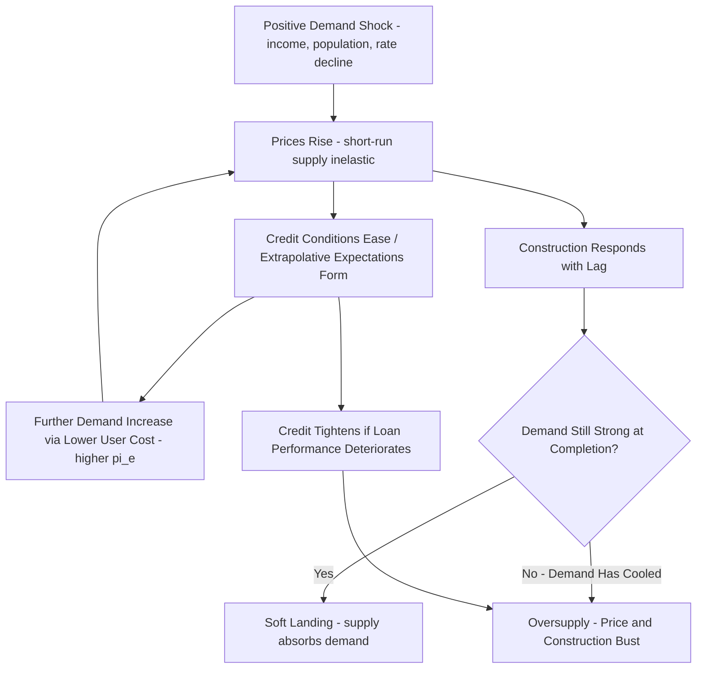

## Housing Market Cycles and Bubbles

### Overview

Housing market cycles describe the recurring pattern of price and construction booms and busts observed in housing markets over time, while housing bubbles refer to episodes where prices rise substantially above levels justified by underlying fundamentals before undergoing a sharp correction. Understanding cycles and bubbles requires integrating asset-pricing theory (housing as a durable, imperfectly arbitraged asset), supply-side construction lag dynamics, credit market conditions, and — in the bubble literature specifically — behavioral and expectations-formation mechanisms that can generate temporary but substantial departures from fundamental value.

### Housing as an Asset: The Fundamental Value Framework

**Key Points**

- Standard asset-pricing theory treats the fundamental value of a housing unit as the present discounted value of the future flow of housing services (rents, whether actually collected or imputed for owner-occupiers) it will generate
- The user-cost/asset-pricing identity links the house price to the rental flow via the capitalization rate (user cost rate): $P_H = R / UC\_rate$, meaning fundamental price should move with expected future rents and the discount/user-cost rate, not independently of them
- A "bubble" in the technical asset-pricing sense refers to a component of price that exceeds the present value of the asset's fundamental cash flows — i.e., $P_t = P_t^{fundamental} + B_t$, where $B_t$ is a bubble component sustained only by expectation of future price appreciation rather than by underlying rental/service value

The fundamental value of a housing asset via discounted cash flow:

$$P_H^{fundamental} = \sum_{t=0}^{\infty} \frac{E[R_t]}{(1+r)^t}$$

where $E[R_t]$ is expected future rental/service flow and $r$ is the appropriate discount rate. A rational bubble component, if present, must satisfy:

$$E_t[B_{t+1}] = (1+r) B_t$$

meaning the bubble is expected to grow at the discount rate to compensate holders for the risk it may burst — a mathematically coherent but economically fragile structure, since it requires ever-growing willingness to pay with no anchor in fundamentals.

### The Standard Real Estate Cycle: Supply-Lag Mechanism

**Key Points**

- Independent of bubble dynamics, housing markets exhibit a well-documented cyclical pattern driven by the interaction of long construction lags with demand shocks — this is sometimes formalized in cobweb-model-style dynamics, where current construction decisions respond to current (or recently past) prices, but the resulting supply only materializes with a multi-year lag, by which point demand conditions may have changed
- A positive demand shock raises prices immediately (short-run supply is inelastic), which signals developers to initiate new construction; because construction takes years to complete, by the time the resulting supply comes online, it may coincide with either continued strong demand (soft landing) or a demand slowdown (oversupply and subsequent price/construction bust) — this lag-driven overshoot is a structural feature of real estate cycles distinct from any behavioral bubble mechanism
- This supply-lag cyclicality means that housing construction (starts, permits) is a leading indicator often used in macroeconomic cycle analysis, and that housing cycles are commonly longer in duration than typical business cycles, given the multi-year gestation period of large-scale construction projects

### Diagram: Real Estate Cycle Phases (svg_diagram)

<svg xmlns="http://www.w3.org/2000/svg" viewBox="0 0 680 420">
<text x="340" y="24" text-anchor="middle" font-size="16" font-weight="bold">Real Estate Cycle Phases (svg_diagram)</text>
<line x1="70" y1="370" x2="620" y2="370" stroke="black" stroke-width="2" />
<line x1="70" y1="370" x2="70" y2="30" stroke="black" stroke-width="2" />
<text x="345" y="400" text-anchor="middle" font-size="13">Time</text>
<text x="30" y="200" text-anchor="middle" font-size="13" transform="rotate(-90 30 200)">Price / Construction Activity</text>
<path d="M 90 300 Q 200 100 320 70 Q 420 60 480 180 Q 550 300 600 330" stroke="#d62728" stroke-width="3" fill="none" />
<text x="330" y="55" font-size="12" fill="#d62728">Price</text>
<path d="M 90 330 Q 250 280 350 150 Q 450 90 550 250" stroke="#1f77b4" stroke-width="3" stroke-dasharray="5" fill="none" />
<text x="450" y="85" font-size="12" fill="#1f77b4">Construction Starts (lagged response)</text>

<text x="110" y="345" font-size="11">Recovery</text>

<text x="250" y="345" font-size="11">Expansion</text>

<text x="380" y="345" font-size="11">Hyper-Supply</text>

<text x="510" y="345" font-size="11">Recession</text>

</svg>

### Credit Channel and Leverage Amplification

**Key Points**

- Because most housing purchases are leveraged via mortgage debt, credit availability and underwriting standards are a first-order driver of housing cycle amplitude: loosening credit conditions (lower down payment requirements, expanded eligibility, lower rates) expand the pool of qualified buyers and effective demand, pushing prices up, while credit tightening has the reverse effect
- The 2000s US housing boom and subsequent 2007-2009 bust is widely analyzed as a case study in credit-driven amplification, where expansion of non-traditional mortgage products and securitization broadened credit access, contributing to rapid price appreciation, followed by a sharp credit contraction and price decline as underlying loan performance deteriorated [Unverified — the relative causal weight of credit expansion versus other contributing factors, such as monetary policy, securitization market structure, and regulatory gaps, remains a subject of extensive and ongoing academic and policy debate; cite specific causal claims only from named primary studies]
- Leverage mechanically amplifies both the upside and downside of house price movements for homeowner equity (as shown in the leveraged-return illustration in the tenure choice discussion), meaning credit-fueled price booms tend to be associated with disproportionately severe wealth effects during subsequent corrections, particularly for highly leveraged recent buyers who face negative equity risk

### Expectations, Extrapolation, and Behavioral Mechanisms

**Key Points**

- Adaptive/extrapolative expectations models posit that households and investors partly form expectations of future price appreciation by extrapolating recent price trends, rather than through fully rational forward-looking assessment of fundamentals — this creates a feedback mechanism where rising prices generate expectations of further increases, temporarily boosting demand and sustaining the price rise (a self-reinforcing dynamic)
- Case and Shiller's survey-based research on homebuyer expectations during historical boom periods found evidence that a substantial share of buyers held very high short-term price appreciation expectations extending years into the future, a pattern more consistent with extrapolative than fully rational expectations formation [Unverified — cite specific survey findings and magnitudes only from the named primary studies, as this is empirical survey evidence specific to studied time periods and markets]
- Recall from the user-cost framework that expected appreciation $\pi^e$ directly lowers user cost and raises quantity/price demanded — this creates the formal channel by which extrapolative expectations translate into actual price effects through the standard demand-side mechanism, rather than being a separate, unmodeled behavioral add-on
- Narrative economics approaches (associated with Shiller's broader work) argue that popularly circulating stories about "real estate always going up" or specific boom narratives can themselves become a self-fulfilling social mechanism amplifying price momentum beyond what any single household's private information would justify [Unverified — this is a less formally testable theoretical framework relative to standard empirical asset-pricing approaches, and should be treated as one interpretive lens among several rather than an established quantitative model]

### Bubble Identification: Empirical Challenges

**Key Points**

- Definitively identifying a bubble in real time is econometrically difficult because it requires distinguishing a genuine departure from fundamentals from a fundamentals shift that is simply hard to observe or measure (e.g., a genuine shift in expected long-run interest rates, migration patterns, or income growth can rationally justify a large price increase without any bubble component)
- Common empirical indicators used to flag potential overvaluation include elevated price-to-rent ratios relative to historical norms, elevated price-to-income ratios, rapid price appreciation outpacing rental growth, and survey evidence of extrapolative buyer expectations — but no single indicator is definitive, and researchers generally treat these as risk signals rather than conclusive bubble proof
- Ex-post identification (after a sharp correction has occurred) is comparatively more straightforward, but this asymmetry means the bubble literature is disproportionately built on hindsight-informed case studies, creating potential survivorship/confirmation bias in how "bubble" episodes are selected for study [Inference — this methodological asymmetry is a recognized epistemological challenge in the bubble-identification literature broadly, not specific to housing]

### Housing Cycle Amplification Mechanism Flow (Mermaid)

### Regional Variation in Cycle Severity

**Key Points**

- Supply-constrained metro areas (low elasticity, per the Saiz/Glaeser-Gyourko literature) tend to exhibit larger price cycle amplitude in response to demand shocks, since limited construction response channels demand volatility disproportionately into price rather than quantity adjustment
- Elastic-supply metro areas tend to exhibit comparatively muted price cycles but larger construction/quantity cycle amplitude, since developers can and do respond to price signals with substantial new supply, which itself can overshoot if demand growth reverses mid-construction-cycle
- This regional heterogeneity means that "housing bubble" and "housing cycle" analysis conducted at a national aggregate level can mask substantially different underlying dynamics across metro areas with different supply elasticity regimes, a point emphasized in post-2008 academic re-analyses of the US housing boom-bust episode [Unverified — cite specific regional comparison findings only from named primary studies]

### Policy and Macroprudential Considerations

**Key Points**

- Because housing cycles are credit-amplified and systemically significant (housing is typically the largest asset class for most households and a major component of bank balance sheets), macroprudential policy tools (loan-to-value limits, debt-to-income underwriting standards, countercyclical capital buffers) have been increasingly used or discussed internationally as tools to dampen credit-driven housing cycle amplitude, distinct from monetary policy's broader interest-rate tool
- Central bank interest rate policy affects housing cycles through the user-cost channel (lower rates reduce user cost, raising prices and construction incentive) but is a blunt instrument affecting the entire economy, motivating the separate development of housing-specific macroprudential tools that can be targeted more narrowly at credit conditions in the mortgage market specifically
- There is a general recognition in the post-2008 academic and policy literature that housing cycle amplitude has systemic macroeconomic and financial-stability implications beyond the housing market itself, given housing wealth effects on consumption and the centrality of mortgage-related assets to financial institution balance sheets [Inference — this is a widely shared conclusion following the 2007-2009 experience, though the specific optimal calibration of macroprudential tools remains an active area of policy research and debate]

### Conclusion

Housing market cycles combine a structural supply-lag mechanism (construction responding to price signals only after a multi-year delay) with credit-channel amplification and, in bubble episodes specifically, extrapolative expectations that can temporarily push prices above levels justified by discounted future rental/service flows. While standard asset-pricing theory provides the fundamental-value benchmark against which bubbles are conceptually defined, real-time empirical identification of a bubble remains genuinely difficult, and researchers generally rely on a combination of valuation ratios, expectations survey evidence, and credit condition indicators as risk signals rather than definitive proof — with regional supply elasticity a key factor shaping how demand volatility manifests as price versus quantity cycle amplitude across different housing markets.

**Related Topics**

- User cost of capital and the role of expected appreciation in housing demand
- Housing supply elasticity and construction lag dynamics
- Credit markets, mortgage underwriting, and leverage amplification
- Price-to-rent and price-to-income ratios as valuation indicators
- Extrapolative expectations and behavioral asset pricing
- Macroprudential policy tools (loan-to-value limits, countercyclical buffers)
- The 2007-2009 US housing market boom-bust as a case study
- Homeownership versus renting decisions and leveraged asset exposure