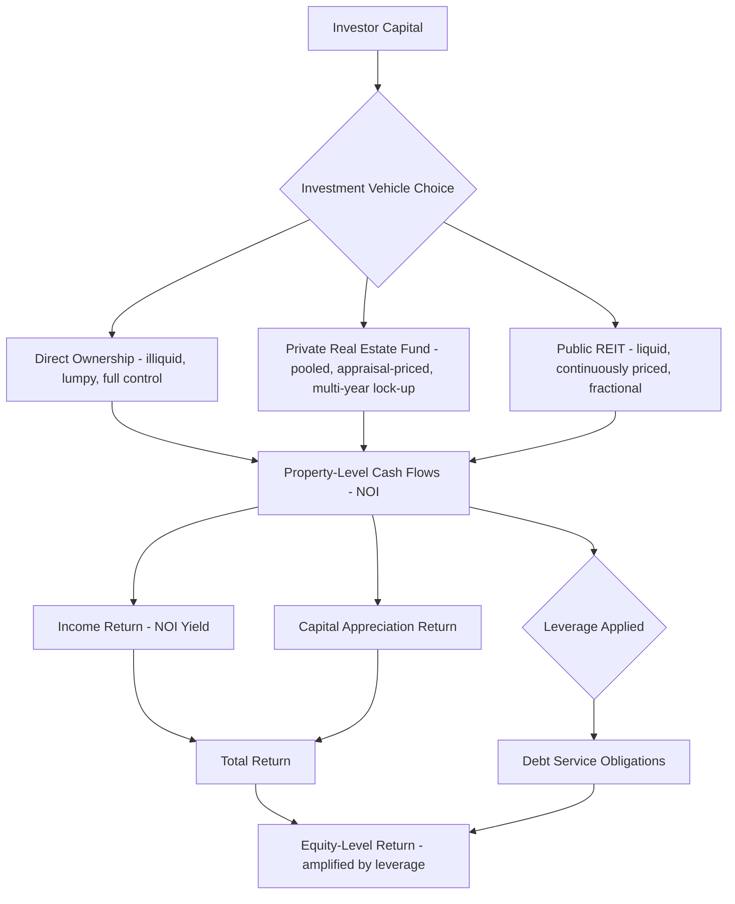

## Real Estate as an Asset Class

### Overview

Real estate occupies a distinctive position in portfolio theory and asset pricing, combining features of both a consumption/production good and a financial asset. Unlike equities or bonds, real estate is heterogeneous, illiquid, spatially fixed, and typically transacted infrequently with high search and transaction costs — properties that fundamentally shape how it is valued, how its risk-return profile is measured, and how it fits within a diversified investment portfolio. This topic surveys real estate's defining asset characteristics, its risk-return properties, valuation approaches, and its role in institutional and household portfolios.

### Defining Characteristics Relative to Other Asset Classes

**Key Points**

- Heterogeneity: unlike a share of stock (fungible and identical to every other share of the same class), every real estate asset is unique in location, physical characteristics, and legal/tenancy status, meaning there is no single "market price" observable at any moment — prices must be inferred from infrequent comparable transactions or appraisals
- Illiquidity: real estate transactions involve substantial search time, due diligence, financing arrangement, and legal closing processes, typically taking weeks to months to complete, in sharp contrast to near-instantaneous execution in public equity or bond markets
- High transaction costs: brokerage commissions, legal fees, transfer taxes, and financing costs commonly represent a substantial percentage of asset value per transaction (round-trip), far exceeding the basis-point-level costs typical of liquid public securities trading
- Indivisibility/lumpiness: direct real estate investment typically requires large minimum capital commitments per asset, limiting direct-ownership diversification for all but the largest institutional investors — a friction addressed by securitized vehicles (see below)
- Local/idiosyncratic risk: real estate returns are heavily influenced by local market conditions (employment, supply pipeline, regulatory environment) in addition to broad macroeconomic factors, creating a risk profile with a large idiosyncratic/location-specific component relative to systematic market risk

### Direct vs. Securitized Real Estate Investment

**Key Points**

- Direct/private real estate investment involves outright ownership of physical property (or a stake in a private fund holding physical property), offering maximum control and direct exposure but suffering the illiquidity, lumpiness, and high transaction cost characteristics described above
- Real Estate Investment Trusts (REITs) are publicly traded securities that hold portfolios of income-producing real estate, allowing investors to gain diversified real estate exposure with equity-market-level liquidity, fractional investment size, and continuous price discovery — REITs must generally satisfy specific structural requirements (e.g., distributing a high share of taxable income to shareholders, asset/income composition tests) that vary by jurisdiction's REIT regime [Unverified — specific REIT qualification requirements are jurisdiction-specific and subject to legislative change; verify against current regulations for any applied analysis]
- Private real estate funds (opportunistic, value-add, and core strategies) occupy a middle ground: pooled capital vehicles providing diversification across multiple properties and professional management, but retaining private-market illiquidity (typically multi-year lock-up periods) and periodic-appraisal-based rather than continuous market pricing
- This distinction — public/securitized vs. private/direct — is central to understanding observed differences in measured volatility and correlation properties of real estate returns across data sources, discussed further below

### Risk-Return Profile and Portfolio Role

**Key Points**

- Real estate is conventionally positioned in portfolio theory between bonds and equities on the risk-return spectrum: offering relatively stable income yield (rental cash flow) combined with potential capital appreciation, though the specific risk-return ranking varies by property type, leverage level, and market segment
- Private/direct real estate return series (based on appraisal-based indices) typically exhibit lower measured volatility and lower correlation with public equities than REIT return series, but this is substantially attributable to "appraisal smoothing" — appraisals are updated infrequently and tend to lag true market-clearing price movements, artificially dampening measured volatility and correlation relative to a hypothetical continuously-traded price series
- REIT returns, being continuously priced in public markets, exhibit higher measured volatility and higher short-run correlation with broader equity markets than appraisal-based private real estate indices, though over longer horizons REIT returns are generally understood to reflect the same underlying property market fundamentals as private real estate — the difference is largely a measurement/pricing-frequency artifact rather than a fundamentally different risk exposure [Unverified — the precise degree to which de-smoothed private returns converge with REIT return properties varies across studies and de-smoothing methodologies]
- This "appraisal smoothing" problem is a well-recognized methodological issue in real estate finance research, addressed through various statistical de-smoothing/unsmoothing techniques that attempt to recover an estimate of the true underlying volatility and correlation properties from lagged, appraisal-based data series

### Diagram: Return Series Comparison — Smoothed vs. Unsmoothed (svg_diagram)

<svg xmlns="http://www.w3.org/2000/svg" viewBox="0 0 680 400">
<text x="340" y="24" text-anchor="middle" font-size="16" font-weight="bold">Appraisal Smoothing: Reported vs. True Returns (svg_diagram)</text>
<line x1="70" y1="350" x2="620" y2="350" stroke="black" stroke-width="2" />
<line x1="70" y1="350" x2="70" y2="30" stroke="black" stroke-width="2" />
<text x="345" y="380" text-anchor="middle" font-size="13">Time</text>
<text x="30" y="190" text-anchor="middle" font-size="13" transform="rotate(-90 30 190)">Return / Value Index</text>
<path d="M 90 200 L 150 195 L 210 205 L 270 190 L 330 210 L 390 180 L 450 220 L 510 170 L 570 230" stroke="#d62728" stroke-width="2" fill="none" />
<text x="450" y="160" font-size="12" fill="#d62728">True Market Value (volatile, REIT-like)</text>
<path d="M 90 200 Q 250 202 400 198 Q 500 197 570 199" stroke="#1f77b4" stroke-width="3" fill="none" />
<text x="200" y="230" font-size="12" fill="#1f77b4">Appraisal-Based Index (smoothed, lagged)</text>
</svg>

### Income Return and Capital Appreciation Decomposition

**Key Points**

- Total real estate return is conventionally decomposed into income return (net operating income yield relative to asset value, analogous to a dividend yield) and capital appreciation return (change in asset value over the period), allowing performance comparison across property types with different income-versus-growth return profiles
- Core/stabilized properties (well-leased, low-risk assets in established markets) typically emphasize income return as the dominant component of total return, appealing to investors seeking bond-like stable cash flow
- Value-add and opportunistic strategies (properties requiring renovation, releasing, or repositioning) typically target a larger share of total return from capital appreciation, accepting higher risk and lower current income yield in exchange for higher expected total return

Total return decomposition:

$$R_{total} = \frac{NOI_t}{V_{t-1}} + \frac{V_t - V_{t-1}}{V_{t-1}}$$

where $NOI_t$ is net operating income in period $t$ and $V_t$ is asset value at time $t$ — the first term is income return, the second is capital appreciation return.

### Cap Rates as the Central Valuation Metric

**Key Points**

- The capitalization rate ("cap rate") is the standard income-property valuation metric, defined as the ratio of stabilized net operating income to current asset value, functioning as an inverse valuation multiple (lower cap rate = higher price relative to income, analogous to a higher price-earnings multiple in equity valuation)
- Cap rates move inversely with asset prices for a given income stream and are influenced by the risk-free rate, required risk premium for the specific property type/location, expected NOI growth, and liquidity conditions — theoretically connecting cap rate levels to the same discount-rate and growth-expectation fundamentals underlying the housing user-cost framework
- Cap rate spreads relative to risk-free benchmark yields (e.g., government bond yields) are commonly used by practitioners as a relative-value indicator across property types and markets, with compressed spreads sometimes interpreted as a signal of elevated valuation risk, analogous to credit spread compression signals in fixed income markets [Unverified — interpretation of any specific cap rate spread level as indicating over/undervaluation is practitioner heuristic rather than a rigorously validated academic threshold]

The cap rate and its relationship to value:

$$\text{Cap Rate} = \frac{NOI}{V} \quad \Rightarrow \quad V = \frac{NOI}{\text{Cap Rate}}$$

Under a stabilized-growth (Gordon-growth-style) assumption, the cap rate relates to the discount rate and expected growth:

$$\text{Cap Rate} = r - g$$

where $r$ is the required rate of return and $g$ is expected NOI growth.

### Property Type Segmentation

**Key Points**

- Institutional real estate investment is conventionally segmented into core property types — office, industrial/logistics, multifamily/apartment, and retail — each with distinct demand drivers, lease structures (lease term length, tenant credit quality, rent escalation clauses), and cyclicality relative to broader economic conditions
- Industrial/logistics real estate has seen substantial institutional capital inflow in recent years tied to e-commerce and supply-chain reconfiguration demand growth, while traditional retail (particularly enclosed mall format) has faced structural headwinds from e-commerce substitution in many markets [Unverified — sector-specific demand trends are dynamic and should be verified against current market data for any applied investment analysis]
- Beyond the four core sectors, "alternative" real estate sectors (data centers, self-storage, senior/medical housing, student housing, single-family rental portfolios) have grown as distinct institutional investment categories, each with property-type-specific demand drivers and risk characteristics

### Leverage and Capital Structure in Real Estate Investment

**Key Points**

- Real estate investment is conventionally highly leveraged relative to typical corporate or equity investment, with debt financing (commercial mortgages, construction loans) commonly covering a substantial share of asset value, amplifying equity-level returns (and losses) relative to unleveraged property-level returns — the same leverage-amplification mechanism discussed in the homeownership tenure-choice context, applied here at the institutional/commercial scale
- Debt service coverage ratio (DSCR) and loan-to-value (LTV) ratio are standard underwriting metrics used by lenders to assess repayment capacity and collateral cushion, with covenant thresholds on these ratios commonly embedded in commercial mortgage agreements
- Capital structure decisions in real estate investment (leverage level, fixed vs. floating rate debt, debt term relative to hold period) directly affect the risk-return profile delivered to equity investors and are a central lever in real estate investment strategy, distinct from but interacting with the underlying property-level fundamentals

### Real Estate Investment Structure Flow (Mermaid)

### Diversification Properties and Inflation Hedging

**Key Points**

- Real estate is frequently cited in the institutional investment literature as offering diversification benefits within a mixed-asset portfolio due to imperfect correlation with public equities and bonds, though as noted above, the measured degree of diversification benefit is sensitive to whether appraisal-based (smoothed) or transaction/REIT-based (unsmoothed) return series are used in the analysis
- Real estate income streams (particularly those with lease structures including rent escalation clauses tied to inflation indices) are commonly cited as offering a partial inflation hedge, since nominal rental income and property values have historically tended to rise with general price levels over sufficiently long horizons [Unverified — the strength and consistency of real estate's inflation-hedging property varies across studies, time periods, and property types, and is not a uniformly established empirical constant]
- Institutional portfolio allocation frameworks (endowment/pension "modern portfolio theory extended" approaches) commonly include a real estate allocation specifically for its combination of income yield, partial inflation-hedging characteristics, and diversification benefit relative to public equity and fixed income, though optimal allocation percentages are model- and institution-specific rather than a single universally agreed figure

### Valuation Approaches Beyond Cap Rate Capitalization

**Key Points**

- Discounted cash flow (DCF) valuation projects a multi-year pro forma of property-level cash flows (accounting for lease rollover, releasing assumptions, capital expenditure) and discounts them at a property-specific required return, generally used for properties with more complex or non-stabilized cash flow profiles than a simple direct capitalization approach assumes
- Sales comparison (comparable transactions) approach values a property by reference to recent transaction prices of similar assets, analogous to the hedonic comparable-sales logic applied in residential housing valuation, adjusted for differences in location, condition, and lease terms
- Replacement cost approach estimates value based on the cost to reconstruct the property new, less depreciation, plus land value — most relevant for unique-use properties lacking comparable sales or stabilized income (e.g., specialized industrial facilities) and conceptually connects to the "regulatory tax" gap analysis used in housing supply-constraint research (comparing market price to replacement cost)

### Conclusion

Real estate's status as an asset class rests on a distinctive combination of features — heterogeneity, illiquidity, high transaction costs, and a large local/idiosyncratic risk component — that differentiate it from standard liquid financial assets and require specialized valuation tools (cap rate capitalization, DCF, comparable sales) and measurement approaches (with particular attention to appraisal-smoothing effects in private-market return data). Its role in institutional and household portfolios is typically justified by income yield, partial diversification benefits, and potential inflation-hedging characteristics, delivered through a spectrum of investment vehicles ranging from direct ownership to publicly traded REITs, each offering a different tradeoff between liquidity, control, and measured risk-return properties.

**Related Topics**

- Capitalization rates and income-property valuation methodology
- REITs: structure, regulation, and public market pricing
- Appraisal smoothing and de-smoothing techniques in private real estate indices
- Commercial real estate leverage, DSCR, and loan underwriting
- Property type segmentation: office, industrial, multifamily, retail, alternatives
- Portfolio diversification theory applied to alternative asset classes
- Discounted cash flow valuation for non-stabilized properties
- User cost of capital and its connection to cap rate fundamentals