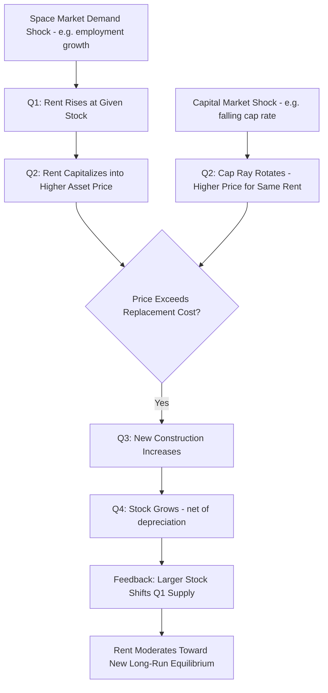

## The DiPasquale-Wheaton Four-Quadrant Model

### Overview

The DiPasquale-Wheaton four-quadrant model (DiPasquale and Wheaton, 1992) is a graphical framework linking the real estate space market (where space is leased and occupied) with the asset market (where real estate as a financial asset is bought and sold), integrating rent determination, asset pricing, construction activity, and stock adjustment into a single closed-loop diagram. It is a foundational teaching and analytical tool in real estate economics because it makes explicit how rents, prices, and the physical stock of real estate are jointly and dynamically determined in long-run equilibrium.

### Conceptual Structure: Two Markets, Four Quadrants

**Key Points**

- The model separates the real estate market into two conceptually distinct but linked markets: the space market (top half of the diagram), where the demand and supply of physical space determine market rent, and the asset market (bottom half), where the demand and supply of real estate as a capital asset determine property price and, ultimately, new construction
- The four quadrants proceed sequentially in a clockwise (or counterclockwise, depending on diagram orientation convention) loop: (1) rent determination in the space market, (2) asset pricing via capitalization of rent, (3) construction determination as a function of asset price relative to replacement cost, and (4) stock adjustment as new construction (net of depreciation) feeds back into the space market
- The elegance of the model lies in closing the loop: stock adjustment in quadrant four feeds back into quadrant one's space market supply curve, meaning the model captures the full dynamic interaction between flow variables (construction, absorption) and stock variables (the total space inventory) rather than treating them as independent

### Quadrant One: Space Market Rent Determination

**Key Points**

- Quadrant one plots the relationship between the stock of space (horizontal axis) and market rent (vertical axis), with a downward-sloping demand curve for space representing the relationship between occupied stock and the rent tenants are willing to pay — analogous to a standard demand curve, but here demand for space is driven by underlying economic activity (employment, output, population) rather than by price alone
- The demand curve for space is typically drawn as a function of both rent and an exogenous economic activity variable (e.g., regional employment or GDP); an increase in the activity variable shifts the entire demand curve outward, raising the market-clearing rent for a given stock level
- Given a fixed short-run stock of space (vertical supply in the very short run, since new construction takes time), market rent is determined by the intersection of the demand curve with the existing stock — this rent is the space market's equilibrium signal, analogous to the rent-vs-user-cost tension in housing markets but generalized to all commercial and residential property types

The space market equilibrium rent as a function of stock and demand shifters:

$$R = f(S, D)$$

where $S$ is the existing stock of space and $D$ represents demand shifters (employment, GDP, population). Holding $D$ fixed, rent falls as stock $S$ increases (more space chasing the same demand); holding $S$ fixed, rent rises as $D$ increases.

### Quadrant Two: Asset Market — Capitalizing Rent into Price

**Key Points**

- Quadrant two translates market rent (vertical axis, shared with quadrant one) into asset price (horizontal axis) via a capitalization ray — a straight line through the origin whose slope is the inverse of the capitalization rate, reflecting the standard income-capitalization valuation logic ($V = NOI / \text{Cap Rate}$, or here $V = R / \text{Cap Rate}$)
- The capitalization rate embedded in this ray is determined by capital market conditions: the risk-free rate, the required risk premium for real estate as an asset class, and expected future rent growth — a lower cap rate (flatter/steeper ray depending on axis convention) implies a higher asset price for any given level of current rent, directly connecting the model to the discount-rate and growth-expectation fundamentals discussed in real estate asset-pricing theory
- This quadrant is where capital market conditions (interest rates, investor risk appetite, availability of capital for real estate investment) enter the model and transmit into asset prices — a shift in the cap rate (e.g., due to falling interest rates) rotates the capitalization ray and changes the price implied by any given rent level, independent of any change in the underlying space market fundamentals

The capitalization relationship:

$$P = \frac{R}{\text{Cap Rate}}$$

A lower cap rate increases $P$ for a given $R$, illustrating how capital market conditions (not just space market fundamentals) drive asset prices.

### Quadrant Three: Construction as a Function of Asset Price

**Key Points**

- Quadrant three plots asset price (vertical axis, shared with quadrant two) against new construction (horizontal axis), representing the developer's decision to build additional space as a function of the price that space can command once completed relative to the cost of constructing it
- The construction curve typically reflects a replacement-cost relationship: developers will build additional space up to the point where asset price equals the marginal cost of construction (land plus hard and soft costs), analogous to a supply curve in the asset market for newly produced space, with the curve's slope reflecting how construction costs rise with the pace/volume of building activity (capacity constraints in the construction industry, rising land costs at higher density)
- When asset price exceeds replacement cost, construction is profitable and occurs; when asset price falls below replacement cost, new construction is not economically justified and development activity slows or halts — this is the direct mechanism linking asset market pricing back to physical supply decisions, paralleling the developer cost-minimization logic in housing supply theory

The construction decision rule:

$$\text{Build if: } P > MC_{construction}(C)$$

where $C$ is the quantity of new construction and $MC_{construction}$ is the marginal cost function, generally increasing in $C$ due to capacity and land-cost constraints.

### Quadrant Four: Stock Adjustment

**Key Points**

- Quadrant four plots new construction (vertical axis, shared with quadrant three) against the total stock of space (horizontal axis, shared with quadrant one), closing the loop by showing how new construction, net of depreciation/demolition of existing stock, determines the change in total stock over time
- The stock adjustment relationship is essentially an accounting identity linking the flow of new construction to the change in the stock variable, with a depreciation/removal rate determining how much of the existing stock exits use each period (through obsolescence, demolition, or conversion) — connecting directly to the filtering and depreciation concepts discussed in housing stock dynamics
- This quadrant feeds back into quadrant one: the new (larger) stock level shifts the space-market supply, generating a new equilibrium rent in the next period, which then propagates back through quadrants two and three — this is what makes the model dynamic rather than a static one-shot equilibrium picture

The stock adjustment identity:

$$S_{t} = S_{t-1}(1 - \delta) + C_{t}$$

where $\delta$ is the depreciation/removal rate and $C_t$ is new construction completed in period $t$.

### Diagram: The Four-Quadrant Model Structure (svg_diagram)

<svg xmlns="http://www.w3.org/2000/svg" viewBox="0 0 680 680">
<text x="340" y="24" text-anchor="middle" font-size="16" font-weight="bold">DiPasquale-Wheaton Four-Quadrant Model (svg_diagram)</text>
<line x1="340" y1="60" x2="340" y2="620" stroke="black" stroke-width="1.5" />
<line x1="60" y1="340" x2="620" y2="340" stroke="black" stroke-width="1.5" />

<text x="345" y="75" font-size="12" font-weight="bold">Rent (R)</text>

<text x="500" y="335" font-size="12" font-weight="bold">Stock (S)</text>

<text x="345" y="610" font-size="12" font-weight="bold">Price (P)</text>

<text x="120" y="335" font-size="12" font-weight="bold">New Construction (C)</text>

<text x="450" y="100" font-size="13" fill="`#1f77b4`" font-weight="bold">Q1: Space Market</text>

<path d="M 340 100 Q 450 150 600 260" stroke="`#1f77b4`" stroke-width="2.5" fill="none" />

<text x="440" y="180" font-size="11" fill="`#1f77b4`">Demand for Space</text>

<text x="150" y="100" font-size="13" fill="`#2ca02c`" font-weight="bold">Q2: Asset Market</text>

<line x1="340" y1="100" x2="80" y2="340" stroke="`#2ca02c`" stroke-width="2.5" />

<text x="130" y="230" font-size="11" fill="`#2ca02c`">Cap Rate Ray</text>

<text x="150" y="600" font-size="13" fill="`#d62728`" font-weight="bold">Q3: Construction</text>

<path d="M 80 340 Q 150 450 340 560" stroke="`#d62728`" stroke-width="2.5" fill="none" />

<text x="120" y="470" font-size="11" fill="`#d62728`">Construction Cost Curve</text>

<text x="450" y="600" font-size="13" fill="`#9467bd`" font-weight="bold">Q4: Stock Adjustment</text>

<line x1="340" y1="560" x2="600" y2="340" stroke="`#9467bd`" stroke-width="2.5" />

<text x="480" y="470" font-size="11" fill="`#9467bd`">Stock = f(Construction, Depreciation)</text>

<path d="M 320 90 L 340 100 L 320 110" stroke="black" stroke-width="1.5" fill="none" />
<path d="M 70 330 L 80 340 L 90 330" stroke="black" stroke-width="1.5" fill="none" />
<path d="M 330 570 L 340 560 L 350 570" stroke="black" stroke-width="1.5" fill="none" />
<path d="M 610 330 L 600 340 L 610 350" stroke="black" stroke-width="1.5" fill="none" />
</svg>

### Equilibrium and Comparative Statics

**Key Points**

- Long-run equilibrium in the model occurs when all four quadrants are mutually consistent: the rent generated by the space market (Q1) capitalizes (Q2) into an asset price that exactly justifies construction (Q3) at a level that, net of depreciation, holds the stock (Q4) constant — i.e., new construction exactly replaces depreciated/removed stock, so the stock level (and hence rent) is stable
- A demand shock (e.g., an increase in regional employment) shifts the Q1 demand curve outward, raising rent at the existing stock level; this higher rent capitalizes (Q2) into a higher asset price; if the new price exceeds replacement cost, construction (Q3) increases above the depreciation-replacement level, and the stock (Q4) grows over time, which then shifts the Q1 supply/stock back outward, gradually bringing rent back down toward a new long-run equilibrium level (assuming replacement cost/construction supply conditions are unchanged)
- A capital market shock (e.g., falling interest rates lowering the cap rate) rotates the Q2 capitalization ray without any initial change in the space market — asset prices rise for the same rent level, which can trigger increased construction (Q3) even without any change in underlying space market demand, illustrating how the model captures construction booms driven by capital market conditions distinct from space market fundamentals — a mechanism directly relevant to understanding real estate cycles where credit/capital conditions, not just occupier demand, drive construction activity

### Comparative Statics Shock Propagation (Mermaid)

### Applications and Analytical Uses

**Key Points**

- The model is widely used pedagogically to distinguish space-market-driven real estate cycles (occupier demand-led) from capital-market-driven cycles (credit/investor-appetite-led), since both can produce similar observed price increases but have different underlying causes and different implications for whether a construction boom is fundamentally justified
- It provides a structured framework for diagnosing whether a given market is in equilibrium, oversupplied (stock has overshot the level justified by current rent/demand fundamentals), or undersupplied (rent is elevated relative to what current stock would suggest, signaling construction has not yet caught up) — directly applicable to identifying real estate cycle phases (recovery, expansion, hyper-supply, recession) discussed in housing market cycle analysis
- The model can be applied at various geographic and property-type scales — from a single metro office market to a national industrial real estate market — provided the underlying demand, cap rate, and construction cost relationships are appropriately specified for that specific market segment

### Model Limitations and Extensions

**Key Points**

- The basic model is a comparative-static/long-run equilibrium framework and does not explicitly model the dynamic adjustment path with realistic time lags, expectations formation, or overshoot dynamics — subsequent literature has extended the model with explicit stock-flow dynamic simulation and rational/adaptive expectations to better capture cyclical overshoot behavior of the kind discussed in real estate cycle analysis
- The model assumes a well-functioning capitalization relationship (a stable, observable cap rate) and a well-defined replacement cost/construction supply curve, both of which can be difficult to specify accurately in markets with limited transaction data, appraisal-based pricing lags, or rapidly changing construction cost conditions
- Because the model treats the four relationships as relatively simple bivariate functions for pedagogical clarity, applied/empirical implementations often require richer specifications (e.g., explicitly incorporating vacancy rates, lease-up periods, heterogeneous space quality tiers) to match real-world market complexity, while retaining the model's core quadrant-based logical structure

### Conclusion

The DiPasquale-Wheaton four-quadrant model provides an integrated graphical framework linking the space market (occupier demand and rent determination) with the asset market (capitalization, construction, and stock adjustment), making explicit the feedback loop between flow variables (new construction) and stock variables (total space inventory) that drives real estate market dynamics over time. Its principal analytical contribution is cleanly separating space-market-driven price movements from capital-market-driven price movements — a distinction central to diagnosing the underlying causes of real estate booms, busts, and long-run equilibrium conditions across property types and markets.

**Related Topics**

- Capitalization rates and income-property valuation methodology
- Real estate as an asset class and the space-vs-asset-market distinction
- Housing market cycles and the supply-lag construction mechanism
- Filtering models and the stock depreciation/removal rate concept
- Housing supply elasticity and the construction cost/replacement cost curve
- Credit markets and capital-market-driven real estate cycles
- Commercial property type segmentation (office, industrial, multifamily, retail)
- Vacancy rates and lease-up dynamics in commercial real estate markets