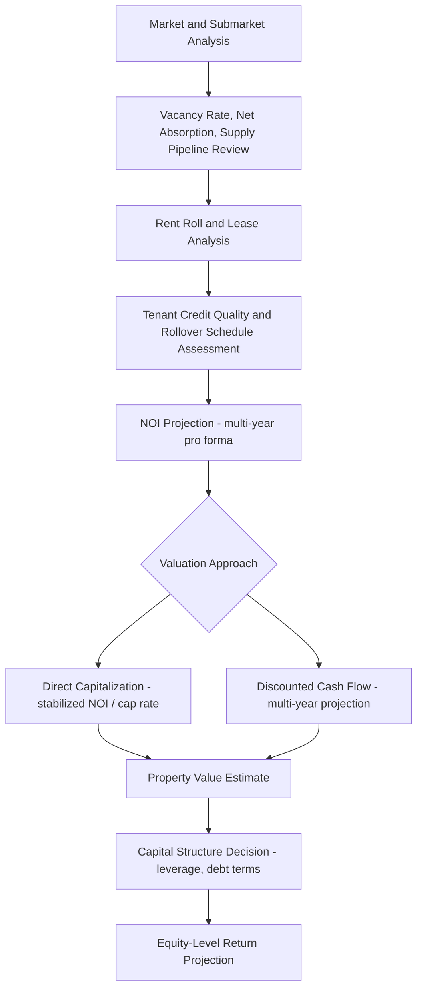

## Commercial Real Estate Markets

### Overview

Commercial real estate (CRE) markets encompass income-producing property held for business use rather than owner-occupied residential purposes, spanning office, industrial, retail, multifamily (treated as commercial for investment purposes despite residential end-use), and specialized/alternative property types. CRE markets are distinguished from residential housing markets by their lease-driven cash flow structures, institutional investor base, sophisticated underwriting practices, and closer analytical connection to regional and national economic activity through occupier demand tied to employment and output.

### Core Property Type Sectors

**Key Points**

- Office: space leased primarily to professional, financial, technology, and administrative tenants; demand is closely tied to office-using employment growth, and the sector has faced significant structural demand uncertainty in many markets following shifts toward remote and hybrid work arrangements [Unverified — the magnitude and persistence of remote-work-driven demand shifts vary substantially by market, submarket, and building quality tier, and remain an actively evolving empirical question; source specific vacancy/demand figures from current market data]
- Industrial/logistics: warehouses, distribution centers, and manufacturing facilities; demand drivers include broader goods consumption, supply-chain configuration (including reshoring/nearshoring trends), and e-commerce fulfillment infrastructure requirements, with proximity to transportation infrastructure (ports, highways, rail) a key locational determinant
- Retail: space leased to businesses selling goods/services directly to consumers, spanning formats from enclosed regional malls to open-air shopping centers to single-tenant net-lease properties; demand and format preferences have shifted substantially with e-commerce growth, with grocery-anchored and experiential/service-oriented retail generally viewed as more structurally resilient than traditional department-store-anchored mall formats [Unverified — retail sector performance is highly format- and location-specific; cite specific trend claims from current sector research]
- Multifamily/apartment: rental residential buildings held as income-producing investment assets; while the end product is residential housing, multifamily is analyzed using commercial real estate investment frameworks (cap rates, NOI, institutional ownership structures) distinct from the owner-occupied housing demand/supply models discussed elsewhere in this course
- Alternative/specialized sectors: data centers, self-storage, life sciences/lab space, senior and medical housing, student housing, and single-family rental portfolios — each with distinct demand drivers, lease structures, and specialized operational requirements that differentiate them from the four core traditional sectors

### Lease Structures and Cash Flow Mechanics

**Key Points**

- Commercial leases vary substantially in structure regarding which party bears operating expense risk: gross leases (landlord pays operating expenses, tenant pays a flat rent), net leases (tenant pays some/all operating expenses in addition to base rent — single, double, or triple net depending on which expense categories, typically taxes, insurance, and maintenance, are passed through), and modified gross leases (a negotiated split)
- Lease term length varies significantly by property type: office and industrial leases commonly run five to ten years or longer (particularly for larger tenants requiring build-out investment), retail leases vary by tenant type (anchor tenants often have longer terms than in-line/smaller tenants), while multifamily leases are typically short-term (commonly one year), giving multifamily owners more frequent opportunity to reset rents to market but also greater turnover-related cash flow variability
- Rent escalation clauses (fixed annual percentage increases, or increases indexed to inflation measures) are commonly embedded in longer-term commercial leases, directly affecting the income-growth assumption used in DCF valuation and connecting to the inflation-hedging properties discussed in real estate asset class analysis
- Tenant improvement (TI) allowances and leasing commissions represent significant upfront capital costs landlords incur to secure new leases, particularly in office and retail, and are a key component of the total cost of ownership that must be incorporated into accurate property-level return analysis

### Net Operating Income (NOI) and Property-Level Cash Flow

**Key Points**

- Net Operating Income is the standard commercial real estate cash flow metric, calculated as gross potential rental income less vacancy/credit loss, plus other income (parking, fees), less operating expenses — explicitly excluding debt service, capital expenditures, and income taxes, making it a property-level (unlevered) operating cash flow measure comparable across differently financed properties
- NOI is the input to both the direct capitalization valuation approach (as discussed in real estate as an asset class) and multi-year discounted cash flow analysis, making accurate NOI projection (rent roll analysis, vacancy/lease-rollover assumptions, expense growth assumptions) the central analytical task in commercial property underwriting

$$NOI = \text{Gross Potential Rent} - \text{Vacancy/Credit Loss} + \text{Other Income} - \text{Operating Expenses}$$

### Vacancy, Absorption, and Market Equilibrium

**Key Points**

- Vacancy rate (the share of total leasable space currently unoccupied) is the primary space-market health indicator in commercial real estate, analogous to the unemployment rate in labor economics, and is tracked at the market and submarket level by commercial real estate data providers and used extensively in the space-market (Quadrant One) analysis of the DiPasquale-Wheaton framework
- Net absorption measures the change in occupied space over a period (new leasing activity minus space vacated), serving as the flow-variable counterpart to the vacancy-rate stock variable, and is a key indicator of whether demand is currently outpacing or lagging the existing/newly delivered supply pipeline
- "Natural vacancy rate" is a concept analogous to the natural rate of unemployment — a structural equilibrium vacancy level below which rents tend to accelerate upward (landlords gain pricing power in a tight market) and above which rents tend to soften (oversupply relative to demand), varying by property type and market due to differing frictional vacancy needs (e.g., turnover/re-leasing time) [Unverified — specific natural vacancy rate estimates are market- and property-type-specific and should be sourced from named empirical studies rather than treated as a fixed universal constant]

### Diagram: Commercial Real Estate Market Analysis Framework (svg_diagram)

<svg xmlns="http://www.w3.org/2000/svg" viewBox="0 0 680 420">
<text x="340" y="24" text-anchor="middle" font-size="16" font-weight="bold">CRE Market Cycle Indicators (svg_diagram)</text>
<line x1="70" y1="370" x2="620" y2="370" stroke="black" stroke-width="2" />
<line x1="70" y1="370" x2="70" y2="30" stroke="black" stroke-width="2" />
<text x="345" y="400" text-anchor="middle" font-size="13">Time</text>
<text x="30" y="200" text-anchor="middle" font-size="13" transform="rotate(-90 30 200)">Rate / Level</text>
<line x1="70" y1="220" x2="620" y2="220" stroke="#888" stroke-dasharray="4" />
<text x="500" y="212" font-size="11" fill="#888">Natural Vacancy Rate</text>
<path d="M 90 100 Q 200 280 320 220 Q 450 150 580 260" stroke="#d62728" stroke-width="3" fill="none" />
<text x="420" y="145" font-size="12" fill="#d62728">Vacancy Rate</text>
<path d="M 90 320 Q 200 150 320 220 Q 450 300 580 180" stroke="#1f77b4" stroke-width="3" fill="none" />
<text x="420" y="320" font-size="12" fill="#1f77b4">Rent Growth</text>
</svg>

### Investor Types and Capital Sources

**Key Points**

- Institutional investors (pension funds, insurance companies, sovereign wealth funds, endowments) represent a major capital source for core and core-plus CRE strategies, typically seeking stable income and moderate risk, often accessed through private real estate funds or direct joint-venture ownership structures
- Private equity real estate funds pursue value-add and opportunistic strategies involving property repositioning, releasing, redevelopment, or ground-up development, targeting higher returns commensurate with the higher operational and execution risk relative to core strategies
- Publicly traded REITs provide liquid public-market access to diversified CRE portfolios (as discussed in real estate as an asset class), with sector-specific REITs (office REITs, industrial REITs, retail REITs, etc.) allowing investors to target specific property-type exposure through public markets
- Commercial mortgage lenders (banks, life insurance companies, commercial mortgage-backed securities/CMBS conduits, debt funds) provide the debt capital layer of CRE capital structures, with underwriting standards (loan-to-value, debt service coverage ratio requirements) directly affecting the leverage available to equity investors and, in aggregate, the overall credit conditions influencing CRE cycle dynamics

### Underwriting and Risk Assessment

**Key Points**

- Tenant credit quality is a central underwriting consideration distinct from residential housing analysis: a single-tenant property's value and risk profile depend heavily on that tenant's creditworthiness and lease term remaining, since default or non-renewal by a major tenant can substantially impair cash flow and value
- Lease rollover risk — the risk that leases expiring during a hold period will not be renewed, or will only be renewed at different (potentially lower) market rents, requiring re-leasing capital expenditure (tenant improvements, leasing commissions) — is a central analytical concern in commercial underwriting, particularly for office and retail properties with concentrated lease expiration schedules
- Market/submarket supply pipeline analysis (tracking under-construction and planned/proposed space) is essential underwriting due diligence, since new competitive supply delivering during a hold period can pressure both occupancy and achievable rents at a subject property, connecting directly to the Quadrant Three/Four construction and stock-adjustment dynamics of the DiPasquale-Wheaton framework

### Commercial Property Underwriting Process Flow (Mermaid)

### Commercial vs. Residential Market Distinctions

**Key Points**

- Commercial real estate markets are more directly and immediately linked to business cycle conditions than owner-occupied residential housing, since occupier demand for office, industrial, and retail space derives from business activity (employment, output, consumption) rather than household formation and consumption preferences, creating a generally shorter and more cyclically sensitive demand-response lag
- Data availability and market transparency differ significantly: institutional-grade CRE benefits from extensive third-party market data tracking (vacancy, absorption, asking/effective rents, cap rate surveys) provided by commercial real estate data and brokerage firms, while comparable granular data for smaller/private residential rental markets is often less systematically available
- Financing structures differ substantially: commercial mortgages typically involve shorter amortization/balloon structures, recourse/non-recourse distinctions, and covenant-based lending (DSCR, LTV triggers) that are largely absent from standard residential owner-occupied mortgage products, reflecting the different risk assessment approach applied to income-producing investment property versus owner-occupied housing

### Cyclicality and Sector-Specific Structural Trends

**Key Points**

- CRE sectors exhibit differentiated cyclicality: industrial/logistics demand has historically shown strong correlation with goods consumption and trade volumes, office demand with professional/financial services employment, and retail with consumer spending patterns and format-specific competitive dynamics (e-commerce substitution effects)
- Beyond cyclical demand fluctuation, several CRE sectors face structural (secular) demand shifts operating independently of the business cycle: remote/hybrid work affecting office space utilization ratios, e-commerce affecting retail format preferences and simultaneously driving industrial/logistics demand, and demographic shifts affecting senior housing and student housing demand — distinguishing cyclical from structural demand change is a central and often difficult analytical task in CRE market forecasting [Unverified — the relative magnitude of cyclical versus structural drivers in any specific current market condition should be assessed against up-to-date market data rather than assumed from historical patterns alone]

### Conclusion

Commercial real estate markets combine the general real estate asset-market principles (capitalization, leverage, cyclicality) discussed in prior topics with sector-specific lease structures, tenant credit considerations, and demand drivers tied closely to business activity and evolving structural trends across office, industrial, retail, multifamily, and alternative property types. Effective analysis of CRE markets requires integrating space-market indicators (vacancy, absorption, supply pipeline) with asset-market valuation methodology (NOI-based capitalization and DCF) and capital-structure considerations (leverage, tenant credit risk, lease rollover), making the DiPasquale-Wheaton four-quadrant framework and cap-rate-based valuation tools directly applicable analytical foundations for the sector-specific dynamics surveyed here.

**Related Topics**

- The DiPasquale-Wheaton four-quadrant model applied to sector-specific space markets
- Real estate as an asset class: REITs, private funds, and direct ownership
- Net operating income, capitalization rates, and DCF valuation methodology
- Vacancy rates, net absorption, and natural vacancy rate concepts
- Commercial mortgage underwriting: LTV, DSCR, and lease rollover risk
- Structural demand shifts: remote work, e-commerce, and supply-chain reconfiguration
- Real estate market cycles and capital-market-driven construction booms
- REIT sector segmentation and public market pricing of property types