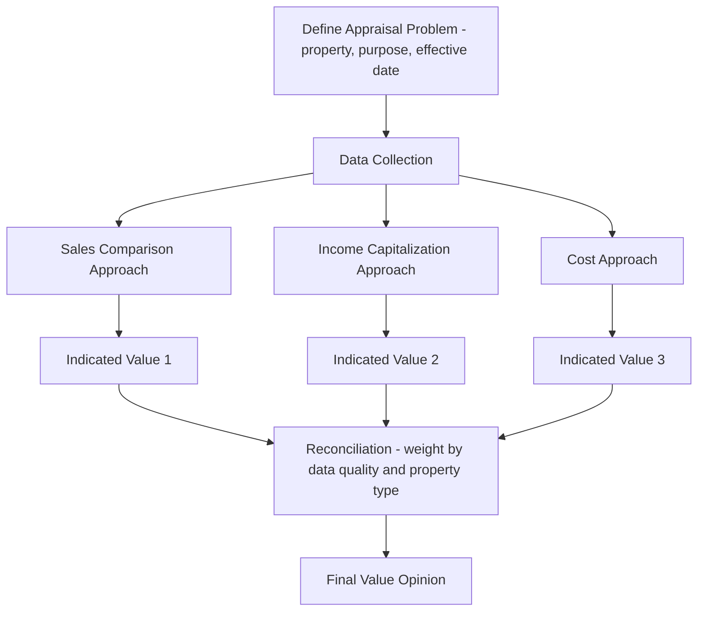

## Real Estate Valuation and Appraisal Methods

### Overview

Real estate valuation and appraisal methodology comprises the systematic approaches used to estimate the market value of real property, essential for transactions, financing, taxation, litigation, and investment decision-making. Because real estate is heterogeneous and infrequently traded (as established in the discussion of real estate as an asset class), value cannot simply be read off a continuous market price like a publicly traded security — it must be estimated through structured analytical approaches, of which three are conventionally recognized as the core methodology: the sales comparison approach, the income capitalization approach, and the cost approach.

### The Three Traditional Approaches to Value

**Key Points**

- Professional appraisal practice conventionally recognizes three primary approaches to estimating market value, each grounded in a distinct economic principle: the sales comparison approach (principle of substitution — a buyer will pay no more for a property than the cost of acquiring an equally desirable substitute), the income capitalization approach (principle of anticipation — value derives from the present worth of anticipated future benefits/income), and the cost approach (principle of substitution applied to construction — value should not exceed the cost to acquire land and construct an equivalent structure, less depreciation)
- Appraisers typically reconcile indications of value from multiple applicable approaches into a single final value opinion, weighting each approach's reliability based on data availability and property type — the reconciliation is a judgment-based synthesis, not a mechanical average
- The appropriate approach(es) to emphasize vary systematically by property type: owner-occupied residential properties typically rely most heavily on sales comparison (abundant comparable transaction data, minimal income generation), income-producing commercial properties emphasize income capitalization, and unique/special-purpose properties lacking comparable sales or income data (e.g., schools, government facilities) often rely most heavily on the cost approach

### The Sales Comparison Approach

**Key Points**

- The sales comparison approach estimates value by analyzing recent transactions of similar properties ("comparables" or "comps"), adjusting each comparable's sale price for differences from the subject property in attributes such as location, size, condition, age, and market conditions at time of sale — conceptually the direct empirical analog to the hedonic pricing framework discussed in housing valuation
- Adjustments are typically derived from paired-sales analysis (comparing otherwise-similar properties that differ primarily in one attribute to isolate that attribute's contribution to price) or from statistical/regression-based methods when sufficient transaction data is available — connecting directly to the hedonic regression methodology covered in housing valuation
- This approach is most reliable in markets with an active volume of comparable transactions and becomes progressively less reliable for unique properties, illiquid/thin markets, or during periods of rapid market change where recent comparables may not reflect current conditions

**Example**

An appraiser valuing a 2,000-square-foot single-family home identifies three recent sales of similar homes in the neighborhood. Comp 1 sold for $420,000 but has an extra bathroom (adjustment: -$8,000); Comp 2 sold for $395,000 and lacks a garage the subject has (adjustment: +$15,000); Comp 3 sold for $410,000 with a smaller lot (adjustment: +$5,000). The adjusted comparable values ($412,000, $410,000, $415,000) are then reconciled into a final indicated value, typically weighted toward the comparable requiring the smallest and most defensible adjustments.

### The Income Capitalization Approach

**Key Points**

- The income capitalization approach estimates value based on the property's capacity to generate income, using either direct capitalization (dividing a single stabilized-year Net Operating Income by a market-derived capitalization rate) or discounted cash flow analysis (projecting multi-year cash flows, including a terminal/reversion value, and discounting them to present value at an appropriate discount rate) — both methods discussed in detail in the real estate asset class and commercial real estate market topics
- Direct capitalization is most appropriate for stabilized properties with relatively predictable, consistent income streams, while DCF is preferred for properties with non-stabilized or lease-rollover-affected cash flows where a single stabilized-year NOI would not adequately capture the property's value-relevant cash flow trajectory
- The cap rate or discount rate used must be derived from market evidence (extracted from comparable property sales where both price and NOI are known, or from investor surveys of required returns for the specific property type/market/risk profile) rather than assumed arbitrarily, since this rate is the single most value-sensitive input in the approach

Direct capitalization:

$$V = \frac{NOI}{\text{Cap Rate}}$$

Discounted cash flow with terminal value:

$$V = \sum_{t=1}^{n} \frac{CF_t}{(1+r)^t} + \frac{TV_n}{(1+r)^n}$$

where $TV_n$ is the terminal/reversion value at the end of the holding period (commonly estimated by capitalizing the projected NOI of the year following the holding period at an exit cap rate) and $r$ is the discount rate.

### The Cost Approach

**Key Points**

- The cost approach estimates value as the current cost to construct a replica or functional equivalent of the improvements, less accrued depreciation (physical deterioration, functional obsolescence, and external/economic obsolescence), plus the estimated value of the land as if vacant
- Replacement cost (cost to build a structure with equivalent utility using current materials/design standards) is generally preferred over reproduction cost (cost to build an exact replica, including any outdated design elements) in contemporary appraisal practice, since replacement cost better reflects what a rational buyer would actually pay for equivalent functionality
- Depreciation estimation is the most analytically challenging component of the cost approach: physical deterioration is comparatively straightforward to estimate from observed condition and age, but functional obsolescence (outdated design/layout relative to current market preferences) and external obsolescence (value loss from factors outside the property itself, such as neighborhood decline or negative externalities) require significant appraiser judgment

The cost approach formula:

$$V = \text{Land Value} + \text{Replacement Cost New} - \text{Accrued Depreciation}$$

**Key Points**

- This approach connects directly to the "regulatory tax" and filtering-related concepts discussed elsewhere in the course: comparing market price to replacement cost is the same underlying logic used in the Glaeser-Gyourko regulatory-constraint literature, where a persistent gap between market price and replacement cost is interpreted as evidence of binding supply constraints (land-use regulation or scarcity) rather than construction cost alone
- The cost approach is generally considered most reliable for new or nearly-new construction (where depreciation estimation is straightforward and minimal) and least reliable for older properties where accumulated depreciation, particularly functional and external obsolescence, becomes difficult to estimate with precision

### Approach Reconciliation Process Flow (Mermaid)

### Highest and Best Use Analysis

**Key Points**

- Highest and best use (HBU) analysis is a foundational preliminary step in appraisal practice, defined as the reasonably probable and legal use of a property that is physically possible, legally permissible, financially feasible, and maximally productive among the reasonably probable alternatives, evaluated for the land as though vacant and for the property as improved
- HBU analysis directly informs which approaches and comparables are relevant: a property's value should be estimated based on its highest and best use, not necessarily its current use, meaning an underutilized property (e.g., a single-story retail building on land now zoned for high-density residential) may be valued based on redevelopment potential rather than existing improvement income
- The "as though vacant" and "as improved" HBU analyses can diverge, and when the value of land under its highest and best use exceeds the value of the property in its current improved state plus demolition costs, this signals that redevelopment (rather than continued use of existing improvements) represents the economically rational path — directly connecting to filtering-up/redevelopment dynamics discussed in housing stock filtering theory

### Appraisal Standards and Professional Practice

**Key Points**

- Appraisal practice in many jurisdictions is governed by formal professional standards (e.g., the Uniform Standards of Professional Appraisal Practice, USPAP, in the US context) establishing ethical and methodological requirements for appraisers, particularly for appraisals used in federally related mortgage transactions [Unverified — specific regulatory/standards frameworks are jurisdiction-specific; verify current requirements against the relevant professional/regulatory body for any applied context]
- Mass appraisal (used for property tax assessment purposes) differs from single-property "fee" appraisal in methodology: mass appraisal employs statistical models (often multiple regression or automated valuation model techniques) calibrated across large samples of properties to estimate value for an entire jurisdiction's tax roll efficiently, trading some individual-property precision for consistency and scalability across thousands of parcels
- Automated Valuation Models (AVMs), used both by mass appraisal jurisdictions and increasingly by private-sector lenders and platforms for preliminary valuation estimates, apply statistical/machine-learning techniques to large transaction datasets to generate rapid value estimates, though they generally require human appraiser review for high-value, unique, or legally consequential valuations due to limitations in capturing property-specific idiosyncratic factors that a physical inspection would reveal [Unverified — the accuracy and appropriate use-case boundaries of AVMs relative to traditional appraisal continue to evolve with data and methodology improvements; specific accuracy claims should be sourced from current vendor/academic validation studies]

### Special Valuation Contexts

**Key Points**

- Litigation and eminent domain valuation often require additional analytical rigor and defensibility given adversarial proceedings, with valuation methodology subject to scrutiny and cross-examination, and specific legal doctrines (e.g., "just compensation" standards in eminent domain contexts) that may constrain or specify particular valuation approaches
- Going-concern valuation (for properties where business operations are integral to value, such as hotels or senior living facilities) requires separating real property value from business/personal property value components, since the income capitalization approach applied to total enterprise cash flow would otherwise overstate real estate value alone
- Partial interest valuation (e.g., valuing a leasehold interest, a leased fee interest, or a fractional ownership interest) requires adapting standard approaches to reflect the specific rights and cash flows attributable to the partial interest being valued, rather than the value of the full fee-simple interest

### Diagram: Cost Approach Depreciation Components (svg_diagram)

<svg xmlns="http://www.w3.org/2000/svg" viewBox="0 0 680 380">
<text x="340" y="24" text-anchor="middle" font-size="16" font-weight="bold">Cost Approach: Depreciation Components (svg_diagram)</text>
<rect x="100" y="60" width="480" height="60" fill="none" stroke="black" stroke-width="2" />
<text x="340" y="95" text-anchor="middle" font-size="13">Replacement Cost New</text>

<text x="340" y="145" text-anchor="middle" font-size="14">minus Accrued Depreciation</text>

<rect x="100" y="170" width="150" height="60" fill="none" stroke="#d62728" stroke-width="2" />
<text x="175" y="195" text-anchor="middle" font-size="11" fill="#d62728">Physical</text>
<text x="175" y="210" text-anchor="middle" font-size="11" fill="#d62728">Deterioration</text>
<rect x="265" y="170" width="150" height="60" fill="none" stroke="#2ca02c" stroke-width="2" />
<text x="340" y="195" text-anchor="middle" font-size="11" fill="#2ca02c">Functional</text>
<text x="340" y="210" text-anchor="middle" font-size="11" fill="#2ca02c">Obsolescence</text>
<rect x="430" y="170" width="150" height="60" fill="none" stroke="#1f77b4" stroke-width="2" />
<text x="505" y="195" text-anchor="middle" font-size="11" fill="#1f77b4">External</text>
<text x="505" y="210" text-anchor="middle" font-size="11" fill="#1f77b4">Obsolescence</text>

<text x="340" y="265" text-anchor="middle" font-size="14">plus Land Value</text>

<rect x="220" y="285" width="240" height="50" fill="none" stroke="black" stroke-width="2" />
<text x="340" y="315" text-anchor="middle" font-size="13" font-weight="bold">= Indicated Property Value</text>
</svg>

### Common Sources of Appraisal Error and Bias

**Key Points**

- Comparable selection bias (choosing comparables that support a predetermined value conclusion rather than the most genuinely similar available transactions) is a recognized integrity risk in appraisal practice, particularly in contexts with pressure from a transaction party benefiting from a specific value outcome (e.g., mortgage lending), motivating the professional independence standards embedded in formal appraisal regulation
- Appraisal-based valuation inherits the "smoothing" characteristics discussed in the real estate asset class topic: because appraisals rely on historical comparable transactions and periodic updates rather than continuous market pricing, appraised values tend to lag true market-clearing prices, particularly during periods of rapid market movement (both upward and downward)
- Model risk in mass appraisal and AVM contexts arises when the statistical model is calibrated on historical data that may not capture current market structural shifts (e.g., a regression model trained pre-pandemic may misprice properties in a market experiencing structural remote-work-driven demand shifts), illustrating a general limitation of any historically-calibrated valuation model applied during periods of structural rather than purely cyclical change

### Conclusion

Real estate valuation and appraisal methodology rests on three complementary approaches — sales comparison, income capitalization, and cost — each grounded in a distinct economic principle and each most reliable for different property types and market data conditions, reconciled through appraiser judgment into a final value opinion. Highest and best use analysis frames which use and which approaches are most relevant, while professional standards, mass appraisal/AVM techniques, and special valuation contexts (litigation, going-concern, partial interests) extend the core methodology to the full range of practical valuation applications, with appraisal-based value estimates subject to well-recognized limitations including comparable selection judgment, smoothing/lag effects, and model risk during periods of structural market change.

**Related Topics**

- Hedonic pricing theory and its connection to sales comparison adjustment methodology
- Capitalization rates, NOI, and income-property valuation (real estate as an asset class)
- The DiPasquale-Wheaton model and replacement-cost-driven construction decisions
- Highest and best use analysis and redevelopment/filtering-up dynamics
- Mass appraisal, automated valuation models, and property tax assessment
- Appraisal smoothing and de-smoothing in private real estate return indices
- Regulatory tax/scarcity rent analysis (Glaeser-Gyourko methodology)
- Going-concern and partial-interest valuation for specialized property types