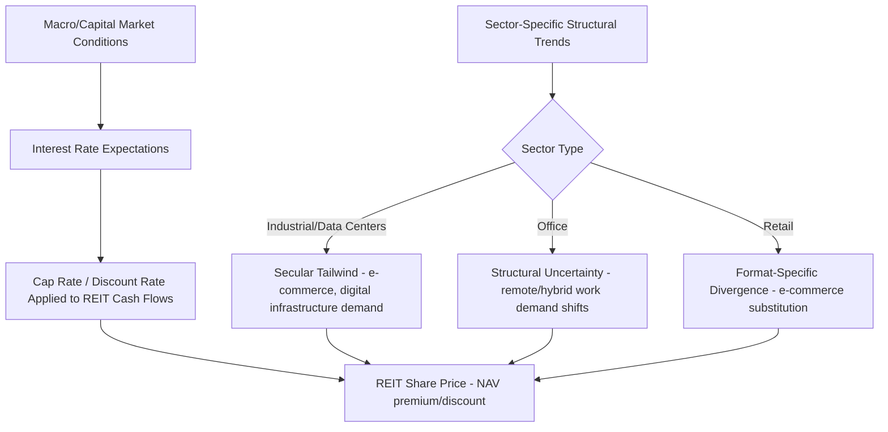

## Real Estate Investment Trusts

### Overview

Real Estate Investment Trusts (REITs) are corporate entities that own, operate, or finance income-producing real estate, structured to allow investors to access diversified real estate exposure through publicly traded (or, in some cases, private/non-traded) securities rather than direct property ownership. REITs represent the primary securitization vehicle bridging real estate's traditionally illiquid, lumpy asset characteristics with the liquidity, fractional investment size, and continuous price discovery of public capital markets, as introduced in the discussion of real estate as an asset class.

### Legal and Structural Requirements

**Key Points**

- REIT status is a special tax election/qualification (not a generic descriptor) requiring an entity to satisfy specific statutory tests governing income composition, asset composition, ownership distribution, and income distribution — the REIT structure originated in the US in 1960 and has since been adopted, with jurisdiction-specific variations, in numerous countries [Unverified — specific qualification thresholds and requirements are jurisdiction-specific and subject to legislative change; verify against current tax code for any applied analysis]
- In the US context, REITs are generally required to distribute a high percentage (historically 90% or more) of taxable income to shareholders annually as dividends, derive the substantial majority of gross income from real estate-related sources (rents, mortgage interest, gains from property sales), and hold the substantial majority of total assets in real estate, cash, or government securities — these tests collectively ensure the entity functions as a pass-through real estate income vehicle rather than an operating company that happens to own property
- In exchange for meeting these requirements, REITs generally avoid entity-level corporate income tax on the distributed portion of income (avoiding the "double taxation" that would otherwise apply to a standard corporation's dividends), meaning REIT income is effectively taxed once, at the shareholder level, rather than twice — this tax treatment is the central structural incentive underlying the REIT vehicle's design and popularity

### Equity REITs vs. Mortgage REITs

**Key Points**

- Equity REITs own and operate physical income-producing property directly, generating revenue primarily from tenant rental income, and represent the large majority of REIT market capitalization in most markets — these are the vehicles most directly comparable to the direct property ownership and commercial real estate concepts discussed elsewhere in this course
- Mortgage REITs (mREITs) instead originate or acquire real estate debt (commercial or residential mortgages, mortgage-backed securities) and generate revenue primarily from interest income on these holdings, making them structurally more similar to a leveraged fixed-income/credit investment vehicle than to direct property ownership, with distinct risk exposures (interest rate risk, credit/prepayment risk, and often substantial balance-sheet leverage) relative to equity REITs
- Hybrid REITs combine both direct property ownership and mortgage/debt investment activities within a single entity, though pure-play equity or mortgage REIT structures are more common in practice, allowing investors to more precisely target the specific risk exposure (property-level equity vs. real estate debt) they seek

### Publicly Traded vs. Non-Traded REITs

**Key Points**

- Publicly traded REITs are listed on public stock exchanges, offering continuous liquidity and market-based price discovery, but as a consequence exhibit the higher short-run return volatility and closer correlation with broader public equity markets discussed in the real estate asset class topic, since public market pricing incorporates investor sentiment and broad market conditions in addition to underlying property fundamentals
- Non-traded (or non-listed) REITs are registered with securities regulators but not listed on a public exchange, typically priced periodically based on appraisals rather than continuous market trading, and historically have carried higher upfront fees/commissions and more limited liquidity (often subject to redemption limits or program-specific liquidity events) relative to publicly traded REITs — features that have drawn regulatory and investor-advocacy scrutiny in various markets [Unverified — fee structures, liquidity terms, and regulatory treatment of non-traded REITs vary by jurisdiction and specific program design; verify against current offering documents and regulatory guidance for any applied analysis]
- Private REITs (not registered for public offering, typically sold only to institutional or accredited investors) occupy a further point on the liquidity spectrum, functioning similarly to private real estate funds in practice but retaining the REIT tax election's pass-through benefits

### Sector-Specific REIT Segmentation

**Key Points**

- REITs are commonly organized by property-type specialization, mirroring the commercial real estate sector segmentation discussed previously: office REITs, industrial/logistics REITs, retail REITs (further subdivided into mall, shopping center, and net-lease specialists), residential/multifamily REITs, and healthcare REITs (hospitals, medical office, senior housing, skilled nursing)
- Specialized/alternative sector REITs have grown substantially as distinct categories, including data center REITs, cell tower/communications infrastructure REITs, self-storage REITs, timberland REITs, and single-family rental REITs — several of these alternative categories (particularly data centers and communications infrastructure) represent a meaningful and growing share of aggregate REIT market capitalization in major markets [Unverified — specific market capitalization weightings shift over time and should be sourced from current index/market data]
- Net-lease REITs (specializing in single-tenant properties under long-term triple-net leases, often with investment-grade corporate tenants) represent a distinct risk-return profile emphasizing bond-like stable income with minimal landlord operating expense responsibility, differentiated from operationally intensive sectors like hotels (sometimes considered a REIT-eligible sector in some jurisdictions with specific structural accommodations) or senior housing requiring active property-level management

### REIT Valuation Metrics

**Key Points**

- Funds From Operations (FFO) is the standard REIT industry earnings metric, adjusting net income (calculated under standard accounting principles) by adding back real estate depreciation and amortization and excluding gains/losses from property sales — this adjustment reflects the view that standard depreciation accounting, designed for typical corporate assets, does not accurately capture real estate's actual economic value trajectory (since well-maintained real estate often holds or appreciates in value rather than depreciating to zero as standard accounting depreciation schedules would suggest)
- Adjusted Funds From Operations (AFFO) further refines FFO by deducting recurring capital expenditures (maintenance capex) and normalizing for non-cash rent adjustments (e.g., straight-lining of contractual rent escalations), aiming to approximate a REIT's sustainable distributable cash flow more precisely than FFO alone
- Price/FFO and Price/AFFO multiples are the REIT-industry-standard valuation multiples, analogous to price/earnings multiples in general equity analysis, allowing relative valuation comparison across REITs while correcting for the depreciation-accounting distortion that would make standard price/earnings comparisons misleading for real estate-holding entities

FFO calculation (standard formula):

$$FFO = \text{Net Income} + \text{Real Estate Depreciation \& Amortization} - \text{Gains on Property Sales} + \text{Losses on Property Sales}$$

### Diagram: REIT Investment Structure and Income Flow (svg_diagram)

<svg xmlns="http://www.w3.org/2000/svg" viewBox="0 0 680 400">
<text x="340" y="24" text-anchor="middle" font-size="16" font-weight="bold">REIT Structure and Income Flow (svg_diagram)</text>
<rect x="250" y="60" width="180" height="60" fill="none" stroke="black" stroke-width="2" />
<text x="340" y="95" text-anchor="middle" font-size="13">Tenants</text>
<line x1="340" y1="120" x2="340" y2="160" stroke="black" stroke-width="2" />
<text x="380" y="145" font-size="11">Rental Income</text>
<rect x="200" y="160" width="280" height="70" fill="none" stroke="black" stroke-width="2" />
<text x="340" y="190" text-anchor="middle" font-size="13" font-weight="bold">REIT Entity</text>
<text x="340" y="210" text-anchor="middle" font-size="11">(owns/operates properties, pays no entity-level tax on distributed income)</text>
<line x1="340" y1="230" x2="340" y2="270" stroke="black" stroke-width="2" />
<text x="420" y="255" font-size="11">Required Dividend Distribution</text>
<rect x="250" y="270" width="180" height="60" fill="none" stroke="black" stroke-width="2" />
<text x="340" y="305" text-anchor="middle" font-size="13">Shareholders</text>

<text x="480" y="305" font-size="11" fill="#666">(taxed at shareholder level)</text>

</svg>

### REIT Capital Structure and Leverage

**Key Points**

- REITs employ leverage (corporate-level debt, property-level mortgages, or a combination) similarly to other real estate investment vehicles, with leverage amplifying equity returns and risk as discussed in the real estate asset class and commercial real estate contexts, though publicly traded REITs are also subject to public capital market discipline (rating agency scrutiny, bond covenant requirements) affecting typical leverage levels relative to private real estate funds
- Because REITs are required to distribute the large majority of taxable income rather than retaining substantial earnings, they typically rely more heavily on external capital markets (debt and equity issuance) to fund growth (acquisitions, development) than a typical retained-earnings-funded corporation, making access to and cost of capital markets a first-order determinant of REIT growth capacity
- REIT credit ratings and access to unsecured corporate debt markets (as opposed to solely property-level secured mortgage debt) vary significantly by REIT size, sector, and balance sheet quality, with larger, more diversified REITs generally accessing lower-cost unsecured capital relative to smaller or more leveraged peers

### REIT Return Drivers and Public Market Dynamics

**Key Points**

- Public REIT total returns combine dividend yield (reflecting the required high distribution payout) and share price appreciation, with the dividend yield component typically representing a larger share of total return relative to a typical broad-market equity index, reflecting REITs' income-oriented underlying asset base
- Because REIT shares trade continuously in public markets, REIT prices can and do diverge from underlying property net asset value (NAV) — trading at a premium or discount to NAV — driven by investor sentiment, sector rotation, interest rate expectations, and broader public equity market conditions, distinct from the underlying private property market fundamentals captured in appraisal-based valuation
- REIT share prices have historically shown meaningful sensitivity to interest rate expectations, operating through multiple channels: higher rates raise the discount/cap rate applied to property cash flows (per the DiPasquale-Wheaton Quadrant Two capitalization relationship), raise REITs' cost of debt capital, and increase the relative attractiveness of competing income-oriented investments (bonds), though the empirical magnitude and consistency of this interest-rate sensitivity varies across REIT sectors and time periods [Unverified — specific interest-rate-sensitivity (duration-like) estimates for REITs vary by study, sector, and market regime; cite specific figures only from named primary research]

### REIT Sector Rotation and Structural Trend Exposure Flow (Mermaid)

### International REIT Regimes

**Key Points**

- REIT-equivalent structures have been adopted in numerous countries beyond the originating US framework, including the UK (UK-REIT regime), Australia (Australian Real Estate Investment Trusts, historically termed Listed Property Trusts), Japan (J-REITs), Singapore (S-REITs), and many others, each with jurisdiction-specific qualification requirements, distribution thresholds, and tax treatment details [Unverified — specific international REIT regime requirements and market characteristics are jurisdiction-specific and evolve over time; verify against current regulatory sources for any cross-jurisdictional applied analysis]
- Cross-border REIT market development has been driven by similar underlying motivations across jurisdictions: providing broad investor access to real estate income and diversification benefits through a liquid, tax-efficient public market vehicle, though specific structural features (permitted leverage levels, income/asset tests, distribution requirements) vary meaningfully across national regimes

### Advantages and Limitations of the REIT Structure

**Key Points**

- Advantages relative to direct property ownership include liquidity (continuous public market trading for listed REITs), fractional investment size (accessible to a much broader range of investor capital than direct property ownership), professional management, diversification across multiple properties/markets within a single REIT holding, and tax-efficient pass-through income treatment
- Limitations include exposure to public equity market volatility and sentiment-driven price movements that can diverge from underlying property fundamentals in the short run (as discussed above), lack of direct control over specific property-level decisions (in contrast to direct ownership), and the mandatory high-distribution requirement, which limits internal capital retention for growth relative to a typical operating company, increasing reliance on external capital market access
- The choice between REIT and direct/private real estate investment vehicles is generally framed in the institutional investment literature as a liquidity-versus-control and volatility-measurement tradeoff rather than a fundamentally different underlying real estate risk exposure, consistent with the appraisal-smoothing discussion in the real estate asset class topic — over sufficiently long horizons, REIT and private real estate returns are generally understood to reflect the same underlying property market fundamentals despite differing short-run measured volatility [Unverified — the degree of long-run return convergence and the appropriate methodology for comparing REIT and private real estate performance remains an active area of academic research]

### Conclusion

Real Estate Investment Trusts provide the primary securitized vehicle for public-market real estate investment, combining a specific tax-advantaged pass-through structure with sector-specialized (equity or mortgage) exposure to income-producing property, and are valued using real estate-specific metrics (FFO, AFFO) that correct for standard accounting depreciation's mismatch with real estate's actual economic value behavior. While REITs offer liquidity, fractional access, and diversification advantages over direct property ownership, their public-market pricing introduces short-run volatility and sentiment-driven premium/discount-to-NAV dynamics not present in appraisal-based private real estate valuation, making the REIT-versus-direct-ownership choice fundamentally a liquidity, control, and volatility-measurement tradeoff rather than a difference in underlying real estate fundamentals.

**Related Topics**

- Real estate as an asset class: appraisal smoothing and REIT-versus-private return comparison
- Funds From Operations (FFO) and Adjusted FFO valuation methodology
- Commercial real estate sector segmentation and structural demand trends
- The DiPasquale-Wheaton model and cap rate sensitivity to capital market conditions
- REIT capital structure, leverage, and access to public debt markets
- International REIT regimes and cross-border real estate securitization
- Net-lease investment structures and tenant credit risk
- Mortgage REITs and real estate debt/credit market exposure