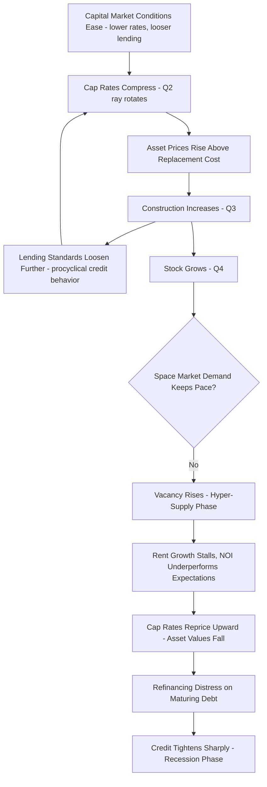

## Real Estate Cycles and Market Bubbles

### Overview

Real estate cycles and market bubbles extend the housing-specific cycle analysis covered earlier to the full commercial and investment real estate context, integrating the DiPasquale-Wheaton four-quadrant framework, capital market dynamics, and asset-pricing bubble theory into a unified treatment of why real estate markets — across property types and geographies — exhibit persistent, often severe boom-bust patterns distinct from typical business-cycle fluctuations in other sectors.

### The Four-Phase Real Estate Cycle Framework

**Key Points**

- The conventional commercial real estate cycle is commonly described using a four-phase framework: recovery (declining vacancy from a cyclical peak, but rents still flat or below replacement-cost-justified levels, minimal new construction), expansion (vacancy continues falling, rent growth accelerates, construction activity increases as asset prices rise above replacement cost), hyper-supply (construction continues or peaks even as vacancy begins rising again due to delivering supply outpacing slowing demand growth), and recession (vacancy rises further, rent growth stalls or reverses, construction activity contracts sharply)
- This phase framework maps directly onto the DiPasquale-Wheaton quadrant mechanics: expansion corresponds to Quadrant One demand outpacing Quadrant Four stock growth (rents rising), which drives Quadrant Two asset prices above Quadrant Three replacement cost (triggering construction), while hyper-supply reflects the lagged Quadrant Three/Four construction response finally catching up to and then overshooting a Quadrant One demand trajectory that has itself begun to decelerate
- Because the cycle is driven fundamentally by the interaction of long construction lags with occupier demand fluctuation, the framework applies across property types (office, industrial, retail, multifamily), though the typical cycle duration and amplitude vary by sector depending on construction lead times (which differ substantially between, for example, a multifamily development and a large industrial or office project) and the elasticity of occupier demand to broader economic activity

### Cycle Drivers: Space Market vs. Capital Market Origins

**Key Points**

- Real estate cycle literature draws a fundamental distinction between space-market-driven cycles (originating from occupier demand shifts tied to employment, output, and consumption) and capital-market-driven cycles (originating from changes in the cost and availability of capital — interest rates, credit underwriting standards, investor risk appetite — independent of underlying occupier fundamentals), a distinction made explicit by the separate quadrants of the DiPasquale-Wheaton model
- Capital-market-driven cycles are generally considered more prone to generating pronounced overbuilding and subsequent severe correction, because a capital-market shock (e.g., loosened lending standards or falling interest rates compressing cap rates) can drive asset prices and construction activity upward even without a corresponding genuine increase in occupier demand — creating a disconnect between the physical stock being built and the underlying space-market need for it
- The commercial real estate overbuilding and subsequent distress observed in the US in the late 1980s/early 1990s (associated with savings and loan industry lending practices) and the 2000s residential-and-related-commercial credit-driven boom-bust are frequently cited as illustrative examples of capital-market-driven cycle dynamics in the academic and practitioner literature [Unverified — specific causal attribution and magnitude claims regarding any historical episode should be sourced from named primary studies, as the relative contribution of capital-market versus space-market factors in any specific historical cycle remains a subject of ongoing academic analysis]

### Diagram: Real Estate Cycle Phase Diagram with Quadrant Mapping (svg_diagram)

<svg xmlns="http://www.w3.org/2000/svg" viewBox="0 0 680 440">
<text x="340" y="24" text-anchor="middle" font-size="16" font-weight="bold">Four-Phase Real Estate Cycle (svg_diagram)</text>
<circle cx="340" cy="240" r="160" fill="none" stroke="black" stroke-width="2" />

<text x="340" y="85" text-anchor="middle" font-size="13" font-weight="bold" fill="`#2ca02c`">Recovery</text>

<text x="330" y="100" text-anchor="middle" font-size="10">Vacancy falling, low construction</text>

<text x="490" y="240" text-anchor="middle" font-size="13" font-weight="bold" fill="`#1f77b4`">Expansion</text>

<text x="490" y="255" text-anchor="middle" font-size="10">Rent growth, rising construction</text>

<text x="340" y="400" text-anchor="middle" font-size="13" font-weight="bold" fill="`#ff7f0e`">Hyper-Supply</text>

<text x="340" y="415" text-anchor="middle" font-size="10">Peak construction, rising vacancy</text>

<text x="190" y="240" text-anchor="middle" font-size="13" font-weight="bold" fill="`#d62728`">Recession</text>

<text x="190" y="255" text-anchor="middle" font-size="10">Vacancy peaks, construction halts</text>

<path d="M 260 130 A 160 160 0 0 1 420 130" stroke="#2ca02c" stroke-width="3" fill="none" marker-end="url(#arrow)" />
<path d="M 420 130 A 160 160 0 0 1 450 350" stroke="#1f77b4" stroke-width="3" fill="none" />
<path d="M 450 350 A 160 160 0 0 1 230 350" stroke="#ff7f0e" stroke-width="3" fill="none" />
<path d="M 230 350 A 160 160 0 0 1 260 130" stroke="#d62728" stroke-width="3" fill="none" />
</svg>

### Property-Type Variation in Cycle Timing and Amplitude

**Key Points**

- Development lead time varies substantially by property type — multifamily and industrial projects generally have shorter construction periods than large office towers or complex mixed-use developments — meaning the supply-response lag underlying the cobweb-style cycle dynamic differs in duration across sectors, contributing to imperfect synchronization of cycle phases across property types even within the same metro market
- Lease term length also affects cycle transmission speed: sectors with short lease terms (multifamily, with typically one-year leases) reprice to current market rent conditions quickly, producing faster-adjusting rent cycles, while sectors with long lease terms (office, with leases commonly five to ten-plus years) experience slower rent-roll repricing, meaning reported average/in-place rents can lag current market/asking rent conditions substantially during a cycle transition
- This differential lease-term repricing speed means headline market statistics (average in-place rent) can understate the severity of a downturn in long-lease sectors (since only expiring leases reprice to current depressed market conditions) or understate the strength of a recovery, requiring analysts to examine asking/market rent trends and lease rollover schedules separately from in-place average rent to accurately assess current cycle position

### Credit Cycle Amplification in Commercial Real Estate

**Key Points**

- Commercial real estate lending standards (loan-to-value limits, debt service coverage ratio requirements, underwriting rigor) exhibit pronounced cyclicality, tending to loosen during expansion phases (as competition among lenders increases and recent performance appears favorable) and tighten sharply during downturns — this pro-cyclical credit behavior is a well-documented amplification mechanism in the broader financial cycle literature, applied specifically to CRE lending
- Commercial Mortgage-Backed Securities (CMBS) issuance volume has historically shown strong cyclicality, expanding rapidly during favorable credit conditions and contracting sharply during periods of credit market stress, affecting the availability of debt capital for refinancing maturing commercial mortgages and thereby transmitting broader credit cycle conditions directly into property-level distress or opportunity during market downturns
- The interaction between debt maturity schedules and cycle timing creates a specific vulnerability: properties financed with debt maturing during a market downturn face refinancing risk (inability to refinance at the original loan amount if property value has declined and/or lending standards have tightened), a dynamic studied extensively following major CRE credit cycle downturns [Unverified — specific historical refinancing distress magnitude and resolution patterns should be sourced from named primary studies of specific cycle episodes]

### Bubble Dynamics Applied to Commercial and Investment Real Estate

**Key Points**

- The asset-pricing bubble framework discussed in housing market cycles (fundamental value as discounted future rental/service flow, with a bubble component representing price sustained only by expected future appreciation rather than income fundamentals) applies equally to commercial real estate, with the DiPasquale-Wheaton Quadrant Two capitalization relationship providing the explicit mechanism: if cap rates compress based on expected future cap rate compression or rent growth that does not materialize, realized asset prices will have embedded a bubble component relative to ex-post fundamental value
- Cap rate compression driven by capital market conditions (abundant capital seeking real estate yield, historically low interest rates) rather than by improving space-market fundamentals is a commonly cited pattern preceding commercial real estate corrections, since compressed cap rates unsupported by underlying NOI growth expectations are particularly vulnerable to reversal if capital market conditions shift [Unverified — the specific degree to which any historical cap rate compression episode reflected bubble dynamics versus a rational repricing of the risk-free rate or risk premium is a matter of ongoing empirical and academic assessment]
- Sentiment and narrative-driven demand (extrapolative expectations of continued price appreciation, as discussed in the housing bubble context) apply to institutional and professional real estate investors as well as individual homebuyers, with survey-based and flow-of-funds evidence sometimes cited to indicate periods of elevated capital allocation to real estate driven by recent-performance-chasing behavior rather than a fundamentals-based reassessment of expected returns [Unverified — this is a less rigorously quantifiable behavioral claim relative to standard empirical asset-pricing evidence and should be treated as one interpretive lens among several]

### Cycle and Bubble Interaction Mechanism Flow (Mermaid)

### Regional and Sector-Specific Cycle Divergence

**Key Points**

- Real estate cycles are not perfectly synchronized across geography or property type within the same broad macroeconomic environment: a given metro area's office market can be in a recession phase while its industrial market is simultaneously in an expansion phase, driven by sector-specific demand fundamentals (structural remote-work effects on office versus e-commerce/logistics tailwinds on industrial, for example) operating independently of the shared local capital market and interest rate environment
- Supply elasticity heterogeneity across markets (discussed extensively in the housing supply and market cycles context) applies equally to commercial property: supply-constrained metro office or multifamily markets tend to exhibit larger price/rent cycle amplitude in response to demand shocks than markets with more responsive construction supply, mirroring the residential market pattern
- This divergence means national-level aggregate real estate cycle indicators can mask substantial underlying heterogeneity, and practitioner/institutional cycle analysis is generally conducted at the property-type and metro/submarket level rather than relying solely on national aggregate indicators for investment or lending decisions

### Post-Downturn Market Adjustment and Distressed Asset Dynamics

**Key Points**

- Following a cycle downturn, market clearing typically occurs through a combination of price adjustment (asset values declining to a level consistent with prevailing NOI and cap rate conditions), reduced new construction (as discussed in the Quadrant Three replacement-cost mechanism), and, in more severe downturns, distressed asset resolution (foreclosure, loan workouts, forced sales) that can further pressure prices in the near term through elevated transaction supply from distressed sellers
- Opportunistic and distressed-debt investment strategies (discussed in the real estate as an asset class topic) are specifically designed to capitalize on post-downturn dislocation, acquiring undervalued assets or distressed debt positions during the recession/early-recovery phase transition, reflecting the cyclical nature of institutional capital allocation strategy across the real estate cycle
- Recovery from a severe downturn is generally understood to require sufficient time for excess vacant space to be absorbed by renewed demand growth (a stock-adjustment process, per DiPasquale-Wheaton Quadrant Four/One feedback) before rent growth and, subsequently, construction activity resume — meaning severe hyper-supply/recession phases are typically followed by an extended recovery phase duration proportional to the magnitude of the preceding oversupply, rather than a rapid V-shaped rebound [Inference — this follows from the stock-adjustment mechanics of the four-quadrant model applied to the observation that absorbing a large oversupply overhang takes time, though the specific duration in any given cycle depends on the magnitude of oversupply and the strength of the subsequent demand recovery]

### Conclusion

Real estate cycles and bubbles across commercial and investment property types are best understood through the integrated lens of the DiPasquale-Wheaton four-quadrant framework, distinguishing space-market-driven cycles (occupier demand fluctuation interacting with construction lags) from capital-market-driven cycles and bubbles (credit and investor-appetite-driven cap rate compression and overbuilding), with property-type-specific lease structures, construction lead times, and credit market conditions shaping the timing, amplitude, and synchronization of cycles across sectors and geographies. Because capital-market-driven dynamics can generate a substantial disconnect between built stock and genuine occupier demand, distinguishing the underlying driver of any given price or construction boom remains a central and practically consequential analytical task for real estate investors, lenders, and policymakers alike.

**Related Topics**

- The DiPasquale-Wheaton four-quadrant model and quadrant-specific shock propagation
- Housing market cycles and bubbles (residential-specific treatment and extrapolative expectations)
- Commercial real estate lending, CMBS markets, and procyclical credit standards
- Cap rate compression, capital market conditions, and asset-pricing bubble theory
- Sector-specific structural demand trends (office, industrial, retail divergence)
- Housing supply elasticity heterogeneity applied to commercial property markets
- Distressed asset investment strategies and opportunistic real estate capital
- Refinancing risk and commercial mortgage debt maturity schedules