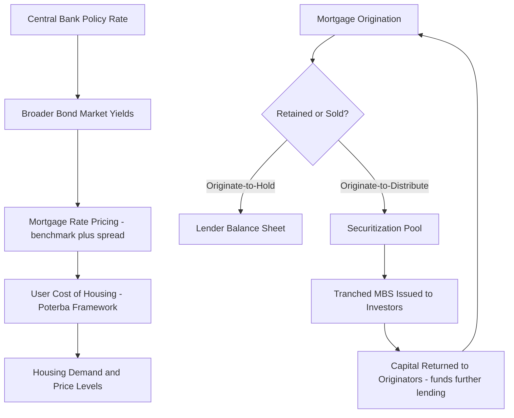

## Mortgage Markets and Housing Finance

### Overview

Mortgage markets and housing finance encompass the institutions, instruments, and capital flows through which residential (and, by extension, commercial) real estate purchases are financed with debt secured by the property itself. This system links household borrowers to capital markets through origination, underwriting, servicing, and — critically in modern housing finance — securitization, and its structure and functioning directly determine the credit availability and cost that shape housing demand, user cost, and, as discussed in real estate cycle analysis, the amplitude of housing market booms and busts.

### The Mortgage Instrument: Core Structure

**Key Points**

- A mortgage is a loan secured by real property, giving the lender a legal claim (lien) on the property that allows foreclosure and sale of the collateral if the borrower defaults on the debt obligation — this collateralization is what distinguishes mortgage lending's risk and pricing structure from unsecured consumer lending
- Standard mortgage amortization schedules specify a fixed monthly payment (for fixed-rate loans) that combines principal repayment and interest, structured so that early payments are interest-heavy and later payments are increasingly principal-heavy, following the standard amortization formula — this means home equity builds slowly in the early years of a mortgage term relative to a simple linear principal paydown assumption
- Loan-to-value (LTV) ratio — the loan amount divided by the property's appraised value — is the central underwriting risk metric, with lower LTV (higher down payment) reducing lender loss-given-default risk and commonly qualifying borrowers for more favorable interest rate pricing, while high-LTV loans often require private mortgage insurance (PMI) or equivalent credit enhancement to protect the lender against the greater risk of the borrower holding less equity cushion

The standard fixed-rate mortgage payment formula:

$$M = P \cdot \frac{r(1+r)^n}{(1+r)^n - 1}$$

where $M$ is the monthly payment, $P$ is the original loan principal, $r$ is the monthly interest rate, and $n$ is the total number of payments (loan term in months).

### Fixed-Rate vs. Adjustable-Rate Mortgages

**Key Points**

- Fixed-rate mortgages (FRMs) lock in a constant interest rate for the entire loan term, providing borrowers payment certainty and insulation from future interest rate increases, but exposing the lender (or the ultimate holder of the mortgage-backed security, discussed below) to interest rate risk — if market rates rise after origination, the fixed-rate loan's value to the holder declines relative to a hypothetical new loan originated at the higher current rate
- Adjustable-rate mortgages (ARMs) reset the interest rate periodically according to a specified index plus margin, shifting interest rate risk from the lender/investor to the borrower, typically offered with an initial lower "teaser" or discounted rate relative to prevailing FRM rates to compensate borrowers for accepting this rate risk transfer
- The relative prevalence of FRMs versus ARMs varies substantially across countries, reflecting differences in capital market structure, prepayment option conventions, and historical institutional development — some housing finance systems are predominantly FRM-based (aided by well-developed long-term fixed-rate securitization markets) while others rely more heavily on ARM or shorter-reset-period structures [Unverified — cross-country mortgage product prevalence patterns and their underlying institutional drivers should be sourced from current comparative housing finance literature, as they are institution- and market-specific and evolve over time]

### The Prepayment Option and Its Valuation Implications

**Key Points**

- Most fixed-rate residential mortgages (particularly in the US context) embed a prepayment option, allowing the borrower to repay the loan early (through refinancing or sale of the property) without penalty — this option has significant value to the borrower and correspondingly represents a risk to the lender/investor, since prepayment tends to occur precisely when it is least advantageous to the lender (i.e., when interest rates have fallen and the lender must reinvest the returned principal at the new, lower prevailing rate)
- This prepayment risk is analytically similar to the call option embedded in callable bonds, and mortgage-backed securities pricing models explicitly incorporate option-adjusted spread (OAS) analysis to value this embedded prepayment optionality, since a simple yield-to-maturity calculation ignoring prepayment risk would misprice the security
- Prepayment behavior is influenced not only by interest rate differentials (the primary driver of "refinancing" prepayment) but also by housing turnover (borrowers prepaying due to home sale rather than refinancing motivation), meaning prepayment models must account for both rate-driven and turnover-driven prepayment components to accurately project cash flows

### Mortgage Origination and Underwriting

**Key Points**

- Underwriting evaluates borrower creditworthiness (credit score/history, debt-to-income ratio, employment/income verification, assets/reserves) and collateral adequacy (appraisal-based property value, as discussed in real estate valuation methodology) to assess default risk and determine loan eligibility and pricing
- Debt-to-income (DTI) ratio — total monthly debt obligations (including the proposed mortgage payment) divided by gross monthly income — is a standard underwriting threshold metric, with maximum acceptable DTI ratios varying by loan program and lender risk appetite, directly connecting to the credit-constraint literature discussed in the homeownership tenure-choice topic
- The originate-to-distribute model (where the originating lender sells the loan into the secondary market shortly after origination, discussed below under securitization) versus the originate-to-hold model (where the lender retains the loan on its own balance sheet) creates different underwriting incentive structures — originate-to-distribute can weaken the originator's incentive for rigorous underwriting if credit risk is fully transferred to the ultimate security holder, a dynamic extensively analyzed in the academic literature examining contributing factors to the 2000s US mortgage credit expansion and subsequent crisis [Unverified — the relative causal weight of originate-to-distribute incentive misalignment versus other contributing factors in that specific historical episode remains a subject of extensive academic debate; cite specific causal claims only from named primary studies]

### Mortgage Securitization: Structure and Mechanism

**Key Points**

- Securitization pools individual mortgage loans into a trust structure that issues mortgage-backed securities (MBS) to investors, with the pooled mortgage payments (principal and interest, net of servicing fees) passed through to security holders — this process transforms illiquid, heterogeneous individual mortgage loans into standardized, tradable securities, directly connecting individual housing finance to broader fixed-income capital markets
- Agency MBS (in the US context, securities guaranteed by government-sponsored enterprises or government agencies) carry credit risk guarantees that effectively remove mortgage default risk from the security's pricing (leaving primarily interest rate and prepayment risk as the priced risk factors), while non-agency/"private-label" MBS lack this guarantee and require credit risk to be priced and typically allocated through structural credit enhancement (subordination/tranching, discussed below) [Unverified — specific agency guarantee structures and government-sponsored enterprise roles are jurisdiction-specific and subject to policy/regulatory change; verify against current sources for applied analysis]
- Securitization structures commonly employ tranching, dividing the cash flows and credit risk of the underlying mortgage pool into multiple securities (tranches) with differing seniority — senior tranches receive priority claim on cash flows and are shielded from initial losses by subordinate/junior tranches that absorb losses first, allowing the senior tranches to achieve higher credit ratings than the average credit quality of the underlying loan pool

### Diagram: Mortgage Securitization Flow (svg_diagram)

<svg xmlns="http://www.w3.org/2000/svg" viewBox="0 0 680 420">
<text x="340" y="24" text-anchor="middle" font-size="16" font-weight="bold">Mortgage Securitization Structure (svg_diagram)</text>
<rect x="50" y="60" width="140" height="60" fill="none" stroke="black" stroke-width="2" />
<text x="120" y="95" text-anchor="middle" font-size="12">Borrowers</text>
<line x1="190" y1="90" x2="260" y2="90" stroke="black" stroke-width="2" />
<text x="225" y="80" font-size="10">Loan Payments</text>
<rect x="260" y="60" width="160" height="60" fill="none" stroke="black" stroke-width="2" />
<text x="340" y="85" text-anchor="middle" font-size="12">Originating Lender</text>
<text x="340" y="100" text-anchor="middle" font-size="10">(underwrites, sells loans)</text>
<line x1="420" y1="90" x2="490" y2="90" stroke="black" stroke-width="2" />
<rect x="490" y="60" width="140" height="60" fill="none" stroke="black" stroke-width="2" />
<text x="560" y="85" text-anchor="middle" font-size="12">Securitization Trust</text>
<text x="560" y="100" text-anchor="middle" font-size="10">(pools loans)</text>
<line x1="560" y1="120" x2="560" y2="170" stroke="black" stroke-width="2" />
<rect x="150" y="180" width="150" height="50" fill="none" stroke="#2ca02c" stroke-width="2" />
<text x="225" y="210" text-anchor="middle" font-size="11" fill="#2ca02c">Senior Tranche</text>
<rect x="330" y="180" width="150" height="50" fill="none" stroke="#ff7f0e" stroke-width="2" />
<text x="405" y="210" text-anchor="middle" font-size="11" fill="#ff7f0e">Mezzanine Tranche</text>
<rect x="510" y="180" width="150" height="50" fill="none" stroke="#d62728" stroke-width="2" />
<text x="585" y="210" text-anchor="middle" font-size="11" fill="#d62728">Subordinate/Equity Tranche</text>
<line x1="560" y1="170" x2="225" y2="180" stroke="black" stroke-width="1.5" />
<line x1="560" y1="170" x2="405" y2="180" stroke="black" stroke-width="1.5" />
<line x1="560" y1="170" x2="585" y2="180" stroke="black" stroke-width="1.5" />

<text x="340" y="270" text-anchor="middle" font-size="11">Losses absorbed bottom-up; senior tranche protected by subordination</text>

<rect x="150" y="300" width="510" height="50" fill="none" stroke="black" stroke-width="2" />
<text x="405" y="330" text-anchor="middle" font-size="12">Investors (institutional, pension funds, banks, etc.)</text>
</svg>

### Mortgage Insurance and Credit Enhancement

**Key Points**

- Private mortgage insurance (PMI) protects the lender (or ultimate security holder) against loss in the event of borrower default on high-LTV loans, typically required when the down payment falls below a specified threshold, with the cost passed through to the borrower as an additional periodic premium until sufficient equity (through paydown and/or appreciation) is accumulated
- Government mortgage insurance/guarantee programs (in various national housing finance systems) provide credit enhancement specifically targeted at expanding credit access for borrower segments that might otherwise be rationed out of conventional lending (e.g., lower down payment programs, programs targeted at specific borrower populations) — directly addressing the credit-constraint barrier to homeownership discussed in the tenure-choice topic [Unverified — specific program structures, eligibility requirements, and guarantee terms are jurisdiction-specific and subject to policy change; verify against current program documentation for applied analysis]
- Credit enhancement at the securitization structure level (tranching/subordination, as discussed above; also including excess spread and overcollateralization mechanisms in some structures) serves an analogous risk-allocation function at the security level, distinct from but complementary to individual-loan-level mortgage insurance

### Interest Rate Risk and the Mortgage Market's Connection to Broader Capital Markets

**Key Points**

- Mortgage rates are fundamentally priced off broader capital market benchmark rates (government bond yields of comparable duration) plus a spread reflecting credit risk (for non-guaranteed segments), prepayment risk, and lender/investor required return, meaning mortgage rate movements are closely linked to — though not identical to — movements in broader fixed-income benchmark yields
- This connection directly links housing finance conditions to monetary policy transmission: central bank policy rate changes influence broader bond market yields, which in turn influence mortgage rates, directly affecting the user cost of housing (per the Poterba framework) and housing demand — one of the primary channels through which monetary policy affects the real economy
- The mortgage-backed securities market's size and depth (particularly in mature agency MBS markets) means that mortgage rate-setting reflects continuous, liquid secondary market pricing rather than being set in isolation by individual originating lenders, linking household-level mortgage pricing tightly to institutional capital market conditions in real time

### Mortgage Market Flow of Funds Mechanism (Mermaid)

### Housing Finance System Variation Across Countries

**Key Points**

- National housing finance systems vary substantially in the degree of securitization/capital market integration versus traditional deposit-funded bank lending (where mortgages remain on originating bank balance sheets funded by customer deposits rather than being sold into securitization markets), with implications for credit availability cyclicality, product structure (FRM versus ARM prevalence), and systemic risk transmission channels
- The government's role in housing finance also varies substantially across countries, ranging from direct government-sponsored enterprise involvement in secondary mortgage markets (as in the US context) to more purely private bank-lending-based systems with limited government guarantee involvement, to systems with covered-bond-based funding models (common in several European housing finance systems) — each carrying different implications for mortgage product availability, pricing, and financial stability characteristics [Unverified — comparative international housing finance system characteristics are complex, evolving, and jurisdiction-specific; source specific comparative claims from current comparative housing finance policy literature]
- These structural differences in housing finance system design are a recognized contributing factor to cross-country variation in housing cycle characteristics (amplitude, typical mortgage product structure, and credit availability cyclicality), connecting housing finance system design directly to the real estate cycle and credit-amplification dynamics discussed elsewhere in this course

### Financial Stability Considerations

**Key Points**

- Because mortgage debt typically represents the largest liability category for households and mortgage-related assets/securities represent a major holding category for banks, insurance companies, and other financial institutions, mortgage market conditions have direct macroprudential and financial stability significance beyond the housing market itself, as discussed in the housing cycle and bubble context
- Post-2008 regulatory reforms in many jurisdictions introduced enhanced mortgage underwriting standards (e.g., "ability to repay" requirements, qualified mortgage standards, risk retention requirements for securitizers designed to better align originate-to-distribute incentives) aimed specifically at addressing underwriting and securitization incentive weaknesses identified as contributing factors in the 2000s credit expansion [Unverified — specific post-crisis regulatory reform details, their current status, and empirical assessment of their effectiveness are jurisdiction-specific and should be sourced from current regulatory and academic literature]
- Stress testing and macroprudential mortgage market monitoring (tracking aggregate household mortgage debt-to-income levels, high-LTV lending share, and mortgage credit growth relative to income growth) are commonly employed by financial regulators internationally as leading indicators of potential housing finance system vulnerability, connecting to the broader macroprudential policy toolkit discussed in housing market cycle analysis

### Conclusion

Mortgage markets and housing finance systems form the credit infrastructure connecting individual household home-purchase decisions to broader capital markets, through origination and underwriting practices, mortgage instrument design (fixed versus adjustable rate, prepayment optionality), and — in modern securitized systems — the transformation of individual loans into tradable, tranched mortgage-backed securities. This system directly determines the credit availability and cost that shape the user cost of housing and household credit-constraint status discussed throughout housing demand and tenure-choice analysis, while its structural design (securitization depth, underwriting incentive alignment, government guarantee role) is a recognized determinant of real estate credit cycle amplitude and broader financial stability, particularly evident in the extensively studied 2000s US housing finance credit expansion and subsequent crisis episode.

**Related Topics**

- User cost of capital and the Poterba framework connecting mortgage rates to housing demand
- Homeownership versus renting decisions and credit constraint/down payment barriers
- Housing market cycles, credit-driven amplification, and macroprudential policy
- Real estate cycles and capital-market-driven commercial credit dynamics (CMBS)
- Mortgage-backed securities structure, tranching, and option-adjusted spread analysis
- Post-2008 mortgage regulatory reform: ability-to-repay and risk retention standards
- Comparative international housing finance system design
- Real estate valuation and appraisal methods as underwriting collateral input