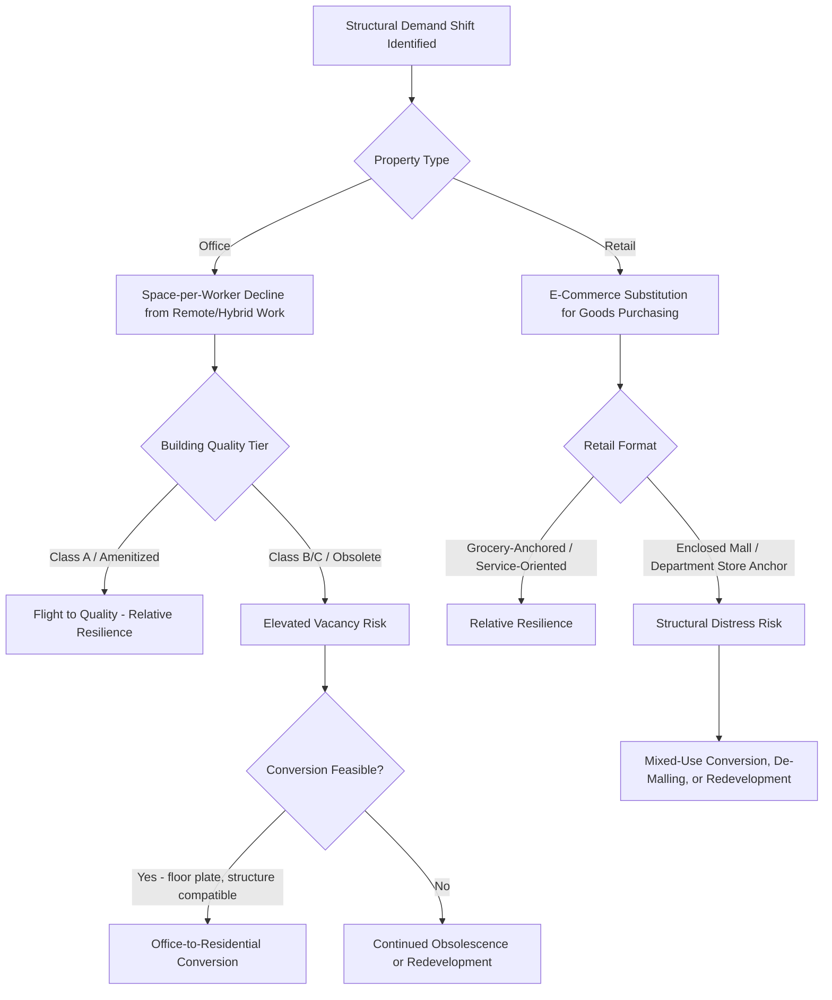

## Office and Retail Real Estate Transformation

### Overview

Office and retail real estate transformation refers to the structural (secular) demand shifts affecting these two core commercial property sectors, distinct from the cyclical fluctuations covered in real estate cycle analysis. Both sectors face demand-side disruption from technology-enabled substitution — remote/hybrid work reducing office space utilization, and e-commerce reducing brick-and-mortar retail space requirements — creating analytically distinct challenges from a standard cyclical downturn, since structural change implies a potentially permanent repricing and repurposing of existing stock rather than a temporary demand trough awaiting cyclical recovery.

### Distinguishing Structural Change from Cyclical Downturn

**Key Points**

- A cyclical downturn (as modeled in the DiPasquale-Wheaton framework and real estate cycle analysis) is characterized by temporarily depressed demand that is expected to recover as the broader economic cycle turns, with the existing stock eventually being reabsorbed as the space-market demand curve shifts back outward
- Structural transformation instead implies a durable shift in the underlying demand function itself — the relationship between economic activity (employment, retail sales) and required physical space per unit of that activity has changed, meaning even a full macroeconomic recovery would not necessarily restore prior space-demand levels for the affected sector
- Distinguishing cyclical from structural drivers in real time is analytically difficult (as noted in the commercial real estate markets discussion) since both can produce similar initial symptoms (rising vacancy, softening rents), but the appropriate market response and investment strategy differ substantially: a cyclical downturn calls for patience and eventual reabsorption, while structural change may call for active repositioning, conversion, or write-down of affected assets [Unverified — real-time classification of any specific current market softness as cyclical versus structural requires current market data and is an inherently uncertain judgment call rather than a mechanically determinable fact]

### Office Sector: Remote and Hybrid Work Effects

**Key Points**

- The shift toward remote and hybrid work arrangements, substantially accelerated by the COVID-19 pandemic period, reduced the average physical office space utilization per employee in many markets, as a portion of the workforce works from home on some or all days, reducing the space required to accommodate a given headcount even without any reduction in the underlying employee count itself
- This creates a demand-side effect operating through the "space per worker" ratio rather than solely through office-using employment levels — meaning office space demand can decline even in a market with stable or growing office-sector employment, a dynamic not well captured by traditional employment-based office demand forecasting models calibrated on pre-pandemic space-utilization relationships
- The magnitude and persistence of this effect vary substantially by market, industry composition, and individual employer policy, with some markets and building segments (particularly newer, higher-amenity "trophy" or Class A buildings in central locations) showing greater resilience than older, lower-amenity Class B/C buildings in many studied markets — a bifurcation pattern frequently described in commercial real estate market commentary [Unverified — this is a rapidly evolving, market-specific empirical pattern; source current vacancy, leasing, and utilization data from up-to-date market reports rather than treating any specific figure as a stable constant]

### Diagram: Office Space Demand Function Shift (svg_diagram)

<svg xmlns="http://www.w3.org/2000/svg" viewBox="0 0 680 400">
<text x="340" y="24" text-anchor="middle" font-size="16" font-weight="bold">Structural Shift in Office Space Demand (svg_diagram)</text>
<line x1="70" y1="350" x2="620" y2="350" stroke="black" stroke-width="2" />
<line x1="70" y1="350" x2="70" y2="30" stroke="black" stroke-width="2" />
<text x="345" y="380" text-anchor="middle" font-size="13">Office-Using Employment</text>
<text x="30" y="190" text-anchor="middle" font-size="13" transform="rotate(-90 30 190)">Space Demanded</text>
<line x1="90" y1="330" x2="590" y2="80" stroke="#1f77b4" stroke-width="3" />
<text x="420" y="120" font-size="12" fill="#1f77b4">Pre-Shift Demand (space per worker fixed)</text>
<line x1="90" y1="330" x2="590" y2="180" stroke="#d62728" stroke-width="3" />
<text x="420" y="220" font-size="12" fill="#d62728">Post-Shift Demand (lower space per worker)</text>
<line x1="400" y1="204" x2="400" y2="130" stroke="#888" stroke-dasharray="4" />
<text x="410" y="165" font-size="11">Gap = utilization effect, not employment change</text>
</svg>

### Office Market Bifurcation and Flight to Quality

**Key Points**

- Office market performance divergence between high-quality/amenitized buildings (often newer construction with strong sustainability credentials, on-site amenities, and central, transit-accessible locations) and older, lower-amenity buildings has been widely observed in the commercial real estate literature and market commentary, sometimes termed a "flight to quality" pattern, where tenants renewing or relocating leases increasingly concentrate demand in a shrinking pool of top-tier buildings while lower-tier stock experiences disproportionately elevated vacancy
- This bifurcation pattern connects directly to filtering theory concepts discussed in the housing context, applied here to commercial office stock: buildings unable to attract tenant demand at competitive rents may face accelerated functional obsolescence, requiring substantial capital reinvestment to remain competitive or, in more severe cases, becoming candidates for conversion to alternative uses or removal from the office stock entirely
- The capital expenditure required to reposition older office stock to competitive quality standards (updated mechanical systems, amenity spaces, sustainability retrofits) represents a significant reinvestment decision analogous to the owner maintenance/reinvestment decision discussed in housing filtering theory, with the economic viability of reinvestment depending on whether achievable post-renovation rents justify the capital outlay relative to the building's underlying land value and location

### Office-to-Residential and Adaptive Reuse Conversion

**Key Points**

- Office-to-residential conversion has been widely discussed as a potential adaptive reuse strategy for structurally obsolete office stock, particularly in markets facing simultaneous office oversupply and housing undersupply — conceptually connecting the office transformation topic directly to the housing supply elasticity and filtering discussions elsewhere in this course, since conversion effectively transfers physical stock from one property-type category to another
- Conversion feasibility is constrained by building-specific physical characteristics: floor plate depth (residential units generally require access to natural light and ventilation within a narrower depth than typical office floor plates, making deep-floor-plate buildings often economically or physically challenging to convert), structural/mechanical system compatibility, and existing window configuration, meaning not all obsolete office stock is a physically viable conversion candidate
- Beyond physical feasibility, conversion economics depend on the same replacement-cost/asset-price relationship discussed in the DiPasquale-Wheaton framework: conversion will occur where the resulting residential asset value (post-conversion) exceeds the conversion cost plus the acquisition cost of the office building at its current (potentially depressed) value — meaning conversion activity should be expected to concentrate in markets and buildings where this value gap is most favorable, rather than being a universally applicable solution across all obsolete office stock [Unverified — the actual pace and scale of office-to-residential conversion activity relative to the scale of the underlying office oversupply challenge is a matter of ongoing market observation; source current conversion pipeline data from current market reports]

### Retail Sector: E-Commerce Substitution Effects

**Key Points**

- The growth of e-commerce as a channel for consumer purchasing has reduced the physical retail space required to serve a given level of consumer spending for goods categories highly amenable to online purchase and fulfillment (general merchandise, apparel, electronics, among others), while categories requiring in-person service or experience (grocery, restaurants, personal services, healthcare) have shown greater resilience to e-commerce substitution
- This has produced differentiated performance across retail property formats: enclosed regional malls (historically anchored by department stores particularly exposed to e-commerce substitution) have faced the most pronounced structural challenges in many markets, while grocery-anchored neighborhood/community shopping centers and open-air formats with a service/experience-oriented tenant mix have generally shown greater resilience [Unverified — retail format performance divergence is market- and format-specific and evolves with consumer behavior trends; source current performance data from current retail sector market research]
- E-commerce growth has simultaneously been a significant demand driver for industrial/logistics real estate (warehousing, distribution, last-mile fulfillment facilities), meaning the retail sector's structural challenge and the industrial sector's structural tailwind are, to a meaningful degree, two sides of the same underlying consumer behavior shift — physical retail space is being substituted not merely for "no space" but partly for industrial/logistics space elsewhere in the supply chain

### Retail Adaptive Reuse and Repositioning

**Key Points**

- Distressed or obsolete retail properties, particularly former department store anchor spaces and underperforming enclosed malls, have been subject to various adaptive reuse and repositioning strategies including conversion to mixed-use development (residential, office, or hotel components replacing retail), experiential/entertainment-oriented retail repositioning, medical office or healthcare use conversion, and in some cases full redevelopment/demolition for alternative uses entirely
- Repositioning strategy selection depends on location-specific factors including underlying land value (connecting to the highest and best use analysis discussed in real estate valuation methodology), local zoning/entitlement flexibility, and the specific market's unmet demand for alternative uses (e.g., a market with strong residential demand but obsolete retail stock is a more natural conversion candidate than a market lacking underlying demand for any alternative use)
- Some retail repositioning strategies retain a retail use but fundamentally alter the tenant mix and physical configuration — de-malling (converting enclosed mall space to open-air format), right-sizing (reducing overall retail square footage while adding non-retail uses to the site), and experiential anchor replacement (replacing a vacated department store with entertainment, fitness, or dining-oriented anchors) — representing a spectrum of adaptation short of full conversion to a different property type

### Structural Transformation Response Framework (Mermaid)

### Investment and Capital Market Implications

**Key Points**

- REIT sector performance and capital allocation (discussed in the REIT topic) has reflected these structural trends, with industrial and data center REITs generally attracting increased institutional capital allocation relative to office and traditional mall-format retail REITs in recent years, reflecting investor repricing of expected sector-specific cash flow growth trajectories [Unverified — specific relative capital allocation and valuation multiple trends shift over time and should be sourced from current REIT sector market data]
- Lending and underwriting standards for office and traditional retail properties have generally become more conservative in markets experiencing pronounced structural demand uncertainty, reflecting lender reassessment of appropriate loan-to-value ratios and debt service coverage assumptions given greater uncertainty regarding sustainable long-run NOI for affected property types and quality tiers
- Valuation methodology (as discussed in real estate valuation and appraisal methods) faces particular challenges during periods of structural transformation, since comparable sales data reflecting the new structural regime may be limited during the transition period, income capitalization approaches require careful reassessment of appropriate cap rates and NOI growth assumptions given genuine uncertainty about the sector's structural trajectory, and cost approach replacement-cost comparisons may be less relevant for properties whose highest and best use has shifted away from continued use in their current property type

### Policy and Urban Planning Dimensions

**Key Points**

- Zoning and entitlement flexibility (streamlined approval processes for office-to-residential or retail-to-mixed-use conversion, as-of-right conversion allowances) has been proposed and, in various jurisdictions, adopted as a policy response to facilitate adaptive reuse, connecting directly to the land-use regulation and permitting-process discussion in housing supply elasticity analysis, since conversion projects face many of the same discretionary review and entitlement friction issues affecting new ground-up construction
- Downtown/central business district vitality concerns have motivated broader municipal policy interest in office-to-residential conversion beyond pure private-market economics, given concerns about reduced foot traffic, retail spillover effects, and municipal tax base implications from sustained office vacancy in core urban districts — creating a public-policy rationale for conversion incentive programs (tax abatements, expedited permitting) in some jurisdictions beyond what private market economics alone might generate [Unverified — specific municipal incentive program details and their effectiveness are jurisdiction-specific and should be sourced from current policy documentation]
- These conversion and repositioning dynamics illustrate a direct practical application of the filtering and highest-and-best-use concepts developed in earlier housing and valuation topics, extended to the commercial property context and cross-property-type structural transformation rather than same-use-category filtering alone

### Conclusion

Office and retail real estate transformation represents a structural, rather than purely cyclical, demand shift driven by remote/hybrid work adoption and e-commerce substitution respectively, producing bifurcated performance within each sector (flight to quality in office, format-specific divergence in retail) and motivating adaptive reuse strategies — office-to-residential conversion, retail de-malling and mixed-use repositioning — whose feasibility depends on building-specific physical characteristics and market-specific value gaps between current use and alternative highest-and-best-use potential. These dynamics extend the filtering, highest-and-best-use, and DiPasquale-Wheaton replacement-cost frameworks developed earlier in this course to cross-property-type structural transformation, representing an increasingly central analytical challenge in contemporary commercial real estate economics.

**Related Topics**

- Filtering models applied to commercial office stock obsolescence
- Highest and best use analysis and redevelopment/conversion economics
- Commercial real estate markets and sector-specific demand drivers
- REIT sector allocation shifts reflecting structural trend repricing
- Housing supply elasticity, land-use regulation, and conversion permitting friction
- The DiPasquale-Wheaton model and replacement-cost-driven conversion decisions
- Real estate valuation challenges during structural market transitions
- Industrial/logistics real estate as the demand-side counterpart to retail e-commerce substitution