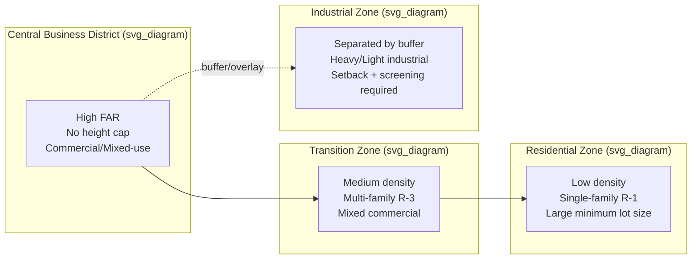

## Land Use Regulation and Zoning Ordinances

### Definition and Scope

Land use regulation refers to the body of legal instruments through which government authorities control how privately and publicly owned land may be used, developed, and transferred. Zoning ordinances are the primary municipal-level instrument within this body: legally binding codes that partition a jurisdiction into geographically defined districts (zones) and prescribe permitted uses, density limits, and physical development standards within each district.

Zoning is a form of **police power** regulation — grounded in the government's authority to protect public health, safety, and welfare — distinguished from eminent domain in that it does not require compensation to landowners for value lost due to use restrictions (subject to constitutional limits discussed below).

### Historical and Legal Foundations

**Origins**: Comprehensive municipal zoning began in the United States with New York City's 1916 Zoning Resolution, motivated by concerns over skyscraper shadows, tenement overcrowding, and incompatible land use juxtaposition (e.g., factories adjacent to residential blocks).

**Constitutional basis**: The landmark case *Village of Euclid v. Ambler Realty Co.* (1926) established that zoning is a valid exercise of police power under the U.S. Constitution, provided it bears a rational relationship to public health, safety, morals, or general welfare. This gave rise to the term "Euclidean zoning" to describe use-based, district-segregated zoning systems.

**Takings limitation**: *Pennsylvania Coal Co. v. Mahon* (1922) and later *Lucas v. South Carolina Coastal Council* (1992) established that regulation which deprives land of all economically viable use may constitute a regulatory taking requiring compensation under the Fifth Amendment. This creates a legal boundary condition on how restrictive zoning can be.

[Inference] Legal frameworks outside the U.S. (e.g., UK's discretionary planning permission system, or statutory land-use planning in the Philippines under the Local Government Code and HLURB/DHSUD guidelines) follow different institutional logics but serve analogous economic functions — this section's case law is U.S.-specific and should not be assumed universally applicable.

### Core Instrument Types

**Euclidean (use-based) zoning**

Districts are defined primarily by permitted use categories, typically:

- Residential (further subdivided by density: R-1 single-family, R-2/R-3 multi-family, etc.)
- Commercial (neighborhood, general, central business district)
- Industrial (light, heavy)
- Agricultural
- Institutional/public

Within each district, ordinances specify:

- **Bulk/dimensional standards**: setbacks, height limits, lot coverage ratios, floor-area ratio (FAR)
- **Density controls**: minimum lot size, units per acre, dwelling unit caps
- **Parking requirements**: minimum off-street spaces per unit or per square foot of commercial space

**Performance zoning**

Regulates outcomes (noise, emissions, traffic generation, stormwater runoff) rather than prescribing specific uses, allowing more flexibility in what activities occur as long as impact thresholds are met.

**Form-based codes**

Regulate building form, massing, and street relationship (e.g., build-to lines, frontage type) rather than use, on the premise that urban form — not use segregation — determines neighborhood character and walkability.

**Overlay zones**

Supplemental regulations layered atop base zoning for special considerations: historic preservation districts, floodplain overlays, airport approach zones, transit-oriented development (TOD) overlays.

**Planned Unit Developments (PUDs)**

Negotiated, site-specific zoning agreements that allow deviation from standard district rules in exchange for public benefits (e.g., open space dedication, affordable housing set-asides), common in large master-planned developments.

### Administrative Mechanisms

- **Variance**: Case-by-case relief from a specific dimensional requirement (e.g., a reduced setback) granted when strict application would cause "unnecessary hardship," typically adjudicated by a Zoning Board of Adjustment.
- **Special/conditional use permit**: Authorization for a use permitted in a district only subject to added conditions (e.g., a church in a residential zone, subject to parking and noise mitigation).
- **Nonconforming use ("grandfathering")**: Legal protection for uses that predate a zoning change and violate current rules but are allowed to continue, typically with restrictions on expansion or rebuilding after destruction.
- **Rezoning (zone map/text amendment)**: Legislative change to the zoning map or ordinance text, typically requiring public hearings and planning commission/city council approval.
- **Zoning by right vs. discretionary approval**: "By right" development conforms to code and requires only administrative permit issuance; discretionary approval (e.g., conditional use, PUD) involves public hearings and case-specific findings.

### Economic Rationale

**Externality correction**

The standard welfare-economics justification for zoning is correction of negative externalities from land use incompatibility. A factory locating next to housing imposes noise, pollution, and traffic costs on residents that are not reflected in the factory's private cost calculus. Absent regulation or a functioning Coasean bargaining mechanism (blocked here by high transaction costs among many affected residents), the market will over-produce the externality-generating use.

$$MSC = MPC + MEC$$

where $MSC$ is marginal social cost, $MPC$ is marginal private cost, and $MEC$ is marginal external cost. Zoning functions as a **quantity-based** correction (Pigouvian taxes being the price-based alternative) — it restricts the externality-generating activity to zero in incompatible districts rather than pricing the externality.

**Public goods and amenity provision**

Zoning also supports the provision of local public goods with excludability problems, e.g., preserving low-density residential character or scenic viewsheds that raise aggregate property values but cannot be efficiently priced through private transactions alone.

**Fiscal zoning**

[Inference — well-established in urban economics literature but represents a theoretical interpretation of observed behavior] Municipalities, particularly in fragmented metropolitan areas with local property-tax-funded services (Tiebout-style sorting), often use zoning (especially large-lot minimums and multi-family exclusions) to attract high property-tax-yielding, low-service-cost residents (e.g., wealthy childless households) while excluding lower-income households who would be net fiscal burdens. This is termed **fiscal zoning** and is distinct from pure externality correction.

**Exclusionary zoning and the housing affordability channel**

A substantial empirical and theoretical literature (Glaeser & Gyourko, and others) argues that restrictive zoning — minimum lot sizes, height caps, parking minimums, and lengthy discretionary review — constrains housing supply elasticity, causing prices to diverge from physical construction costs in high-demand metros. The gap between market price and marginal construction cost is interpreted as an implicit "zoning tax":

$$P_{house} = MC_{construction} + Z$$

where $Z$ represents the shadow price of regulatory constraint on the quantity of buildable housing.

[Inference] The magnitude of $Z$ is empirically estimated and varies substantially by metro area and study methodology; treat specific published estimates as time- and place-bound rather than structural constants.

### Efficiency vs. Equity Trade-offs

| Consideration | Pro-regulation view | Anti-regulation / market view |
| --- | --- | --- |
| Externalities | Zoning internalizes costs of incompatible land uses | Nuisance law and private covenants can achieve similar outcomes with fewer deadweight losses |
| Housing supply | Necessary for orderly, planned infrastructure-matched growth | Restricts supply elasticity, inflates prices, worsens affordability |
| Equity | Protects existing residents' investment and neighborhood stability | Enables exclusionary sorting by income and, historically, race |
| Property rights | Legitimate exercise of police power for collective welfare | Constitutes a partial, uncompensated taking of development rights |

### Historical Use for Exclusion

[Unverified — historical claim requiring case-specific citation, though broadly documented in the urban planning historiography] Following the U.S. Supreme Court's invalidation of explicit racial zoning in *Buchanan v. Warley* (1917), many municipalities adopted facially race-neutral instruments — minimum lot sizes, single-family-only districts, and prohibitions on multi-family housing — that produced similar exclusionary effects by proxying for income, which correlated with race under conditions of employment and lending discrimination. This history is central to contemporary zoning reform debates (e.g., single-family zoning repeal initiatives in Minneapolis, California SB 9/SB 10).

### Contemporary Reform Approaches

- **Upzoning**: Legislative increase in permitted density (e.g., allowing duplexes/triplexes in former single-family-only zones) to expand housing supply capacity.
- **Inclusionary zoning**: Mandates or incentivizes a percentage of new units in a development be affordable to low/moderate-income households, often paired with density bonuses.
- **Transit-oriented development (TOD) zoning**: Higher density and reduced parking minimums near transit stations to align land use with transit ridership potential.
- **Accessory dwelling unit (ADU) legalization**: Permitting secondary units on single-family lots as a low-friction density increment.
- **Zoning preemption**: State-level legislation overriding local zoning authority to compel higher density or reduce discretionary review (e.g., California's statewide ADU and SB 9 laws).

### Illustrative Diagram: Zoning District Cross-Section

### Worked Example: Externality-Based Zoning Decision

**Scenario**: A municipality is deciding whether to permit a light-manufacturing use in a parcel adjacent to an existing residential subdivision.

**Key Points**:

- Estimated private benefit to the manufacturer (in land rent terms): $150,000/year
- Estimated aggregate external cost to 40 adjacent households (noise, traffic, air quality) at $3,000/year each: $120,000/year
- Net social benefit if permitted without mitigation: $150,000 − $120,000 = $30,000/year (positive, suggesting conditional approval with mitigation may be efficient)
- If a buffer/setback requirement costs the manufacturer $40,000/year but reduces external cost to $50,000/year, net social benefit rises to $150,000 − $40,000 − $50,000 = $60,000/year

**Conclusion**: This illustrates why conditional use permits with mitigation conditions (buffers, hour restrictions, noise limits) can be more allocatively efficient than blanket prohibition or blanket permission — zoning administration in practice frequently operates at this margin rather than as a binary use/no-use decision.

[Inference] Numbers above are illustrative for pedagogical purposes, not derived from a specific empirical study.

### Common Critiques Summarized

- **Static district boundaries** poorly track dynamic urban growth and shifting land value gradients, leading to costly rezoning battles.
- **Discretionary review processes** (public hearings, environmental review) can be captured by incumbent-resident opposition ("NIMBYism"), systematically biasing outcomes toward under-supply of new housing relative to the social optimum.
- **Parking minimums** are frequently cited in the urban economics literature as imposing large, hidden costs on development (Donald Shoup's work is the reference point here), since structured parking can cost tens of thousands of dollars per space, embedding these costs into housing prices even for car-free households.
- **Fragmented metropolitan governance** allows individual municipalities to externalize regional housing shortages onto neighboring jurisdictions, a collective action problem not resolved at the single-municipality zoning level.

### Related Topics

- Tiebout sorting and local public finance
- Land value taxation as a zoning alternative
- Urban growth boundaries and greenbelt policy
- Housing supply elasticity estimation methods
- Eminent domain and just compensation doctrine
- Comprehensive/master plans and their legal relationship to zoning ordinances
- Transit-oriented development economics
- Informal settlement regulation and land tenure (relevant comparative context for Philippine LGU contexts)