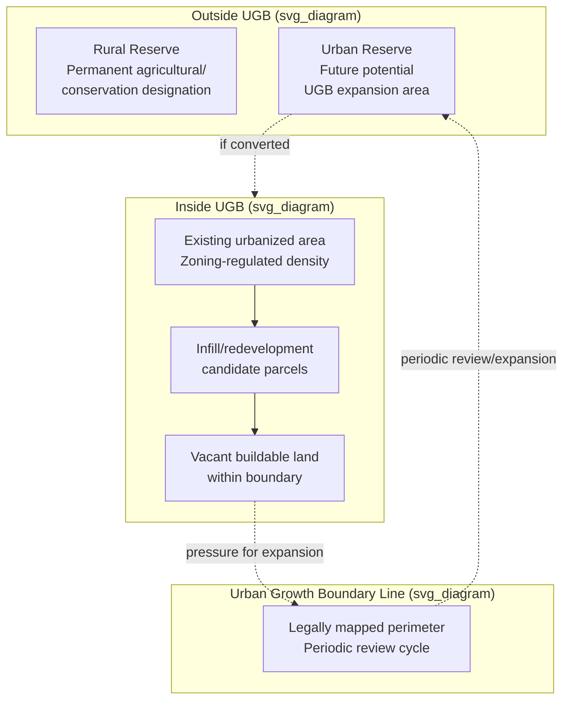

## Growth Controls and Urban Growth Boundaries

### Definition and Scope

Growth controls encompass a broad category of regulatory instruments that limit the pace, location, or magnitude of urban development, distinct from ordinary zoning in that they typically constrain aggregate growth over time rather than merely allocating land to use categories. **Urban growth boundaries (UGBs)** are the most geographically explicit form: a legally defined perimeter beyond which urban-density development is prohibited, with land outside the boundary reserved for agricultural, forestry, or open-space use.

### Taxonomy of Growth Control Instruments

**Quantity-based controls**

- **Growth caps/permit allocation systems**: Annual numerical limits on building permits issued (e.g., Petaluma, California's historic residential permit cap system upheld in *Construction Industry Association v. City of Petaluma*, 1975)
- **Adequate public facilities ordinances (APFO)**: Development approval conditioned on concurrent availability of infrastructure capacity (roads, schools, sewer) — sometimes called "concurrency" requirements

**Geographic containment instruments**

- **Urban growth boundaries (UGBs)**: A mapped line separating urbanizable land from land reserved for non-urban use, with periodic review and potential expansion (Portland, Oregon's regional UGB, administered by Metro, is the most frequently cited U.S. example)
- **Greenbelts**: Permanently protected open space or agricultural land rings around a city, generally more static than UGBs (London's Metropolitan Green Belt is the archetypal example)
- **Urban service boundaries/service area limits**: Restriction of water and sewer extension to a defined area, functioning as a de facto growth boundary since urban-density development is generally infeasible without utility service

**Timing/phasing controls**

- **Growth phasing/tiering ordinances**: Sequencing development approval based on proximity to existing infrastructure or a formal capital improvement schedule
- **Moratoria**: Temporary suspension of new development approvals, typically used while infrastructure capacity or a comprehensive plan update catches up with demand

### Economic Mechanism and Theoretical Framework

**Land price effects at the boundary**: A UGB functions economically as a hard supply constraint on urbanizable land, analogous to the zoning-restriction case but operating at the regional/metropolitan land-market level rather than the parcel/use level. Land immediately inside the boundary experiences an upward discontinuity in per-acre value relative to observationally similar land immediately outside, since the inside parcel carries development rights the outside parcel lacks.

$$P_{in} - P_{out} = V(D)$$

where $P_{in}$ and $P_{out}$ are land prices on either side of the boundary and $V(D)$ is the capitalized value of development rights — this discontinuity is directly measurable and has been estimated in several UGB-specific hedonic and regression-discontinuity studies (e.g., Portland-area and other Oregon UGB studies). [Inference] Specific published coefficient magnitudes vary by study period, boundary segment, and methodology; treat any single number as time- and place-bound.

**Compact urban form vs. leapfrog development trade-off**: The standard monocentric city model (Alonso-Muth-Mills) predicts that absent constraint, urban development expands outward until the bid-rent curve for urban use falls to the agricultural land value at the urban fringe:

$$R_{urban}(x) = R_{agricultural}$$

at the equilibrium city radius $x^*$. A UGB imposed at $x_{UGB} < x^*$ forces the urban land market to absorb population and economic growth through:

1. **Densification within the boundary** (higher FAR, infill, redevelopment of underutilized parcels)
2. **Price appreciation** if densification is itself zoning-constrained (see interaction effect below)
3. **Leapfrog development** beyond the boundary into adjacent, unconstrained jurisdictions, if the boundary is jurisdiction-specific rather than regional

[Inference — this is the standard theoretical prediction, though which outcome dominates in a given case is an empirical question dependent on the interior zoning regime] If a UGB is imposed without corresponding upzoning inside the boundary to permit the necessary densification, the constraint largely manifests as price appreciation rather than compact-form densification — a criticism frequently leveled at growth boundary programs that pair containment with restrictive interior zoning.

### Case Study: Portland Metro Urban Growth Boundary

Oregon's statewide land-use planning system (established under Senate Bill 100, 1973) requires every incorporated city to establish a UGB, with Portland's regional boundary managed by Metro, an elected regional government — an institutional structure notable for being one of few directly elected regional governance bodies in the U.S.

**Key design features**:

- Periodic mandated review (originally 20-year buildable land supply requirement) with potential boundary expansion if insufficient buildable land is identified
- Companion "urban reserve" and "rural reserve" designations identifying land for future potential UGB expansion versus permanently protected rural land
- Paired (at least in policy intent) with transit investment and some interior upzoning to accommodate growth through density rather than pure containment

[Inference] Empirical assessments of whether Portland's UGB has raised housing prices relative to counterfactual, and by how much, remain a genuinely contested question in the literature, with some studies attributing measurable price effects to the boundary and others attributing regional price growth primarily to other factors (income growth, national housing cycle, interior zoning restrictiveness). This is an area of live academic and policy debate rather than a settled empirical consensus.

### Rationale and Justifications for Growth Controls

- **Farmland and open-space preservation**: Explicit non-market valuation of agricultural land, ecosystem services, and scenic/recreational amenity that would otherwise be converted to urban use at private-market prices that do not reflect these externalities
- **Infrastructure cost management**: Concentrating development within a service-efficient boundary reduces per-capita costs of extending roads, water, sewer, and emergency services (paralleling the sprawl-cost arguments discussed under general zoning effects)
- **Congestion and environmental externality management**: Compact form is argued to reduce vehicle-miles-traveled (VMT) and associated congestion and emissions, though this depends on complementary transit and land-use-mix policy, not containment alone [Inference]
- **Fiscal predictability for capital planning**: A defined growth boundary provides local governments a bounded planning horizon for capital improvement programming

### Critiques and Economic Costs

**Housing affordability channel**: The primary economic critique parallels the zoning-restriction literature — a binding UGB, especially combined with restrictive interior density limits, constrains aggregate housing supply and is associated with higher regional housing price levels relative to construction cost, following the same $P_{market} = MC_{construction} + Z$ framework discussed under zoning effects, with $Z$ here reflecting the regional land-supply constraint rather than a parcel-level use restriction.

**Regional leapfrog and exurban sprawl**: [Inference] If a UGB applies to only one jurisdiction within a multi-jurisdiction metro area, development pressure may simply relocate to unconstrained neighboring jurisdictions beyond commuting-cost thresholds, potentially producing more, not less, vehicle-miles-traveled and infrastructure duplication than an unconstrained but better-coordinated regional growth pattern — this is a genuine theoretical possibility whose empirical magnitude is context-specific.

**Distributional effects**: As with restrictive zoning generally, higher land and housing prices resulting from binding growth boundaries advantage existing property owners while raising entry costs for new households and lower-income residents, reproducing the "homevoter" political economy dynamic.

**Rigidity and adjustment cost**: Static boundary lines can lag behind actual demand growth, especially where periodic review processes are politically contentious or infrequent, producing periods of acute land-supply scarcity relative to demand.

### Comparative Note: Growth Boundaries vs. General Zoning

| Dimension | General zoning | Urban growth boundary |
| --- | --- | --- |
| Spatial scale | Parcel/district level | Metro/regional perimeter |
| Primary target | Use compatibility, density within urbanized area | Urban/non-urban land conversion |
| Typical administering body | Municipal planning department | Regional authority or state mandate (varies) |
| Time horizon | Ongoing, amendable via rezoning | Periodic review cycle (e.g., 5-20 years) |
| Interacts with | Density caps, FAR limits inside boundary | Agricultural/conservation land policy outside boundary |

### Illustrative Diagram: Growth Boundary Structure

### Worked Example: Boundary Expansion Decision

**Scenario**: A regional planning authority must decide whether to expand a UGB to accommodate projected population growth.

**Key Points**:

- Projected 20-year population growth: 150,000 new residents
- Current buildable land supply inside boundary (accounting for existing zoning): capacity for 90,000 new residents via infill/densification
- Shortfall: 60,000 residents' worth of housing capacity
- Options: (a) expand boundary to add greenfield land, (b) upzone interior parcels to increase densification capacity, (c) some combination

**Conclusion**: The chosen mix has direct economic consequences — pure boundary expansion preserves low interior density (and associated per-unit infrastructure cost) while consuming peripheral agricultural/open land; pure interior upzoning avoids land conversion but requires politically difficult density increases in already-built neighborhoods. Most actual planning processes (including Portland's) use blended approaches, though the specific mix is a political-economy outcome as much as a technical planning calculation. [Inference regarding the general pattern across observed cases]

### Related Topics

- Monocentric city model (Alonso-Muth-Mills) and bid-rent theory
- Economic effects of zoning restrictions (interior density interaction)
- Regional governance and metropolitan fragmentation
- Agricultural land preservation policy and farmland conversion economics
- Transit-oriented development and compact growth strategies
- Vehicle-miles-traveled (VMT) and land-use/transportation interaction
- Hedonic pricing methods for land value estimation
- Comparative international growth management (UK green belts, South Korea greenbelt policy)