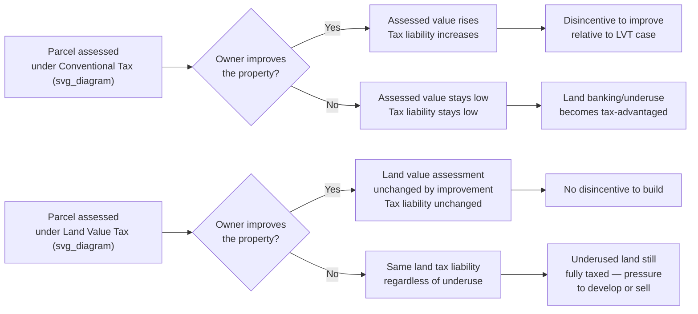

## Land Value Taxation

### Definition and Scope

Land value taxation (LVT) is a system of property taxation that assesses tax liability based solely, or primarily, on the unimproved value of land, excluding the value of buildings and other capital improvements affixed to it. This contrasts with conventional property taxation, which taxes the combined value of land and improvements at a uniform rate. A **split-rate tax** (or "two-rate" tax) is the common practical implementation, applying a higher millage rate to land value and a lower (or zero) rate to improvement value, rather than eliminating the improvement tax entirely.

### Theoretical Foundations

**Georgist origin**: LVT is most closely associated with Henry George's 1879 work *Progress and Poverty*, which argued that the unearned increase in land value arising from community growth and public investment (rather than from any effort of the landowner) constitutes a legitimate and efficient basis for public revenue — encapsulated in George's proposal for a "single tax" on land value sufficient to fund government, replacing other taxes.

**The supply inelasticity argument**: The core economic case for LVT rests on the classical observation that the supply of land is fixed (perfectly inelastic) in aggregate — land cannot be manufactured in response to price signals, unlike labor or capital.

$$\epsilon_{s,land} = 0$$

Under standard tax incidence theory, a tax on a perfectly inelastically supplied factor falls entirely on the factor owner (in this case, the landowner) and cannot be shifted forward to tenants or consumers through price increases, since the quantity supplied does not respond to the tax.

$$\text{Tax incidence on supplier} = \frac{\epsilon_d}{\epsilon_d - \epsilon_s}$$

As $\epsilon_s \to 0$, the landowner bears the full incidence regardless of demand elasticity $\epsilon_d$. This is the standard textbook derivation underlying the claim that LVT is **non-distortionary**: since the pre-tax quantity of land is unchanged by the tax (there being no way to reduce the "quantity" of land supplied), LVT does not create the deadweight loss associated with taxes on mobile or elastically-supplied factors, such as capital improvements.

**Contrast with conventional property tax**: A conventional ad valorem property tax that includes the value of improvements functions, at the margin, partly as a tax on capital investment in structures — since increasing the value of a building increases assessed value and therefore tax liability. This is argued to create a disincentive to invest in improvements, maintenance, and redevelopment (the "penalize improvement" critique), potentially encouraging land banking, deferred maintenance, or underdevelopment of parcels relative to their economically optimal use.

$$T_{conventional} = t(V_{land} + V_{improvement})$$

$$T_{split-rate} = t_L \cdot V_{land} + t_I \cdot V_{improvement}, \quad t_L > t_I$$

### Economic Effects: Predicted Mechanisms

**Incentive for land development/densification**: Because LVT liability is fixed regardless of what is built (or not built) on a parcel, holding underutilized land (e.g., surface parking lots, vacant lots, or under-built structures in high-value areas) becomes relatively more costly per unit of value extracted, compared to under a conventional property tax where an owner might minimize tax liability precisely by leaving land undeveloped or under-built.

[Inference — this is the standard theoretical prediction from the literature, and is supported by some empirical case studies, but the magnitude of the effect and generalizability across contexts remains debated] Empirical studies of the split-rate tax jurisdictions in Pennsylvania (e.g., Pittsburgh's split-rate system, in place from 1913 until its repeal in 2001, and other Pennsylvania municipalities such as Harrisburg and Allentown) have found associations between adoption of split-rate taxation and increased building activity relative to comparison jurisdictions, though isolating the causal effect of the tax structure from concurrent economic development policy and regional trends is methodologically difficult, and results across specific studies vary in magnitude and statistical robustness.

**Capitalization into land price**: Standard capital-asset pricing logic implies that an anticipated future tax stream capitalizes into a reduction in the present asset price. A newly imposed or increased LVT is predicted to reduce the market price of land (holding rental/use value constant) by approximately the present value of the additional tax stream:

$$\Delta P_{land} \approx -\frac{\Delta T}{r}$$

where $r$ is the relevant discount rate. This capitalization effect means the *burden* of a newly introduced LVT falls on landowners *at the time of introduction* (a one-time wealth transfer), while purchasers of land after the tax is established pay a correspondingly lower purchase price and are not, in a present-value sense, additionally burdened by the ongoing tax — a point frequently misunderstood in LVT debates and worth distinguishing carefully. [Inference — this follows from standard asset-pricing capitalization theory, though real-world capitalization is rarely perfectly complete due to assessment lags, uncertainty about future tax changes, and capital market imperfections]

### Assessment and Administrative Challenges

**Land vs. improvement value separation**: The central practical difficulty in implementing LVT is that land and improvement values are not independently observed in most real estate transactions — sale prices reflect the combined bundle. Assessors must estimate land value separately using techniques such as:

- **Comparable vacant land sales**: Using nearby vacant parcel transactions as land-value benchmarks, complicated by the scarcity of vacant land sales in built-up areas
- **Extraction/allocation method**: Estimating replacement cost of improvements (depreciated) and subtracting from total observed sale price to back out implied land value
- **Land residual method**: Applying income-capitalization techniques to the site's highest-and-best-use potential, working backward from achievable rents

[Inference] Assessment accuracy for land value in isolation is generally regarded in the property-assessment literature as more challenging and more prone to error than assessing combined land-and-improvement value, which is one of the most frequently cited practical objections to LVT implementation, particularly in mature urban areas with limited vacant-land transaction data.

**Highest-and-best-use assessment issue**: [Inference] A related complication is that land should, in principle, be assessed at its value under its highest permitted use (given zoning), not its current use — meaning a vacant lot zoned for a high-rise should be assessed near its high-rise-supporting value even while sitting empty. This creates strong incentive alignment with the development-incentive mechanism described above, but also means LVT assessment values are sensitive to, and interact closely with, zoning policy — an underassessed or overly restrictive zoning designation directly suppresses the land value tax base.

### Split-Rate Implementation Spectrum

| Rate structure | Description | Distortion profile |
| --- | --- | --- |
| Pure LVT | 100% land value, 0% improvement value | Theoretically maximal non-distortion on improvements |
| Split-rate (moderate) | Higher rate on land, positive but lower rate on improvements | Partial reduction in improvement disincentive |
| Conventional uniform | Equal rate on land and improvement value | Full "penalize improvement" effect present |

Most real-world "LVT" implementations (Pennsylvania municipalities, Denmark, Estonia, and historically several Australian and New Zealand jurisdictions) are split-rate systems rather than pure single-tax systems, reflecting both political feasibility and revenue-sufficiency constraints (a pure LVT revenue base may be insufficient or excessively volatile relative to conventional combined assessment in some jurisdictions). [Inference regarding revenue-sufficiency claims — this varies substantially by jurisdiction and land-value-to-total-value ratio]

### International and Historical Examples

- **Pennsylvania municipalities (U.S.)**: Longest-running U.S. split-rate experience; Pittsburgh's system (1913–2001) is the most-studied case, ultimately repealed following a reassessment controversy unrelated to the tax structure itself, complicating causal interpretation of its repeal.
- **Denmark**: Land value taxation (grundskyld) has operated as a component of Danish municipal property taxation for an extended period, alongside broader property taxes.
- **Taiwan**: Land value tax and land value increment tax have been components of Taiwan's fiscal system since the mid-20th century, influenced by Sun Yat-sen's writings, which drew partly on Georgist ideas.
- **Estonia**: Adopted a land-value-only (rather than split-rate) property tax following independence, often cited as a contemporary example closer to the pure-LVT model. [Unverified — specific current-year rate structures should be confirmed against current Estonian tax law, as post-independence tax policy has evolved over time]

### Critiques and Practical Limitations

- **Political economy resistance**: Landowners, particularly in high land-value urban cores, face concentrated, salient losses under LVT relative to a conventional property tax, generating organized opposition disproportionate to the diffuse efficiency gains distributed across renters and future residents.
- **Transitional equity concerns**: Owners who purchased land under a conventional tax regime, particularly those on fixed incomes (e.g., retirees owning long-held but modestly improved property on now-valuable urban land), can face large tax increases under a shift to LVT even though they did not "cause" the land value increase — a frequently cited equity objection, sometimes termed the "land-rich, cash-poor" problem. [Inference — this is a well-documented concern in the transition-design literature, addressed in practice through phase-in schedules, circuit-breaker provisions, or deferred-payment liens]
- **Assessment cost and expertise requirements**: Requires assessor capacity for sophisticated land-value-isolation techniques beyond standard mass-appraisal methods used for combined property assessment, raising administrative cost, particularly relevant for LGU-level implementation capacity in developing-country contexts. [Inference regarding capacity constraints in specific developing-country administrative contexts]
- **Revenue volatility**: Since land value (particularly in speculative or rapidly appreciating markets) can be more volatile than combined property value inclusive of a stable improvement base, a jurisdiction heavily reliant on LVT revenue may experience greater fiscal volatility across real estate cycles. [Inference]

### Worked Example: Split-Rate Tax Calculation

**Scenario**: A municipality shifts from a uniform 2% property tax rate to a split-rate structure raising equivalent total revenue, with a land rate of 4% and improvement rate of 1%.

**Key Points**:

- Parcel A (underbuilt, high land value): Land value $400,000, improvement value $100,000
  - Conventional tax: 2% × $500,000 = $10,000
  - Split-rate tax: (4% × $400,000) + (1% × $100,000) = $16,000 + $1,000 = $17,000 (increase — incentivizes redevelopment)
- Parcel B (well-improved, moderate land value): Land value $150,000, improvement value $350,000
  - Conventional tax: 2% × $500,000 = $10,000
  - Split-rate tax: (4% × $150,000) + (1% × $350,000) = $6,000 + $3,500 = $9,500 (decrease — rewards improvement)

**Conclusion**: Holding total assessed value constant across the two parcels, the split-rate structure redistributes tax burden away from well-improved parcels toward underbuilt/land-banked parcels, illustrating the core incentive mechanism: the tax structure is designed to be revenue-neutral in aggregate (assuming rates are calibrated appropriately) while shifting relative burden based on land-to-improvement ratio rather than total value.

[Inference] Rate figures above are illustrative for pedagogical purposes; actual revenue-neutral rate calibration requires jurisdiction-specific aggregate land and improvement value data.

### Illustrative Diagram: LVT Incentive Mechanism

### Related Topics

- Economic effects of zoning restrictions (interaction with LVT assessment base)
- Property tax incidence and capitalization theory
- Tax increment financing (TIF) as an alternative land-value capture mechanism
- Highest-and-best-use analysis in real estate appraisal
- Fiscal zoning and the homevoter hypothesis
- Land banking and speculative land holding behavior
- Comparative property tax systems (Philippines real property tax under the Local Government Code, relevant to LGU fiscal context)
- Betterment levies and special assessment districts