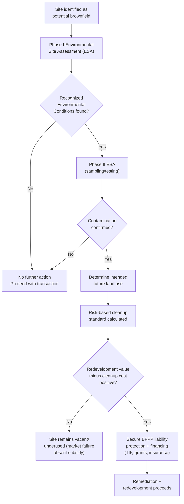

## Brownfield Redevelopment

### Definition and Scope

A brownfield is a parcel of real property, the expansion, redevelopment, or reuse of which is complicated by the presence or potential presence of a hazardous substance, pollutant, or contaminant, typically resulting from prior industrial, commercial, or waste-disposal use. The U.S. definition under the **Small Business Liability Relief and Brownfields Revitalization Act of 2002** (amending CERCLA) codifies this concept for federal program purposes; the term is used more broadly in urban economics to describe any formerly developed, now-contaminated or contamination-suspected site with redevelopment potential, distinguishing it from "greenfield" (previously undeveloped) land.

### Legal and Regulatory Framework (U.S. Context)

**CERCLA foundation**: The Comprehensive Environmental Response, Compensation, and Liability Act of 1980 ("Superfund") established strict, joint-and-several, and retroactive liability for cleanup costs, attaching to current owners, past owners at the time of contamination, generators of the hazardous substances, and transporters — a liability structure that, prior to 2002 reforms, created strong disincentives for prospective purchasers to acquire contaminated sites due to fear of inheriting unlimited cleanup liability regardless of whether they caused the contamination.

**2002 Brownfields Act reforms**: Introduced key liability protections designed to correct this market failure:

- **Bona fide prospective purchaser (BFPP) defense**: Shields a purchaser from CERCLA liability if contamination existed prior to acquisition and the purchaser conducted "all appropriate inquiries" (AAI) before purchase and takes reasonable steps post-acquisition to prevent exposure
- **Contiguous property owner defense**: Protects owners of property contaminated solely by migration from an adjacent source
- **Innocent landowner defense**: Protects owners who acquired property without knowledge of contamination despite appropriate due diligence

**All Appropriate Inquiries (AAI) standard**: A required pre-purchase environmental due diligence process (commonly implemented via **Phase I Environmental Site Assessments**, per ASTM E1527 standard) that must be completed to qualify for the liability defenses above.

[Inference] Regulatory frameworks in other jurisdictions (e.g., the Philippines' environmental compliance certificate system under the Philippine Environmental Impact Statement System, or EU contaminated land regimes) follow different liability allocation logics; the CERCLA-specific liability defenses described above are U.S.-specific and should not be assumed to transfer directly to other legal systems, though the underlying economic problem — liability uncertainty suppressing redevelopment investment — is a general phenomenon.

### The Core Economic Problem: Liability-Driven Market Failure

**Information asymmetry and liability uncertainty as a barrier to transaction**: Absent liability-limiting reform, potential contamination creates a form of market failure distinct from ordinary externality correction — it is fundamentally a problem of **uncertain, potentially unbounded liability** attaching to ownership transfer, which can render a site's expected transaction value negative even when its physical redevelopment value net of known cleanup costs would be positive.

$$V_{transaction} = V_{redeveloped} - C_{cleanup} - E[C_{liability}]$$

where $E[C_{liability}]$ is the expected value of unbounded or poorly quantified future liability exposure. When $E[C_{liability}]$ is large and uncertain (as under pre-2002 joint-and-several liability with no purchaser defense), rational buyers avoid the transaction entirely even when $V_{redeveloped} - C_{cleanup} > 0$ — producing sites that sit vacant or underused despite positive redevelopment value net of known remediation cost. This is sometimes analyzed as a form of the "lemons problem" (Akerlof) compounded by liability-transfer risk rather than pure quality uncertainty.

**Stigma effects**: [Inference — well-documented in the environmental economics and real estate literature, though specific magnitude estimates are context-dependent] Even after remediation to regulatory standards, brownfield sites and often *nearby* properties can retain a market value discount ("environmental stigma") reflecting residual buyer risk aversion, perceived (even if scientifically unwarranted) health concerns, or anticipated difficulty in future resale — this stigma discount has been estimated in various hedonic pricing studies but varies substantially by contamination type, cleanup thoroughness, and market context.

### Remediation Standards and Approaches

**Risk-based corrective action (RBCA)**: Rather than requiring remediation to a uniform, use-independent standard (e.g., pristine/background contaminant levels), most modern regulatory frameworks calibrate required cleanup levels to the site's intended future use — industrial-use cleanup standards are typically less stringent (and less costly) than residential-use standards, since exposure pathways and duration differ.

$$C_{cleanup} = f(\text{contaminant concentration}, \text{intended land use}, \text{exposure pathway})$$

This creates a direct economic linkage between **zoning/land-use planning decisions and remediation cost**: a decision to redevelop a former industrial site for continued industrial/commercial use versus residential use has first-order implications for the cleanup cost that must be incurred, which affects the feasibility calculus of alternative redevelopment scenarios.

**Institutional controls**: Non-remediation risk-management tools such as deed restrictions, land-use covenants, or vapor-barrier engineering controls, used to manage residual contamination risk without full removal, typically at substantially lower cost than complete remediation, but requiring durable long-term institutional monitoring and enforcement capacity — an ongoing administrative burden and enforcement-risk consideration.

### Redevelopment Finance Mechanisms

**EPA Brownfields program grants (U.S.)**: Assessment grants (for Phase I/II environmental site assessment), cleanup grants, and revolving loan fund grants, providing partial public subsidy to close the gap between private redevelopment value and total remediation cost.

**Tax increment financing (TIF)**: Frequently paired with brownfield redevelopment — a TIF district captures the *incremental* property tax revenue generated by post-redevelopment increased assessed value to fund upfront remediation and infrastructure costs, on the theory that without the subsidized cleanup, the incremental value (and associated tax revenue) would not materialize at all.

$$\text{TIF revenue} = t \times (AV_{post} - AV_{base})$$

where $AV_{base}$ is the assessed value frozen at the district's formation (typically the depressed, contaminated-site value) and $AV_{post}$ is the post-redevelopment assessed value.

**Brownfield-specific tax incentives**: Various jurisdictions offer targeted tax credits or accelerated depreciation for remediation expenditures (e.g., historically, U.S. federal brownfields tax incentive provisions allowing expensing of cleanup costs, subject to periodic legislative renewal — [Unverified] current availability and specific provisions should be confirmed against current tax code, as such provisions have lapsed and been renewed at various points).

**Environmental insurance products**: Pollution legal liability (PLL) insurance and cost-cap insurance products have emerged as market-based mechanisms to convert uncertain, potentially unbounded liability exposure into a bounded, priced premium — directly addressing the $E[C_{liability}]$ term in the transaction-value equation above by transferring and pricing the tail risk.

### Economic Rationale for Public Intervention

- **Externality correction (positive)**: Successful brownfield redevelopment often generates positive spillovers to surrounding property values and neighborhood revitalization that exceed the private return captured by the developer alone, providing an efficiency rationale for public subsidy (correcting an under-provision problem analogous to positive-externality goods generally)
- **Infill vs. greenfield land-use efficiency**: Brownfield redevelopment substitutes for greenfield (undeveloped land) consumption at the urban fringe, aligning with compact-growth and growth-boundary policy objectives discussed elsewhere in this chapter — redeveloping an urban-core brownfield can reduce pressure for peripheral greenfield conversion
- **Correcting the liability-driven market failure directly**: As distinguished from ordinary externality correction, the BFPP liability defenses and similar reforms are better understood as removing an artificial, policy-created barrier to an otherwise efficient transaction, rather than subsidizing an activity with under-provided positive externalities — though both rationales often apply simultaneously in practice

### Illustrative Diagram: Brownfield Redevelopment Decision Process

### Worked Example: Redevelopment Feasibility Gap Analysis

**Scenario**: A former manufacturing site in an urban core is being evaluated for conversion to mixed-use residential/commercial development.

**Key Points**:

- Estimated post-redevelopment property value: $8,000,000
- Construction/redevelopment cost (excluding remediation): $5,500,000
- Estimated remediation cost to residential-use standard: $1,800,000
- Net feasibility without subsidy: $8,000,000 − $5,500,000 − $1,800,000 = $700,000 (marginally positive, but developer may require higher risk-adjusted return threshold given liability/cost uncertainty)
- If remediation cost estimate carries significant uncertainty (e.g., ±$800,000 depending on subsurface conditions discovered during cleanup), risk-averse developers may decline the project despite positive expected value, absent a cost-cap insurance product or public cost-sharing grant to bound downside exposure

**Conclusion**: This illustrates why brownfield redevelopment gap financing (TIF, grants) and risk-transfer instruments (environmental insurance) often target not the *expected* cost but specifically the *variance/tail risk* of remediation cost — since it is uncertainty, not merely magnitude, that frequently deters otherwise value-positive redevelopment.

[Inference] Figures above are illustrative for pedagogical purposes rather than drawn from a specific documented case.

### Related Topics

- Tax increment financing (TIF) districts and mechanics
- Externalities and Pigouvian correction in urban land markets
- Hedonic pricing and environmental stigma valuation methods
- Urban growth boundaries and infill development incentives
- Land value taxation and underutilized parcel incentives
- Environmental impact assessment systems (comparative: Philippine EIS System)
- Adaptive reuse and historic building redevelopment economics
- Public-private partnership structures in urban redevelopment