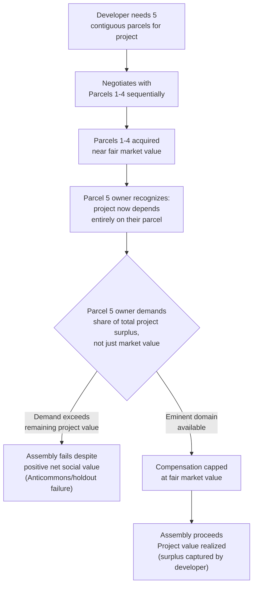

## Eminent Domain and Land Assembly

### Definition and Scope

Eminent domain (also termed compulsory purchase, expropriation, or condemnation in various jurisdictions) is the inherent power of a sovereign government to take private property for public use, subject to the constitutional or statutory requirement of just (fair market value) compensation to the owner. Land assembly refers to the broader economic and logistical process of aggregating multiple contiguous parcels, typically held by different owners, into a single unified site suitable for large-scale development — eminent domain is one instrument (among several, discussed below) used to overcome the specific market failure that makes voluntary land assembly difficult.

### Constitutional and Legal Foundation (U.S. Context)

**Fifth Amendment Takings Clause**: "...nor shall private property be taken for public use, without just compensation" — establishing two distinct constraints: the **public use** requirement and the **just compensation** requirement.

**Evolution of "public use"**:

- *Berman v. Parker* (1954) upheld urban redevelopment takings for blight remediation, broadly interpreting "public use" to include public purpose more generally, not merely direct public occupation (e.g., roads, schools)
- *Kelo v. City of New London* (2005) further extended this interpretation, upholding a taking that transferred condemned property to a private developer for economic development purposes, on the reasoning that anticipated economic development (job creation, tax revenue) constituted a sufficient public purpose — this decision proved highly controversial and prompted a substantial legislative backlash
- **Post-*Kelo* state-level restrictions**: [Inference — the general pattern is well documented, though the specific list of states and provisions should be verified for current status] Following *Kelo*, a large majority of U.S. states enacted statutory or constitutional amendments restricting the use of eminent domain for private economic development purposes, narrowing the practical scope of the *Kelo* holding at the state level even though it remains valid federal constitutional doctrine

**Just compensation standard**: Compensation is generally required to equal the property's **fair market value** at the time of taking — defined as the price a willing buyer would pay a willing seller in an arm's-length transaction, neither being under compulsion to transact. Notably, this standard explicitly excludes:

- **Subjective value / owner's personal attachment**: Any value the owner attaches beyond market value (sentimental value, business-specific goodwill in some jurisdictions, relocation disruption costs) is generally not compensable under the strict fair-market-value standard, though some jurisdictions provide supplemental statutory relocation assistance payments
- **Quick-take/anticipation effects**: Compensation is typically based on value *unaffected* by the proposed public project itself (the "project influence" or "scope of the project" rule), preventing the government from either depressing value through pre-announcement blight designation or the owner capturing speculative value created by the project's own anticipated benefit

### The Economic Rationale: Holdout Problem in Land Assembly

**Bilateral monopoly and holdout theory**: The central economic justification for eminent domain, distinct from ordinary public-goods provision rationale, is the **assembly/holdout problem**. When a developer (public or private) requires N contiguous parcels to execute a project, and negotiates sequentially or simultaneously with N owners, each individual owner recognizes that their parcel may be uniquely necessary to complete the assembly (particularly for the last parcel or parcels needed), granting them **monopoly bargaining power** disproportionate to their parcel's stand-alone market value.

$$V_{owner's demand} > V_{market} \quad \text{as} \quad N_{remaining} \to 1$$

Formally, this is a bilateral monopoly problem: once assembly is partially complete, the developer has sunk cost in already-acquired parcels and faces a strategic negotiation with each remaining holdout owner who knows the project's total value depends on their specific parcel. Each rational holdout owner has an incentive to demand a share of the *total project surplus* attributable to completing assembly, not merely their parcel's stand-alone value — and if multiple owners behave this way, the sum of demanded payments can exceed total project value, causing an otherwise socially efficient assembly to fail entirely (a version of the general **anticommons** problem, formalized by Heller, 1998).

$$\sum_{i=1}^{N} \text{Demand}_i > V_{project} - \sum_{i=1}^{N} V_{market,i}$$

when this condition holds, voluntary assembly fails even though $V_{project} > \sum V_{market,i}$ (the project would be efficient if it could be assembled at fair market value).

**Eminent domain as a solution — and its efficiency trade-off**: By capping compensation at fair market value rather than allowing holdout owners to extract project-surplus-based demands, eminent domain removes the holdout owner's bargaining leverage and enables assembly to proceed at the efficient (surplus-maximizing) scale. However, this solution has a well-recognized cost: it transfers the *entire* assembly surplus to the developer/government (or whoever benefits from the completed project), stripping affected owners of any share of the value their parcel's inclusion helped create — an equity/efficiency trade-off inherent to the mechanism, since the alternative (allowing owners to bargain for a surplus share) reintroduces the holdout failure risk.

### Comparative Instruments for Land Assembly

| Mechanism | How it addresses holdout | Compensation basis | Political/legal complexity |
| --- | --- | --- | --- |
| Eminent domain | Compulsory transfer; removes bargaining leverage | Fair market value | High (constitutional constraints, public opposition) |
| Land readjustment/pooling | Voluntary or quasi-voluntary pooling with proportional post-development share redistribution | Proportional share of post-development value, not cash | Moderate; requires supermajority owner consent in most implementations |
| Voluntary assembly with confidential buying agent | Buyer conceals ultimate assembly intent/identity to prevent individual owners from recognizing their holdout leverage | Negotiated market-based price | Low legal complexity, but ethically contested and time-intensive |
| Transferable development rights (TDR) | Not a direct assembly solution, but can incentivize voluntary consolidation via bonus density elsewhere | Market-priced development-rights transaction | Moderate; requires TDR program infrastructure |

**Land readjustment (comparative note)**: [Inference — this is a well-documented alternative mechanism used prominently in Japan, South Korea, Germany, and parts of Southeast Asia, though the specific Philippine legal framework for land readjustment/consolidation should be separately verified against current Philippine statutes and LGU ordinances if directly relevant to a specific project] Rather than compulsory cash-compensated transfer, **land readjustment (land pooling)** schemes have participating owners contribute their land to a unified pool, which is then re-subdivided and improved (with infrastructure) by the implementing authority, with owners receiving smaller but higher-value serviced parcels back in rough proportion to their original contribution — converting the holdout problem into a proportional-sharing arrangement that preserves some owner upside participation in the assembly's value creation, at the cost of requiring broader owner buy-in (often statutorily requiring a supermajority consent threshold) and more complex administrative implementation.

**Confidential/blind assembly**: A private-market alternative in which a developer uses an intermediary or shell entity to acquire parcels sequentially without revealing the ultimate assembly plan, preventing sequential sellers from recognizing (and pricing) their holdout leverage — effective but raises disclosure and fair-dealing concerns in some jurisdictions, and remains vulnerable to leaks or late-stage recognition by remaining owners.

### Compensation Valuation Methodology

**Highest-and-best-use principle**: Fair market value for compensation purposes is generally assessed based on the property's highest and best legally permissible use at the time of taking (i.e., accounting for its zoning-permitted use potential), not merely its current actual use — directly linking compensation valuation to the zoning framework discussed throughout this chapter.

**Valuation approaches** (standard appraisal methodology, applicable generally, not eminent-domain-specific):

- **Sales comparison approach**: Benchmarking against recent comparable arm's-length transactions
- **Income capitalization approach**: For income-producing property, capitalizing net operating income at a market-derived capitalization rate: $V = \frac{NOI}{r}$
- **Cost approach**: Estimating replacement cost of improvements less depreciation, plus land value, typically used when comparable sales are scarce (e.g., specialized-use properties)

**Severance damages**: When only a portion of a parcel is taken (a partial taking, common for road-widening or utility-easement projects), compensation typically includes not only the value of the taken portion but also **severance damages** — the diminution in value of the remaining parcel caused by the taking (e.g., reduced access, awkward remaining lot configuration, loss of frontage).

$$\text{Total compensation} = V_{taken\ portion} + (V_{remainder,before} - V_{remainder,after})$$

### Distributional and Equity Considerations

[Inference — well-documented empirical pattern in the urban renewal historiography, though specific statistics require case-specific citation] Historically, eminent domain use for urban renewal projects in the mid-20th-century U.S. (under federal urban renewal programs following the Housing Act of 1949) disproportionately displaced lower-income and minority communities, whose neighborhoods were frequently designated as "blighted" under standards that gave implementing authorities substantial discretion — this history is central to contemporary skepticism of eminent domain for redevelopment purposes and directly informed the political backlash following *Kelo*.

**Compensation adequacy critique**: Even where fair-market-value compensation is paid correctly, critics note that displaced owners and tenants (particularly renters, who typically receive minimal or no direct compensation under a fair-market-value-to-owner standard) bear relocation search costs, disruption of established social and economic networks, and potential above-market replacement housing costs in tight markets — costs not captured in the standard compensation formula. [Inference regarding the general critique; specific relocation assistance provisions vary substantially by jurisdiction and program]

### Illustrative Diagram: Land Assembly Holdout Problem

### Worked Example: Holdout Surplus Extraction

**Scenario**: A developer needs 4 parcels (A, B, C, D) to assemble a site worth $10,000,000 upon completion. Each parcel's independent fair market value is $1,500,000 (sum = $6,000,000), implying a total assembly surplus of $4,000,000 if acquired at market value.

**Key Points**:

- Developer acquires Parcels A, B, C sequentially at $1,500,000 each = $4,500,000 total
- Owner of Parcel D, now recognizing they are the sole remaining piece needed to realize the full $10,000,000 project value, demands $3,000,000 (double market value) — reasoning that the developer has already sunk $4,500,000 and stands to lose the entire remaining surplus if the deal collapses
- If the developer refuses and the deal collapses: sunk cost of $4,500,000 is stranded in three now-unusable (for the intended project) parcels
- If the developer accepts: total assembly cost = $4,500,000 + $3,000,000 = $7,500,000, still below the $10,000,000 project value, but the surplus distribution has shifted dramatically toward Parcel D's owner relative to A, B, and C

**Conclusion**: This illustrates why the *sequence* and *timing* of a holdout owner's leverage matters — Parcel D's owner extracts disproportionate surplus precisely because they are the last piece, not because their parcel has any different intrinsic value than A, B, or C. Eminent domain (or a pre-committed land-pooling agreement negotiated before individual leverage positions become apparent) is specifically designed to prevent this sequential leverage dynamic from either extracting disproportionate surplus or collapsing the deal entirely.

[Inference] Figures above are constructed for pedagogical illustration of the holdout mechanism rather than drawn from a specific documented transaction.

### Related Topics

- Anticommons theory and property rights fragmentation (Heller, 1998)
- Urban renewal history and blight designation standards
- Land readjustment/land pooling systems (comparative: Japan, Korea, Germany)
- Transferable development rights (TDR) programs
- Highest-and-best-use analysis in real estate appraisal
- Bilateral monopoly and bargaining theory in economics
- Public-private partnership structures in large-scale redevelopment
- Relocation assistance policy (Uniform Relocation Act, U.S. context)