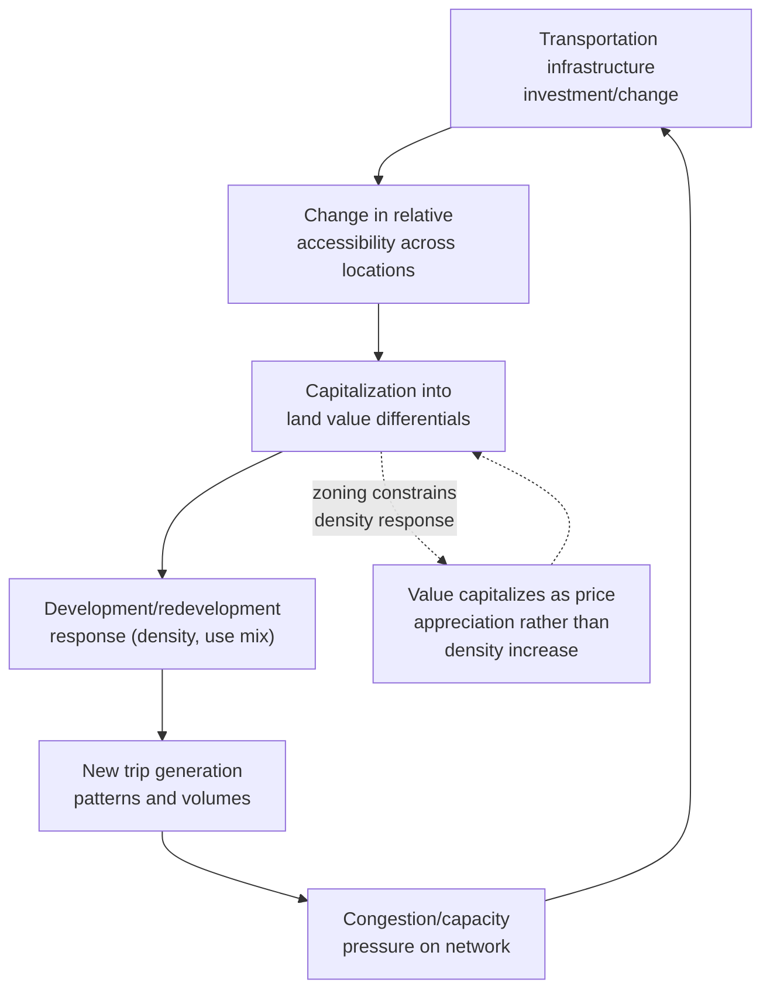

## Interaction Between Transportation and Land Use

### Definition and Scope

The transportation-land use interaction refers to the bidirectional, dynamically reinforcing relationship in which transportation infrastructure and accessibility shape land value and development patterns, while land use patterns and density simultaneously determine transportation demand and mode choice. This feedback relationship is foundational to urban economics and is formally modeled in the "land use–transport feedback cycle," distinguishing it from unidirectional treatments that consider transportation as either purely exogenous infrastructure or purely a derived response to land use.

### The Land Use–Transport Feedback Cycle

**Core feedback loop structure**:

1. Transportation infrastructure investment changes relative accessibility across locations
2. Changed accessibility capitalizes into land value differentials, favoring more accessible locations
3. Land value/accessibility differentials drive development and redevelopment decisions, altering density and use patterns
4. Altered land use patterns generate new trip origins/destinations and volumes
5. New travel demand patterns create congestion or capacity pressure, prompting further transportation investment or degradation of accessibility
6. Return to step 1

This cyclical structure means transportation and land use cannot be analyzed as independent systems for policy purposes — an intervention in either domain propagates into the other with a lag, and equilibrium models (discussed below) attempt to capture the long-run steady state of this feedback process rather than treating either variable as fixed.

### Theoretical Framework: Accessibility and Bid-Rent

**Accessibility as the causal mechanism**: The standard theoretical linkage runs through the concept of **accessibility** — the ease of reaching valued destinations (employment centers, retail, amenities) from a given location, typically operationalized as a function of travel time or generalized travel cost.

$$A_i = \sum_{j} O_j \cdot f(c_{ij})$$

where $A_i$ is the accessibility of location $i$, $O_j$ is the opportunity (e.g., jobs, retail floor space) at destination $j$, $c_{ij}$ is the generalized travel cost between $i$ and $j$, and $f(\cdot)$ is a decay function (commonly negative exponential or power-law) reflecting the declining willingness to travel as cost increases. This is the foundational **gravity-model** formulation of accessibility, used extensively in both transportation planning and urban economic geography.

**Monocentric city model integration**: In the standard Alonso-Muth-Mills monocentric city framework (introduced under growth boundary discussion), land bid-rent at distance $x$ from the central business district is a direct function of commuting cost:

$$R(x) = R(0) - t \cdot x$$

where $t$ is the marginal commuting cost per unit distance. Transportation infrastructure that reduces $t$ (e.g., a new highway, rail line, or transit corridor) **flattens the bid-rent gradient**, reducing the accessibility premium of central locations relative to peripheral ones — this is the standard theoretical mechanism by which transportation investment (specifically, radial infrastructure reducing commute cost to a fixed employment center) is associated with metropolitan spatial decentralization ("sprawl").

$$\frac{\partial R(x)}{\partial t} = -x < 0 \quad \Rightarrow \quad \text{gradient flattens as } t \text{ falls}$$

[Inference — this is the standard comparative-static prediction of the basic monocentric model; real-world outcomes are complicated by polycentric employment structure, zoning constraints on density response, and heterogeneous household preferences not captured in the single-commuter, single-CBD baseline model]

### Empirical Manifestations

**Highway investment and sprawl**: A substantial empirical literature (e.g., work by Baum-Snow examining U.S. interstate highway construction) finds that new radial highway capacity connecting central cities to peripheral areas is associated with measurable population and employment decentralization — consistent with the bid-rent-flattening mechanism above, since reduced commuting cost to suburban and exurban locations reduces the central-location accessibility premium that previously sustained central density. [Inference regarding specific magnitude, which varies across studies, cities, and time periods studied]

**Rail transit and value capture (accessibility premium)**: Conversely, investment in fixed-guideway transit (heavy rail, light rail, bus rapid transit with dedicated right-of-way) that improves accessibility disproportionately for specific corridor locations is associated in numerous hedonic pricing studies with land and property value premiums for parcels within convenient walking distance of stations, relative to otherwise-similar parcels further away — this is the empirical basis for value-capture financing mechanisms (discussed below) and transit-oriented development (TOD) zoning policy.

$$P_{property} = f(\text{distance to station}, \text{other hedonic characteristics})$$

with $\frac{\partial P}{\partial (\text{distance})} < 0$ typically found in station-proximity hedonic studies, though the specific premium magnitude and its spatial decay rate vary substantially by transit mode, service frequency/reliability, station area zoning permissiveness, and regional context. [Inference regarding generalizability of specific magnitude estimates across contexts]

**Induced demand**: A well-established empirical regularity (the "fundamental law of road congestion," Duranton and Turner, 2011) finds that highway capacity expansion tends to generate approximately proportional increases in vehicle-miles-traveled over the medium-to-long run, substantially offsetting anticipated congestion-relief benefits — this occurs through multiple channels operating on the land-use side of the feedback cycle: route/mode shifting, trip generation increases, and critically, **land use adjustment** (new development locating to take advantage of the expanded capacity, regenerating congestion at the new higher-capacity equilibrium). This directly illustrates why treating transportation capacity as a simple engineering fix without accounting for the land-use feedback response tends to systematically underestimate long-run traffic volumes.

### Transit-Oriented Development (TOD) as Applied Feedback Management

**Definition and design principle**: TOD is a land-use planning strategy explicitly designed to harness the transport-land use feedback cycle productively — by concentrating higher-density, mixed-use development within a defined walking radius (typically a quarter- to half-mile) of transit stations, TOD aims to simultaneously (a) capture the accessibility-driven land value premium for productive development rather than allowing it to dissipate as unrealized value or spill into low-density single-family uses, and (b) generate sufficient transit ridership to justify and sustain the transit investment itself — directly linking back into the feedback loop's step 4-5 (land use generating travel demand supporting transit viability).

**Key regulatory tools** (cross-referencing earlier zoning topics):

- Reduced or eliminated parking minimums near stations (interacting with the shared-parking/mixed-use analysis discussed earlier in this chapter)
- Density bonuses or TOD overlay zoning permitting higher FAR within station areas
- Complementary streetscape and pedestrian-infrastructure investment to maximize effective walkshed utilization

**Ridership-density relationship**: [Inference — well-supported directional relationship, though specific elasticity estimates vary by study and transit mode] Transit ridership per capita is consistently found to be positively associated with residential and employment density within station catchment areas, providing the empirical basis for minimum density thresholds sometimes used in transit planning to justify fixed-guideway investment (e.g., informal industry rules of thumb regarding minimum corridor density for light rail versus bus rapid transit viability) — though the specific density thresholds cited vary across transit planning literature and are sensitive to service frequency, fare policy, and competing mode costs (particularly parking pricing).

### Value Capture Financing Mechanisms

Because transportation infrastructure investment demonstrably capitalizes into private land value (the accessibility premium discussed above), several financing mechanisms attempt to recapture a portion of this publicly-created value increment to fund the infrastructure itself:

- **Tax increment financing (TIF)**: As discussed under brownfield redevelopment, capturing incremental property tax revenue within a defined transit-corridor district to fund the transit investment
- **Special assessment/benefit districts**: Direct assessment on property owners within a defined benefit area proportional to estimated accessibility-driven value increase
- **Joint development**: Direct public-private development partnerships on transit-agency-owned land at or near stations, capturing development value directly rather than through the tax system
- **Land value capture via air rights/development rights sales**: Sale or lease of development rights above or adjacent to transit infrastructure (e.g., over rail yards or station structures)

### Polycentric Extensions and Limitations of the Monocentric Model

[Inference — reflects well-established critique and extension in the urban economics literature] Contemporary metropolitan areas typically exhibit **polycentric** employment structure (multiple significant employment subcenters rather than a single dominant CBD), which the basic monocentric bid-rent model does not directly accommodate. Polycentric extensions model accessibility as a function of travel cost to multiple weighted employment centers simultaneously, producing more complex, multi-peaked land value surfaces rather than the simple monotonic gradient of the basic model — this has direct implications for transportation investment prioritization, since a single radial corridor investment may benefit accessibility to only one of several relevant employment centers, requiring more complex network-based accessibility analysis (e.g., using the gravity-model accessibility formulation above summed across multiple destination centers) to evaluate full land-use impact.

### Illustrative Diagram: Land Use–Transport Feedback Cycle

### Worked Example: Highway Interchange Accessibility Effect

**Scenario**: A new highway interchange reduces commute time from a peripheral zone to the central employment district from 45 minutes to 25 minutes.

**Key Points**:

- Assume marginal commuting cost $t$ (combining time value and vehicle operating cost) falls from $0.60/minute-equivalent to $0.60/minute-equivalent applied over a shorter time, reducing total commuting cost by roughly $12/day round-trip equivalent (20 minutes saved × 2 trips × $0.30/minute, illustrative)
- Under the bid-rent relationship $R(x) = R(0) - t \cdot x$, this reduction in effective $t$ for the peripheral zone raises its relative bid-rent competitiveness against previously more-central, now relatively less commute-cost-advantaged locations
- If zoning at the peripheral zone permits residential density increase, the predicted response is increased development intensity at the newly-accessible periphery (sprawl-consistent outcome)
- If, instead, the central business district simultaneously experiences a fixed-guideway transit investment improving its own accessibility to a broader labor-shed, the two investments could operate as competing rather than reinforcing accessibility shocks, with net metropolitan spatial outcome depending on the relative magnitude and geographic scope of each

**Conclusion**: This illustrates why transportation investment prioritization decisions are inseparable from land-use policy — the same accessibility improvement produces sprawl-reinforcing outcomes under permissive peripheral zoning and unconstrained land markets, versus potentially compact-growth-reinforcing outcomes if paired with complementary land-use policy (e.g., TOD zoning, growth boundaries) constraining where the resulting value capitalization can translate into new development.

[Inference] Numerical figures above are illustrative approximations for pedagogical purposes, not derived from a specific documented interchange project.

### Related Topics

- Monocentric city model (Alonso-Muth-Mills) and bid-rent theory
- Growth controls and urban growth boundaries
- Mixed-use development economics and shared parking
- Induced travel demand and the fundamental law of road congestion
- Tax increment financing and value capture mechanisms
- Polycentric urban models and employment subcenter formation
- Hedonic pricing methods for accessibility valuation
- Congestion pricing and its land-use feedback effects