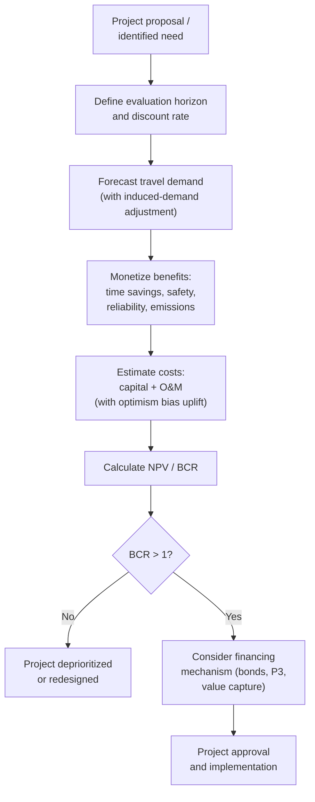

## Transportation Infrastructure Investment

### Definition and Scope

Transportation infrastructure investment encompasses the capital allocation decisions, appraisal methodologies, and financing mechanisms governing the construction, expansion, and maintenance of transportation networks (roads, rail, transit, ports, airports). This section addresses the economic frameworks used to evaluate and prioritize such investment, distinct from the operational/pricing economics addressed under congestion and transit subsidy topics, though the two domains are closely linked through the land-use feedback and induced-demand mechanisms discussed elsewhere in this chapter.

### Investment Appraisal Framework: Cost-Benefit Analysis

**Standard structure**: Transportation project appraisal conventionally uses **benefit-cost analysis (BCA)**, comparing the present value of a project's monetized benefits against its costs over the project's evaluation horizon.

$$NPV = \sum_{t=0}^{T} \frac{B_t - C_t}{(1+r)^t}$$

where $B_t$ and $C_t$ are benefits and costs in year $t$, $r$ is the discount rate, and $T$ is the evaluation horizon (often 20-30+ years for major infrastructure given long asset lives). A project is conventionally deemed economically justified if $NPV > 0$, or equivalently if the benefit-cost ratio $BCR = \frac{PV(B)}{PV(C)} > 1$.

**Standard benefit categories**:

- **Travel time savings**: Typically the largest benefit category in most transportation project appraisals, monetized using an estimated **value of time (VOT)**, often differentiated by trip purpose (commute, business, freight) and sometimes by income level
- **Vehicle operating cost savings**: Reduced fuel consumption and vehicle wear from improved travel conditions (smoother flow, reduced stop-start driving)
- **Safety benefits**: Reduction in expected crash frequency/severity, monetized using a **value of statistical life (VSL)** and associated injury-severity cost schedules
- **Reliability benefits**: Reduction in travel-time variability, increasingly recognized as a distinct benefit category from mean travel-time reduction, since travelers value predictability independent of average speed [Inference regarding the growing methodological emphasis on reliability as a distinct category in more recent appraisal practice]
- **Emissions/environmental benefits or costs**: Monetized using estimated social cost of carbon and other pollutant damage-cost schedules
- **Wider economic benefits/agglomeration effects**: A more contested and methodologically evolving category, discussed separately below

**Standard cost categories**: Capital construction cost, ongoing operations and maintenance cost, and any residual/terminal value of the asset at the end of the evaluation horizon.

### Value of Time and Value of Statistical Life

**Value of time (VOT) estimation methods**:

- **Revealed preference (RP) approaches**: Inferring VOT from observed trade-offs travelers actually make (e.g., toll-road usage studies comparing the toll paid against time saved relative to a free alternative route)
- **Stated preference (SP) approaches**: Survey-based hypothetical choice experiments asking respondents to choose between time-cost trade-off scenarios

[Inference regarding general finding pattern] VOT estimates generally scale with income (consistent with the theoretical prediction that time has an opportunity cost related to the wage rate) and vary by trip purpose (business travel VOT is typically estimated higher than personal/leisure travel VOT, reflecting the direct linkage to employer-valued time). Specific current VOT figures used by any given transportation agency (e.g., U.S. DOT's published VOT guidance, or equivalent guidance from other national transport authorities) should be verified against that agency's current published guidance, as these figures are periodically updated for inflation and methodology revisions. [Unverified for current specific dollar figures]

**Value of statistical life (VSL)**: A standard, though conceptually and politically sensitive, input representing society's implied willingness to pay to reduce mortality risk by a small increment, aggregated to a "life" unit — VSL is derived from studies of real-world risk-compensation trade-offs (e.g., wage premiums for riskier occupations) rather than representing the value of any specific identified individual's life, a distinction important for correctly interpreting and communicating this construct. [Inference regarding standard methodological framing; specific current VSL figures used by transportation agencies vary by country and are periodically updated, and should be verified against current agency guidance for any application requiring precision]

### Discount Rate Selection

**Sensitivity of NPV to discount rate choice**: Given the long time horizons and front-loaded cost structure (large upfront capital cost, benefits accruing over subsequent decades) typical of transportation infrastructure, appraisal outcomes are often highly sensitive to the discount rate selected — a higher discount rate systematically disadvantages projects with long-deferred benefit streams (e.g., transit or rail projects with slow ridership ramp-up) relative to projects with more front-loaded benefits.

$$PV(B_t) = \frac{B_t}{(1+r)^t}$$

As $t$ grows large, $PV(B_t) \to 0$ more rapidly for higher $r$, meaning long-horizon benefits are discounted especially heavily under higher discount rate assumptions.

**Social discount rate debates**: [Inference — reflects a genuine, long-running debate in public-project appraisal economics, not a settled methodological consensus] There is substantial academic and policy debate over whether the appropriate discount rate for public infrastructure (particularly projects with long-term environmental or intergenerational effects) should reflect private market rates of return (opportunity cost of capital approach) or a lower "social time preference rate" reflecting societal weighting of future generations' welfare — this debate has particular salience for transportation infrastructure given its long asset life and interaction with long-horizon considerations like climate impact, and different national appraisal guidance documents adopt varying approaches and rates.

### Induced Demand and Appraisal Bias

**The appraisal-relevant implication of induced demand**: As discussed under congestion economics, capacity expansion tends to generate at least partially offsetting induced traffic volume over the medium-to-long run (the "fundamental law of road congestion"). This has a direct and important implication for cost-benefit appraisal: if a project's benefit-cost analysis assumes traffic volumes remain at pre-project levels (or grows only according to background trend, without accounting for induced demand specifically attributable to the capacity expansion itself), it will systematically **overstate** the achieved travel-time-savings benefit, since some of the theoretical time-savings will instead manifest as additional trips (a different, and generally smaller, category of benefit — the value of newly-induced trips reflects only their marginal consumer surplus, not the full time-savings value that would apply if volume had remained fixed). [Inference — this is a well-established methodological critique in transportation appraisal literature, though the degree of overstatement is sensitive to the specific induced-demand elasticity assumed and the appraisal practice of the specific agency/study in question]

### "Wider Economic Benefits" / Agglomeration Uplift

[Inference — a genuinely contested area of appraisal methodology, not a settled consensus] Some transportation appraisal frameworks (notably influential in the UK's Department for Transport guidance, and adopted with variation elsewhere) incorporate an additional "wider economic benefits" (WEB) category attempting to monetize agglomeration effects — the productivity gains from improved effective density/accessibility that standard travel-time-savings benefit calculation may not fully capture, based on the empirical urban economics finding that worker productivity tends to be positively associated with effective employment density (discussed in agglomeration economics literature). Critics of WEB methodology raise concerns about double-counting (since some of the claimed agglomeration benefit may already be reflected in standard travel-time-savings and land-value-capitalization benefit categories) and about the reliability of the underlying agglomeration elasticity parameters used in the calculation, particularly when applied to project-specific contexts differing from the contexts in which those elasticities were originally estimated. This remains an active area of appraisal methodology development and academic critique rather than a settled, uncontroversial addition to standard BCA. [Inference regarding the state of methodological debate]

### Financing Mechanisms

| Mechanism | Description | Typical application |
| --- | --- | --- |
| General tax revenue (fuel tax, general fund) | Broad-based public funding, often earmarked (e.g., fuel-tax-funded highway trust funds) | Road/highway capital and maintenance |
| Municipal/general obligation bonds | Debt backed by general taxing authority, repaid over time | Large capital projects, transit expansion |
| Revenue bonds | Debt backed specifically by project-generated revenue (tolls, fares) | Toll roads, some transit systems |
| Public-private partnerships (P3) | Private capital and/or operational risk-sharing in exchange for revenue rights or availability payments | Toll roads, some major transit/rail projects |
| Value capture (TIF, special assessment, joint development) | Capturing land-value uplift attributable to the infrastructure, as discussed under transit economics and transportation-land-use interaction | Transit station-area development, corridor improvements |
| Multilateral development bank financing | Loans/grants from institutions such as the World Bank or Asian Development Bank | Common financing source for infrastructure in developing-economy contexts, directly relevant to LGU-level project financing in the Philippine context |

**Public-private partnership (P3) risk allocation logic**: [Inference — standard framing in infrastructure finance literature] The core economic rationale for P3 structures rests on allocating specific project risks (construction cost overrun, demand/traffic risk, operating cost risk) to whichever party (public or private) is best positioned to manage or bear that risk at lowest cost, rather than on private financing being inherently cheaper than public financing (public borrowing costs are, in most contexts, lower than private-sector costs of capital, so the P3 case rests on risk-transfer and lifecycle-cost-management efficiency rather than financing-cost comparison alone) — a frequently misunderstood point in P3 policy debates, where the case is sometimes incorrectly framed primarily as a financing-cost argument.

### Optimism Bias and Cost Overrun Patterns

[Inference — well-documented empirical pattern in the megaproject appraisal literature, notably associated with Bent Flyvbjerg's research on infrastructure megaprojects] A substantial body of empirical research on large transportation infrastructure projects internationally has documented a systematic pattern of construction cost overruns and demand/ridership forecast overestimation relative to initial appraisal projections, attributed to a combination of **optimism bias** (systematic, often unintentional over-optimism in initial estimates) and, in some analyses, **strategic misrepresentation** (deliberate understatement of cost or overstatement of benefit to secure project approval, sometimes termed "strategic bias" in this literature). This has led several national appraisal guidance frameworks to incorporate explicit **optimism bias adjustment factors** (uplifts applied to initial cost estimates, calibrated from historical overrun data by project type) as a standard appraisal correction. [Inference regarding the general pattern and its methodological response; specific overrun magnitude statistics vary substantially by project type, region, and study, and should be sourced to specific studies for any application requiring precise figures]

### Illustrative Diagram: Infrastructure Investment Appraisal Process

### Worked Example: Simplified Benefit-Cost Ratio Calculation

**Scenario**: A proposed road improvement has an upfront capital cost of $50 million and generates estimated annual travel-time-savings and safety benefits of $5 million/year over a 25-year evaluation horizon, discounted at a 5% social discount rate.

**Key Points**:

- Present value of a 25-year, $5 million/year annuity at 5%: using the annuity present-value factor $\frac{1-(1+r)^{-T}}{r} = \frac{1-(1.05)^{-25}}{0.05} \approx 14.09$
- $PV(B) \approx \$5\text{M} \times 14.09 \approx \$70.5\text{M}$
- $NPV = \$70.5\text{M} - \$50\text{M} = \$20.5\text{M}$ (positive, project appears justified under these assumptions)
- $BCR = \$70.5\text{M} / \$50\text{M} \approx 1.41$
- If an induced-demand adjustment reduces the effective annual benefit estimate by 20% (reflecting that some of the naive time-savings benefit is instead absorbed by new trips with lower marginal value), revised annual benefit ≈ $4 million/year, revised $PV(B) \approx \$56.4\text{M}$, revised $NPV \approx \$6.4\text{M}$, revised $BCR \approx 1.13$ — still positive, but with a substantially thinner margin, illustrating how sensitive appraisal conclusions can be to induced-demand and other adjustment assumptions

**Conclusion**: This illustrates why appraisal outcomes are highly sensitive not just to the headline benefit and cost estimates but to specific methodological assumptions (discount rate, induced-demand treatment, optimism-bias uplift) — a project's apparent economic justification can shift materially depending on which methodological conventions and adjustment factors are applied, underscoring the importance of sensitivity analysis in practical appraisal work rather than reliance on a single point estimate.

[Inference] Figures above are illustrative and constructed for pedagogical purposes rather than drawn from a specific documented project appraisal.

### Related Topics

- Economics of traffic congestion and induced demand
- Interaction between transportation and land use
- Public transit economics and value capture financing
- Agglomeration economies and wider economic benefits methodology
- Public-private partnership risk allocation theory
- Social discount rate debates in public project appraisal
- Optimism bias and megaproject cost overrun research (Flyvbjerg)
- Multilateral development bank infrastructure financing (World Bank, ADB)