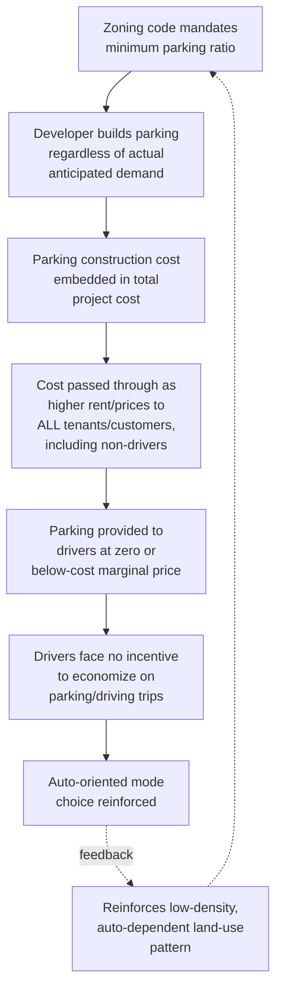

## Parking Economics

### Definition and Scope

Parking economics examines the pricing, regulation, and land-use implications of vehicle storage as a distinct urban land-use category with its own supply-demand dynamics, externality profile, and regulatory history. Parking is often treated as an afterthought in general transportation and land-use analysis, but represents a substantial share of urban land area, development cost, and — as this section establishes — a distinct and economically consequential policy lever in its own right.

### The Core Distortion: Parking Minimums as Implicit Cross-Subsidy

**Origin and mechanism of parking minimum requirements**: Since the mid-20th century, most U.S. municipal zoning codes (and many equivalent codes internationally) have mandated minimum off-street parking provision as a condition of development approval, calibrated by use type (e.g., a minimum number of spaces per residential unit or per square foot of retail/office space). The stated rationale is typically to prevent spillover parking congestion onto public streets, but the economic effect, extensively analyzed in the parking economics literature (most prominently associated with Donald Shoup's *The High Cost of Free Parking*, 2005), is to mandate a bundled, cross-subsidized supply of a good (parking) independent of its actual marginal value to the specific development or its users.

**Bundling and the zero marginal price problem**: When parking minimums require developers to provide "enough" parking such that it is rarely fully utilized at peak demand, and when that parking is then provided to tenants/customers at zero explicit marginal price (bundled into rent or the price of goods purchased), drivers face a **zero private marginal cost** for an additional parking trip, even though the parking space itself carries substantial real construction and opportunity cost.

$$P_{parking,private} = 0 \quad \text{despite} \quad C_{parking,social} > 0$$

This mispricing is analytically similar to any other subsidized-good overconsumption problem: since users do not face the marginal cost of their parking/driving decision, the mandate is argued to systematically favor automobile travel over walking, cycling, or transit at the margin, relative to what would occur if parking costs were unbundled and priced to reflect their true resource cost — directly interacting with the mode-choice and transit-subsidy economics discussed elsewhere in this chapter.

**Construction cost magnitude**: [Inference regarding general cost-ranking pattern; specific dollar figures vary substantially by market, construction type, and time period, and should be sourced to current local/regional construction-cost data for any application requiring precision] Structured parking (above- or below-grade garage construction) carries substantially higher per-space construction cost than surface surface-lot parking, with underground parking generally the most expensive of the three primary construction types (surface, above-grade structure, underground structure) due to excavation, waterproofing, and structural requirements — this cost is a first-order input into the overall project feasibility calculation for dense urban infill development, where land scarcity often forces structured rather than surface parking, and where minimum parking requirements can therefore substantially raise total development cost per housing unit or per square foot of commercial space.

### Shoup's Framework: Cruising for Parking and Curb Pricing

**On-street cruising as a congestion externality**: A distinct strand of parking economics, also closely associated with Shoup's research, examines the specific phenomenon of drivers **cruising** — circling city blocks searching for underpriced or free on-street parking — as itself a significant, though historically under-measured, contributor to local traffic congestion, since cruising vehicles occupy road capacity and contribute to local traffic volume without completing a "through" trip.

[Inference regarding the general finding pattern from Shoup's cited studies] Several observational studies conducted by Shoup and collaborators in various dense commercial districts found that a non-trivial share of total observed traffic on a given block at a given time consisted of vehicles cruising for parking rather than through-traffic — a finding used to argue that underpriced curb parking generates a meaningful, previously unquantified congestion externality distinct from the general road-congestion economics discussed earlier in this chapter. [Unverified for precise current percentage figures from specific studies — original studies were conducted in specific cities/districts/time periods and should not be assumed to generalize with identical magnitude to all urban contexts]

**The proposed solution: performance-based curb pricing**: Shoup's proposed policy response is to price on-street parking dynamically, targeting an occupancy rate around 85% (leaving a small buffer of consistently available spaces) rather than pricing to maximize revenue or eliminate all search cost — the logic being that maintaining a small vacancy buffer eliminates cruising-driven search congestion, since a driver can reliably expect to find an available (though priced) space nearby, without requiring circling. Rates are then adjusted upward or downward periodically based on observed occupancy data to maintain the target occupancy band. San Francisco's SFpark program (a large-scale application of this demand-responsive curb-pricing approach) is commonly cited as an early large-scale empirical test of this framework. [Inference regarding the general design logic and its most-cited application; current program status and specific outcome data should be verified against current sources if needed for a specific application]

### Parking as a Land-Use and Density Constraint

**Direct land-area consumption**: [Inference regarding general order-of-magnitude pattern, not derived from a specific universal statistic] Surface parking lots consume substantial land area relative to the building floor area they serve, particularly for suburban-format retail and commercial development calibrated to peak-demand parking minimums — this directly reduces the effective density achievable on a given parcel and, per the general zoning-and-land-value economics discussed earlier in this chapter, represents a significant opportunity cost of land that could otherwise support additional building floor area, open space, or alternative uses.

**Interaction with mixed-use and shared-parking economics**: As discussed under mixed-use development economics, temporally offsetting peak parking demand across different use types (residential overnight peak vs. commercial daytime peak) allows shared-parking analysis to justify reduced total parking provision relative to the sum of independent single-use requirements — directly reducing the land-area and construction-cost burden of parking mandates when development combines complementary use types.

**Parking maximums as a policy reversal**: Reflecting the accumulated critique of parking minimums, an increasing number of jurisdictions have moved toward eliminating parking minimums entirely (allowing the market to determine appropriate parking supply based on actual anticipated demand and developer risk assessment) or, in some cases, imposing **parking maximums** (a cap on permitted parking, particularly in transit-rich areas) explicitly intended to discourage auto-oriented development and support the transit-oriented development and mode-shift objectives discussed under transit economics and transportation-land-use interaction. [Inference regarding the general policy-trend direction; specific jurisdiction adoption should be verified for current status given this is an actively evolving area of municipal zoning reform]

### Employer-Provided Parking and Commute Mode Choice

**Free employer parking as an implicit subsidy to driving**: [Inference — a well-established finding in the parking/commute-mode-choice literature] When employers provide "free" parking to employees (a cost that is, in reality, embedded in the employer's real estate cost structure and thus indirectly borne through the overall compensation/cost structure rather than genuinely free), this functions as a mode-specific subsidy favoring driving over transit, cycling, or walking commute modes, since employees who choose non-driving modes typically do not receive an equivalent cash-value benefit unless the employer specifically offers a "parking cash-out" option.

**Parking cash-out policies**: Some jurisdictions (notably California, under state legislation) have mandated or incentivized **parking cash-out** programs, requiring employers who provide subsidized parking to also offer employees the option to receive the cash equivalent of the parking subsidy if they choose an alternative commute mode — directly correcting the mode-choice distortion described above by making the parking subsidy's value visible and available regardless of commute mode chosen, rather than conditioning the benefit specifically on driving. [Inference regarding the general policy design logic and its most commonly cited jurisdiction of adoption]

### Illustrative Diagram: Parking Minimum Cross-Subsidy Mechanism

### Worked Example: Parking Mandate Cost Pass-Through

**Scenario**: A 100-unit apartment building is required by zoning code to provide 1.5 parking spaces per unit (150 total spaces) via a structured parking podium, at a construction cost of $35,000 per space.

**Key Points**:

- Total parking construction cost: 150 × $35,000 = $5,250,000
- If this cost is amortized over the building's financing term and passed through proportionally across all 100 units regardless of whether individual tenants own a vehicle, the effective monthly cost embedded per unit (using a simplified straight-line amortization over, e.g., a 30-year term at a given cost of capital) represents a substantial fixed addition to rent that a car-free tenant pays identically to a tenant using multiple parking spaces
- If market analysis (rather than the zoning mandate) suggested actual anticipated demand was closer to 1.0 space/unit (100 spaces) given the building's transit-accessible location, the mandate-driven excess of 50 spaces represents approximately $1,750,000 in construction cost (50 × $35,000) that would not have been incurred absent the regulatory minimum — cost that is nonetheless embedded in rents charged to all tenants

**Conclusion**: This illustrates the core cross-subsidy critique of parking minimums: even tenants who would prefer a lower-parking, lower-rent unit configuration are unable to select that option under a binding zoning mandate, and instead cross-subsidize the parking costs of tenants who do use the mandated parking supply — an efficiency loss distinct from, though related to, the mode-choice distortion discussed above.

[Inference] Figures above are illustrative and constructed for pedagogical purposes rather than drawn from a specific documented project.

### Related Topics

- Mixed-use development economics and shared-parking analysis
- Economics of traffic congestion and cruising-for-parking externality
- Public transit economics and mode-choice subsidy interactions
- Zoning ordinances and minimum parking requirement history
- Transit-oriented development and parking maximum policy
- Land value and opportunity cost of surface parking
- Employer-provided fringe benefits and commute mode choice
- Curb management and dynamic/performance-based pricing systems