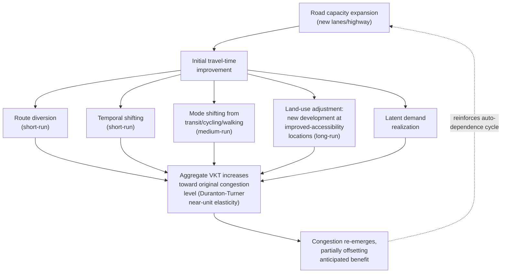

## Induced Demand and Automobile Dependence

### Definition and Scope

Induced demand, in the transportation-economics context, refers to the empirical phenomenon whereby increases in road capacity generate additional vehicle travel that would not have occurred absent the capacity expansion, substantially offsetting the anticipated congestion-relief benefit of the expansion. Automobile dependence refers to the broader structural condition of an urban area's built environment, land-use pattern, and travel behavior norms having developed around near-universal private vehicle use as the primary or only practical mode for most trips — a condition both driven by and reinforcing induced-demand dynamics through the land-use feedback cycle discussed earlier in this chapter.

### The Fundamental Law of Road Congestion

**Core empirical finding**: The most frequently cited formalization is Duranton and Turner's (2011) "fundamental law of road congestion," which examined U.S. metropolitan interstate highway data and found that vehicle-kilometers-traveled (VKT) increases in near-direct proportion to increases in lane-kilometers of road capacity, with an estimated elasticity of VKT with respect to lane-kilometers close to 1 (unit-elastic) in their central estimates for interstate highways within metropolitan areas.

$$\frac{\%\Delta VKT}{\%\Delta \text{Lane-km}} \approx 1$$

[Inference regarding the general robustness pattern of this finding] This near-unit elasticity finding has been broadly corroborated (with some variation in precise magnitude) across subsequent studies using different data sources, geographic contexts, and methodological approaches, establishing induced demand as one of the more robust empirical regularities in urban transportation economics, though the specific elasticity estimate in any given study depends on the road type, geographic scope, and time horizon examined, and should not be treated as a universal constant applicable without qualification to every context (e.g., rural highway capacity expansions in areas without latent demand or land-use flexibility may exhibit different induced-demand magnitudes than the metropolitan interstate context originally studied).

### Mechanisms Generating Induced Demand

Induced demand operates through several distinct behavioral and land-use channels, each contributing to the aggregate effect:

**1. Route diversion (short-run)**: Drivers who previously used alternative, less congested routes shift to the newly expanded facility, redistributing existing traffic rather than generating genuinely new trips — this component operates on a short time horizon (days to weeks following capacity opening).

**2. Temporal shifting (short-run)**: Drivers who previously traveled at off-peak times specifically to avoid peak congestion shift back to their preferred (typically peak) travel time once the expanded capacity reduces peak congestion — again, a redistribution rather than a genuinely new-trip effect.

**3. Mode shifting (medium-run)**: Travelers who previously used transit, carpooling, cycling, or walking specifically to avoid congestion on the corridor shift to solo driving once the expanded facility offers a sufficiently improved driving travel-time advantage over the alternative mode — this channel directly interacts with the mode-choice and transit-ridership economics discussed under public transit economics, and can contribute to a feedback loop in which reduced transit ridership justifies reduced transit service frequency, further reinforcing auto-mode-share shift (the Downs-Thomson dynamic discussed in that section).

**4. Land-use adjustment (long-run)**: As discussed extensively under the transportation-land-use interaction topic, improved accessibility from expanded road capacity capitalizes into land value and development patterns over a multi-year-to-decade horizon, with new residential and commercial development locating to take advantage of the improved accessibility — this channel generates genuinely new trips (rather than merely redistributing existing ones) since it results in population and economic activity that would not have located in that specific configuration absent the capacity expansion, and is generally considered the largest-magnitude and longest-lasting component of total induced demand. [Inference regarding the relative-magnitude ranking across channels, which is a common finding across studies decomposing induced-demand components, though exact proportional decomposition varies by study]

**5. Latent demand realization**: A related concept — trips that were suppressed (not made at all, or made via a much less desirable option) specifically due to congestion on the unexpanded facility, which become newly viable once capacity is expanded — distinguishing latent demand (genuinely new trip-making enabled by reduced travel cost) from pure redistribution of existing trip-making.

### Appraisal Implications (Cross-Reference)

As discussed under transportation infrastructure investment, failing to account for induced demand in project benefit-cost analysis leads to systematic overstatement of achieved travel-time-savings benefits, since a benefit calculation that assumes fixed post-project traffic volume will overstate the actual realized time savings once induced traffic materializes and re-congests the facility toward (though rarely completely back to) its pre-expansion level of congestion.

$$TT_{savings,naive} > TT_{savings,actual}$$

where the naive estimate holds volume fixed at pre-project levels and the actual estimate accounts for induced-volume growth eroding a portion of the initially projected speed improvement.

### Automobile Dependence as an Equilibrium Outcome

**Self-reinforcing land-use and infrastructure feedback**: [Inference — synthesizes established concepts from the land-use-transport feedback literature discussed earlier in this chapter] Automobile dependence can be understood not merely as a transportation-mode outcome but as a broader, self-reinforcing spatial equilibrium in which:

- Low-density, single-use zoning (per the Euclidean zoning discussion earlier in this chapter) generates land-use patterns in which most destinations are beyond comfortable walking or cycling distance, making driving the only practical mode for most trips
- The resulting near-universal driving generates political and fiscal support for continued road capacity expansion (since road congestion is the dominant, most visible transportation problem when alternative modes are impractical)
- Road capacity expansion generates induced demand and further land-use decentralization (per the accessibility/bid-rent mechanism discussed under transportation-land-use interaction), reinforcing low-density, auto-oriented development patterns
- Low-density development patterns, in turn, make transit service provision economically inefficient (per the declining-average-cost transit economics discussed earlier), since low-density ridership catchment areas cannot support high-frequency service at reasonable subsidy levels, further entrenching the lack of a viable transit alternative and completing the reinforcing cycle

This is sometimes discussed in the urban planning literature as a "lock-in" or path-dependence phenomenon, wherein a metropolitan area's transportation-land-use configuration, once established along either an auto-dependent or a more balanced multi-modal trajectory, becomes progressively more costly and difficult to reverse due to the compounding of infrastructure sunk cost, land-use pattern inertia, and reinforcing political-economy dynamics. [Inference regarding the general path-dependence framing, which is a widely-used conceptual lens in the urban planning and transportation literature rather than a single specific empirical finding attributable to one study]

### Distinguishing Induced Demand from Simple Growth

**A methodological caution**: [Inference — an important methodological distinction frequently emphasized in the induced-demand literature] Not all traffic growth observed following a capacity expansion should be attributed to induced demand — background population and economic growth in a metropolitan area would generate some traffic growth even absent any capacity expansion. Rigorous induced-demand estimation therefore requires a counterfactual comparison (e.g., comparing traffic growth on expanded corridors against comparable unexpanded corridors or against a broader regional trend, as in Duranton and Turner's comparative cross-metropolitan-area approach) rather than simply observing that traffic volume rose after a capacity expansion, since the latter naive approach cannot distinguish induced demand from coincident background growth.

### Policy Implications

**Implications for capacity-expansion policy**: Given the robust empirical finding that capacity expansion substantially self-defeats its congestion-relief objective over the medium-to-long run, induced-demand research has been influential in shifting some transportation policy discourse toward demand-management approaches (congestion pricing, discussed earlier in this chapter) and multi-modal capacity provision (transit, cycling infrastructure) rather than exclusive reliance on road-capacity expansion as the primary congestion-relief strategy. [Inference regarding the general direction of policy-discourse influence; the actual balance of capacity-expansion versus demand-management investment varies enormously by jurisdiction and remains a live and often politically contested policy choice rather than a settled consensus practice]

**"Induced demand works in reverse" — road diets and capacity reduction**: [Inference — a corollary finding cited in some studies, though this specific reverse-direction claim (sometimes termed "disappearing traffic" in the literature associated with Cairns et al.) warrants a degree of caution regarding generalizability] Some studies of road capacity *reductions* (e.g., "road diets," lane removal, or temporary closures for construction or pedestrianization) have found that a portion of the previously observed traffic volume does not fully relocate to alternative routes but instead appears to genuinely disappear (through mode shift, trip suppression, or destination changes) — suggesting the induced-demand mechanism may operate symmetrically in reverse, an important consideration for policies involving deliberate capacity reduction for pedestrianization, transit-priority, or cycling-infrastructure purposes, though the magnitude of this reverse effect is context-specific and should not be assumed uniform across all capacity-reduction scenarios.

### Illustrative Diagram: Induced Demand Mechanism Channels

### Worked Example: Induced-Demand-Adjusted Congestion Relief Estimate

**Scenario**: A metropolitan highway segment is widened from 4 to 6 lanes (a 50% capacity increase), with initial engineering projections estimating peak travel time would fall from 40 minutes to 25 minutes based on the improved volume-to-capacity ratio, holding traffic volume fixed at pre-expansion levels.

**Key Points**:

- Applying a near-unit induced-demand elasticity (per Duranton-Turner central estimates) to the 50% lane-capacity increase suggests traffic volume (VKT) on the corridor may rise by approximately 50% over the subsequent several years, substantially eroding the initially projected travel-time improvement
- Under this adjustment, the actual medium-to-long-run travel time might settle closer to 32-35 minutes rather than the naively projected 25 minutes, though the exact re-equilibrated travel time depends on the specific volume-delay function of the facility and the pace/composition of the induced-demand response across the different channels described above
- The naive appraisal (in a benefit-cost framework, per the transportation infrastructure investment topic) would have significantly overstated the travel-time-savings benefit used to justify the project, potentially altering the calculated benefit-cost ratio materially

**Conclusion**: This illustrates why induced-demand-aware traffic forecasting (rather than a simple fixed-volume assumption) is now standard practice recommended in current transportation planning guidance for capacity-expansion appraisal, and why some transportation economists argue that induced-demand effects should shift policy emphasis toward demand-management tools (congestion pricing) that do not carry the same self-defeating dynamic, since pricing directly addresses the underlying demand curve rather than attempting to outpace it with supply expansion.

[Inference] Figures above are illustrative and constructed for pedagogical purposes rather than drawn from a specific documented highway-widening project's before/after data.

### Related Topics

- Economics of traffic congestion and Pigouvian road tolls
- Interaction between transportation and land use
- Public transit economics and the Downs-Thomson paradox
- Transportation infrastructure investment appraisal methodology
- Parking economics and cruising-induced congestion
- Road diets and "disappearing traffic" literature
- Path dependence and lock-in in urban spatial structure
- Multimodal transportation planning and demand management