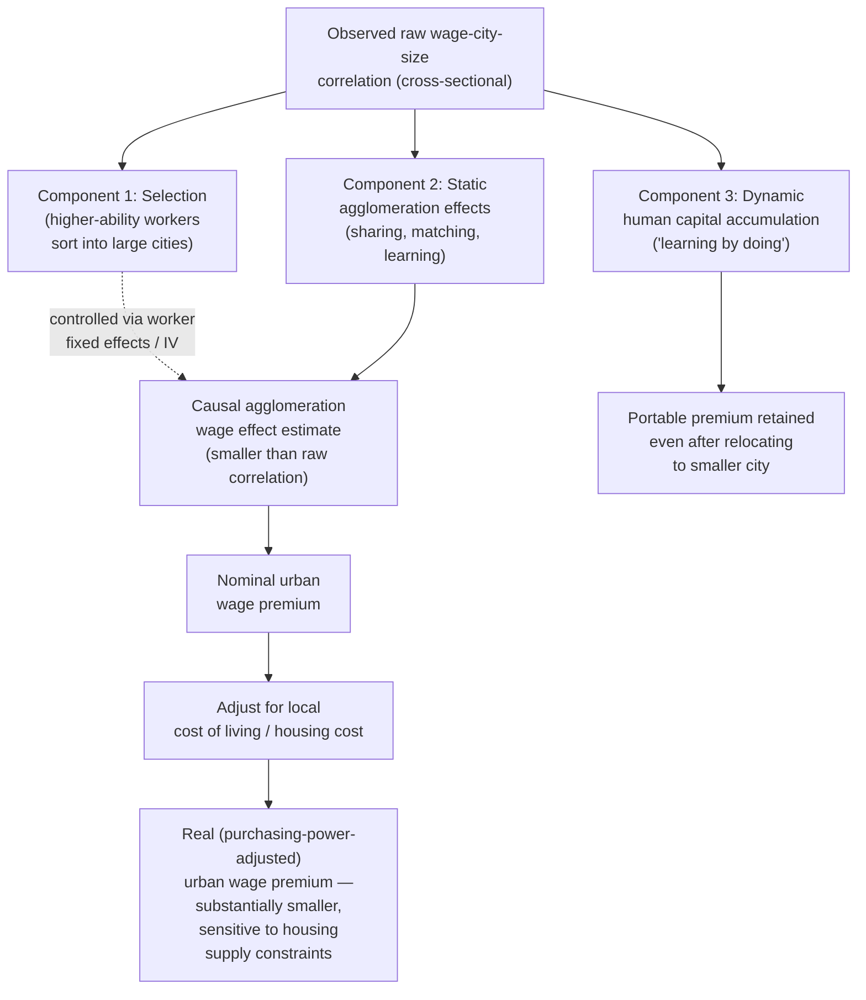

## Urban Wage Premium and Agglomeration Effects on Productivity

### Definition and Scope

The urban wage premium refers to the robust empirical finding that observably similar workers earn higher nominal wages in larger, denser cities than in smaller cities or rural areas, holding individual worker characteristics constant. Agglomeration economies refer to the broader class of productivity-enhancing effects arising from the spatial concentration of economic activity, of which the urban wage premium is generally interpreted as a labor-market manifestation — the wage premium is understood in the urban economics literature as compensation reflecting (at least in part) genuinely higher worker productivity in dense urban environments, rather than purely a cost-of-living adjustment.

### Empirical Regularity: The Urban Wage Premium

**Core finding**: [Inference regarding general finding pattern; specific elasticity estimates vary across studies, countries, and time periods] A large empirical literature spanning multiple countries consistently finds that nominal wages rise with city size/density, with commonly cited elasticity estimates of wages with respect to city population clustering in a range frequently cited as approximately 3-8% per doubling of city population in various U.S. and international studies, after controlling for observable worker characteristics (education, experience, occupation). [Unverified for precise current consensus figures — this range reflects commonly cited historical estimates across a body of literature rather than a single universally agreed-upon parameter, and should be checked against current meta-analyses for any application requiring precision]

$$\ln(w_i) = \beta_0 + \beta_1 \ln(\text{City Population}) + \gamma X_i + \epsilon_i$$

where $w_i$ is worker $i$'s wage, $X_i$ is a vector of observable worker characteristics, and $\beta_1$ is the estimated elasticity of wages with respect to city size — the coefficient of central interest in this literature.

### Three Competing (Non-Exclusive) Explanations

The urban economics literature has identified three primary, non-mutually-exclusive mechanisms potentially explaining the observed urban wage premium, and a substantial body of empirical work has focused on decomposing the relative contribution of each:

**1. Static agglomeration economies (genuine productivity effect)**: Following Marshall's (1890) original taxonomy, later formalized by Duranton and Puga (2004) into a three-part framework, agglomeration can raise productivity through:

- **Sharing**: Firms in dense clusters can share indivisible infrastructure, specialized suppliers, and risk-pooling benefits not economically viable to provide at smaller scale
- **Matching**: Larger, denser labor markets improve the quality and speed of matching between workers' specific skills and firms' specific needs, reducing search frictions and improving match quality (connecting directly to the job-search and effective-labor-market-access concepts discussed under commuting behavior)
- **Learning**: Spatial proximity facilitates knowledge spillovers and faster diffusion of innovation and best practices between firms and workers (related to Jacobs's (1969) emphasis on urban diversity as a driver of innovation, distinct from Marshall-Arrow-Romer models emphasizing within-industry specialization)

**2. Dynamic/selection effects (sorting of high-ability workers)**: [Inference — a well-established alternative/complementary explanation actively debated in the literature] An alternative explanation holds that the observed urban wage premium partly or wholly reflects **selection** — higher-ability, more productive workers may disproportionately choose to locate in large cities (whether due to superior career-advancement opportunities, preference for urban amenities correlated with ability, or other unobserved factors), such that the wage premium reflects pre-existing worker heterogeneity not fully captured by standard observable controls (education, experience) rather than a genuine causal productivity effect of density itself.

**3. Dynamic learning-by-doing / human capital accumulation effects**: [Inference — an influential extension in the literature, notably associated with Glaeser and Maré's (2001) and De la Roca and Puga's (2017) research] A further refinement finds that a substantial portion of the urban wage premium accrues gradually over a worker's tenure in a large city, and — importantly — that workers who have spent time working in large cities retain an earnings premium even after relocating to smaller cities, suggesting the effect is not purely a static, city-specific productivity effect (which would predict the premium disappears immediately upon relocation) but partly reflects genuine human-capital accumulation ("learning") that workers carry with them, distinguishing this "portable" component from a purely static, non-portable agglomeration effect.

### Distinguishing Causation from Selection: Empirical Strategies

**Methodological challenge**: Because worker location choice is not random, isolating the causal productivity effect of urban density from selection effects (mechanism 2 above) requires careful empirical strategy. Standard approaches in the literature include:

- **Worker fixed-effects panel models**: Tracking the same individual worker's wages as they move between cities of different sizes over their career, which controls for time-invariant individual ability/characteristics and isolates the wage change specifically associated with the location change — this approach underlies much of the de la Roca/Puga-style "learning" findings described above
- **Instrumental variable approaches**: Using historical or geological determinants of city size (e.g., historical population density, geographic/natural-advantage variables) that are plausibly uncorrelated with unobserved individual worker ability, to isolate the causal effect of city size on wages

[Inference regarding the general conclusion synthesized across this literature] The consensus emerging from this body of research (though genuine debate over precise magnitudes continues) is that both genuine productivity/agglomeration effects and selection/sorting effects contribute to the observed urban wage premium, with worker fixed-effects and IV-based studies generally finding a meaningfully positive causal agglomeration effect even after netting out selection, though of somewhat smaller magnitude than the raw, unadjusted cross-sectional wage-city-size correlation would suggest.

### Human Capital Externalities and Education Complementarity

[Inference — a well-established extension in the literature, associated substantially with Moretti's (2004) and related research] A related and extensively studied finding is that the urban wage/productivity premium is not uniform across worker skill levels — cities with a higher share of college-educated workers tend to exhibit wage premiums that extend even to less-educated workers in that city (a **human capital externality** or **spillover** effect), consistent with the idea that a more human-capital-intensive local economy raises the productivity of complementary, lower-skill labor (e.g., through complementarities in production, or general local economic vibrancy effects) beyond what the direct skill composition of the workforce alone would predict. [Inference regarding the specific magnitude and mechanism, which remains an area of ongoing research and some debate regarding the precise channel through which such externalities operate]

### Cost of Living and Real vs. Nominal Wage Distinction

**Critical qualification**: A substantial share of the observed nominal urban wage premium is offset by higher cost of living in large cities — most significantly housing costs, which are directly linked to the land-value and bid-rent dynamics discussed extensively earlier in this chapter under zoning and land-use topics.

$$w_{real} = \frac{w_{nominal}}{P_{local}}$$

where $P_{local}$ is a local cost-of-living index, dominated in most studies by housing cost variation across cities. [Inference regarding general finding pattern] Studies that adjust for local cost of living generally find that the **real** wage premium (purchasing-power-adjusted) is substantially smaller than the nominal wage premium, and in some studies of the most expensive, highly-regulated housing markets (connecting directly to the zoning-restriction and housing-supply-elasticity economics discussed earlier in this chapter), the real wage premium for lower-skill workers can be small or, in some specific studies, potentially negative — since housing costs may rise faster than nominal wages for workers who do not capture the full productivity premium associated with high-skill, high-demand occupations. [Unverified for precise current magnitude in any specific metro area or occupation category — this is a genuinely debated empirical question sensitive to the specific cost-of-living index and time period used]

**Implication for the zoning-restriction connection**: This creates a direct analytical link back to the zoning and housing-supply-restriction economics discussed earlier in this chapter — if housing supply constraints in high-productivity cities (as discussed under "economic effects of zoning restrictions" and the Hsieh-Moretti aggregate misallocation findings) inflate local housing costs beyond what unconstrained supply would produce, this erodes the *real* wage premium that would otherwise accrue to workers from relocating to high-agglomeration cities, potentially discouraging efficient labor reallocation toward the nation's most productive urban agglomerations — directly connecting the labor-market agglomeration literature to the housing-supply-constraint literature discussed under zoning topics.

### Industry Composition and Specialization vs. Diversity Debates

[Inference — reflects a genuine, long-running academic debate rather than a settled consensus] A distinct strand of the agglomeration literature debates whether productivity/wage benefits are larger from **specialization** (geographic concentration of firms within the same industry, generating localization economies, associated with Marshall-Arrow-Romer (MAR) models) or from **diversity** (a broad mix of different industries co-located, generating cross-industry knowledge spillovers, associated with Jacobs's urbanization-economies framework) — empirical findings across studies examining this question have been mixed, with results sensitive to industry, time period, and the specific empirical specification used to distinguish the two effects, and this remains an active area of ongoing empirical research rather than a resolved question with a single correct answer.

### Illustrative Diagram: Decomposing the Urban Wage Premium

### Worked Example: Nominal-to-Real Wage Premium Adjustment

**Scenario**: A worker considers relocating from a mid-sized metro area to a large, high-density metro area for a job offering a 20% higher nominal wage.

**Key Points**:

- Nominal wage premium: +20%
- Local cost-of-living index in the destination metro is estimated at 35% higher than the origin metro, driven predominantly by housing costs (consistent with the housing-supply-elasticity and zoning-restriction dynamics discussed earlier in this chapter)
- If the worker's expenditure share on housing is approximately 30% of total budget, and other consumption costs are roughly equal between the two metros, the effective cost-of-living-adjusted wage change is approximately: $1.20 / (1 + 0.30 \times 0.35) \approx 1.20 / 1.105 \approx 1.086$, or roughly an 8.6% real wage gain — smaller than the 20% nominal figure would suggest, though still positive in this illustrative case
- If housing cost differential were instead 60% higher (a more severely supply-constrained destination market) rather than 35%, the same calculation would yield: $1.20 / (1 + 0.30 \times 0.60) = 1.20 / 1.18 \approx 1.017$, or only a marginal 1.7% real gain — illustrating how sensitive the realized benefit of agglomeration-driven wage premiums is to the severity of housing supply constraints in the destination city

**Conclusion**: This calculation illustrates directly why the housing-supply/zoning-restriction literature and the urban-wage-premium/agglomeration literature are not separable policy domains — the aggregate productivity gains from labor reallocation toward high-agglomeration cities (as emphasized in the Hsieh-Moretti framework discussed earlier) depend critically on whether local housing supply is sufficiently elastic to prevent the nominal wage premium from being substantially eroded by housing-cost capitalization before it reaches workers as a genuine improvement in real purchasing power.

[Inference] Figures above are illustrative and constructed for pedagogical purposes rather than drawn from a specific documented study or metro-area pair.

### Related Topics

- Economic effects of zoning restrictions (Hsieh-Moretti misallocation framework)
- Human capital externalities and local skill composition (Moretti)
- Marshall-Arrow-Romer vs. Jacobs agglomeration models
- Spatial equilibrium models of city systems (Rosen-Roback framework)
- Commuting behavior and effective labor market access
- Housing supply elasticity and regional cost-of-living variation
- Worker mobility, migration, and regional labor market adjustment
- Innovation clusters and knowledge spillover geography