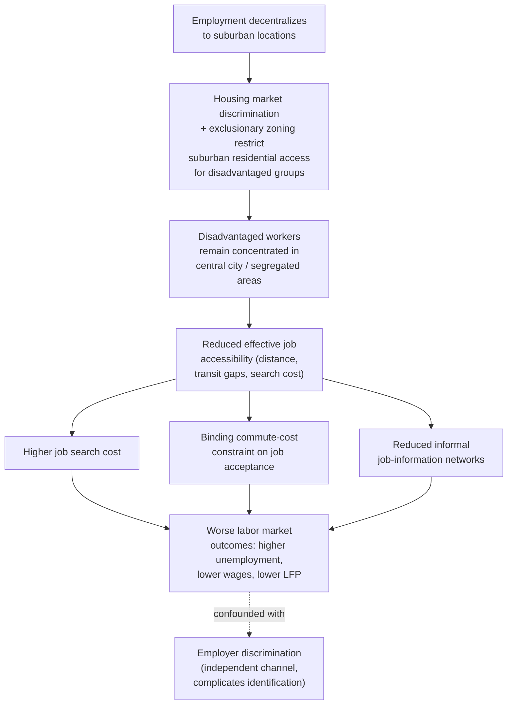

## Spatial Mismatch Hypothesis

### Definition and Scope

The spatial mismatch hypothesis (SMH), originally articulated by John Kain (1968), posits that residential segregation combined with the suburbanization of employment produces a geographic mismatch between where certain population groups — historically, Black urban residents in the U.S. context — live and where job opportunities, particularly in growing sectors, are located, resulting in worse labor market outcomes (higher unemployment, lower wages, longer job search) for spatially disadvantaged groups relative to an otherwise-identical population with better job proximity.

### Original Formulation and Historical Context

**Kain's original argument**: Kain's 1968 study examined the interaction between two well-documented mid-20th-century U.S. urban trends: (1) suburbanization of manufacturing and, subsequently, other employment away from central cities, and (2) racially segregated housing markets (driven by a combination of discriminatory practices including redlining, restrictive covenants, and — as discussed under zoning ordinances earlier in this chapter — exclusionary zoning) that confined Black urban residents disproportionately to central-city neighborhoods even as employment relocated to suburbs those residents could not readily access, whether due to housing discrimination limiting relocation options or transportation barriers limiting reverse-commute feasibility.

**Core causal chain hypothesized**:

1. Employment decentralizes from central city to suburbs (driven by land cost, highway accessibility, and other factors discussed under transportation-land-use interaction)
2. Housing market discrimination and exclusionary zoning restrict Black households' ability to relocate to suburban areas near the new job locations
3. Central-city-resident Black workers face longer commutes, higher job-search costs, and reduced effective access to the suburbanizing job base (connecting directly to the effective-labor-market-access concept discussed under commuting behavior)
4. This reduced access translates into worse labor market outcomes: higher unemployment rates, lower wages, and/or lower labor force participation, relative to what would be observed if job proximity were equalized

### Theoretical Mechanisms Linking Distance to Labor Outcomes

**Job search cost channel**: Greater physical distance to job opportunities raises the direct time and monetary cost of job search itself (traveling to interviews, gathering information about job openings in unfamiliar areas), potentially resulting in a smaller effective job-search radius and therefore a smaller effective set of job opportunities considered, independent of any actual employment discrimination.

**Commuting cost channel**: Even conditional on securing a suburban job, workers facing long commutes from segregated central-city residential areas face the commuting-cost burden discussed under the wage-commuting tradeoff topic, which — if reservation wages do not fully adjust, or if households face reservation-wage floors due to public assistance program interactions or other constraints — can reduce the effective set of jobs a worker is willing or able to accept.

$$\text{Accept job at distance } x \text{ if} \quad w(x) - t \cdot x \geq w_{reservation}$$

As discussed under commuting behavior, this reservation-wage/commute-cost relationship implies a maximum acceptable commute distance for any given wage offer — spatial mismatch theory argues that for lower-wage workers particularly, this maximum acceptable distance may exclude a meaningful share of suburbanizing job opportunities, especially where transit access (discussed below) is poor.

**Information/network channel**: [Inference — a recognized extension in the literature beyond Kain's original formulation] Geographic distance and residential segregation can also degrade the informal social-network channels through which job information often flows (particularly important for lower-skill labor markets where formal job-search channels may be less developed), compounding the pure commuting-cost mechanism with an information-access disadvantage.

**Employer discrimination interaction**: [Inference — an important complicating factor emphasized in later critiques and extensions of the original hypothesis] Some researchers have argued that observed correlations between residential location and labor market outcomes attributed to "spatial" mismatch may partly reflect employer discrimination that operates independently of, but is correlated with, residential racial composition (e.g., employer perceptions or statistical discrimination based on neighborhood of residence, sometimes termed "residential redlining" in hiring) — complicating the interpretation of empirical spatial-mismatch findings as reflecting pure distance/accessibility effects versus discrimination effects that happen to correlate with the same racially segregated geography.

### Empirical Testing Challenges

**The core identification problem**: [Inference — a well-recognized and central methodological challenge in this literature, extensively discussed by subsequent researchers including Ihlanfeldt and Sjoquist (1998) in their influential literature review] Rigorously testing the spatial mismatch hypothesis requires isolating the causal effect of job proximity on labor market outcomes from confounding factors, since residential location, job location, and labor market outcomes are all potentially jointly determined by unobserved factors (e.g., unobserved worker characteristics that affect both where someone can afford to live and their employability, or reverse causation in which unemployed workers move to lower-cost areas that happen to also be job-poor, rather than job-poor location causing unemployment).

**Common empirical approaches**:

- **Job accessibility indices**: Constructing gravity-model-style measures of the number of job opportunities accessible within a given commute-time threshold from a worker's residence (using the same general accessibility formulation, $A_i = \sum_j O_j \cdot f(c_{ij})$, introduced under transportation-land-use interaction), then correlating this accessibility measure with individual or neighborhood-level labor market outcomes
- **Natural experiments involving residential relocation**: Studies examining outcomes for individuals who relocate (voluntarily or via housing-mobility programs) to areas with different job accessibility, holding individual characteristics fixed via panel/longitudinal tracking
- **Moving to Opportunity (MTO) and similar housing-mobility experiments**: [Inference — a frequently cited body of evidence in this literature, though its findings speak to a related but distinct question (neighborhood effects on outcomes, particularly for children) rather than testing spatial-job-mismatch specifically] U.S. federal housing-mobility experiments providing housing vouchers enabling relocation from high-poverty to lower-poverty neighborhoods have generated an extensive body of research on neighborhood effects, with some findings (e.g., Chetty, Hendren, and Katz's later analysis) relevant to, though not identical in focus to, the spatial-mismatch-specific job-accessibility question — these literatures are related but should not be conflated, since MTO-style studies focus more broadly on neighborhood poverty-concentration effects than specifically on job-proximity/commute-accessibility effects

[Inference regarding the general state of empirical consensus, synthesizing the literature review tradition established by Ihlanfeldt and Sjoquist and subsequent work] The empirical literature testing SMH has found broadly supportive, though not universally consistent, evidence that job proximity/accessibility is associated with better labor market outcomes for disadvantaged urban populations, with the relationship generally found to be stronger for less-skilled workers (who are more likely to face binding commute-cost constraints and have less job-search flexibility) than for higher-skilled workers with wider effective job-search radii and greater private-vehicle access facilitating longer commutes.

### The Role of Automobile Access and Transit

**Automobile ownership as a mediating factor**: [Inference — a well-supported finding in the empirical spatial-mismatch and welfare-to-work literature] A substantial body of research finds that automobile access substantially expands a worker's effective job-search radius relative to reliance on transit, particularly in metropolitan areas where employment has decentralized to locations poorly served by radial, central-city-oriented transit networks (a common transit-network legacy pattern, since many U.S. transit systems were originally built to serve central-city-oriented commute patterns from an earlier era of more centralized employment). This has motivated several policy interventions aimed specifically at improving low-income workers' vehicle access (e.g., "cars for the poor" programs providing vehicle-ownership assistance) as a spatial-mismatch remedy, alongside transit-service-improvement approaches.

**Reverse-commute transit service**: Some transit agencies have implemented specialized "reverse-commute" service explicitly designed to connect central-city, transit-dependent populations to suburban job centers, directly targeting the spatial-mismatch mechanism — though such service often faces the same declining-average-cost economics discussed under public transit economics, since reverse-commute ridership catchment is typically more dispersed and lower-density than traditional radial commute patterns, making cost-effective service provision a persistent operational challenge. [Inference regarding the general cost-structure challenge]

### Contemporary Relevance and Critiques

**Critique regarding causal weight relative to other factors**: [Inference — reflects a genuine and long-standing debate in the urban labor economics and urban sociology literature] Some researchers have argued that the spatial mismatch framework, while capturing a real mechanism, has at times been overemphasized relative to other contributing factors in explaining urban labor market disparities — including employer discrimination operating independently of geography, differences in educational access and quality, and broader labor-demand shifts (e.g., deindustrialization reducing the overall stock of accessible middle-wage jobs regardless of specific geographic distribution) — this is not a rejection of the spatial-mismatch mechanism's existence but a debate over its relative explanatory weight within a multi-causal landscape of urban labor market disparity.

**Contemporary extension to other populations and contexts**: [Inference — reflects the broadening of the framework beyond its original Black-white, U.S.-central-city-specific formulation] While originally formulated specifically regarding Black urban residents in the mid-20th-century U.S. context, the underlying spatial-mismatch mechanism (geographic separation between residence and job opportunity combined with constrained residential mobility) has since been applied and studied in a broader range of contexts, including other racial/ethnic minority groups, immigrant populations facing residential clustering, and — with appropriate contextual adaptation — in international urban settings with distinct patterns of residential segregation and employment geography, including relevance to informal-settlement/employment-geography dynamics in developing-country urban contexts. [Inference regarding this general extension pattern; specific study findings for any particular population or country context would require separate citation]

### Illustrative Diagram: Spatial Mismatch Causal Chain

### Worked Example: Job Accessibility Index Comparison

**Scenario**: Two otherwise-similar workers with identical skills live in different neighborhoods within the same metro area. Worker A lives in a well-connected inner-suburb neighborhood; Worker B lives in a central-city neighborhood with limited transit connections to the suburban job-growth corridor.

**Key Points**:

- Using a simplified accessibility index counting jobs reachable within a 45-minute one-way commute by the worker's typical available mode: Worker A (with private vehicle access and proximity to the suburban job corridor) can reach an estimated 180,000 jobs; Worker B (relying on a radial, central-city-oriented transit network with limited suburban connections) can reach an estimated 60,000 jobs within the same 45-minute threshold
- This threefold difference in effective accessible job count, holding individual skills and qualifications constant, illustrates the core spatial-mismatch mechanism — Worker B's job search and acceptance decisions operate over a substantially smaller effective opportunity set purely due to geographic/transportation-access factors
- If a reverse-commute transit service were introduced connecting Worker B's neighborhood directly to the suburban job corridor, the accessibility gap could narrow, though likely not close entirely given the density and network-coverage limitations typical of specialized reverse-commute service (per the transit economics discussion above)

**Conclusion**: This illustrates why job-accessibility-index methodology (rather than simple physical distance) is the standard empirical tool for operationalizing and testing the spatial mismatch hypothesis, since it captures the combined effect of physical distance and actual transportation-mode-specific travel time/cost, which is the theoretically relevant variable per the underlying commuting-cost and job-search mechanisms described above.

[Inference] Figures above are illustrative and constructed for pedagogical purposes rather than drawn from a specific documented metro-area accessibility study.

### Related Topics

- Commuting behavior and the wage-commuting tradeoff
- Public transit economics and reverse-commute service economics
- Land use regulation and zoning ordinances (exclusionary zoning history)
- Economic effects of zoning restrictions (segregation channel)
- Interaction between transportation and land use (employment decentralization)
- Urban wage premium and agglomeration effects (accessibility interaction)
- Housing discrimination history (redlining, restrictive covenants)
- Moving to Opportunity and neighborhood-effects research