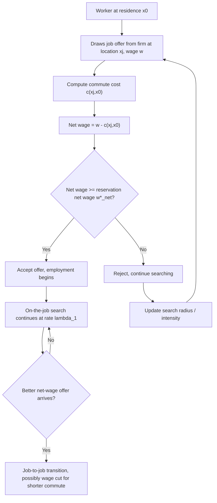

## Commuting, Job Search, and Search Frictions

### Overview

Urban labor markets do not clear instantaneously. Workers and firms must locate one another across space, evaluate match quality, and incur costs of both searching and commuting. This topic integrates two literatures: **spatial job search** (how distance and commuting costs shape search behavior and unemployment duration) and **search-theoretic labor economics** (how frictions generate wage dispersion, unemployment, and inefficient matches even in otherwise competitive markets). In an urban context, space is not a backdrop but an active friction: longer commutes shrink a worker's effective search radius, lower reservation wages in some models while raising them in others (depending on compensating-differential structure), and interact with residential sorting.

### Foundations: The Search-Theoretic Labor Market

**The basic McCall search model**

A worker samples wage offers from a known distribution $F(w)$ at some arrival rate. Upon receiving an offer, the worker decides whether to accept (take the job) or reject (continue searching, receiving unemployment benefit $b$ this period). The key object is the **reservation wage** $w^*$, the wage that makes the worker indifferent between accepting and continuing to search.

The reservation wage solves:

$$w^* = b + \frac{\lambda}{r+\lambda}\int_{w^*}^{\infty}(1-F(w))\,dw$$

where $r$ is the discount rate and $\lambda$ is the job offer arrival rate. Intuitively, the reservation wage exceeds the flow value of unemployment $b$ by an amount reflecting the **option value of continued search**.

**Key Points**

- The reservation wage rule: accept any offer $w \geq w^*$, reject otherwise.
- $w^*$ rises with $b$ (higher unemployment benefits raise the bar for acceptance).
- $w^*$ rises with the arrival rate $\lambda$ (more frequent offers increase the value of waiting).
- $w^*$ falls with the discount rate $r$ (impatient workers accept lower offers sooner).

### Spatial Extension: Commuting as a Search Friction

In the canonical non-spatial search model, all jobs are equally accessible. Once space is introduced, jobs differ not only in wage but in **location relative to the worker's residence**, and commuting imposes a real resource and time cost.

**Modeling commuting cost**

Let a worker reside at location $x_0$ and consider a job at location $x_j$. Commuting cost is typically modeled as increasing and convex in distance:

$$c(x_j, x_0) = \tau \cdot d(x_j, x_0)^{\gamma}, \quad \gamma \geq 1$$

where $\tau$ is a per-unit cost (fuel, time valued at the wage or opportunity cost of time, wear on infrastructure) and $d(\cdot)$ is a distance metric (Euclidean, network, or travel-time based). A worker's **net wage** from a job offer is then $w - c(x_j, x_0)$, so job acceptance depends jointly on the gross wage and location.

**The spatial reservation wage**

The reservation wage becomes location-specific: $w^*(x_0, x_j)$, or equivalently, workers apply a **reservation net wage** that must hold regardless of job location:

$$w^*_{net} = b + \frac{\lambda}{r+\lambda}\int_{w^*_{net}}^{\infty}\big(1 - F_{net}(w)\big)\,dw$$

where $F_{net}$ is the distribution of net-of-commute wage offers as perceived from the worker's specific residential location. Because $F_{net}$ depends on $x_0$, workers in different parts of the city face different effective offer distributions, generating **spatial variation in unemployment duration and acceptance wages** even with identical worker productivity.

**Search intensity and spatial radius**

A related margin is the **choice of search radius**. If search effort is costly and increasing in distance searched, workers optimize over how far to look, trading off:

- A wider radius → higher expected wage offer (larger effective $\lambda$ and better draw from $F$)
- A wider radius → higher expected commute cost conditional on accepting, and higher search cost itself

This produces an interior optimal search radius $r^*$ characterized by equating the marginal benefit of search extension to its marginal cost.

### The Spatial Mismatch Hypothesis

A foundational empirical and theoretical question (Kain, 1968) asks whether the spatial separation between low-income (often minority) residential areas and suburban job growth explains elevated unemployment and lower earnings among affected groups. Search-friction models formalize this as follows: if job vacancies are disproportionately located far from certain residential areas, then:

1. Effective $\lambda$ (offer arrival rate) is lower for spatially isolated workers, since travel-cost-adjusted search intensity toward distant vacancies falls.
2. The effective offer distribution $F_{net}$ is left-shifted (net wages are systematically lower after subtracting commute costs).
3. Reservation wages may fall (workers become less selective to escape long unemployment spells) even as *realized* wages fall — a pattern distinguishable from lower labor demand only through spatial variation in vacancy density.

**[Inference]** The magnitude of spatial mismatch effects is sensitive to transportation infrastructure, housing discrimination constraints on residential relocation, and information frictions about distant vacancies — the literature has found effects ranging from modest to substantial depending on city, time period, and identification strategy.

### Job Search Models with On-the-Job Search

Extending the model to allow **employed** workers to continue searching (Burdett-Mortensen framework) is essential for urban labor markets, where commuting costs can motivate job-to-job transitions purely to reduce commute distance, holding the wage fixed or even accepting a wage cut.

In the Burdett-Mortensen equilibrium search model:

- Unemployed workers search at rate $\lambda_0$; employed workers search at rate $\lambda_1$ (often $\lambda_1 \leq \lambda_0$).
- Firms post wages knowing that higher wages reduce the quit rate to other firms, generating equilibrium **wage dispersion** among ex-ante identical workers — a departure from the law of one price for labor.
- Spatially, workers may accept a "commute-improving" job offer even at a lower wage if $\delta$ (the value of reduced commute time) exceeds the wage differential:

$$w_{new} - c(x_{new}) > w_{old} - c(x_{old})$$

This generates observable **wage cuts upon job change accompanied by shorter commutes**, a pattern documented in commuting-and-mobility empirical work.

### Equilibrium Search and Urban Spatial Structure

Search frictions interact with the monocentric city model (see chapter on Urban Spatial Structure) in several ways:

**Endogenous commute-wage tradeoff**

In equilibrium, if all jobs are at the Central Business District (CBD), the bid-rent function must adjust so that workers are indifferent across locations net of commute cost and land rent. With search frictions, this indifference condition is stochastic rather than deterministic: workers do not know their wage draw ex ante, so the **residential location decision under uncertainty** interacts with expected job search outcomes, not realized ones.

**Directed search and vacancy location**

In directed search models, firms post wages (and implicitly, locations) and workers direct their search toward the location-wage combination maximizing expected utility. This produces a **spatial equilibrium condition** analogous to free entry:

$$\Theta(x) : \text{market tightness at location } x \text{ adjusts until expected search value is equalized across space, net of commuting costs}$$

Market tightness $\theta(x) = V(x)/U(x)$ (vacancies over searching workers at location $x$) determines the matching probability via a matching function $m(u,v) = u^{\alpha}v^{1-\alpha}$ (Cobb-Douglas form is standard), and this tightness itself becomes spatially heterogeneous — higher near dense employment centers, lower in job-poor peripheries, consistent with the spatial mismatch mechanism above.

### Empirical Measurement and Identification

**Key empirical objects**

- **Commute time/distance** — from time-use surveys, transit smart-card data, or GPS-based mobility data.
- **Unemployment duration** — hazard models (e.g., Cox proportional hazards) relating exit rates from unemployment to distance-to-job-density measures.
- **Job search intensity by distance** — application data from online job boards, often geocoded, allowing direct estimation of how application rates decay with distance (a "gravity" pattern in job search).

**Common empirical specification**

A widely used reduced-form specification for the distance decay of job applications:

$$\log(A_{ij}) = \beta_0 - \beta_1 \log(d_{ij}) + X_i'\gamma + \epsilon_{ij}$$

where $A_{ij}$ is applications from worker/area $i$ to job/area $j$, and $\beta_1 > 0$ captures the elasticity of search effort with respect to distance. **[Unverified]** Specific elasticity magnitudes vary substantially across studies and labor markets and should be treated as context-dependent empirical estimates rather than structural constants.

**Identification challenges**

- Residential sorting is endogenous to job search prospects (workers who value proximity to jobs self-select into central locations), biasing naive OLS estimates of the commute-employment relationship.
- Instruments have included historical transit infrastructure (e.g., legacy rail lines), housing supply shocks, or discontinuities in administrative boundaries.
- Difference-in-differences designs around transit expansions (e.g., new transit line openings) are used to estimate causal effects of improved job accessibility on employment and wages.

### Search Frictions and Policy: Transportation and Housing Interventions

**Key Points**

- **Transit subsidies / new transit lines**: Reduce $\tau$ (per-unit commute cost), expanding the effective search radius and $\lambda$; theoretically should raise reservation wages *and* realized employment rates, but general equilibrium effects (land rent capitalization, gentrification-driven displacement) can offset gains for the target population.
- **Relocation assistance / housing vouchers (e.g., Moving to Opportunity-style programs)**: Directly relax the spatial mismatch constraint by allowing residential relocation toward job-dense areas.
- **Job information/matching platforms**: Reduce information frictions independent of physical distance, effectively raising $\lambda$ without requiring commute cost reduction — evidence on effectiveness is mixed and platform-dependent.
- **Employer-side relocation/decentralization policies**: Shift vacancy density toward underserved residential areas rather than moving workers.

**Example**

Consider a worker residing 25 km from the CBD where 70% of vacancies are concentrated. Suppose:

- Per-km commute cost $\tau = \$0.50$/km round trip equivalent per day, valued over a 22-day work month: $\tau \cdot d \cdot 22$
- At $d = 25$: monthly commute cost $= 0.50 \times 25 \times 22 = \$275$
- If the worker's reservation net wage is $w^*_{net} = \$1,800$/month, they will reject any gross wage offer below $\$2,075$/month for CBD jobs, but only $\$1,800$ flat for jobs within their own neighborhood (assuming negligible local commute cost).

This numerical wedge illustrates why **otherwise-identical vacancies are not equally likely to be filled by the same worker pool** — the effective applicant pool for CBD jobs excludes workers whose commute-adjusted reservation wage exceeds the posted wage, even if their skill-adjusted reservation wage would clear the posted wage absent the commute.

### Diagram: Spatial Search and Acceptance Decision

### Diagram: Reservation Net Wage by Distance to Employment Center (svg_diagram)

<svg xmlns="http://www.w3.org/2000/svg" viewBox="0 0 640 380">
<text x="320" y="24" text-anchor="middle" font-size="16" font-weight="bold" fill="#1a1a1a">Reservation Net Wage vs. Distance to CBD (svg_diagram)</text>
<line x1="70" y1="320" x2="600" y2="320" stroke="#333" stroke-width="2" />
<line x1="70" y1="320" x2="70" y2="50" stroke="#333" stroke-width="2" />

<text x="335" y="355" text-anchor="middle" font-size="13" fill="#333">Distance from residence to CBD (km)</text>

<text x="25" y="185" text-anchor="middle" font-size="13" fill="#333" transform="rotate(-90 25 185)">Wage ($/month)</text>

<line x1="90" y1="120" x2="580" y2="120" stroke="#2166ac" stroke-width="2.5" stroke-dasharray="6,3" />
<text x="585" y="120" font-size="11" fill="#2166ac">Gross wage offer</text>

<polyline points="90,140 200,175 320,215 440,255 580,300" fill="none" stroke="#b2182b" stroke-width="2.5" />
<text x="585" y="300" font-size="11" fill="#b2182b">Net wage (after commute cost)</text>

<line x1="90" y1="230" x2="580" y2="230" stroke="#4d4d4d" stroke-width="1.5" stroke-dasharray="3,3" />
<text x="95" y="222" font-size="11" fill="#4d4d4d">Reservation net wage w*_net</text>

<circle cx="380" cy="230" r="5" fill="#000" />
<text x="390" y="245" font-size="11" fill="#000">Max acceptable distance</text>
<line x1="380" y1="230" x2="380" y2="320" stroke="#000" stroke-width="1" stroke-dasharray="2,2" />

<text x="90" y="335" font-size="10" text-anchor="middle" fill="#333">0</text>

<text x="200" y="335" font-size="10" text-anchor="middle" fill="#333">10</text>

<text x="320" y="335" font-size="10" text-anchor="middle" fill="#333">20</text>

<text x="440" y="335" font-size="10" text-anchor="middle" fill="#333">30</text>

<text x="580" y="335" font-size="10" text-anchor="middle" fill="#333">40</text>

</svg>

### Interaction with Housing Discrimination and Segregation

**[Inference]** Search frictions compound with residential segregation: if information about distant vacancies flows preferentially through social networks that are themselves spatially and racially segregated, the effective offer arrival rate $\lambda$ for isolated groups falls independent of physical commuting cost. This mechanism — **network-mediated information frictions** — is distinct from but reinforces pure distance-based spatial mismatch, and disentangling the two empirically requires data on both physical accessibility and network structure (e.g., referral hiring rates, social tie geography).

### Common Points of Confusion

- **Reservation wage vs. reservation net wage**: In spatial models, always clarify whether $w^*$ refers to the gross wage threshold (which varies by job location) or a location-invariant net wage threshold (the more standard and tractable formulation).
- **Search radius as a choice variable vs. an exogenous constraint**: Some models treat maximum search distance as a resource/time constraint (exogenous), others as an optimized choice balancing marginal costs and benefits (endogenous) — these generate different comparative statics with respect to transit improvements.
- **Distinguishing spatial mismatch from taste-based or statistical discrimination**: Lower acceptance/employment rates among spatially isolated workers can be conflated with discrimination; careful identification (e.g., using distance-based instruments uncorrelated with employer preferences) is needed to separate the two.

### Related Topics

- Monocentric city model and the bid-rent function
- Burdett-Mortensen equilibrium wage dispersion
- Matching functions and market tightness in labor economics
- Spatial mismatch hypothesis (Kain, 1968) and empirical tests
- Transit accessibility and employment outcomes (natural experiment designs)
- Residential sorting and self-selection in urban labor markets
- Agglomeration economies and labor market pooling
- Housing vouchers and Moving to Opportunity-style interventions
- Directed search and wage posting in spatial equilibrium
- Job search using online platforms and geocoded application data