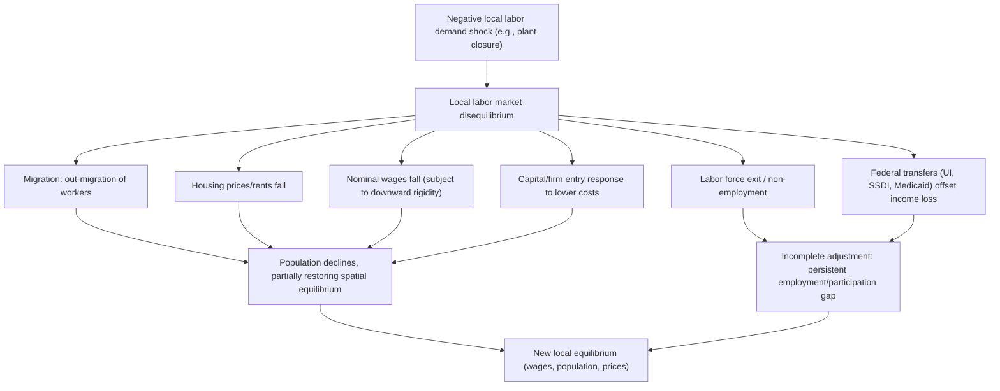

## Local Labor Market Adjustment Mechanisms

### Overview

When a local labor market experiences a shock — a plant closure, a boom in a tradable industry, a productivity shift, a demand shock — wages, employment, and prices cannot be understood as adjusting in isolation from the rest of the national (or global) economy. Workers, capital, and firms can move across regions; local prices (especially housing) respond endogenously; and federal transfers, transportation costs, and amenity differences all mediate how a shock in one local market propagates or dissipates. This topic covers the theoretical channels of adjustment, the empirical **local labor markets** literature (Bartik shocks, shift-share designs), and the policy implications of incomplete or slow adjustment.

### The Basic Spatial Equilibrium Framework

The workhorse model (Rosen-Roback) treats a national economy as a system of local labor markets connected by costless (in the simplest version) migration of workers and capital. In equilibrium, workers are indifferent across locations because differences in nominal wages, cost of living (chiefly housing), and local amenities exactly offset:

$$w_j - r_j = \bar{U} - A_j$$

where $w_j$ is the nominal wage in location $j$, $r_j$ is the local cost of living (housing cost index), $A_j$ is the amenity value of location $j$, and $\bar{U}$ is the reservation utility level common across an integrated national labor market. This spatial indifference condition is the benchmark against which "adjustment" is measured: **a well-functioning national labor market should equilibrate quickly**, whereas frictions (migration costs, housing supply constraints, information gaps) generate persistent regional wage and employment gaps.

### Channels of Local Adjustment

**1. Labor mobility (migration)**

The classical adjustment channel: workers move from low-wage/high-unemployment regions to high-wage/low-unemployment regions until the spatial equilibrium condition is restored. Key frictions slowing this channel:

- **Housing lock-in**: homeowners in declining regions may face capital losses on selling that discourage moving (particularly salient when regional housing prices have fallen sharply, as this can leave homeowners in a negative-equity position).
- **Family and social ties**: joint location decisions in dual-earner households reduce the responsiveness of migration to one spouse's local labor demand shock.
- **Skill specificity**: workers with regionally- or industry-specific human capital face lower returns to relocating if their skills do not transfer.
- **Moving costs**: direct financial costs plus information costs about opportunities elsewhere.

**Key Points**

- Migration responses to local shocks are typically slow, occurring over 5–10 years rather than immediately (Blanchard-Katz, 1992).
- Out-migration in response to negative shocks tends to be a more robust margin than in-migration in response to positive shocks, particularly at business-cycle frequencies.
- Migration selection is non-random: mobile workers tend to be younger, more educated, and less rooted (e.g., renters rather than homeowners), so migration can widen skill gaps between growing and declining regions.

**2. Capital mobility and firm relocation/entry**

Firms can relocate production or expand/contract facilities in response to local wage and cost conditions, providing an alternative (or complementary) adjustment channel to worker migration. If capital is highly mobile relative to labor:

- A negative local labor demand shock lowers local wages, which can attract capital investment and job creation, partially offsetting the initial employment loss — this is the "wage adjustment" channel.
- If capital mobility is fast relative to migration, wage responses (rather than population responses) bear more of the initial adjustment burden.

**3. Local price adjustment (housing markets)**

Housing costs adjust to a shock, cushioning or amplifying the real (utility-adjusted) impact:

- A negative labor demand shock reduces housing demand, lowering rents/house prices, which partially offsets the real wage decline for those who stay (nominal wages fall, but so does the cost of living).
- In housing-supply-constrained regions (e.g., strict zoning, geographic constraints), price adjustment is muted relative to quantity adjustment (population out-migration), consistent with the Saiz (2010) housing supply elasticity framework.
- In elastic-supply regions, positive shocks translate more into population growth than into price appreciation, since new housing construction absorbs demand.

**4. Nominal wage adjustment**

Local nominal wages can adjust directly, though downward nominal wage rigidity is a well-documented friction limiting the speed of this channel following negative shocks — wages tend to adjust more readily upward in booming regions than downward in declining ones.

**5. Non-employment and labor force participation margins**

Rather than migrating or accepting lower wages, workers facing negative local shocks may exit the labor force entirely (particularly relevant for prime-age male labor force participation declines documented in manufacturing-decline regions), transition to disability insurance receipt, or take up informal-sector or non-market activity. This margin is a form of **incomplete adjustment**: it does not restore the spatial equilibrium condition but instead reflects individuals dropping out of the labor market count.

**6. Fiscal transfers and federal insurance**

Federal tax-and-transfer systems (unemployment insurance, Social Security Disability Insurance, Medicaid, other means-tested transfers) act as automatic stabilizers that cushion local income shocks without requiring wage, price, or mobility adjustment. Because eligibility and generosity are often federally determined, they flow disproportionately toward regions experiencing negative shocks, partially substituting for the market-based adjustment channels above.

### Diagram: Channels of Adjustment to a Negative Local Labor Demand Shock

### Empirical Methodology: Measuring Local Shocks and Adjustment Speed

**Bartik / shift-share instruments**

The dominant empirical tool for identifying exogenous local labor demand shocks is the **Bartik instrument** (Bartik, 1991), constructed as:

$$B_{jt} = \sum_{i} s_{ij,0} \cdot g_{it}$$

where $s_{ij,0}$ is location $j$'s initial employment share in industry $i$ (measured at a baseline period, to avoid contemporaneous endogeneity), and $g_{it}$ is the national growth rate of industry $i$ at time $t$. The identifying logic: local variation in the instrument comes purely from cross-region differences in industry composition, interacted with industry-specific national shocks that are arguably exogenous to any single region.

**[Inference]** A substantial subsequent econometric literature (Goldsmith-Pinkham, Sorkin, and Swift, 2020, and related work) has clarified that Bartik instruments are numerically equivalent to a GMM estimator using the industry shares as instruments directly, which has sharpened the required identifying assumptions (exogeneity of the shares, not just the shocks) and generated ongoing methodological refinement.

**The Blanchard-Katz (1992) VAR framework**

Blanchard and Katz's canonical approach models the dynamic response of state-level employment, unemployment, wages, and net migration to an idiosyncratic state-level employment shock using a vector autoregression. Their central finding: employment shocks are followed by gradual out-migration over several years, while relative wages and unemployment return close to their pre-shock levels within roughly 5-7 years, but population levels are permanently affected — implying that migration, not wage adjustment, is the primary long-run equilibrating channel in the U.S. context historically.

**Example**

Consider a Bartik shock analysis for a metro area heavily concentrated in furniture manufacturing (say, 15% of local employment share at baseline) during a period of rapid Chinese import competition raising the industry's national decline rate to -5%/year. The predicted local labor demand shock is $0.15 \times (-5\%) = -0.75\%$ of local employment annually — this instrument would then be used as a right-hand-side regressor (or instrumented for actual local employment change) in a regression estimating the elasticity of local wages, population, or non-employment on predicted labor demand.

### The China Shock Literature as a Case Study

The trade-and-labor-markets literature following Autor, Dorn, and Hanson (2013) applies the local-labor-market framework to study the effect of rising Chinese import competition on U.S. commuting zones. Key findings relevant to adjustment mechanisms:

- Employment losses were geographically concentrated in commuting zones with high baseline exposure to import-competing manufacturing industries.
- Contrary to the classical Rosen-Roback prediction of rapid labor mobility restoring equilibrium, affected commuting zones exhibited **persistent** population and employment declines rather than rapid out-migration — workers largely stayed and experienced sustained non-employment, wage declines, and increased transfer receipt (disability insurance, in particular).
- This finding challenged the standard assumption of frictionless labor mobility embedded in trade models and motivated a wave of research on migration frictions as a first-order determinant of the local incidence of trade shocks.

**[Inference]** The muted migration response in this setting is generally attributed to some combination of housing lock-in (many affected regions had experienced house price declines reducing homeowner mobility), an aging population with weaker migration propensities, and possibly declining migration responsiveness in the U.S. economy more broadly over recent decades relative to the mid-20th century — the precise decomposition of these channels remains an active research question.

### Diagram: Speed of Adjustment Across Channels (svg_diagram)

<svg xmlns="http://www.w3.org/2000/svg" viewBox="0 0 640 360">
<text x="320" y="24" text-anchor="middle" font-size="16" font-weight="bold" fill="#1a1a1a">Relative Speed and Completeness of Adjustment Channels (svg_diagram)</text>
<line x1="200" y1="310" x2="620" y2="310" stroke="#333" stroke-width="2" />
<line x1="200" y1="310" x2="200" y2="50" stroke="#333" stroke-width="2" />
<text x="410" y="340" text-anchor="middle" font-size="13" fill="#333">Time since shock (years)</text>
<text x="160" y="180" text-anchor="middle" font-size="13" fill="#333" transform="rotate(-90 160 180)">Share of adjustment complete</text>

<polyline points="200,290 260,150 340,90 620,70" fill="none" stroke="#2166ac" stroke-width="2.5" />
<text x="345" y="85" font-size="11" fill="#2166ac">Housing price adjustment (fast)</text>

<polyline points="200,300 300,240 400,190 500,160 620,150" fill="none" stroke="#1a9850" stroke-width="2.5" />
<text x="425" y="175" font-size="11" fill="#1a9850">Nominal wage adjustment (medium)</text>

<polyline points="200,305 300,290 400,255 500,205 620,160" fill="none" stroke="#d73027" stroke-width="2.5" />
<text x="425" y="220" font-size="11" fill="#d73027">Migration (slow)</text>

<polyline points="200,300 300,270 400,250 500,240 620,235" fill="none" stroke="#762a83" stroke-width="2.5" stroke-dasharray="5,3" />
<text x="425" y="255" font-size="11" fill="#762a83">Non-employment gap (persistent)</text>

<text x="200" y="325" font-size="10" text-anchor="middle" fill="#333">0</text>

<text x="340" y="325" font-size="10" text-anchor="middle" fill="#333">3</text>

<text x="480" y="325" font-size="10" text-anchor="middle" fill="#333">6</text>

<text x="620" y="325" font-size="10" text-anchor="middle" fill="#333">10+</text>

</svg>

### Amenities, Sorting, and Heterogeneous Adjustment

Adjustment is not uniform across the population. The Rosen-Roback framework implies that when a location experiences a positive productivity shock, the resulting increase in both wages and housing costs sorts the population: workers with high place-specific amenity value (or low mobility costs) remain despite rising costs, while others exit. This generates **compositional change** as part of the adjustment process itself — a booming region's average wage and skill composition can shift not only because incumbent workers' outcomes change, but because the marginal mover in and out changes who lives there.

**[Speculation]** Some researchers have argued that this compositional/sorting channel may account for a meaningful share of measured "local multiplier" effects in regional economics — i.e., part of what looks like local wage growth from a tradable-sector boom may reflect selective in-migration of higher-skill workers rather than within-worker wage gains — though disentangling composition from true wage growth requires panel data following the same individuals over time.

### Policy Implications

**Key Points**

- **Place-based policies** (enterprise zones, regional investment tax credits, infrastructure spending targeted at declining regions) are motivated precisely by the empirical finding of incomplete/slow local adjustment — if migration and wage adjustment were fast and complete, such policies would have limited rationale, since national welfare would already be near its efficient allocation.
- **Portable vs. place-based transfers**: A central policy debate is whether to support displaced workers via transfers that follow the person (encouraging migration, e.g., wage insurance, relocation vouchers) versus transfers/investment that follow the place (encouraging local revitalization) — the optimal mix depends on the relative importance of migration frictions versus place-specific human/physical capital that would be lost by encouraging exit.
- **Trade adjustment assistance** programs in the U.S. context are a direct policy response to the finding that trade-exposed regions do not adjust via rapid reallocation, and have been critiqued for insufficient scale relative to the persistence of documented local shocks.

### Common Points of Confusion

- **National vs. local adjustment**: A shock can be fully absorbed at the national level (e.g., aggregate employment unaffected) while still generating substantial and persistent local dislocation — local labor market analysis specifically isolates this distributional/geographic dimension, distinct from aggregate business cycle analysis.
- **Shift-share instrument validity**: The Bartik instrument's validity rests on the exogeneity of *initial industry shares* (not contemporaneous industry growth), a subtlety often glossed over — regions may have historically sorted into industries for reasons correlated with other unobserved regional trends, threatening exclusion restrictions.
- **Migration response asymmetry**: Models and empirical work sometimes conflate the speed of adjustment to positive versus negative shocks; the empirical evidence generally shows meaningfully different (typically slower) migration responses to negative shocks, an asymmetry with distinct implications for policy design around declining regions specifically.

### Related Topics

- Rosen-Roback spatial equilibrium model
- Bartik/shift-share instrumental variable methodology
- Housing supply elasticity (Saiz, 2010) and regional price adjustment
- The "China Shock" literature (Autor, Dorn, Hanson)
- Place-based policy design and evaluation
- Agglomeration economies and local employment multipliers
- Downward nominal wage rigidity
- Disability insurance and labor force exit as an adjustment margin
- Migration elasticity and housing lock-in effects
- Regional convergence and divergence in per capita income